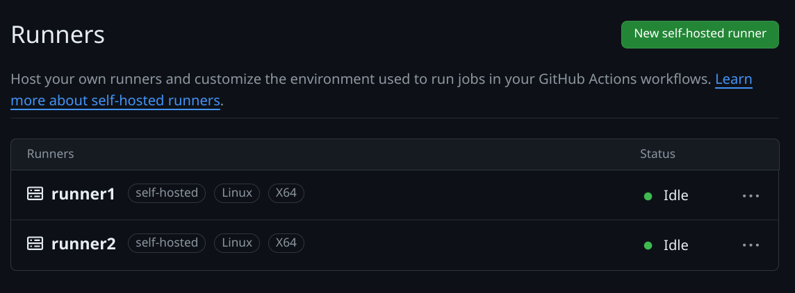
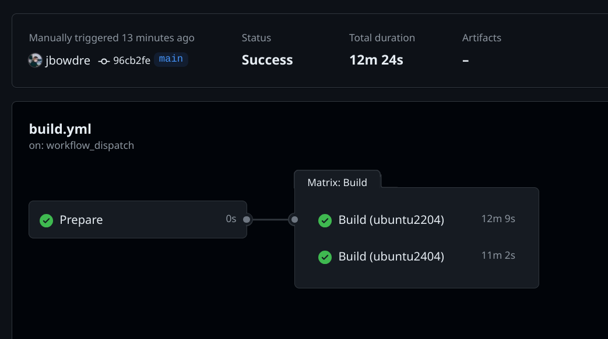
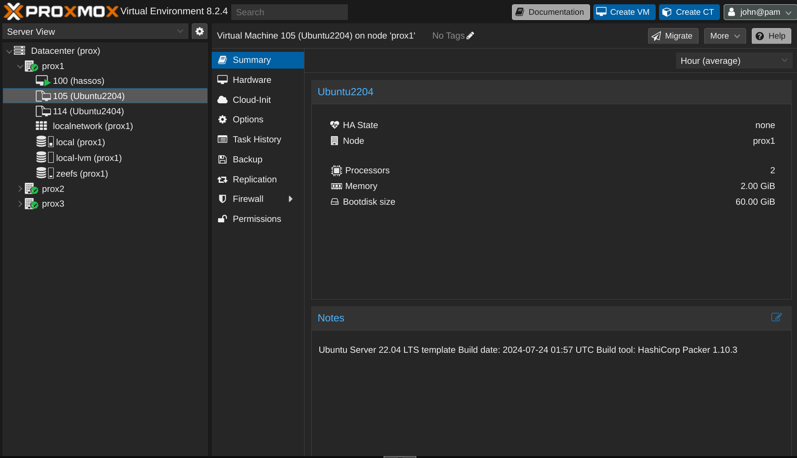

I recently shared how I [set up Packer to build Proxmox templates](/building-proxmox-templates-packer/) in my homelab. That post covered storing (and retrieving) environment-specific values in Vault, the `cloud-init` configuration for defining the installation parameters, the various post-install scripts for further customizing and hardening the template, and the Packer template files that tie it all together. By the end of the post, I was able to simply run `./build.sh ubuntu2204` to kick the build of a new Ubuntu 22.04 template without having to do any other interaction with the process.

That's pretty cool, but *The Dream* is to not have to do anything at all. So that's what this post is about: setting up a self-hosted GitHub Actions Runner to perform the build and a GitHub Actions workflow to trigger it.

### Self-Hosted Runner
When a GitHub Actions workflow fires, it schedules the job(s) to run on GitHub's own infrastructure. That's easy and convenient, but can make things tricky when you need a workflow to interact with on-prem infrastructure. I've worked around that in the past by [configuring the runner to connect to my tailnet](/gemini-capsule-gempost-github-actions/#publish-github-actions), but given the amount of data that will need to be transferred during the Packer build I decided that a [self-hosted runner](https://docs.github.com/en/actions/hosting-your-own-runners/managing-self-hosted-runners/about-self-hosted-runners) would be a better solution.

I wanted my runner to execute the build inside of a Docker container for better control of the environment, and I wanted that container to run [without elevated permissions (rootless)](https://docs.docker.com/engine/security/rootless/).

{}
GitHub [strongly recommends](https://docs.github.com/en/actions/hosting-your-own-runners/managing-self-hosted-runners/about-self-hosted-runners#self-hosted-runner-security) that you only use self-hosted runners with **private** repositories. You don't want a misconfigured workflow to allow a pull request submitted from a fork to run potentially-malicious code on your system(s).

So while I have a [public repo](https://github.com/jbowdre/packer-proxmox-templates/) to share my Packer work, my runner environment is attached to an otherwise-identical private repo. I'd recommend following a similar setup.
{}

#### Setup Rootless Docker Host
I start by cloning a fresh Ubuntu 22.04 VM off of my new template. After doing the basic initial setup (setting the hostname and IP, connecting it Tailscale, and so on), I create a user account for the runner to use. That account will need sudo privileges during the initial setup, but those will be revoked later on. I also set a password for the account.

```shell
sudo useradd -m -G sudo -s $(which bash) github # [tl! .cmd:1]
sudo passwd github
```

I then install the `systemd-container` package so that I can use [`machinectl`](https://www.man7.org/linux/man-pages/man1/machinectl.1.html) to log in as the new user (since [`sudo su` won't work for the rootless setup](https://docs.docker.com/engine/security/rootless/#unable-to-install-with-systemd-when-systemd-is-present-on-the-system)).

```shell
sudo apt update # [tl! .cmd:2]
sudo apt install systemd-container
sudo machinectl shell github@
```

And I install the `uidmap` package since rootless Docker requires `newuidmap` and `newgidmap`:

```shell
sudo apt install uidmap # [tl! .cmd]
```

At this point, I can follow the usual [Docker installation instructions](https://docs.docker.com/engine/install/ubuntu/#install-using-the-repository):

```shell
# Add Docker's official GPG key:
sudo apt-get update # [tl! .cmd:4]
sudo apt-get install ca-certificates curl
sudo install -m 0755 -d /etc/apt/keyrings
sudo curl -fsSL https://download.docker.com/linux/ubuntu/gpg -o /etc/apt/keyrings/docker.asc
sudo chmod a+r /etc/apt/keyrings/docker.asc

# Add the repository to apt sources:
echo \ # [tl! .cmd]
  "deb [arch=$(dpkg --print-architecture) signed-by=/etc/apt/keyrings/docker.asc] https://download.docker.com/linux/ubuntu \
  $(. /etc/os-release && echo "$VERSION_CODENAME") stable" | \
  sudo tee /etc/apt/sources.list.d/docker.list > /dev/null
sudo apt-get update # [tl! .cmd]

# Install the Docker packages:
sudo apt-get install \ # [tl! .cmd]
  docker-ce \
  docker-ce-cli \
  containerd.io \
  docker-buildx-plugin \
  docker-compose-plugin
```

Now it's time for the rootless setup, which starts by disabling the existing Docker service and socket and then running the `dockerd-rootless-setuptool.sh` script:

```shell
sudo systemctl disable --now docker.service docker.socket # [tl! .cmd:1]
sudo rm /var/run/docker.sock

dockerd-rootless-setuptool.sh install # [tl! .cmd]
```

Next, I enable and start the service in the user context, and I enable "linger" for the `github` user so that its systemd instance can continue to function even while the user is not logged in:

```shell
systemctl --user enable --now docker # [tl! .cmd:1]
sudo loginctl enable-linger $(whoami)
```

That should take care of setting up Docker, and I can quickly confirm by spawning the usual `hello-world` container:

```shell
docker run hello-world # [tl! .cmd]
Unable to find image 'hello-world:latest' locally # [tl! .nocopy:25]
latest: Pulling from library/hello-world
c1ec31eb5944: Pull complete
Digest: sha256:1408fec50309afee38f3535383f5b09419e6dc0925bc69891e79d84cc4cdcec6
Status: Downloaded newer image for hello-world:latest

Hello from Docker!
This message shows that your installation appears to be working correctly.

To generate this message, Docker took the following steps:
 1. The Docker client contacted the Docker daemon.
 2. The Docker daemon pulled the "hello-world" image from the Docker Hub.
    (amd64)
 3. The Docker daemon created a new container from that image which runs the
    executable that produces the output you are currently reading.
 4. The Docker daemon streamed that output to the Docker client, which sent it
    to your terminal.

To try something more ambitious, you can run an Ubuntu container with:
 $ docker run -it ubuntu bash

Share images, automate workflows, and more with a free Docker ID:
 https://hub.docker.com/

For more examples and ideas, visit:
 https://docs.docker.com/get-started/
```

So the Docker piece is sorted; now for setting up the runner.

#### Install/Configure Runner
I know I've been talking about a singular runner, but I'm actually setting up multiple instances of the runner on the same host to allow running jobs in parallel. I could probably support four simultaneous builds in my homelab but I'll start with just two runners for now (after all, I only have two build flavors so far anyway).

Each runner instance needs its own directory so I create those under `/opt/github/`:

```shell
sudo mkdir -p /opt/github/runner{1..2} # [tl! .cmd:2]
sudo chown -R github:github /opt/github
cd /opt/github
```

And then I download the [latest runner package](https://github.com/actions/runner/releases):

```shell
curl -O -L https://github.com/actions/runner/releases/download/v2.317.0/actions-runner-linux-x64-2.317.0.tar.gz # [tl! .cmd]
```

For each runner, I:
- Extract the runner software into the designated directory and `cd` into it:
    ```shell
    tar xzf ./actions-runner-linux-x64-2.317.0.tar.gz --directory=runner1 # [tl! .cmd:1]
    cd runner1
    ```
- Go to my private GitHub repo, navigate to **Settings > Actions > Runners**, and click the big friendly **New self-hosted runner** button at the top-right of the page. All I really need from that is the token which appears in the **Configure** section. Once I have that token, I...
- Run the configuration script, accepting the defaults for every prompt *except* for the runner name, which must be unique within the repository (so `runner1`, `runner2`, so on):
    ```shell
    ./config.sh \ # [tl! **:2 .cmd]
      --url https://github.com/[GITHUB_USERNAME]/[GITHUB_REPO] \
      --token [TOKEN] # [tl! .nocopy:1,35]

    --------------------------------------------------------------------------------
    |        ____ _ _   _   _       _          _        _   _                      |
    |       / ___(_) |_| | | |_   _| |__      / \   ___| |_(_) ___  _ __  ___      |
    |      | |  _| | __| |_| | | | | '_ \    / _ \ / __| __| |/ _ \| '_ \/ __|     |
    |      | |_| | | |_|  _  | |_| | |_) |  / ___ \ (__| |_| | (_) | | | \__ \     |
    |       \____|_|\__|_| |_|\__,_|_.__/  /_/   \_\___|\__|_|\___/|_| |_|___/     |
    |                                                                              |
    |                       Self-hosted runner registration                        |
    |                                                                              |
    --------------------------------------------------------------------------------

    # Authentication


    √ Connected to GitHub

    # Runner Registration

    Enter the name of the runner group to add this runner to: [press Enter for Default]

    Enter the name of runner: [press Enter for runner] runner1 # [tl! ** ~~]

    This runner will have the following labels: 'self-hosted', 'Linux', 'X64'
    Enter any additional labels (ex. label-1,label-2): [press Enter to skip]

    √ Runner successfully added
    √ Runner connection is good

    # Runner settings

    Enter name of work folder: [press Enter for _work]

    √ Settings Saved.

    ```
- Use the `svc.sh` script to install it as a user service, and start it running as the `github` user:
    ```shell
    sudo ./svc.sh install $(whoami) # [tl! .cmd:1]
    sudo ./svc.sh start $(whoami)
    ```

Once all of the runner instances are configured I can remove the `github` user from the `sudo` group:

```shell
sudo deluser github sudo # [tl! .cmd]
```

And I can see that my new runners are successfully connected to my *private* GitHub repo:


I now have a place to execute the Packer builds, I just need to tell the runner how to do that. And that's means it's time to talk about the...

### GitHub Actions Workflow
My solution for this consists of a Github Actions workflow which calls a custom action to spawn a Docker container and do the work. Let's start with the innermost component (the Docker image) and work out from there.

#### Docker Image
I'm using a customized Docker image consisting of Packer and associated tools with the addition of the [wrapper script](/building-proxmox-templates-packer/#wrapper-script) that I used for local builds. That image will be integrated with a custom action called `packerbuild`.

So I'll create a folder to hold my new action (and Dockerfile):

```shell
mkdir -p .github/actions/packerbuild # [tl! .cmd]
```

I don't want to maintain two copies of the `build.sh` script, so I move it into this new folder and create a symlink to it back at the top of the repo:

```shell
mv build.sh .github/actions/packerbuild/ # [tl! .cmd:1]
ln -s .github/actions/packerbuild/build.sh build.sh
```

That way I can easily load the script into the Docker image while also having it available for running on-demand local builds as needed.

And as a quick reminder, that `build.sh` script accepts a single argument to specify what build to produce and then fires off the appropriate Packer commands:

```shell
# torchlight! {"lineNumbers":true}
#!/usr/bin/env bash
# Run a single packer build
#
# Specify the build as an argument to the script. Ex:
# ./build.sh ubuntu2204
set -eu

if [ $# -ne 1 ]; then
  echo """
Syntax: $0 [BUILD]

Where [BUILD] is one of the supported OS builds:

ubuntu2204 ubuntu2404
"""
  exit 1
fi

if [ ! "${VAULT_TOKEN+x}" ]; then
  #shellcheck disable=SC1091
  source vault-env.sh || ( echo "No Vault config found"; exit 1 )
fi

build_name="${1,,}"
build_path=

case $build_name in
  ubuntu2204)
    build_path="builds/linux/ubuntu/22-04-lts/"
    ;;
  ubuntu2404)
    build_path="builds/linux/ubuntu/24-04-lts/"
    ;;
  *)
    echo "Unknown build; exiting..."
    exit 1
    ;;
esac

packer init "${build_path}"
packer build -on-error=cleanup -force "${build_path}"
```

I use the following `Dockerfile` to create the environment in which the build will be executed:

```Dockerfile
# torchlight! {"lineNumbers":true}
FROM alpine:3.20

ENV PACKER_VERSION=1.10.3

RUN apk --no-cache upgrade \
  && apk add --no-cache \
  bash \
  curl \
  git \
  openssl \
  wget \
  xorriso

ADD https://releases.hashicorp.com/packer/${PACKER_VERSION}/packer_${PACKER_VERSION}_linux_amd64.zip ./
ADD https://releases.hashicorp.com/packer/${PACKER_VERSION}/packer_${PACKER_VERSION}_SHA256SUMS ./

RUN sed -i '/.*linux_amd64.zip/!d' packer_${PACKER_VERSION}_SHA256SUMS \
  && sha256sum -c packer_${PACKER_VERSION}_SHA256SUMS \
  && unzip packer_${PACKER_VERSION}_linux_amd64.zip -d /bin \
  && rm -f packer_${PACKER_VERSION}_linux_amd64.zip packer_${PACKER_VERSION}_SHA256SUMS

COPY build.sh /bin/build.sh
RUN chmod +x /bin/build.sh

ENTRYPOINT ["/bin/build.sh"]
```

It starts with a minimal `alpine` base image and installs a few common packages (and `xorriso` to support the creation of ISO images). It then downloads the indicated version of the Packer installer and extracts it to `/bin/`. Finally it copies the `build.sh` script into the image and sets it as the `ENTRYPOINT`.

#### Custom Action
Turning this Docker image into an action requires just a smidge of YAML to describe how to interact with the image.

Behold, `.github/actions/packerbuild/action.yml`:
```yaml
# torchlight! {"lineNumbers":true}
name: 'Execute Packer Build'
description: 'Performs a Packer build'
inputs:
  build-flavor:
    description: 'The build to execute'
    required: true
runs:
  using: 'docker'
  image: 'Dockerfile'
  args:
    - ${{ inputs.build-flavor }}
```

As you can see, the action expects (nay, requires!) a `build-flavor` input to line up with `build.sh`'s expected parameter. The action will run in Docker using the image defined in the local `Dockerfile`, and will pass `${{ inputs.build-flavor }}` as the sole argument to that image.

Alright, let's tie it all together with the automation workflow now.

#### The Workflow
The workflow is defined in `.github/workflows/build.yml`. It starts simply enough with a name and an explanation of when the workflow should be executed.

```yaml
# torchlight! {"lineNumbers":true}
name: Build VM Templates

on:
  workflow_dispatch:
  schedule:
    - cron: '0 8 * * 1'
```

`workflow_dispatch` sets it so I can manually execute the workflow from the GitHub Actions UI (for testing / as a treat), and the `cron` schedule configures the workflow to run automatically every Monday at 8:00 AM (UTC).

Rather than rely on an environment file (ew), I'm securely storing the `VAULT_ADDR` and `VAULT_TOKEN` values in GitHub [repository secrets](https://docs.github.com/en/actions/security-guides/using-secrets-in-github-actions). So I introduce those values into the workflow like so:

```yaml
# torchlight! {"lineNumbers":true, "lineNumbersStart":8}
env:
  VAULT_ADDR: ${{ secrets.VAULT_ADDR }}
  VAULT_TOKEN: ${{ secrets.VAULT_TOKEN }}
```

When I did the [Vault setup](/building-proxmox-templates-packer/#vault-configuration), I created the token with a `period` of `336` hours; that means that the token will only remain valid as long as it gets renewed at least once every two weeks. So I start the `jobs:` block with a simple call to [Vault's REST API](https://developer.hashicorp.com/vault/api-docs/auth/token#renew-a-token-self) to renew the token before each run:

```yaml
# torchlight! {"lineNumbers":true, "lineNumbersStart":12}
jobs:
  prepare:
    name: Prepare
    runs-on: self-hosted
    steps:
      - name: Renew Vault Token
        run: |
          curl -s --header "X-Vault-Token:${VAULT_TOKEN}" \
            --request POST "${VAULT_ADDR}v1/auth/token/renew-self" | grep -q auth
```

Assuming that token is renewed successfully, the Build job uses a [matrix strategy](https://docs.github.com/en/actions/using-workflows/workflow-syntax-for-github-actions#jobsjob_idstrategymatrixinclude) to enumerate the `build-flavor`s that will need to be built. All of the following steps will be repeated for each flavor.

And the first step is to simply check out the GitHub repo so that the runner has all the latest code.

```yaml
# torchlight! {"lineNumbers":true, "lineNumbersStart":22}
  builds:
    name: Build
    needs: prepare
    runs-on: self-hosted
    strategy:
      matrix:
        build-flavor:
          - ubuntu2204
          - ubuntu2404
    steps:
      - name: Checkout
        uses: actions/checkout@v4
```

To get the runner to interact with the rootless Docker setup we'll need to export the `DOCKER_HOST` variable and point it to the Docker socket registered by the user... which first means obtaining the UID of that user and echoing it to the special `$GITHUB_OUTPUT` variable so it can be passed to the next step:

```yaml
# torchlight! {"lineNumbers":true, "lineNumbersStart":34}
      - name: Get UID of Github user
        id: runner_uid
        run: |
          echo "gh_uid=$(id -u)" >> "$GITHUB_OUTPUT"
```

And now, finally, for the actual build. The `Build template` step calls the `.github/actions/packerbuild` custom action, sets the `DOCKER_HOST` value to the location of `docker.sock` (using the UID obtained earlier) so the runner will know how to interact with rootless Docker, and passes along the `build-flavor` from the matrix to influence which template will be created.

If it fails for some reason, the `Retry on failure` step will try again, just in case it was a transient glitch like a network error or a hung process.

```yaml
# torchlight! {"lineNumbers":true, "lineNumbersStart":38}
      - name: Build template
        id: build
        uses: ./.github/actions/packerbuild
        timeout-minutes: 90
        env:
          DOCKER_HOST: unix:///run/user/${{ steps.runner_uid.outputs.gh_uid }}/docker.sock
        with:
          build-flavor: ${{ matrix.build-flavor }}
        continue-on-error: true
      - name: Retry on failure
        id: retry
        if: steps.build.outcome == 'failure'
        uses: ./.github/actions/packerbuild
        timeout-minutes: 90
        env:
          DOCKER_HOST: unix:///run/user/${{ steps.runner_uid.outputs.gh_uid }}/docker.sock
        with:
          build-flavor: ${{ matrix.build-flavor }}
```

Here's the complete `.github/workflows/build.yml`, all in one code block:

```yaml
# torchlight! {"lineNumbers":true}
name: Build VM Templates

on:
  workflow_dispatch:
  schedule:
    - cron: '0 8 * * 1'

env:
  VAULT_ADDR: ${{ secrets.VAULT_ADDR }}
  VAULT_TOKEN: ${{ secrets.VAULT_TOKEN }}

jobs:
  prepare:
    name: Prepare
    runs-on: self-hosted
    steps:
      - name: Renew Vault Token
        run: |
          curl -s --header "X-Vault-Token:${VAULT_TOKEN}" \
            --request POST "${VAULT_ADDR}v1/auth/token/renew-self" | grep -q auth

  builds:
    name: Build
    needs: prepare
    runs-on: self-hosted
    strategy:
      matrix:
        build-flavor:
          - ubuntu2204
          - ubuntu2404
    steps:
      - name: Checkout
        uses: actions/checkout@v4
      - name: Get UID of Github user
        id: runner_uid
        run: |
          echo "gh_uid=$(id -u)" >> "$GITHUB_OUTPUT"
      - name: Build template
        id: build
        uses: ./.github/actions/packerbuild
        timeout-minutes: 90
        env:
          DOCKER_HOST: unix:///run/user/${{ steps.runner_uid.outputs.gh_uid }}/docker.sock
        with:
          build-flavor: ${{ matrix.build-flavor }}
        continue-on-error: true
      - name: Retry on failure
        id: retry
        if: steps.build.outcome == 'failure'
        uses: ./.github/actions/packerbuild
        timeout-minutes: 90
        env:
          DOCKER_HOST: unix:///run/user/${{ steps.runner_uid.outputs.gh_uid }}/docker.sock
        with:
          build-flavor: ${{ matrix.build-flavor }}
```

### Your Templates Are Served
All that's left at this point is to `git commit` and `git push` this to my *private* repo. I can then visit the repo on the web, go to the **Actions** tab, select the new **Build VM Templates** workflow on the left, and click the **Run workflow** button. That fires off the build, and I can check back a few minutes later to confirm that it completed successfully:



And I can also consult with my Proxmox host and confirm that the new VM templates were indeed created:



For future builds, I don't have to actually do anything at all. GitHub will automatically trigger this workflow every Monday morning so my templates will never be more than a week out-of-date. Pretty slick, right?

You can check out my *public* repo at [github.com/jbowdre/packer-proxmox-templates/](https://github.com/jbowdre/packer-proxmox-templates/) to explore the full setup - and to follow along as I add support for additional OS flavors.