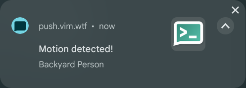
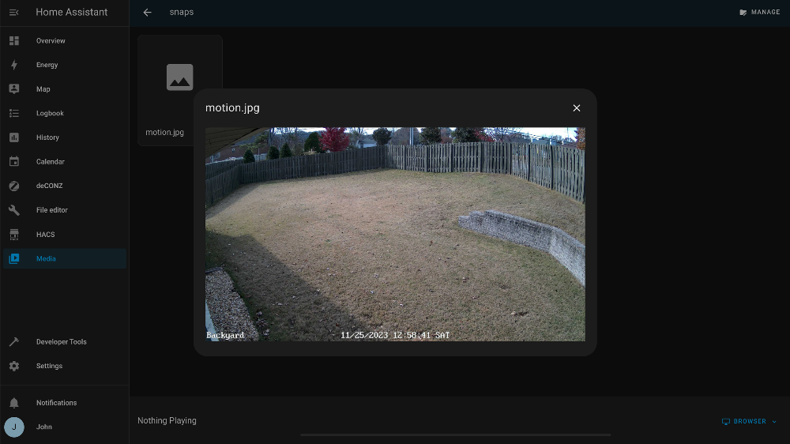
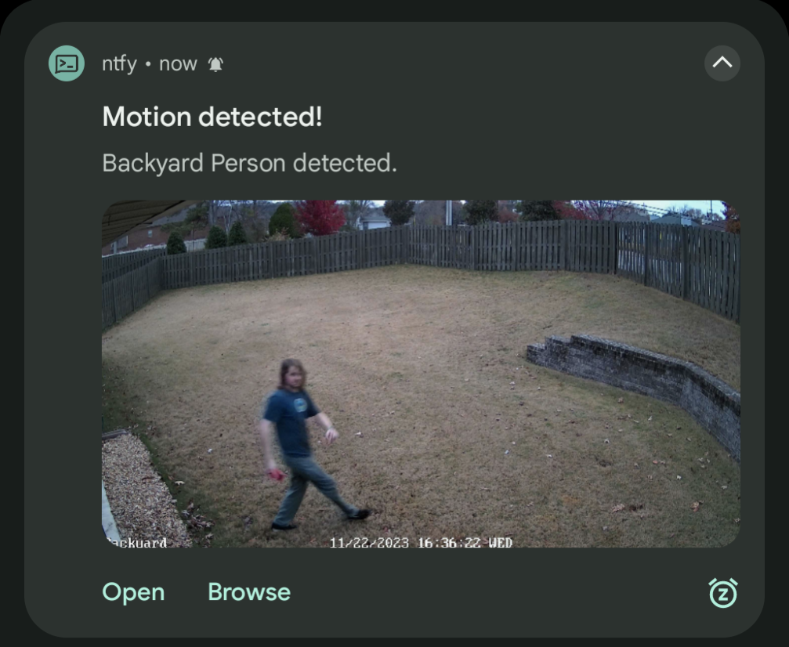
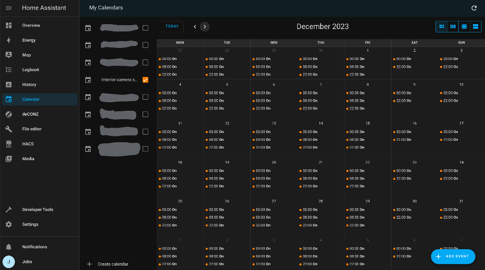

A couple of months ago, I [wrote about](/easy-push-notifications-with-ntfy) how I was using a self-hosted instance of [ntfy](https://ntfy.sh) to help streamline notification pushes from a variety of sources. I closed that post with a quick look at how I had [integrated ntfy into my Home Assistant setup](/easy-push-notifications-with-ntfy/#home-assistant) for some basic notifications.

I've now used that immense power to enhance the notifications I get from the [Reolink security cameras](https://reolink.com/us/product/rlk16-820d8-a/) scattered around my house. I selected Reolink cameras specifically because I knew it was supported by Home Assistant, and for the on-device animal/person/vehicle detection which allowed for a bit of extra control over which types of motion events would trigger a notification or other action. I've been very happy with this choice, but I have found that the Reolink app itself can be a bit clunky:

- The app lets you send notifications on a schedule (I only want notifications from the indoor cameras during work hours when no one is home), but doesn't make it easy to override that schedule (like when it's a holiday and we're all at home anyway).
- Push notifications don't include an image capture so when I receive a notification about a person in my backyard I have to open the app, go select the correct camera, select the Playback option, and scrub back and forth until I see whatever my camera saw.

I figured I could combine the excellent [Reolink integration for Home Assistant](https://www.home-assistant.io/integrations/reolink) with Home Assistant's powerful Automation platform and ntfy to get more informative notifications and more flexible alert schedules. Here's the route I took.

### Alert on motion detection
{}
Since manually configuring ntfy in Home Assistant via the [RESTful Notifications integration](/easy-push-notifications-with-ntfy#notify-configuration), I found that a [ntfy-specific integration](https://github.com/ivanmihov/homeassistant-ntfy.sh) was available through the [Home Assistant Community Store](https://hacs.xyz/) addon. That setup is a bit more flexible so I've switched my setup to use it instead:
```yaml
# configuration.yaml
notify:
  - name: ntfy
    platform: rest # [tl! --:8 collapse:8]
    method: POST_JSON
    headers:
      Authorization: !secret ntfy_token
    data:
      topic: home_assistant
    title_param_name: title
    message_param_name: message
    resource: ! secret ntfy_url
    platform: ntfy # [tl! ++:3]
    url: !secret ntfy_url
    token: !secret ntfy_token
    topic: home_assistant
```
{}

The Reolink integration exposes a number of entities for each camera. For triggering a notification on motion detection, I'll be interested in the [binary sensor](https://www.home-assistant.io/integrations/binary_sensor/) entities named like `binary_sensor.$location_$type` (like `binary_sensor.backyard_person` and `binary_sensor.driveway_vehicle`), the state of which will transition from `off` to `on` when the selected motion type is detected.

So I'll begin by crafting a simple automation which will push out a notification whenever any of the listed cameras detect a person or vehicle[^vehicle]:
```yaml
# torchlight! {"lineNumbers": true}
# exterior_motion.yaml
alias: Exterior Motion Alerts
description: ""
trigger:
  - platform: state
    entity_id:
      - binary_sensor.backyard_person
      - binary_sensor.driveway_person
      - binary_sensor.driveway_vehicle
      - binary_sensor.east_side_front_person
      - binary_sensor.east_side_rear_person
      - binary_sensor.west_side_person
    from: "off"
    to: "on"
condition: []
action:
  - service: notify.ntfy
    data:
      title: Motion detected!
      message: "{{ trigger.to_state.attributes.friendly_name }}"
```

[^vehicle]: Hopefully I only need to worry about vehicles in the driveway. _Please don't drive through my backyard, thanks._

{}
That last line is taking advantage of Jinja templating and [trigger variables](https://www.home-assistant.io/docs/automation/templating/#state) so that the resulting notification displays the friendly name of whichever `binary_sensor` triggered the automation run. This way, I'll see something like "Backyard Person" instead of the entity ID listed earlier.
{}

I'll step outside and see if it works...


### Capture a snapshot
Each Reolink camera also exposes a `camera.$location_sub` entity which represents the video stream from the connected camera. I can add another action to the notification so that it will grab a snapshot, but I'll also need a way to match the `camera` entity to the correct `binary_sensor` entity. I can do that by adding a variable set to the bottom of the automation:

```yaml
# torchlight! {"lineNumbers": true}
# exterior_motion.yaml  [tl! focus]
alias: Exterior Motion Alerts
description: ""
trigger: # [tl! collapse:start]
  - platform: state
    entity_id:
      - binary_sensor.backyard_person
      - binary_sensor.driveway_person
      - binary_sensor.driveway_vehicle
      - binary_sensor.east_side_front_person
      - binary_sensor.east_side_rear_person
      - binary_sensor.west_side_person
    from: "off"
    to: "on" # [tl! collapse:end]
condition: []
action:
  - service: camera.snapshot # [tl! ++:start focus:start]
    target:
      entity_id: "{{ cameras[trigger.to_state.entity_id] }}"
    data:
      filename: /media/snaps/motion.jpg # [tl! ++:end focus:end]
  - service: notify.ntfy
    data:
      title: Motion detected!
      message: "{{ trigger.to_state.attributes.friendly_name }}"
variables: # [tl! ++:start focus:start]
  cameras:
    binary_sensor.backyard_person: camera.backyard_sub
    binary_sensor.driveway_person: camera.driveway_sub
    binary_sensor.driveway_vehicle: camera.driveway_sub
    binary_sensor.east_side_front_person: camera.east_side_front_sub
    binary_sensor.east_side_rear_person: camera.east_side_rear_sub
    binary_sensor.west_side_person: camera.west_side_sub # [tl! ++:end focus:end]
```

That `"{{ cameras[trigger.to_state.entity_id] }}"` template will look up the ID of the triggering `binary_sensor` and return the appropriate `camera` entity, and that will use the [`camera.snapshot` service](https://www.home-assistant.io/integrations/camera/#service-snapshot) to save a snapshot to the desginated location (`/media/snaps/motion.jpg`).

Before this will actually work, though, I need to reconfigure Home Assistant to allow access to the storage location, and I should also go ahead and pre-create the folder so there aren't any access issues.

```yaml
# configuration.yaml
homeassistant:
  allowlist_external_dirs:
    - "/media/snaps/"
```

I'm using the [Home Assistant Operating System virtual appliance](https://www.home-assistant.io/installation/alternative#install-home-assistant-operating-system), so `/media` is already symlinked to `/root/media` inside the Home Assistant installation directory. So I'll just log into that shell and create the `snaps` subdirectory:
```shell
mkdir -p /media/snaps # [tl! .cmd_root]
```

Rather than walking outside each time I want to test this, I'll just use the Home Assistant Developer Tools to manually toggle the state of the `binary_sensor.backyard_person` entity to `on`, and I should then be able to see the snapshot in the Media interface:


Woo, look at me making progress!

### Attach the snapshot
Now that I've captured the snap, I need to figure out how to attach it to the notification. Ntfy [supports inline image attachments](https://docs.ntfy.sh/publish/#attach-local-file), which is handy, but it expects those to be delivered via HTTP `PUT` action. Neither my original HTTP `POST` approach or the Ntfy integration support this currently, so I had to use the [`shell_command` integration](https://www.home-assistant.io/integrations/shell_command/) to make the call directly.

I can't use the handy `!secret` expansion inside of the shell command, though, so I'll need a workaround to avoid sticking sensitive details directly in my `configuration.yaml`. I can use a dummy sensor to hold the value, and then use the `{{ states('sensor.$sensor_name') }}` template to retrieve it.

So here we go:
```yaml
# configuration.yaml [tl! focus:start]

# dummy sensor to make ntfy secrets available to template engine
template:
  - sensor:
    - name: ntfy_token
      state: !secret ntfy_token # [tl! highlight]
    - name: ntfy_url
      state: !secret ntfy_url # [tl! highlight focus:end]

notify:
  - name: ntfy
    platform: ntfy
    url: !secret ntfy_url
    token: !secret ntfy_token
    topic: home_assistant
# [tl! highlight:10,1]
shell_command: # [tl! focus:9 highlight:6,1]
  ntfy_put: >
    curl
    --header 'Title: {{ title }}'
    --header 'Priority: {{ priority }}'
    --header 'Filename: {{ filename }}'
    --header 'Authorization: Bearer {{ states('sensor.ntfy_token') }}'
    --upload-file '{{ file }}'
    --header 'Message: {{ message }}'
    --url '{{ states('sensor.ntfy_url') }}/home_assistant'
```

Now I just need to replace the service call in the automation with the new `shell_command.ntfy_put` one:
```yaml
# torchlight! {"lineNumbers": true}
# exterior_motion.yaml # [tl! focus]
alias: Exterior Motion Alerts
description: ""
trigger: # [tl! collapse:start]
  - platform: state
    entity_id:
      - binary_sensor.backyard_person
      - binary_sensor.driveway_person
      - binary_sensor.driveway_vehicle
      - binary_sensor.east_side_front_person
      - binary_sensor.east_side_rear_person
      - binary_sensor.west_side_person
    from: "off"
    to: "on" # [tl! collapse:end]
condition: []
action:
  - service: camera.snapshot
    target:
      entity_id: "{{ cameras[trigger.to_state.entity_id] }}"
    data:
      filename: /media/snaps/motion.jpg
  - service: notify.ntfy # [tl! --:start focus:start]
    data:
      title: Motion detected!
      message: "{{ trigger.to_state.attributes.friendly_name }}" # [tl! --:end]
  - service: shell_command.ntfy_put # [tl! ++:start reindex(-4)]
    data:
      title: Motion detected!
      message: "{{ trigger.to_state.attributes.friendly_name }}"
      file: /media/snaps/motion.jpg # [tl! ++:end focus:end]
variables: # [tl! collapse:start]
  cameras:
    binary_sensor.backyard_person: camera.backyard_sub
    binary_sensor.driveway_person: camera.driveway_sub
    binary_sensor.driveway_vehicle: camera.driveway_sub
    binary_sensor.east_side_front_person: camera.east_side_front_sub
    binary_sensor.east_side_rear_person: camera.east_side_rear_sub
    binary_sensor.west_side_person: camera.west_side_sub # [tl! collapse:end]
```

Now when I wander outside...

Well that guy seems sus - but hey, it worked!

### Backoff rate limit
Of course, I'll also continue to get notified about that creeper in the backyard about every 15-20 seconds or so. That's not quite what I want. The _easy_ way to prevent an automation from firing constantly would be to [insert a `delay`](https://www.home-assistant.io/docs/scripts/#wait-for-time-to-pass-delay) action, but that would be a global delay rather than per-camera. I don't necessarily need to know every time the weirdo in the backyard moves, but I would like to know if he moves around to the side yard or driveway. So I needed something more flexible than an automation-wide delay.

Instead, I'll create a 5-minute [`timer`](https://www.home-assistant.io/integrations/timer/) for each camera by simply adding this to my `configuration.yaml`:
```yaml
# configuration.yaml
timer:
  backyard_person:
    duration: "00:05:00"
  driveway_person:
    duration: "00:05:00"
  driveway_vehicle:
    duration: "00:05:00"
  east_front_person:
    duration: "00:05:00"
  east_rear_person:
    duration: "00:05:00"
  west_person:
    duration: "00:05:00"
```

Back in the automation, I'll add a new `timers` variable set which will help to map the `binary_sensor` to the corresponding `timer` object. I can then append an action to start the timer, and a condition so that the automation will only fire if the timer for a given camera is not currently running. I'll also set the automation's `mode` to `single` (so that it will only run once at a time), and set the `max_exceeded` value to `silent` (so that multiple triggers won't raise any errors).

```yaml
# torchlight! {"lineNumbers": true}
# exterior_motion.yaml # [tl! focus]
alias: Exterior Motion Alerts
description: ""
trigger: # [tl! collapse:start]
  - platform: state
    entity_id:
      - binary_sensor.backyard_person
      - binary_sensor.driveway_person
      - binary_sensor.driveway_vehicle
      - binary_sensor.east_side_front_person
      - binary_sensor.east_side_rear_person
      - binary_sensor.west_side_person
    from: "off"
    to: "on" # [tl! collapse:end]
condition: [] # [tl! focus:3 --]
condition: # [tl! ++:2 reindex(-1)]
  - condition: template
    value_template: "{{ is_state(timers[trigger.to_state.entity_id], 'idle') }}"
action:
  - service: camera.snapshot
    target:
      entity_id: "{{ cameras[trigger.to_state.entity_id] }}"
    data:
      filename: /media/snaps/motion.jpg
  - service: notify.ntfy
    data:
      title: Motion detected!
      message: "{{ trigger.to_state.attributes.friendly_name }}"
  - service: shell_command.ntfy_put
    data:
      title: Motion detected!
      message: "{{ trigger.to_state.attributes.friendly_name }}"
      file: /media/snaps/motion.jpg
  - service: timer.start # [tl! focus:2 ++:2]
    target:
      entity_id: "{{ timers[trigger.to_state.entity_id] }}"
mode: single # [tl! focus:1 ++:1]
max_exceeded: silent
variables:
  cameras: # [tl! collapse:start]
    binary_sensor.backyard_person: camera.backyard_sub
    binary_sensor.driveway_person: camera.driveway_sub
    binary_sensor.driveway_vehicle: camera.driveway_sub
    binary_sensor.east_side_front_person: camera.east_side_front_sub
    binary_sensor.east_side_rear_person: camera.east_side_rear_sub
    binary_sensor.west_side_person: camera.west_side_sub # [tl! collapse:end]
  timers: # [tl! ++:start focus:start]
    binary_sensor.backyard_person: timer.backyard_person
    binary_sensor.driveway_person: timer.driveway_person
    binary_sensor.driveway_vehicle: timer.driveway_vehicle
    binary_sensor.east_side_front_person: timer.east_front_person
    binary_sensor.east_side_rear_person: timer.east_rear_person
    binary_sensor.west_side_person: timer.west_person# [tl! ++:end focus:end]
```

That pretty much takes care of my needs for exterior motion alerts, and should keep me informed if someone is poking around my house (or, more frequently, making a delivery).

### Managing interior alerts
I've got a few interior cameras which I'd like to monitor too, so I'll start by just copying the exterior automation and updating the entity IDs:
```yaml
# torchlight! {"lineNumbers": true}
# interior_motion.yaml
alias: Interior Motion Alerts
description: ""
trigger:
  - platform: state
    entity_id:
      - binary_sensor.kitchen_back_door_person
      - binary_sensor.garage_person
      - binary_sensor.garage_vehicle
      - binary_sensor.study_entryway_person
    from: "off"
    to: "on"
condition:
  - condition: template
    value_template: "{{ is_state(timers[trigger.to_state.entity_id], 'idle') }}"
action:
  - service: camera.snapshot
    target:
      entity_id: "{{ cameras[trigger.to_state.entity_id] }}"
    data:
      filename: /media/snaps/motion.jpg
  - service: shell_command.ntfy_put
    data:
      title: Motion detected!
      message: "{{ trigger.to_state.attributes.friendly_name }}"
      file: /media/snaps/motion.jpg
  - service: timer.start
    target:
      entity_id: "{{ timers[trigger.to_state.entity_id] }}"
max_exceeded: silent
mode: single
variables:
  cameras:
    binary_sensor.kitchen_back_door_person: camera.kitchen_back_door_sub
    binary_sensor.study_entryway_person: camera.study_entryway_sub
    binary_sensor.garage_person: camera.garage_sub
    binary_sensor.garage_vehicle: camera.garage_sub
  timers:
    binary_sensor.kitchen_back_door_person: timer.kitchen_person
    binary_sensor.study_entryway_person: timer.study_person
    binary_sensor.garage_person: timer.garage_person
    binary_sensor.garage_vehicle: timer.garage_vehicle
```

But I don't typically want to get alerted by these cameras if my wife or I are home and awake. So I'll use the [local calendar integration](https://www.home-assistant.io/integrations/local_calendar) to create a schedule for when the interior cameras should be active. Once that integration is enabled and the entity `calendar.interior_camera_schedule` created, I can navigate to the Calendar section of my Home Assistant interface to create the recurring calendar events (with the summary "On"). I'll basically be enabling notifications while we're sleeping and while we're at work, but disabling notifications while we're expected to be at home.



So then I'll just add another condition so that the automation will only fire during those calendar events:
```yaml
# torchlight! {"lineNumbers": true}
# interior_motion.yaml [tl! focus]
alias: Interior Motion Alerts
description: ""
trigger: # [tl! collapse:start]
  - platform: state
    entity_id:
      - binary_sensor.kitchen_back_door_person
      - binary_sensor.garage_person
      - binary_sensor.garage_vehicle
      - binary_sensor.study_entryway_person
    from: "off"
    to: "on" # [tl! collapse:end]
condition:
  - condition: template
    value_template: "{{ is_state(timers[trigger.to_state.entity_id], 'idle') }}"
  - condition: state # [tl! focus:2 ++:2]
    entity_id: calendar.interior_camera_schedule
    state: "on"
action: # [tl! collapse:start]
  - service: camera.snapshot
    target:
      entity_id: "{{ cameras[trigger.to_state.entity_id] }}"
    data:
      filename: /media/snaps/motion.jpg
  - service: shell_command.ntfy_put
    data:
      title: Motion detected!
      message: "{{ trigger.to_state.attributes.friendly_name }}"
      file: /media/snaps/motion.jpg
  - service: timer.start
    target:
      entity_id: "{{ timers[trigger.to_state.entity_id] }}" # [tl! collapse:end]
max_exceeded: silent
mode: single
variables: # [tl! collapse:start]
  cameras:
    binary_sensor.kitchen_back_door_person: camera.kitchen_back_door_sub
    binary_sensor.study_entryway_person: camera.study_entryway_sub
    binary_sensor.garage_person: camera.garage_sub
    binary_sensor.garage_vehicle: camera.garage_sub
  timers:
    binary_sensor.kitchen_back_door_person: timer.kitchen_person
    binary_sensor.study_entryway_person: timer.study_person
    binary_sensor.garage_person: timer.garage_person
    binary_sensor.garage_vehicle: timer.garage_vehicle # [tl! collapse:end]
```

I'd also like to ensure that the interior motion alerts are also activated whenever our [Abode](https://goabode.com/) security system is armed, regardless of what time that may be. That will make the condition a little bit trickier: alerts should be pushed if the timer isn't running AND the schedule is active OR the security system is armed (in either "Home" or "Away" mode). So here's what that will look like:

```yaml
# torchlight! {"lineNumbers": true}
# interior_motion.yaml [tl! focus]
alias: Interior Motion Alerts
description: ""
trigger: # [tl! collapse:start]
  - platform: state
    entity_id:
      - binary_sensor.kitchen_back_door_person
      - binary_sensor.garage_person
      - binary_sensor.garage_vehicle
      - binary_sensor.study_entryway_person
    from: "off"
    to: "on" # [tl! collapse:end]
condition: # [tl! focus:start]
  - condition: and # [tl! ++:1]
    conditions: # [tl! collapse:5]
  - condition: template # [tl! --:4]
    value_template: "{{ is_state(timers[trigger.to_state.entity_id], 'idle') }}"
  - condition: state
    entity_id: calendar.interior_camera_schedule
    state: "on"
      - condition: template # [tl! ++:start reindex(-5)]
        value_template: "{{ is_state(timers[trigger.to_state.entity_id], 'idle') }}"
      - condition: or
        conditions:
          - condition: state
            entity_id: calendar.interior_camera_schedule
            state: "on"
          - condition: state
            state: armed_away
            entity_id: alarm_control_panel.abode_alarm
          - condition: state
            state: armed_home
            entity_id: alarm_control_panel.abode_alarm # [tl! ++:end focus:end]
action: # [tl! collapse:start]
  - service: camera.snapshot
    target:
      entity_id: "{{ cameras[trigger.to_state.entity_id] }}"
    data:
      filename: /media/snaps/motion.jpg
  - service: shell_command.ntfy_put
    data:
      title: Motion detected!
      message: "{{ trigger.to_state.attributes.friendly_name }}"
      file: /media/snaps/motion.jpg
  - service: timer.start
    target:
      entity_id: "{{ timers[trigger.to_state.entity_id] }}" # [tl! collapse:end]
max_exceeded: silent
mode: single
variables: # [tl! collapse:start]
  cameras:
    binary_sensor.kitchen_back_door_person: camera.kitchen_back_door_sub
    binary_sensor.study_entryway_person: camera.study_entryway_sub
    binary_sensor.garage_person: camera.garage_sub
    binary_sensor.garage_vehicle: camera.garage_sub
  timers:
    binary_sensor.kitchen_back_door_person: timer.kitchen_person
    binary_sensor.study_entryway_person: timer.study_person
    binary_sensor.garage_person: timer.garage_person
    binary_sensor.garage_vehicle: timer.garage_vehicle # [tl! collapse:end]
```

### Snooze or disable alerts
We've got a lawn service that comes pretty regularly to take care of things, and I don't want to get constant alerts while they're doing things in the yard. Or maybe we stay up a little late one night and don't want to get pinged with interior alerts during that time. So I created a script to snooze all motion alerts for 30 minutes, simply by temporarily disabling the automations I just created:

```yaml
# torchlight! {"lineNumbers": true}
# snooze_motion_alerts.yaml
alias: Snooze Motion Alerts
sequence:
  - service: automation.turn_off
    data:
      stop_actions: true
    target:
      entity_id:
        - automation.exterior_motion_alerts
        - automation.interior_motion_alerts
  - service: notify.ntfy
    data:
      title: Motion Snooze
      message: Camera motion alerts are disabled for 30 minutes.
  - delay:
      hours: 0
      minutes: 30
      seconds: 0
      milliseconds: 0
  - service: automation.turn_on
    data: {}
    target:
      entity_id:
        - automation.interior_motion_alerts
        - automation.exterior_motion_alerts
  - service: notify.ntfy
    data:
      title: Motion Resume
      message: Camera motion alerts are resumed.
mode: single
icon: mdi:alarm-snooze
```

I can then add that script to the camera dashboard in Home Assistant or pin it to the home controls on my Android phone for easy access.

I'll also create another script for manually toggling interior alerts for when we're home at an odd time:
```yaml
# torchlight! {"lineNumbers": true}
# toggle_interior_alerts.yaml
alias: Toggle Indoor Camera Alerts
sequence:
  - service: automation.toggle
    data: {}
    target:
      entity_id: automation.interior_motion_alerts
  - service: notify.ntfy
    data:
      title: "Interior Camera Alerts "
      message: "Alerts are {{ states('automation.interior_motion_alerts') }} "
mode: single
icon: mdi:cctv
```

### That's a wrap
This was a fun little project which had me digging a bit deeper into Home Assistant than I had previously ventured, and I'm really happy with how things turned out. I definitely learned a ton in the process. I might explore [adding action buttons to the notifications](https://community.home-assistant.io/t/ntfy-sh-with-actions/578603) to directly snooze alerts that way, but that will have to wait a bit as I'm out of tinkering time for now.

