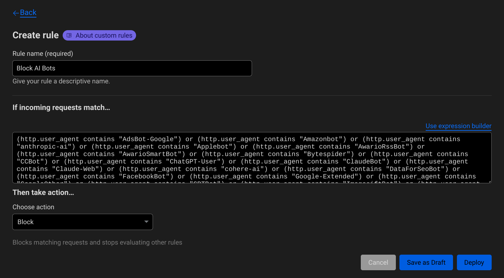

I've seen some recent posts from folks like [Cory Dransfeldt](https://coryd.dev/posts/2024/go-ahead-and-block-ai-web-crawlers/) and [Ethan Marcotte](https://ethanmarcotte.com/wrote/blockin-bots/) about how (and *why*) to prevent your personal website from being slurped up by the crawlers that AI companies use to [actively enshittify the internet](https://boehs.org/node/llms-destroying-internet). I figured it was past time for me to hop on board with this, so here we are.

My initial approach was to use [Hugo's robots.txt templating](https://gohugo.io/templates/robots/) to generate a `robots.txt` file based on a list of bad bots I got from [ai.robots.txt on GitHub](https://github.com/ai-robots-txt/ai.robots.txt).

I dumped that list into my `config/params.toml` file, *above* any of the nested elements (since toml is kind of picky about that...).

```toml
robots = [
  "AdsBot-Google",
  "Amazonbot",
  "anthropic-ai",
  "Applebot",
  "AwarioRssBot",
  "AwarioSmartBot",
  "Bytespider",
  "CCBot",
  "ChatGPT",
  "ChatGPT-User",
  "Claude-Web",
  "ClaudeBot",
  "cohere-ai",
  "DataForSeoBot",
  "Diffbot",
  "FacebookBot",
  "Google-Extended",
  "GPTBot",
  "ImagesiftBot",
  "magpie-crawler",
  "omgili",
  "Omgilibot",
  "peer39_crawler",
  "PerplexityBot",
  "YouBot"
]

[author]
name = "John Bowdre"
```

I then created a new template in `layouts/robots.txt`:

```text
Sitemap: {{ .Site.BaseURL }}/sitemap.xml

User-agent: *
Disallow:
{{ range .Site.Params.robots }}
User-agent: {{ . }}
{{- end }}
Disallow: /
```

And enabled the template processing for this in my `config/hugo.toml` file:

```toml
enableRobotsTXT = true
```

Now Hugo will generate the following `robots.txt` file for me:

```text
Sitemap: https://runtimeterror.dev//sitemap.xml

User-agent: *
Disallow:

User-agent: AdsBot-Google
User-agent: Amazonbot
User-agent: anthropic-ai
User-agent: Applebot
User-agent: AwarioRssBot
User-agent: AwarioSmartBot
User-agent: Bytespider
User-agent: CCBot
User-agent: ChatGPT
User-agent: ChatGPT-User
User-agent: Claude-Web
User-agent: ClaudeBot
User-agent: cohere-ai
User-agent: DataForSeoBot
User-agent: Diffbot
User-agent: FacebookBot
User-agent: Google-Extended
User-agent: GPTBot
User-agent: ImagesiftBot
User-agent: magpie-crawler
User-agent: omgili
User-agent: Omgilibot
User-agent: peer39_crawler
User-agent: PerplexityBot
User-agent: YouBot
Disallow: /
```

Cool!

I also dropped the following into `static/ai.txt` for good measure:

```text
# Spawning AI
# Prevent datasets from using the following file types

User-Agent: *
Disallow: /
Disallow: *
```

That's all well and good, but these files carry all the weight of a "No Soliciting" sign. Do I *really* trust these bots to honor it?

I'm hosting this site [on Neocities](/deploy-hugo-neocities-github-actions/), but it's fronted by Cloudflare. So I added a [WAF Custom Rule](https://developers.cloudflare.com/waf/custom-rules/) to block those unwanted bots. Here's the expression I'm using:

```text
(http.user_agent contains "AdsBot-Google") or (http.user_agent contains "Amazonbot") or (http.user_agent contains "anthropic-ai") or (http.user_agent contains "Applebot") or (http.user_agent contains "AwarioRssBot") or (http.user_agent contains "AwarioSmartBot") or (http.user_agent contains "Bytespider") or (http.user_agent contains "CCBot") or (http.user_agent contains "ChatGPT-User") or (http.user_agent contains "ClaudeBot") or (http.user_agent contains "Claude-Web") or (http.user_agent contains "cohere-ai") or (http.user_agent contains "DataForSeoBot") or (http.user_agent contains "FacebookBot") or (http.user_agent contains "Google-Extended") or (http.user_agent contains "GoogleOther") or (http.user_agent contains "GPTBot") or (http.user_agent contains "ImagesiftBot") or (http.user_agent contains "magpie-crawler") or (http.user_agent contains "Meltwater") or (http.user_agent contains "omgili") or (http.user_agent contains "omgilibot") or (http.user_agent contains "peer39_crawler") or (http.user_agent contains "peer39_crawler/1.0") or (http.user_agent contains "PerplexityBot") or (http.user_agent contains "Seekr") or (http.user_agent contains "YouBot")
```



I'll probably streamline this in the future to be managed with a GitHub Actions workflow but this will do for now.
