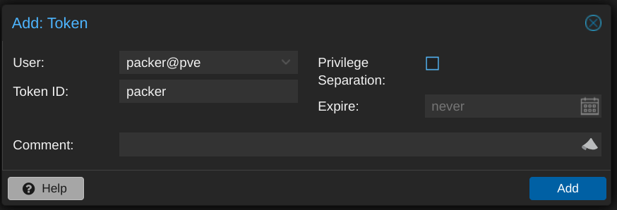

I've been [using Proxmox](/ditching-vsphere-for-proxmox/) in my [homelab](/homelab/) for a little while now, and I recently expanded the environment a bit with the addition of two HP Elite Mini 800 G9 computers. I figured it was time to start automating the process of building and maintaining my VM templates. I already had functional [Packer templates for VMware](https://github.com/jbowdre/packer-vsphere-templates) so I used that content as a starting point for the [Proxmox builds](https://github.com/jbowdre/packer-proxmox-templates). Once I had the builds working locally, I just had to explore how to automate them.

This post will describe how I did it. It will cover a lot of the implementation details but may gloss over some general setup steps; you'll need at least passing familiarity with [Packer](https://www.packer.io/) and [Vault](https://www.vaultproject.io/) to take this on.

### Component Overview
There are a lot of parts to this setup, so let's start by quickly running through those:
- a **Proxmox host** to serve the virtual infrastructure and provide compute for the new templates,
- a **Vault instance** running in a container in the lab to hold the secrets needed for the builds,
- some **Packer content** for building the templates in the first place,
- an **on-premise self-hosted GitHub runner** to simplify connectivity between GitHub and my homelab,
- and a **private GitHub repo** to hold the code and tell the runner when it's time to get to work.

{}
GitHub [strongly recommends](https://docs.github.com/en/actions/hosting-your-own-runners/managing-self-hosted-runners/about-self-hosted-runners#self-hosted-runner-security) that self-hosted runners *only* be used with private repositories.
> This is because forks of your public repository can potentially run dangerous code on your self-hosted runner machine by creating a pull request that executes the code in a workflow.

I don't like the idea of randos running arbitrary code on my home infrastructure. So while I'm sharing my work publicly [in this repo](https://github.com/jbowdre/packer-proxmox-templates), the workflows there are disabled and there are no connected runners. I'm running my builds out of a private repo and recommend that you do the same.
{}

### Proxmox Setup
The only configuration I did on the Proxmox side of things was to [create a user account](https://pve.proxmox.com/pve-docs/chapter-pveum.html#pveum_users) that Packer could use. I called it `packer` but didn't set a password for it. Instead, I set up an [API token](https://pve.proxmox.com/pve-docs/chapter-pveum.html#pveum_tokens) for that account, making sure to uncheck the "Privilege Separation" box so that the token inherits the same permissions as the user itself.



To use the token, I needed the ID (in the form `USERNAME@REALM!TOKENNAME`) and the UUID-looking secret, which is only displayed once so I made sure to record it in a safe place.

Speaking of privileges, the [Proxmox ISO integration documentation](https://developer.hashicorp.com/packer/integrations/hashicorp/proxmox/latest/components/builder/iso) doesn't offer any details on the minimum required permissions, and none of my attempts worked until I eventually assigned the Administrator role to the `packer` user. (I plan on doing more testing to narrow the scope a bit before running this in production, but this will do for my homelab purposes.)

Otherwise I just needed to figure out the details like which network bridge, ISO storage, and VM storage the Packer-built VMs should use.

### Vault Configuration
I use [Vault](https://github.com/hashicorp/vault) to hold the configuration details for the template builds - not just traditional secrets like usernames and passwords, but basically *every environment-specific setting* as well. This approach lets others use my Packer code without having to change much (if any) of it; every value that I expect to change between environments is retrieved from Vault at run time.

Because this is just a homelab, I'm using [Vault in Docker](https://hub.docker.com/r/hashicorp/vault), and I'm making it available within my tailnet with [Tailscale Serve](/tailscale-serve-docker-compose-sidecar/) using the following `docker-compose.yaml`

```yaml
# torchlight! {"lineNumbers":true}
services:
  tailscale:
    image: tailscale/tailscale:latest
    container_name: vault-tailscaled
    restart: unless-stopped
    environment:
      TS_AUTHKEY: ${TS_AUTHKEY:?err}
      TS_HOSTNAME: vault
      TS_STATE_DIR: "/var/lib/tailscale/"
      TS_SERVE_CONFIG: /config/serve-config.json
    volumes:
      - ./ts_data:/var/lib/tailscale/
      - ./serve-config.json:/config/serve-config.json

  vault:
    image: hashicorp/vault
    container_name: vault
    restart: unless-stopped
    environment:
      VAULT_ADDR: 'https://0.0.0.0:8200'
    cap_add:
      - IPC_LOCK
    volumes:
      - ./data:/vault/data
      - ./config:/vault/config
      - ./log:/vault/log
    command: vault server -config=/vault/config/vault.hcl
    network_mode: "service:tailscale"
```

Vault's `./config/vault.hcl`:

```hcl
ui = true

listener "tcp" {
  address = "0.0.0.0:8200"
  tls_disable = "true"
}

storage "file" {
  path = "/vault/data"
}
```

And Tailscale's `./serve-config.json`:

```json
# torchlight! {"lineNumbers":true}
{
  "TCP": {
    "443": {
      "HTTPS": true
    }
  },
  "Web": {
    "vault.tailnet-name.ts.net:443": {
      "Handlers": {
        "/": {
          "Proxy": "http://127.0.0.1:8200"
        }
      }
    }
  }
}
```

After performing the initial Vault setup, I then create a [kv-v2](https://developer.hashicorp.com/vault/docs/secrets/kv/kv-v2) secrets engine
for Packer to use:

```shell
vault secrets enable -path=packer kv-v2 # [tl! .cmd]
Success! Enabled the kv-v2 secrets engine at: packer/ # [tl! .nocopy]
```

And I define a [policy](https://developer.hashicorp.com/vault/docs/concepts/policies) which will grant the bearer read-only access to the data stored in the `packer` secrets as well as the ability to create and update its own token:

```shell
cat << EOF | vault policy write packer -
path "packer/*" {
  capabilities = ["read", "list"]
}

path "auth/token/renew-self" {
  capabilities = ["update"]
}

path "auth/token/create" {
  capabilities = ["create", "update"]
}
EOF # [tl! .cmd:-12,1]

Success! Uploaded policy: packer2 # [tl! .nocopy]
```

Now I just need to create a token attached to the policy:

```shell
vault token create -policy=packer -no-default-policy
  -orphan -ttl=4h -period=336h -display-name=packer # [tl! .cmd:-1,1 ]

Key                  Value # [tl! .nocopy:8]
---                  -----
token                hvs.CAES[...]GSFQ
token_accessor       aleV[...]xu5I
token_duration       336h
token_renewable      true
token_policies       ["packer"]
identity_policies    []
policies             ["packer"]
```

Within the `packer` secrets engine, I have two secrets which each have a number of subkeys:
`proxmox` contains values related to the Proxmox environment:
| Key                   | Example value                                 | Description                                                                                                              |
|-----------------------|-----------------------------------------------|--------------------------------------------------------------------------------------------------------------------------|
| `api_url`             | `https://proxmox1.example.com:8006/api2/json` | URL to the Proxmox API                                                                                                   |
| `insecure_connection` | `true`                                        | set to `false` if your Proxmox host has a valid certificate                                                              |
| `iso_path`            | `local:iso`                                   | path for (existing) ISO storage                                                                                          |
| `iso_storage_pool`    | `local`                                       | pool for storing created/uploaded ISOs                                                                                   |
| `network_bridge`      | `vmbr0`                                       | bridge the VM's NIC will be attached to                                                                                  |
| `node`                | `proxmox1`                                    | node name where the VM will be built                                                                                     |
| `token_id`            | `packer@pve!packer`                           | ID for an [API token](https://pve.proxmox.com/wiki/User_Management#pveum_tokens), in the form `USERNAME@REALM!TOKENNAME` |
| `token_secret`        | `3fc69f[...]d2077eda`                         | secret key for the token                                                                                                 |
| `vm_storage_pool`     | `zfs-pool`                                    | storage pool where the VM will be created                                                                                |

`linux` holds values for the created VM template(s)
| Key                   | Example value                                             | Description                                                                                     |
|-----------------------|-----------------------------------------------------------|-------------------------------------------------------------------------------------------------|
| `bootloader_password` | `bootplease`                                              | Grub bootloader password to set                                                                 |
| `password_hash`       | `$6$rounds=4096$NltiNLKi[...]a7Shax41`                    | hash of the build account's password (example generated with `mkpasswd -m sha512crypt -R 4096`) |
| `public_key`          | `ssh-ed25519 AAAAC3NzaC1[...]lXLUI5I40 admin@example.com` | SSH public key for the user                                                                     |
| `username`            | `admin`                                                   | build account username                                                                          |

### Packer Content
The layout of my [Packer Proxmox repo](https://github.com/jbowdre/packer-proxmox-templates/) looks something like this:

```text
.
├── .github # [tl! collapse:8 ]
│  ├── actions
│  │  └── packerbuild
│  │     ├── action.yml
│  │     ├── build.sh
│  │     └── Dockerfile
│  └── workflows
│     ├── build-single.yml
│     └── build.yml
├── builds
│  └── linux
│     └── ubuntu
│        ├── 22-04-lts
│        │  ├── data
│        │  │  ├── meta-data
│        │  │  └── user-data.pkrtpl.hcl
│        │  ├── hardening.sh
│        │  ├── linux-server.auto.pkrvars.hcl
│        │  ├── linux-server.pkr.hcl
│        │  └── variables.pkr.hcl
│        └── 24-04-lts # [tl! collapse:7 ]
│           ├── data
│           │  ├── meta-data
│           │  └── user-data.pkrtpl.hcl
│           ├── hardening.sh
│           ├── linux-server.auto.pkrvars.hcl
│           ├── linux-server.pkr.hcl
│           └── variables.pkr.hcl
├── certs
├── scripts
│  └── linux # [tl! collapse:16 ]
│     ├── cleanup-cloud-init.sh
│     ├── cleanup-packages.sh
│     ├── cleanup-subiquity.sh
│     ├── configure-pam_mkhomedir.sh
│     ├── configure-sshd.sh
│     ├── disable-multipathd.sh
│     ├── generalize.sh
│     ├── install-ca-certs.sh
│     ├── install-cloud-init.sh
│     ├── join-domain.sh
│     ├── persist-cloud-init-net.sh
│     ├── prune-motd.sh
│     ├── set-homedir-privacy.sh
│     ├── update-packages.sh
│     ├── wait-for-cloud-init.sh
│     └── zero-disk.sh
├── build.sh -> .github/actions/packerbuild/build.sh
└── vault-env.sh
```

- `.github/` holds the actions and workflows that will perform the automated builds. I'll cover this later.
- `builds/` contains subfolders for OS types (Linux or Windows (eventually)) and then separate subfolders for each flavor.
  - `linux/ubuntu/22-04-lts/` holds everything related to the Ubuntu 22.04 build:
    - `data/meta-data` is an empty placeholder,
    - `data/user-data.pkrtpl.hcl` is a template file for `cloud-init` to perform the initial install,
    - `hardening.sh` is a script to perform basic security hardening,
    - `variables.pkr.hcl` describes all the variables for the build,
    - `linux-server.auto.pkrvars.hcl` assigns values to each of those variables, and
    - `linux-server.pkr.hcl` details the steps for actually perfoming the build.
- `certs/` is empty in my case but *could* contain CA certificates that need to be installed in the template.
- `scripts/linux/` contains a variety of scripts that will be executed by Packer as a part of the build.
- `build.sh` is a (symlink to a) wrapper script which helps with running the builds locally.
- `vault-env.sh` exports variables for connecting to my Vault instance for use by `build.sh`.

#### Input Variable Definitions
Let's take a quick look at the variable definitions in `variables.pkr.hcl` first. All it does is define the available variables along with their type, provide a brief description about what the variable should hold or be used for, and set sane defaults for some of them.

{}
There are two types of variables used with Packer:
- **[Input Variables](https://developer.hashicorp.com/packer/docs/templates/hcl_templates/variables)** may have defined defaults, can be overridden, but cannot be changed after that initial override. They serve as build parameters, allowing aspects of the build to be altered without having to change the source code.
- **[Local Variables](https://developer.hashicorp.com/packer/docs/templates/hcl_templates/locals)** are useful for assigning a name to an expression. These expressions are evaluated at run time and can work with input variables, other local variables, data sources, and built-in functions.

Input variables are great for those predefined values, while local variables can be really handy for stuff that needs to be more dynamic.
{}

```hcl
# torchlight! {"lineNumbers":true}
/*
  Ubuntu Server 22.04 LTS variables using the Packer Builder for Proxmox.
*/

//  BLOCK: variable
//  Defines the input variables.

// Virtual Machine Settings

variable "remove_cdrom" {
  type          = bool
  description   = "Remove the virtual CD-ROM(s)."
  default       = true
}

variable "vm_name" {
  type          = string
  description   = "Name of the new template to create."
}

variable "vm_cpu_cores" {
  type          = number
  description   = "The number of virtual CPUs cores per socket. (e.g. '1')"
}

variable "vm_cpu_count" {
  type          = number
  description   = "The number of virtual CPUs. (e.g. '2')"
}

variable "vm_cpu_type" { # [tl! collapse:start]
  type          = string
  description   = "The virtual machine CPU type. (e.g. 'host')"
}

variable "vm_disk_size" {
  type          = string
  description   = "The size for the virtual disk (e.g. '60G')"
  default       = "60G"
}

variable "vm_bios_type" {
  type          = string
  description   = "The virtual machine BIOS type (e.g. 'ovmf' or 'seabios')"
  default       = "ovmf"
}

variable "vm_guest_os_keyboard" {
  type          = string
  description   = "The guest operating system keyboard input."
  default       = "us"
}

variable "vm_guest_os_language" {
  type          = string
  description   = "The guest operating system lanugage."
  default       = "en_US"
}

variable "vm_guest_os_timezone" {
  type          = string
  description   = "The guest operating system timezone."
  default       = "UTC"
}

variable "vm_guest_os_type" {
  type          = string
  description   = "The guest operating system type. (e.g. 'l26' for Linux 2.6+)"
}

variable "vm_mem_size" {
  type          = number
  description   = "The size for the virtual memory in MB. (e.g. '2048')"
}

variable "vm_network_model" {
  type          = string
  description   = "The virtual network adapter type. (e.g. 'e1000', 'vmxnet3', or 'virtio')"
  default       = "virtio"
}

variable "vm_scsi_controller" {
  type          = string
  description   = "The virtual SCSI controller type. (e.g. 'virtio-scsi-single')"
  default       = "virtio-scsi-single"
}

// VM Guest Partition Sizes
variable "vm_guest_part_audit" {
  type          = number
  description   = "Size of the /var/log/audit partition in MB."
}

variable "vm_guest_part_boot" {
  type          = number
  description   = "Size of the /boot partition in MB."
}

variable "vm_guest_part_efi" {
  type          = number
  description   = "Size of the /boot/efi partition in MB."
}

variable "vm_guest_part_home" {
  type          = number
  description   = "Size of the /home partition in MB."
}

variable "vm_guest_part_log" {
  type          = number
  description   = "Size of the /var/log partition in MB."
}

variable "vm_guest_part_root" {
  type          = number
  description   = "Size of the /var partition in MB. Set to 0 to consume all remaining free space."
  default       = 0
}

variable "vm_guest_part_swap" {
  type          = number
  description   = "Size of the swap partition in MB."
}

variable "vm_guest_part_tmp" {
  type          = number
  description   = "Size of the /tmp partition in MB."
}

variable "vm_guest_part_var" {
  type          = number
  description   = "Size of the /var partition in MB."
}

variable "vm_guest_part_vartmp" {
  type          = number
  description   = "Size of the /var/tmp partition in MB."
}

// Removable Media Settings

variable "cd_label" {
  type          = string
  description   = "CD Label"
  default       = "cidata"
}

variable "iso_checksum_type" {
  type          = string
  description   = "The checksum algorithm used by the vendor. (e.g. 'sha256')"
}

variable "iso_checksum_value" {
  type          = string
  description   = "The checksum value provided by the vendor."
}

variable "iso_file" {
  type          = string
  description   = "The file name of the ISO image used by the vendor. (e.g. 'ubuntu-<version>-live-server-amd64.iso')"
}

variable "iso_url" {
  type          = string
  description   = "The URL source of the ISO image. (e.g. 'https://mirror.example.com/.../os.iso')"
}

// Boot Settings

variable "vm_boot_command" {
  type          = list(string)
  description   = "The virtual machine boot command."
  default       = []
}

variable "vm_boot_wait" {
  type          = string
  description   = "The time to wait before boot."
}

// Communicator Settings and Credentials

variable "build_remove_keys" {
  type          = bool
  description   = "If true, Packer will attempt to remove its temporary key from ~/.ssh/authorized_keys and /root/.ssh/authorized_keys"
  default       = true
}

variable "communicator_insecure" {
  type          = bool
  description   = "If true, do not check server certificate chain and host name"
  default       = true
}

variable "communicator_port" {
  type          = string
  description   = "The port for the communicator protocol."
}

variable "communicator_ssl" {
  type          = bool
  description   = "If true, use SSL"
  default       = true
}

variable "communicator_timeout" {
  type          = string
  description   = "The timeout for the communicator protocol."
}

// Provisioner Settings

variable "cloud_init_apt_packages" {
  type          = list(string)
  description   = "A list of apt packages to install during the subiquity cloud-init installer."
  default       = []
}

variable "cloud_init_apt_mirror" {
  type          = string
  description   = "Sets the default apt mirror during the subiquity cloud-init installer."
  default       = ""
}

variable "post_install_scripts" {
  type          = list(string)
  description   = "A list of scripts and their relative paths to transfer and run after OS install."
  default       = []
}

variable "pre_final_scripts" {
  type          = list(string)
  description   = "A list of scripts and their relative paths to transfer and run before finalization."
  default       = []
} # [tl! collapse:end]
```

(Collapsed because I think you get the idea, but feel free to expand to view the whole thing.)

#### Input Variable Assignments
Now that I've told Packer about what variables I intend to use, I can then go about setting values for those variables. That's done in the `linux-server.auto.pkrvars.hcl` file.

```hcl
# torchlight! {"lineNumbers":true}
/*
  Ubuntu Server 22.04 LTS  variables used by the Packer Builder for Proxmox.
*/

// Guest Operating System Metadata
vm_guest_os_keyboard    = "us"
vm_guest_os_language    = "en_US"
vm_guest_os_timezone    = "America/Chicago"

// Virtual Machine Guest Operating System Setting
vm_guest_os_type        = "l26"

//Virtual Machine Guest Partition Sizes (in MB)
vm_guest_part_audit     = 4096  # [tl! **:9 ~~:9]
vm_guest_part_boot      = 512
vm_guest_part_efi       = 512
vm_guest_part_home      = 8192
vm_guest_part_log       = 4096
vm_guest_part_root      = 0
vm_guest_part_swap      = 1024
vm_guest_part_tmp       = 4096
vm_guest_part_var       = 8192
vm_guest_part_vartmp    = 1024

// Virtual Machine Hardware Settings
vm_cpu_cores            = 1 # [tl! **:8 ~~:8]
vm_cpu_count            = 2
vm_cpu_type             = "host"
vm_disk_size            = "60G" #
vm_bios_type            = "ovmf"
vm_mem_size             = 2048 #
vm_name                 = "Ubuntu2204"
vm_network_card         = "virtio"
vm_scsi_controller      = "virtio-scsi-single"

// Removable Media Settings
iso_checksum_type       = "sha256" # [tl! **:3 ~~:3]
iso_checksum_value      = "45f873de9f8cb637345d6e66a583762730bbea30277ef7b32c9c3bd6700a32b2" #
iso_file                = "ubuntu-22.04.4-live-server-amd64.iso"
iso_url                 = "https://releases.ubuntu.com/jammy/ubuntu-22.04.4-live-server-amd64.iso"
remove_cdrom            = true

// Boot Settings
boot_key_interval       = "250ms"
vm_boot_wait            = "4s"
vm_boot_command = [ # [tl! **:8 ~~:8]
    "<esc><wait>c",
    "linux /casper/vmlinuz --- autoinstall ds=\"nocloud\"",
    "<enter><wait5s>",
    "initrd /casper/initrd",
    "<enter><wait5s>",
    "boot",
    "<enter>"
  ]

// Communicator Settings
communicator_port       = 22
communicator_timeout    = "25m"

// Provisioner Settings
cloud_init_apt_packages = [ # [tl! **:7 ~~:7]
  "cloud-guest-utils",
  "net-tools",
  "perl",
  "qemu-guest-agent",
  "vim",
  "wget"
]

post_install_scripts = [ # [tl! **:9 ~~:9]
  "scripts/linux/wait-for-cloud-init.sh",
  "scripts/linux/cleanup-subiquity.sh",
  "scripts/linux/install-ca-certs.sh",
  "scripts/linux/disable-multipathd.sh",
  "scripts/linux/prune-motd.sh",
  "scripts/linux/persist-cloud-init-net.sh",
  "scripts/linux/configure-pam_mkhomedir.sh",
  "scripts/linux/update-packages.sh"
]

pre_final_scripts = [ # [tl! **:6 ~~:6]
  "scripts/linux/cleanup-cloud-init.sh",
  "scripts/linux/cleanup-packages.sh",
  "builds/linux/ubuntu/22-04-lts/hardening.sh",
  "scripts/linux/zero-disk.sh",
  "scripts/linux/generalize.sh"
]
```

As you can see, this sets up a lot of the properties which aren't strictly environment specific, like:
- partition sizes (ll. 14-23),
- virtual hardware settings (ll. 26-34),
- the hash and URL for the installer ISO (ll. 37-40),
- the command to be run at first boot to start the installer in unattended mode (ll. 47-53),
- a list of packages to install during the `cloud-init` install phase, primarily the sort that might be needed during later steps (ll. 62-67),
- a list of scripts to execute after `cloud-init` (ll. 71-78),
- and a list of scripts to run at the very end of the process (ll. 82-86).

We'll look at the specifics of those scripts shortly, but first...

#### Packer Build File
Let's explore the Packer build file, `linux-server.pkr.hcl`, which is the set of instructions used by Packer for performing the deployment. It's what ties everything else together.

This one is kind of complex so we'll take it a block or two at a time.

It starts by setting the required minimum version of Packer and identifying what plugins (and versions) will be used to perform the build. I'm using the [Packer plugin for Proxmox](https://github.com/hashicorp/packer-plugin-proxmox) for executing the build on Proxmox (*duh*), and the [Packer SSH key plugin](https://github.com/ivoronin/packer-plugin-sshkey) to simplify handling of SSH keys (we'll see how in the next block).

```hcl
# torchlight! {"lineNumbers":true}
/*
  Ubuntu Server 22.04 LTS template using the Packer Builder for Proxmox.
*/

//  BLOCK: packer
//  The Packer configuration.

packer {
  required_version              = ">= 1.9.4" # [tl! ** ~~]
  required_plugins {
    proxmox = { # [tl! **:2 ~~:2]
      version                   = ">= 1.1.8"
      source                    = "github.com/hashicorp/proxmox"
    }
    ssh-key = { # [tl! **:2 ~~:2]
      version                   = "= 1.0.3"
      source                    = "github.com/ivoronin/sshkey"
    }
  }
}
```

This bit creates the `sshkey` data resource which uses the SSH plugin to generate a new SSH keypair to be used during the build process:

```hcl
# torchlight! {"lineNumbers":true, "lineNumbersStart":22}
//  BLOCK: locals
//  Defines the local variables.

// Dynamically-generated SSH key
data "sshkey" "install" { # [tl! **:2 ~~:2]
  type                          = "ed25519"
  name                          = "packer_key"
}
```

This first set of `locals {}` blocks take advantage of the dynamic nature of local variables. They call the [`vault` function](https://developer.hashicorp.com/packer/docs/templates/hcl_templates/functions/contextual/vault) to retrieve secrets from Vault and hold them as local variables. It's broken into a section for "standard" variables, which just hold configuration information like URLs and usernames, and one for "sensitive" variables like passwords and API tokens. The sensitive ones get `sensitive = true` to make sure they won't be printed in the logs anywhere.

```hcl
# torchlight! {"lineNumbers":true, "lineNumbersStart":31}
////////////////// Vault Locals //////////////////
// To retrieve secrets from Vault, the following environment variables MUST be defined:
//  - VAULT_ADDR        : base URL of the Vault server ('https://vault.example.com/')
//  - VAULT_NAMESPACE   : namespace path to where the secrets live ('organization/sub-org', only for Vault Enterprise)
//  - VAULT_TOKEN       : token ID with rights to read/list
//
// Syntax for the vault() call:
//    vault("SECRET_ENGINE/data/SECRET_NAME", "KEY")
//
// Standard configuration values:
locals { # [tl! **:10]
  build_public_key              = vault("packer/data/linux",      "public_key")           // SSH public key for the default admin account
  build_username                = vault("packer/data/linux",      "username")             // Username for the default admin account
  proxmox_url                   = vault("packer/data/proxmox",    "api_url")              // Proxmox API URL
  proxmox_insecure_connection   = vault("packer/data/proxmox",    "insecure_connection")  // Allow insecure connections to Proxmox
  proxmox_node                  = vault("packer/data/proxmox",    "node")                 // Proxmox node to use for the build
  proxmox_token_id              = vault("packer/data/proxmox",    "token_id")             // Proxmox token ID
  proxmox_iso_path              = vault("packer/data/proxmox",    "iso_path")             // Path to the ISO storage
  proxmox_vm_storage_pool       = vault("packer/data/proxmox",    "vm_storage_pool")         // Proxmox storage pool to use for the build
  proxmox_iso_storage_pool      = vault("packer/data/proxmox",    "iso_storage_pool")     // Proxmox storage pool to use for the ISO
  proxmox_network_bridge        = vault("packer/data/proxmox",    "network_bridge")       // Proxmox network bridge to use for the build
}
// Sensitive values:
local "bootloader_password"{ # [tl! **:10]
  expression                    = vault("packer/data/linux",            "bootloader_password")  // Password to set for the bootloader
  sensitive                     = true
}
local "build_password_hash" {
  expression                    = vault("packer/data/linux",            "password_hash")             // Password hash for the default admin account
  sensitive                     = true
}
local "proxmox_token_secret" {
  expression                    = vault("packer/data/proxmox",          "token_secret")             // Token secret for authenticating to Proxmox
  sensitive                     = true
}

////////////////// End Vault Locals //////////////////
```

And the next `locals {}` block leverages other expressions to:
- dynamically set `local.build_date` to the current time (l. 70),
- combine individual string variables, like `local.iso_checksum` and `local.iso_path` (ll. 73-74),
- define a shutdown command to clean up sudoers includes and shutdown the VM at the end of the build (ll. 75),
- capture the keypair generated by the SSH key plugin (ll. 76-77),
- and use the []`templatefile()` function](https://developer.hashicorp.com/packer/docs/templates/hcl_templates/functions/file/templatefile) to process the `cloud-init` config file and insert appropriate variables (ll. 78-101)

```hcl
# torchlight! {"lineNumbers":true, "lineNumbersStart":69}
locals {
  build_date                    = formatdate("YYYY-MM-DD hh:mm ZZZ", timestamp()) # [tl! ** ~~]
  build_description             = "Ubuntu Server 22.04 LTS template\nBuild date: ${local.build_date}\nBuild tool: ${local.build_tool}"
  build_tool                    = "HashiCorp Packer ${packer.version}"
  iso_checksum                  = "${var.iso_checksum_type}:${var.iso_checksum_value}" # [tl! **:2 ~~:2]
  iso_path                      = "${local.proxmox_iso_path}/${var.iso_file}"
  shutdown_command              = "sudo sh -c 'rm -f /etc/sudoers.d/*; /usr/sbin/shutdown -P now'"
  ssh_private_key_file          = data.sshkey.install.private_key_path # [tl! **:1 ~~:1]
  ssh_public_key                = data.sshkey.install.public_key
  data_source_content = { # [tl! **:23]
    "/meta-data"                = file("${abspath(path.root)}/data/meta-data")
    "/user-data"                = templatefile("${abspath(path.root)}/data/user-data.pkrtpl.hcl", { # [tl! **:20 ~~:20]
      apt_mirror                = var.cloud_init_apt_mirror
      apt_packages              = var.cloud_init_apt_packages
      build_password_hash       = local.build_password_hash
      build_username            = local.build_username
      ssh_keys                  = concat([local.ssh_public_key], [local.build_public_key])
      vm_guest_os_hostname      = var.vm_name
      vm_guest_os_keyboard      = var.vm_guest_os_keyboard
      vm_guest_os_language      = var.vm_guest_os_language
      vm_guest_os_timezone      = var.vm_guest_os_timezone
      vm_guest_part_audit       = var.vm_guest_part_audit
      vm_guest_part_boot        = var.vm_guest_part_boot
      vm_guest_part_efi         = var.vm_guest_part_efi
      vm_guest_part_home        = var.vm_guest_part_home
      vm_guest_part_log         = var.vm_guest_part_log
      vm_guest_part_root        = var.vm_guest_part_root
      vm_guest_part_swap        = var.vm_guest_part_swap
      vm_guest_part_tmp         = var.vm_guest_part_tmp
      vm_guest_part_var         = var.vm_guest_part_var
      vm_guest_part_vartmp      = var.vm_guest_part_vartmp
    })
  }
}
```

The `source {}` block is where we get to the meat of the operation. This matches the input and local variables to the Packer options that tell it:
- how to connect and authenticate to the Proxmox host (ll. 110-113, 116),
- what virtual hardware settings the VM should have (ll. 119-141),
- that `local.data_source_content` (which contains the rendered `cloud-init` configuration) should be mounted as a virtual CD-ROM device (ll. 144-149),
- to download and verify the installer ISO from `var.iso_url`, save it to `local.proxmox_iso_storage_pool`, and mount it as the primary CD-ROM device (ll. 150-155),
- what command to run at boot to start the install process (l. 159),
- and how to communicate with the VM once the install is under way (ll. 163-168).

```hcl
# torchlight! {"lineNumbers":true, "lineNumbersStart":104}
//  BLOCK: source
//  Defines the builder configuration blocks.

source "proxmox-iso" "linux-server" {

  // Proxmox Endpoint Settings and Credentials
  insecure_skip_tls_verify      = local.proxmox_insecure_connection # [tl! **:3 ~~:3]
  proxmox_url                   = local.proxmox_url
  token                         = local.proxmox_token_secret
  username                      = local.proxmox_token_id

  // Node Settings
  node                          = local.proxmox_node # [tl! ** ~~]

  // Virtual Machine Settings
  bios                          = "ovmf" # [tl! **:22 ~~:22]
  cores                         = var.vm_cpu_cores
  cpu_type                      = var.vm_cpu_type
  memory                        = var.vm_mem_size
  os                            = var.vm_guest_os_type
  scsi_controller               = var.vm_scsi_controller
  sockets                       = var.vm_cpu_count
  template_description          = local.build_description
  template_name                 = var.vm_name
  vm_name                       = var.vm_name
  disks {
    disk_size                   = var.vm_disk_size
    storage_pool                = local.proxmox_vm_storage_pool
  }
  efi_config {
    efi_storage_pool            = local.proxmox_vm_storage_pool
    efi_type                    = "4m"
    pre_enrolled_keys           = true
  }
  network_adapters {
    bridge                      = local.proxmox_network_bridge
    model                       = var.vm_network_model
  }

  // Removable Media Settings
  additional_iso_files {
    cd_content                  = local.data_source_content
    cd_label                    = var.cd_label
    iso_storage_pool            = local.proxmox_iso_storage_pool
    unmount                     = var.remove_cdrom
  }
  iso_checksum                  = local.iso_checksum
  // iso_file                      = local.iso_path
  iso_url                       = var.iso_url
  iso_download_pve              = true
  iso_storage_pool              = local.proxmox_iso_storage_pool
  unmount_iso                   = var.remove_cdrom


  // Boot and Provisioning Settings
  boot_command                  = var.vm_boot_command
  boot_wait                     = var.vm_boot_wait

  // Communicator Settings and Credentials
  communicator                  = "ssh"
  ssh_clear_authorized_keys     = var.build_remove_keys
  ssh_port                      = var.communicator_port
  ssh_private_key_file          = local.ssh_private_key_file
  ssh_timeout                   = var.communicator_timeout
  ssh_username                  = local.build_username

}
```

//  BLOCK: build
//  Defines the builders to run, provisioners, and post-processors.

build {
  sources = [
    "source.proxmox-iso.linux-server"
  ]

  provisioner "file" {
    source                      = "certs"
    destination                 = "/tmp"
  }

  provisioner "file" {
    source                      = "scripts/linux/join-domain.sh"
    destination                 = "/home/${local.build_username}/join-domain.sh"
  }

  provisioner "shell" {
    execute_command             = "bash {{ .Path }}"
    expect_disconnect           = true
    scripts                     = formatlist("${path.cwd}/%s", var.post_install_scripts)
  }

  provisioner "shell" {
    env                         = {
      "BOOTLOADER_PASSWORD"     = local.bootloader_password
    }
    execute_command             = "{{ .Vars }} bash {{ .Path }}"
    expect_disconnect           = true
    pause_before                = "30s"
    scripts                     = formatlist("${path.cwd}/%s", var.pre_final_scripts)
  }
}
```

#### `cloud-init` Config
Now let's drill into that `cloud-init` template file, `builds/linux/ubuntu/22-04-lts/data/user-data.pkrtpl.hcl`. It follows the basic YAML-based syntax of a standard [cloud config file](https://cloudinit.readthedocs.io/en/latest/reference/examples.html), but with some [HCL templating](https://developer.hashicorp.com/packer/docs/templates/hcl_templates/functions/file/templatefile) to pull in certain values from elsewhere.

```yaml
# torchlight! {"lineNumbers":true}
#cloud-config
autoinstall:
%{ if length( apt_mirror ) > 0 ~}
  apt:
    primary:
      - arches: [default]
        uri: "${ apt_mirror }"
%{ endif ~}
  early-commands: # [tl! **:5]
    - sudo systemctl stop ssh # [tl! ~~]
  identity:
    hostname: ${ vm_guest_os_hostname } # [tl! ~~:2]
    password: '${ build_password_hash }'
    username: ${ build_username }
  keyboard:
    layout: ${ vm_guest_os_keyboard }
  late-commands: # [tl! **:2]
    - echo "${ build_username } ALL=(ALL) NOPASSWD:ALL" > /target/etc/sudoers.d/${ build_username } # [tl! ~~:1]
    - curtin in-target --target=/target -- chmod 400 /etc/sudoers.d/${ build_username }
  locale: ${ vm_guest_os_language }
  network: # [tl! collapse:9]
    network:
      version: 2
      ethernets:
        mainif:
          match:
            name: e*
          critical: true
          dhcp4: true
          dhcp-identifier: mac
%{ if length( apt_packages ) > 0 ~} # [tl! **:5]
  packages:
%{ for package in apt_packages ~} # [tl! ~~:2]
    - ${ package }
%{ endfor ~}
%{ endif ~}
  ssh:
    install-server: true
    allow-pw: true
%{ if length( ssh_keys ) > 0 ~} # [tl! **:5]
    authorized-keys:
%{ for ssh_key in ssh_keys ~} # [tl! ~~2]
      - ${ ssh_key }
%{ endfor ~}
%{ endif ~}
  storage:
    config: # [tl! collapse:start]
      - ptable: gpt
        path: /dev/sda
        wipe: superblock
        type: disk
        id: disk-sda
      - device: disk-sda
        size: ${ vm_guest_part_efi }M
        wipe: superblock
        flag: boot
        number: 1
        grub_device: true
        type: partition
        id: partition-0
      - fstype: fat32
        volume: partition-0
        label: EFIFS
        type: format
        id: format-efi
      - device: disk-sda
        size: ${ vm_guest_part_boot }M
        wipe: superblock
        number: 2
        type: partition
        id: partition-1
      - fstype: xfs
        volume: partition-1
        label: BOOTFS
        type: format
        id: format-boot
      - device: disk-sda
        size: -1
        wipe: superblock
        number: 3
        type: partition
        id: partition-2
      - name: sysvg
        devices:
          - partition-2
        type: lvm_volgroup
        id: lvm_volgroup-0
      - name: home
        volgroup: lvm_volgroup-0
        size: ${ vm_guest_part_home}M
        wipe: superblock
        type: lvm_partition
        id: lvm_partition-home
      - fstype: xfs
        volume: lvm_partition-home
        type: format
        label: HOMEFS
        id: format-home
      - name: tmp
        volgroup: lvm_volgroup-0
        size: ${ vm_guest_part_tmp }M
        wipe: superblock
        type: lvm_partition
        id: lvm_partition-tmp
      - fstype: xfs
        volume: lvm_partition-tmp
        type: format
        label: TMPFS
        id: format-tmp
      - name: var
        volgroup: lvm_volgroup-0
        size: ${ vm_guest_part_var }M
        wipe: superblock
        type: lvm_partition
        id: lvm_partition-var
      - fstype: xfs
        volume: lvm_partition-var
        type: format
        label: VARFS
        id: format-var
      - name: log
        volgroup: lvm_volgroup-0
        size: ${ vm_guest_part_log }M
        wipe: superblock
        type: lvm_partition
        id: lvm_partition-log
      - fstype: xfs
        volume: lvm_partition-log
        type: format
        label: LOGFS
        id: format-log
      - name: audit
        volgroup: lvm_volgroup-0
        size: ${ vm_guest_part_audit }M
        wipe: superblock
        type: lvm_partition
        id: lvm_partition-audit
      - fstype: xfs
        volume: lvm_partition-audit
        type: format
        label: AUDITFS
        id: format-audit
      - name: vartmp
        volgroup: lvm_volgroup-0
        size: ${ vm_guest_part_vartmp }M
        wipe: superblock
        type: lvm_partition
        id: lvm_partition-vartmp
      - fstype: xfs
        volume: lvm_partition-vartmp
        type: format
        label: VARTMPFS
        id: format-vartmp
      - name: root
        volgroup: lvm_volgroup-0
%{ if vm_guest_part_root == 0 ~}
        size: -1
%{ else ~}
        size: ${ vm_guest_part_root }M
%{ endif ~}
        wipe: superblock
        type: lvm_partition
        id: lvm_partition-root
      - fstype: xfs
        volume: lvm_partition-root
        type: format
        label: ROOTFS
        id: format-root
      - path: /
        device: format-root
        type: mount
        id: mount-root
      - path: /boot
        device: format-boot
        type: mount
        id: mount-boot
      - path: /boot/efi
        device: format-efi
        type: mount
        id: mount-efi
      - path: /home
        device: format-home
        type: mount
        id: mount-home
      - path: /tmp
        device: format-tmp
        type: mount
        id: mount-tmp
      - path: /var
        device: format-var
        type: mount
        id: mount-var
      - path: /var/log
        device: format-log
        type: mount
        id: mount-log
      - path: /var/log/audit
        device: format-audit
        type: mount
        id: mount-audit
      - path: /var/tmp
        device: format-vartmp
        type: mount
        id: mount-vartmp # [tl! collapse:end]
  user-data:
    package_upgrade: true
    disable_root: true
    timezone: ${ vm_guest_os_timezone }
  version: 1
```

Some of the key tasks handled by this configuration include:
- stopping the SSH server (l. 10),
- setting the hostname (l 12), inserting username and password (ll. 13-14),
- enabling (temporary) passwordless-sudo (ll. 17-18),
- installing a templated list of packages (ll. 30-35),
- inserting a templated list of SSH public keys (ll. 39-44),
- and other needful things like setting up drive partitioning.

`cloud-init` will reboot the VM once it completes, and when it comes back online it will have a DHCP-issued IP address and the accounts/credentials needed for Packer to log in via SSH and continue the setup.

#### Setup Scripts

#### Build Script