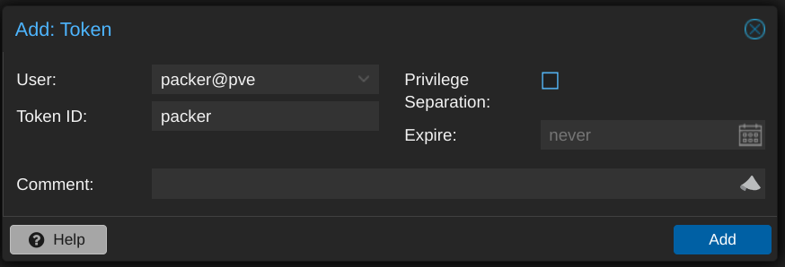
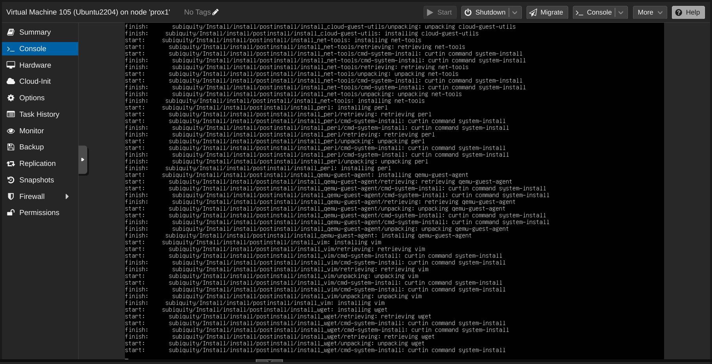

I've been [using Proxmox](/ditching-vsphere-for-proxmox/) in my [homelab](/homelab/) for a while now, and I recently expanded the environment with two HP Elite Mini 800 G9 computers. It was time to start automating the process of building and maintaining my VM templates. I already had functional [Packer templates for VMware](https://github.com/jbowdre/packer-vsphere-templates) so I used that as a starting point for the [Proxmox builds](https://github.com/jbowdre/packer-proxmox-templates). So far, I've only ported over the Ubuntu builds; I'm telling myself I'll get the rest moved over after *finally* publishing this post.

Once I got the builds working locally, I explored how to automate them. I set up a GitHub Actions workflow and a rootless runner to perform the builds for me. I'll write up notes on that part of the process soon, but first, let's run through how I set up Packer. That will be plenty to chew on for now.

This post will cover a lot of the Packer implementation details but may gloss over some general setup steps; you'll need at least a passing familiarity with [Packer](https://www.packer.io/) and [Vault](https://www.vaultproject.io/) to take this on.

### Component Overview
There are several important parts to this setup, so let's start by quickly running through those:
- a **Proxmox host** to serve the virtual infrastructure and provide compute for the new templates,
- a **Vault instance** running in a container in the lab to hold the secrets needed for the builds,
- and some **Packer content** for actually building the templates.

### Proxmox Setup
The only configuration I did on the Proxmox side was to [create a user account](https://pve.proxmox.com/pve-docs/chapter-pveum.html#pveum_users) that Packer could use. I called it `packer` but didn't set a password for it. Instead, I set up an [API token](https://pve.proxmox.com/pve-docs/chapter-pveum.html#pveum_tokens) for that account, making sure to **uncheck** the "Privilege Separation" box so that the token would inherit the same permissions as the user itself.



To use the token, I needed the ID (in the form `USERNAME@REALM!TOKENNAME`) and the UUID-looking secret, which is only displayed once, so I made sure to record it in a safe place.

Speaking of privileges, the [Proxmox ISO integration documentation](https://developer.hashicorp.com/packer/integrations/hashicorp/proxmox/latest/components/builder/iso) doesn't offer any details on the minimum required permissions, and none of my attempts worked until I eventually assigned the Administrator role to the `packer` user. I plan on doing more testing to narrow the scope before running this in production, but this will do for my homelab purposes.

Otherwise, I just needed to figure out the details like which network bridge, ISO storage, and VM storage the Packer-built VMs should use.

### Vault Configuration
I use [Vault](https://github.com/hashicorp/vault) to hold the configuration details for the template builds - not just traditional secrets like usernames and passwords, but basically every environment-specific setting as well. This approach lets others use my Packer code without having to change much (if any) of it; every value that I expect to change between environments is retrieved from Vault at runtime.

Because this is just a homelab, I'm using [Vault in Docker](https://hub.docker.com/r/hashicorp/vault), and I'm making it available within my tailnet with [Tailscale Serve](/tailscale-serve-docker-compose-sidecar/) using the following `docker-compose.yaml`

```yaml
# torchlight! {"lineNumbers":true}
services:
  tailscale:
    image: tailscale/tailscale:latest
    container_name: vault-tailscaled
    restart: unless-stopped
    environment:
      TS_AUTHKEY: ${TS_AUTHKEY:?err}
      TS_HOSTNAME: vault
      TS_STATE_DIR: "/var/lib/tailscale/"
      TS_SERVE_CONFIG: /config/serve-config.json
    volumes:
      - ./ts_data:/var/lib/tailscale/
      - ./serve-config.json:/config/serve-config.json

  vault:
    image: hashicorp/vault
    container_name: vault
    restart: unless-stopped
    environment:
      VAULT_ADDR: 'https://0.0.0.0:8200'
    cap_add:
      - IPC_LOCK
    volumes:
      - ./data:/vault/data
      - ./config:/vault/config
      - ./log:/vault/log
    command: vault server -config=/vault/config/vault.hcl
    network_mode: "service:tailscale"
```

I use the following `./config/vault.hcl` to set the Vault server configuration:

```hcl
ui = true

listener "tcp" {
  address = "0.0.0.0:8200"
  tls_disable = "true"
}

storage "file" {
  path = "/vault/data"
}
```

And this `./serve-config.json` to tell Tailscale that it should proxy the Vault container's port `8200` and make it available on my tailnet at `https://vault.tailnet-name.ts.net/`:

```json
# torchlight! {"lineNumbers":true}
{
  "TCP": {
    "443": {
      "HTTPS": true
    }
  },
  "Web": {
    "vault.tailnet-name.ts.net:443": {
      "Handlers": {
        "/": {
          "Proxy": "http://127.0.0.1:8200"
        }
      }
    }
  }
}
```

After performing the initial Vault setup, I then created a [kv-v2](https://developer.hashicorp.com/vault/docs/secrets/kv/kv-v2) secrets engine for Packer to use:

```shell
vault secrets enable -path=packer kv-v2 # [tl! .cmd]
Success! Enabled the kv-v2 secrets engine at: packer/ # [tl! .nocopy]
```

I defined a [policy](https://developer.hashicorp.com/vault/docs/concepts/policies) which will grant the bearer read-only access to the data stored in the `packer` secrets as well as the ability to create and update its own token:

```shell
cat << EOF | vault policy write packer -
path "packer/*" {
  capabilities = ["read", "list"]
}

path "auth/token/renew-self" {
  capabilities = ["update"]
}

path "auth/token/create" {
  capabilities = ["create", "update"]
}
EOF # [tl! .cmd:-12,1]

Success! Uploaded policy: packer2 # [tl! .nocopy]
```

Now I just need to create a token attached to the policy:

```shell
vault token create -policy=packer -no-default-policy \
  -orphan -ttl=4h -period=336h -display-name=packer # [tl! .cmd:-1,1 ]

Key                  Value # [tl! .nocopy:8]
---                  -----
token                hvs.CAES[...]GSFQ
token_accessor       aleV[...]xu5I
token_duration       336h
token_renewable      true
token_policies       ["packer"]
identity_policies    []
policies             ["packer"]
```

The token will only be displayed this once so I make sure to copy it somewhere safe.

Within the `packer` secrets engine, I have two secrets which each have a number of subkeys.

`proxmox` contains values related to the Proxmox environment:
| Key                   | Example value                                 | Description                                                                                                              |
|-----------------------|-----------------------------------------------|--------------------------------------------------------------------------------------------------------------------------|
| `api_url`             | `https://prox.tailnet-name.ts.net/api2/json/` | URL to the Proxmox API                                                                                                   |
| `insecure_connection` | `true`                                        | set to `false` if your Proxmox host has a valid certificate                                                              |
| `iso_path`            | `local:iso`                                   | path for (existing) ISO storage                                                                                          |
| `iso_storage_pool`    | `local`                                       | pool for storing created/uploaded ISOs                                                                                   |
| `network_bridge`      | `vmbr0`                                       | bridge the VM's NIC will be attached to                                                                                  |
| `node`                | `proxmox1`                                    | node name where the VM will be built                                                                                     |
| `token_id`            | `packer@pve!packer`                           | ID for an [API token](https://pve.proxmox.com/wiki/User_Management#pveum_tokens), in the form `USERNAME@REALM!TOKENNAME` |
| `token_secret`        | `3fc69f[...]d2077eda`                         | secret key for the token                                                                                                 |
| `vm_storage_pool`     | `zfs-pool`                                    | storage pool where the VM will be created                                                                                |

`linux` holds values for the created VM template(s)
| Key                   | Example value                                             | Description                                                                                     |
|-----------------------|-----------------------------------------------------------|-------------------------------------------------------------------------------------------------|
| `bootloader_password` | `bootplease`                                              | Grub bootloader password to set                                                                 |
| `password_hash`       | `$6$rounds=4096$NltiNLKi[...]a7Shax41`                    | hash of the build account's password (example generated with `mkpasswd -m sha512crypt -R 4096`) |
| `public_key`          | `ssh-ed25519 AAAAC3NzaC1[...]lXLUI5I40 admin@example.com` | SSH public key for the user                                                                     |
| `username`            | `admin`                                                   | build account username                                                                          |

### Packer Content
The layout of my [Packer Proxmox repo](https://github.com/jbowdre/packer-proxmox-templates/) looks something like this:

```text
.
├── .github [tl! collapse:8 ]
│  ├── actions
│  │  └── packerbuild
│  │     ├── action.yml
│  │     ├── build.sh
│  │     └── Dockerfile
│  └── workflows
│     ├── build-single.yml
│     └── build.yml
├── builds
│  └── linux
│     └── ubuntu
│        ├── 22-04-lts
│        │  ├── data
│        │  │  ├── meta-data
│        │  │  └── user-data.pkrtpl.hcl
│        │  ├── hardening.sh
│        │  ├── linux-server.auto.pkrvars.hcl
│        │  ├── linux-server.pkr.hcl
│        │  └── variables.pkr.hcl
│        └── 24-04-lts [tl! collapse:7 ]
│           ├── data
│           │  ├── meta-data
│           │  └── user-data.pkrtpl.hcl
│           ├── hardening.sh
│           ├── linux-server.auto.pkrvars.hcl
│           ├── linux-server.pkr.hcl
│           └── variables.pkr.hcl
├── certs
├── scripts
│  └── linux [tl! collapse:16 ]
│     ├── cleanup-cloud-init.sh
│     ├── cleanup-packages.sh
│     ├── cleanup-subiquity.sh
│     ├── configure-pam_mkhomedir.sh
│     ├── configure-sshd.sh
│     ├── disable-multipathd.sh
│     ├── generalize.sh
│     ├── install-ca-certs.sh
│     ├── install-cloud-init.sh
│     ├── join-domain.sh
│     ├── persist-cloud-init-net.sh
│     ├── prune-motd.sh
│     ├── set-homedir-privacy.sh
│     ├── update-packages.sh
│     ├── wait-for-cloud-init.sh
│     └── zero-disk.sh
├── build.sh -> .github/actions/packerbuild/build.sh
└── vault-env.sh
```

- `.github/` holds the actions and workflows that will perform the automated builds. I'll cover this later.
- `builds/` contains subfolders for OS types (Linux or Windows (eventually)) and then separate subfolders for each flavor.
  - `linux/ubuntu/22-04-lts/` holds everything related to the Ubuntu 22.04 build:
    - `data/meta-data` is an empty placeholder,
    - `data/user-data.pkrtpl.hcl` is a template file for `cloud-init` to perform the initial install,
    - `hardening.sh` is a script to perform basic security hardening,
    - `variables.pkr.hcl` describes all the variables for the build,
    - `linux-server.auto.pkrvars.hcl` assigns values to each of those variables, and
    - `linux-server.pkr.hcl` details the steps for actually performing the build.
- `certs/` is empty in my case but could contain CA certificates that need to be installed in the template.
- `scripts/linux/` contains a variety of scripts that will be executed by Packer as part of the build.
- `build.sh` is a (symlink to a) wrapper script which helps with running the builds locally.
- `vault-env.sh` exports variables for connecting to my Vault instance for use by `build.sh`.

#### Input Variable Definitions
Let's take a quick look at the variable definitions in `variables.pkr.hcl` first. All it does is define the available variables along with their type, provide a brief description about what the variable should hold or be used for, and set sane defaults for some of them.

{}
There are two types of variables used with Packer:
- **[Input Variables](https://developer.hashicorp.com/packer/docs/templates/hcl_templates/variables)** may have defined defaults, can be overridden, but cannot be changed after that initial override. They serve as build parameters, allowing aspects of the build to be altered without having to change the source code.
- **[Local Variables](https://developer.hashicorp.com/packer/docs/templates/hcl_templates/locals)** are useful for assigning a name to an expression. These expressions are evaluated at runtime and can work with input variables, other local variables, data sources, and built-in functions.

Input variables are great for those predefined values, while local variables can be really handy for stuff that needs to be more dynamic.
{}

```hcl
# torchlight! {"lineNumbers":true}
/*
  Ubuntu Server 22.04 LTS variables using the Packer Builder for Proxmox.
*/

//  BLOCK: variable
//  Defines the input variables.

// Virtual Machine Settings

variable "remove_cdrom" {
  type          = bool
  description   = "Remove the virtual CD-ROM(s)."
  default       = true
}

variable "vm_name" {
  type          = string
  description   = "Name of the new template to create."
}

variable "vm_cpu_cores" {
  type          = number
  description   = "The number of virtual CPUs cores per socket. (e.g. '1')"
}

variable "vm_cpu_count" {
  type          = number
  description   = "The number of virtual CPUs. (e.g. '2')"
}

variable "vm_cpu_type" { # [tl! collapse:start]
  type          = string
  description   = "The virtual machine CPU type. (e.g. 'host')"
}

variable "vm_disk_size" {
  type          = string
  description   = "The size for the virtual disk (e.g. '60G')"
  default       = "60G"
}

variable "vm_bios_type" {
  type          = string
  description   = "The virtual machine BIOS type (e.g. 'ovmf' or 'seabios')"
  default       = "ovmf"
}

variable "vm_guest_os_keyboard" {
  type          = string
  description   = "The guest operating system keyboard input."
  default       = "us"
}

variable "vm_guest_os_language" {
  type          = string
  description   = "The guest operating system lanugage."
  default       = "en_US"
}

variable "vm_guest_os_timezone" {
  type          = string
  description   = "The guest operating system timezone."
  default       = "UTC"
}

variable "vm_guest_os_type" {
  type          = string
  description   = "The guest operating system type. (e.g. 'l26' for Linux 2.6+)"
}

variable "vm_mem_size" {
  type          = number
  description   = "The size for the virtual memory in MB. (e.g. '2048')"
}

variable "vm_network_model" {
  type          = string
  description   = "The virtual network adapter type. (e.g. 'e1000', 'vmxnet3', or 'virtio')"
  default       = "virtio"
}

variable "vm_scsi_controller" {
  type          = string
  description   = "The virtual SCSI controller type. (e.g. 'virtio-scsi-single')"
  default       = "virtio-scsi-single"
}

// VM Guest Partition Sizes
variable "vm_guest_part_audit" {
  type          = number
  description   = "Size of the /var/log/audit partition in MB."
}

variable "vm_guest_part_boot" {
  type          = number
  description   = "Size of the /boot partition in MB."
}

variable "vm_guest_part_efi" {
  type          = number
  description   = "Size of the /boot/efi partition in MB."
}

variable "vm_guest_part_home" {
  type          = number
  description   = "Size of the /home partition in MB."
}

variable "vm_guest_part_log" {
  type          = number
  description   = "Size of the /var/log partition in MB."
}

variable "vm_guest_part_root" {
  type          = number
  description   = "Size of the /var partition in MB. Set to 0 to consume all remaining free space."
  default       = 0
}

variable "vm_guest_part_swap" {
  type          = number
  description   = "Size of the swap partition in MB."
}

variable "vm_guest_part_tmp" {
  type          = number
  description   = "Size of the /tmp partition in MB."
}

variable "vm_guest_part_var" {
  type          = number
  description   = "Size of the /var partition in MB."
}

variable "vm_guest_part_vartmp" {
  type          = number
  description   = "Size of the /var/tmp partition in MB."
}

// Removable Media Settings

variable "cd_label" {
  type          = string
  description   = "CD Label"
  default       = "cidata"
}

variable "iso_checksum_type" {
  type          = string
  description   = "The checksum algorithm used by the vendor. (e.g. 'sha256')"
}

variable "iso_checksum_value" {
  type          = string
  description   = "The checksum value provided by the vendor."
}

variable "iso_file" {
  type          = string
  description   = "The file name of the ISO image used by the vendor. (e.g. 'ubuntu-<version>-live-server-amd64.iso')"
}

variable "iso_url" {
  type          = string
  description   = "The URL source of the ISO image. (e.g. 'https://mirror.example.com/.../os.iso')"
}

// Boot Settings

variable "vm_boot_command" {
  type          = list(string)
  description   = "The virtual machine boot command."
  default       = []
}

variable "vm_boot_wait" {
  type          = string
  description   = "The time to wait before boot."
}

// Communicator Settings and Credentials

variable "build_remove_keys" {
  type          = bool
  description   = "If true, Packer will attempt to remove its temporary key from ~/.ssh/authorized_keys and /root/.ssh/authorized_keys"
  default       = true
}

variable "communicator_insecure" {
  type          = bool
  description   = "If true, do not check server certificate chain and host name"
  default       = true
}

variable "communicator_port" {
  type          = string
  description   = "The port for the communicator protocol."
}

variable "communicator_ssl" {
  type          = bool
  description   = "If true, use SSL"
  default       = true
}

variable "communicator_timeout" {
  type          = string
  description   = "The timeout for the communicator protocol."
}

// Provisioner Settings

variable "cloud_init_apt_packages" {
  type          = list(string)
  description   = "A list of apt packages to install during the subiquity cloud-init installer."
  default       = []
}

variable "cloud_init_apt_mirror" {
  type          = string
  description   = "Sets the default apt mirror during the subiquity cloud-init installer."
  default       = ""
}

variable "post_install_scripts" {
  type          = list(string)
  description   = "A list of scripts and their relative paths to transfer and run after OS install."
  default       = []
}

variable "pre_final_scripts" {
  type          = list(string)
  description   = "A list of scripts and their relative paths to transfer and run before finalization."
  default       = []
} # [tl! collapse:end]
```

(Collapsed because I think you get the idea, but feel free to expand to view the whole thing.)

#### Input Variable Assignments
Now that I've told Packer about the variables I intend to use, I can then go about setting values for those variables. That's done in the `linux-server.auto.pkrvars.hcl` file. I've highlighted the most interesting bits:

```hcl
# torchlight! {"lineNumbers":true}
/* #
  Ubuntu Server 22.04 LTS  variables used by the Packer Builder for Proxmox.
*/

// Guest Operating System Metadata
vm_guest_os_keyboard    = "us"
vm_guest_os_language    = "en_US"
vm_guest_os_timezone    = "America/Chicago"

// Virtual Machine Guest Operating System Setting
vm_guest_os_type        = "l26"

//Virtual Machine Guest Partition Sizes (in MB)
vm_guest_part_audit     = 4096  # [tl! ~~:9]
vm_guest_part_boot      = 512
vm_guest_part_efi       = 512
vm_guest_part_home      = 8192
vm_guest_part_log       = 4096
vm_guest_part_root      = 0
vm_guest_part_swap      = 1024
vm_guest_part_tmp       = 4096
vm_guest_part_var       = 8192
vm_guest_part_vartmp    = 1024

// Virtual Machine Hardware Settings
vm_cpu_cores            = 1 # [tl! ~~:8]
vm_cpu_count            = 2
vm_cpu_type             = "host"
vm_disk_size            = "60G" #
vm_bios_type            = "ovmf"
vm_mem_size             = 2048 #
vm_name                 = "Ubuntu2204"
vm_network_card         = "virtio"
vm_scsi_controller      = "virtio-scsi-single"

// Removable Media Settings
iso_checksum_type       = "sha256" # [tl! ~~:3]
iso_checksum_value      = "45f873de9f8cb637345d6e66a583762730bbea30277ef7b32c9c3bd6700a32b2" #
iso_file                = "ubuntu-22.04.4-live-server-amd64.iso"
iso_url                 = "https://releases.ubuntu.com/jammy/ubuntu-22.04.4-live-server-amd64.iso"
remove_cdrom            = true

// Boot Settings
boot_key_interval       = "250ms"
vm_boot_wait            = "4s"
vm_boot_command = [ # [tl! ~~:8]
    "<esc><wait>c",
    "linux /casper/vmlinuz --- autoinstall ds=\"nocloud\"",
    "<enter><wait5s>",
    "initrd /casper/initrd",
    "<enter><wait5s>",
    "boot",
    "<enter>"
  ]

// Communicator Settings
communicator_port       = 22
communicator_timeout    = "25m"

// Provisioner Settings
cloud_init_apt_packages = [ # [tl! ~~:7]
  "cloud-guest-utils",
  "net-tools",
  "perl",
  "qemu-guest-agent",
  "vim",
  "wget"
]

post_install_scripts = [ # [tl! ~~:9]
  "scripts/linux/wait-for-cloud-init.sh",
  "scripts/linux/cleanup-subiquity.sh",
  "scripts/linux/install-ca-certs.sh",
  "scripts/linux/disable-multipathd.sh",
  "scripts/linux/prune-motd.sh",
  "scripts/linux/persist-cloud-init-net.sh",
  "scripts/linux/configure-pam_mkhomedir.sh",
  "scripts/linux/update-packages.sh"
]

pre_final_scripts = [ # [tl! ~~:6]
  "scripts/linux/cleanup-cloud-init.sh",
  "scripts/linux/cleanup-packages.sh",
  "builds/linux/ubuntu/22-04-lts/hardening.sh",
  "scripts/linux/zero-disk.sh",
  "scripts/linux/generalize.sh"
]
```

As you can see, this sets up a lot of the properties which aren't strictly environment-specific, like:
- partition sizes (ll. 14-23),
- virtual hardware settings (ll. 26-34),
- the hash and URL for the installer ISO (ll. 37-40),
- the command to be run at first boot to start the installer in unattended mode (ll. 47-53),
- a list of packages to install during the `cloud-init` install phase, primarily the sort that might be needed during later steps (ll. 62-67),
- a list of scripts to execute after `cloud-init` (ll. 71-78),
- and a list of scripts to run at the very end of the process (ll. 82-86).

We'll look at the specifics of those scripts shortly, but first...

#### Packer Build File
Let's explore the Packer build file, `linux-server.pkr.hcl`, which is the set of instructions used by Packer for performing the deployment. It's what ties everything else together.

This one is kind of complex, so we'll take it a block or two at a time.

It starts by setting the required minimum version of Packer and identifying what plugins (and versions) will be used to perform the build. I'm using the [Packer plugin for Proxmox](https://github.com/hashicorp/packer-plugin-proxmox) for executing the build on Proxmox, and the [Packer SSH key plugin](https://github.com/ivoronin/packer-plugin-sshkey) to simplify handling of SSH keys (we'll see how in the next block).

```hcl
# torchlight! {"lineNumbers":true}
/* #
  Ubuntu Server 22.04 LTS template using the Packer Builder for Proxmox.
*/

//  BLOCK: packer
//  The Packer configuration.

packer {
  required_version              = ">= 1.9.4" # [tl! ~~]
  required_plugins {
    proxmox = { # [tl! ~~:2]
      version                   = ">= 1.1.8"
      source                    = "github.com/hashicorp/proxmox"
    }
    ssh-key = { # [tl! ~~:2]
      version                   = "= 1.0.3"
      source                    = "github.com/ivoronin/sshkey"
    }
  }
}
```

This bit creates the `sshkey` data resource which uses the SSH plugin to generate a new SSH keypair to be used during the build process:

```hcl
# torchlight! {"lineNumbers":true, "lineNumbersStart":22}
//  BLOCK: locals
//  Defines the local variables.

// Dynamically-generated SSH key
data "sshkey" "install" { # [tl! ~~:2]
  type                          = "ed25519"
  name                          = "packer_key"
}
```

This first set of `locals {}` blocks take advantage of the dynamic nature of local variables. They call the [`vault` function](https://developer.hashicorp.com/packer/docs/templates/hcl_templates/functions/contextual/vault) to retrieve secrets from Vault and hold them as local variables. It's broken into a section for "standard" variables, which just hold configuration information like URLs and usernames, and one for "sensitive" variables like passwords and API tokens. The sensitive ones get `sensitive = true` to make sure they won't be printed in the logs anywhere.

```hcl
# torchlight! {"lineNumbers":true, "lineNumbersStart":31}
////////////////// Vault Locals //////////////////
// To retrieve secrets from Vault, the following environment variables MUST be defined:
//  - VAULT_ADDR        : base URL of the Vault server ('https://vault.example.com/')
//  - VAULT_NAMESPACE   : namespace path to where the secrets live ('organization/sub-org', only for Vault Enterprise)
//  - VAULT_TOKEN       : token ID with rights to read/list
//
// Syntax for the vault() call:
//    vault("SECRET_ENGINE/data/SECRET_NAME", "KEY")
//
// Standard configuration values:
locals { # [tl! ~~:10]
  build_public_key              = vault("packer/data/linux",      "public_key")           // SSH public key for the default admin account
  build_username                = vault("packer/data/linux",      "username")             // Username for the default admin account
  proxmox_url                   = vault("packer/data/proxmox",    "api_url")              // Proxmox API URL
  proxmox_insecure_connection   = vault("packer/data/proxmox",    "insecure_connection")  // Allow insecure connections to Proxmox
  proxmox_node                  = vault("packer/data/proxmox",    "node")                 // Proxmox node to use for the build
  proxmox_token_id              = vault("packer/data/proxmox",    "token_id")             // Proxmox token ID
  proxmox_iso_path              = vault("packer/data/proxmox",    "iso_path")             // Path to the ISO storage
  proxmox_vm_storage_pool       = vault("packer/data/proxmox",    "vm_storage_pool")         // Proxmox storage pool to use for the build
  proxmox_iso_storage_pool      = vault("packer/data/proxmox",    "iso_storage_pool")     // Proxmox storage pool to use for the ISO
  proxmox_network_bridge        = vault("packer/data/proxmox",    "network_bridge")       // Proxmox network bridge to use for the build
}
// Sensitive values:
local "bootloader_password"{ # [tl! ~~10]
  expression                    = vault("packer/data/linux",            "bootloader_password")  // Password to set for the bootloader
  sensitive                     = true
}
local "build_password_hash" {
  expression                    = vault("packer/data/linux",            "password_hash")             // Password hash for the default admin account
  sensitive                     = true
}
local "proxmox_token_secret" {
  expression                    = vault("packer/data/proxmox",          "token_secret")             // Token secret for authenticating to Proxmox
  sensitive                     = true
}

////////////////// End Vault Locals //////////////////
```

And the next `locals {}` block leverages other expressions to:
- dynamically set `local.build_date` to the current time (l. 70),
- combine individual string variables, like `local.iso_checksum` and `local.iso_path` (ll. 73-74),
- capture the keypair generated by the SSH key plugin (ll. 75-76),
- and use the [`templatefile()` function](https://developer.hashicorp.com/packer/docs/templates/hcl_templates/functions/file/templatefile) to process the `cloud-init` config file and insert appropriate variables (ll. 77-100)

```hcl
# torchlight! {"lineNumbers":true, "lineNumbersStart":69}
locals {
  build_date                    = formatdate("YYYY-MM-DD hh:mm ZZZ", timestamp()) # [tl! ~~]
  build_description             = "Ubuntu Server 22.04 LTS template\nBuild date: ${local.build_date}\nBuild tool: ${local.build_tool}"
  build_tool                    = "HashiCorp Packer ${packer.version}"
  iso_checksum                  = "${var.iso_checksum_type}:${var.iso_checksum_value}" # [tl! ~~:1]
  iso_path                      = "${local.proxmox_iso_path}/${var.iso_file}"
  ssh_private_key_file          = data.sshkey.install.private_key_path # [tl! ~~:1]
  ssh_public_key                = data.sshkey.install.public_key
  data_source_content = { # [tl! ~~:23]
    "/meta-data"                = file("${abspath(path.root)}/data/meta-data")
    "/user-data"                = templatefile("${abspath(path.root)}/data/user-data.pkrtpl.hcl", {
      apt_mirror                = var.cloud_init_apt_mirror
      apt_packages              = var.cloud_init_apt_packages
      build_password_hash       = local.build_password_hash
      build_username            = local.build_username
      ssh_keys                  = concat([local.ssh_public_key], [local.build_public_key])
      vm_guest_os_hostname      = var.vm_name
      vm_guest_os_keyboard      = var.vm_guest_os_keyboard
      vm_guest_os_language      = var.vm_guest_os_language
      vm_guest_os_timezone      = var.vm_guest_os_timezone
      vm_guest_part_audit       = var.vm_guest_part_audit
      vm_guest_part_boot        = var.vm_guest_part_boot
      vm_guest_part_efi         = var.vm_guest_part_efi
      vm_guest_part_home        = var.vm_guest_part_home
      vm_guest_part_log         = var.vm_guest_part_log
      vm_guest_part_root        = var.vm_guest_part_root
      vm_guest_part_swap        = var.vm_guest_part_swap
      vm_guest_part_tmp         = var.vm_guest_part_tmp
      vm_guest_part_var         = var.vm_guest_part_var
      vm_guest_part_vartmp      = var.vm_guest_part_vartmp
    })
  }
}
```

The `source {}` block is where we get to the meat of the operation; it handles the actual creation of the virtual machine. This matches the input and local variables to the Packer options that tell it:
- how to connect and authenticate to the Proxmox host (ll. 110-113, 116),
- what virtual hardware settings the VM should have (ll. 119-141),
- that `local.data_source_content` (which contains the rendered `cloud-init` configuration - we'll look at that in a moment) should be mounted as a virtual CD-ROM device (ll. 144-149),
- to download and verify the installer ISO from `var.iso_url`, save it to `local.proxmox_iso_storage_pool`, and mount it as the primary CD-ROM device (ll. 150-155),
- what command to run at boot to start the install process (l. 159),
- and how to communicate with the VM once the install is underway (ll. 163-168).

```hcl
# torchlight! {"lineNumbers":true, "lineNumbersStart":104}
//  BLOCK: source
//  Defines the builder configuration blocks.

source "proxmox-iso" "linux-server" {

  // Proxmox Endpoint Settings and Credentials
  insecure_skip_tls_verify      = local.proxmox_insecure_connection
  proxmox_url                   = local.proxmox_url
  token                         = local.proxmox_token_secret
  username                      = local.proxmox_token_id

  // Node Settings
  node                          = local.proxmox_node

  // Virtual Machine Settings
  bios                          = "ovmf"
  cores                         = var.vm_cpu_cores
  cpu_type                      = var.vm_cpu_type
  memory                        = var.vm_mem_size
  os                            = var.vm_guest_os_type
  scsi_controller               = var.vm_scsi_controller
  sockets                       = var.vm_cpu_count
  template_description          = local.build_description
  template_name                 = var.vm_name
  vm_name                       = var.vm_name
  disks {
    disk_size                   = var.vm_disk_size
    storage_pool                = local.proxmox_vm_storage_pool
  }
  efi_config {
    efi_storage_pool            = local.proxmox_vm_storage_pool
    efi_type                    = "4m"
    pre_enrolled_keys           = true
  }
  network_adapters {
    bridge                      = local.proxmox_network_bridge
    model                       = var.vm_network_model
  }

  // Removable Media Settings
  additional_iso_files {
    cd_content                  = local.data_source_content
    cd_label                    = var.cd_label
    iso_storage_pool            = local.proxmox_iso_storage_pool
    unmount                     = var.remove_cdrom
  }
  iso_checksum                  = local.iso_checksum
  // iso_file                      = local.iso_path
  iso_url                       = var.iso_url
  iso_download_pve              = true
  iso_storage_pool              = local.proxmox_iso_storage_pool
  unmount_iso                   = var.remove_cdrom


  // Boot and Provisioning Settings
  boot_command                  = var.vm_boot_command
  boot_wait                     = var.vm_boot_wait

  // Communicator Settings and Credentials
  communicator                  = "ssh"
  ssh_clear_authorized_keys     = var.build_remove_keys
  ssh_port                      = var.communicator_port
  ssh_private_key_file          = local.ssh_private_key_file
  ssh_timeout                   = var.communicator_timeout
  ssh_username                  = local.build_username
}
```

By this point, we've got a functional virtual machine running on the Proxmox host but there are still some additional tasks to perform before it can be converted to a template. That's where the `build {}` block comes in: it connects to the VM and runs a few `provisioner` steps:

- The `file` provisioner is used to copy any certificate files into the VM at `/tmp` (ll. 181-182) and to copy the [`join-domain.sh` script](https://github.com/jbowdre/packer-proxmox-templates/blob/main/scripts/linux/join-domain.sh) into the initial user's home directory (ll. 186-187).
- The first `shell` provisioner loops through and executes all the scripts listed in `var.post_install_scripts` (ll. 191-193). The last script in that list (`update-packages.sh`) finishes with a reboot for good measure.
- The second `shell` provisioner (ll. 197-203) waits for 30 seconds for the reboot to complete before it picks up with the remainder of the scripts, and it passes in the bootloader password for use by the hardening script.

```hcl
# torchlight! {"lineNumbers":true, "lineNumbersStart":171}
//  BLOCK: build
//  Defines the builders to run, provisioners, and post-processors.

build {
  sources = [
    "source.proxmox-iso.linux-server"
  ]

  provisioner "file" {
    source                      = "certs" # [tl! ~~:1]
    destination                 = "/tmp"
  }

  provisioner "file" {
    source                      = "scripts/linux/join-domain.sh" # [tl! ~~:1]
    destination                 = "/home/${local.build_username}/join-domain.sh"
  }

  provisioner "shell" {
    execute_command             = "bash {{ .Path }}" # [tl! ~~:2]
    expect_disconnect           = true
    scripts                     = formatlist("${path.cwd}/%s", var.post_install_scripts)
  }

  provisioner "shell" {
    env                         = { # [tl! ~~:6]
      "BOOTLOADER_PASSWORD"     = local.bootloader_password
    }
    execute_command             = "{{ .Vars }} bash {{ .Path }}"
    expect_disconnect           = true
    pause_before                = "30s"
    scripts                     = formatlist("${path.cwd}/%s", var.pre_final_scripts)
  }
}
```

#### `cloud-init` Config
Now let's back up a bit and drill into that `cloud-init` template file, `builds/linux/ubuntu/22-04-lts/data/user-data.pkrtpl.hcl`, which is loaded during the `source {}` block to tell the OS installer how to configure things on the initial boot.

The file follows the basic YAML-based syntax of a standard [cloud config file](https://cloudinit.readthedocs.io/en/latest/reference/examples.html), but with some [HCL templating](https://developer.hashicorp.com/packer/docs/templates/hcl_templates/functions/file/templatefile) to pull in certain values from elsewhere.

Some of the key tasks handled by this configuration include:
- stopping the SSH server (l. 10),
- setting the hostname (l. 12), inserting username and password (ll. 13-14),
- enabling (temporary) passwordless-sudo (ll. 17-18),
- installing a templated list of packages (ll. 30-35),
- inserting a templated list of SSH public keys (ll. 39-44),
- installing all package updates, disabling root logins, and setting the timezone (ll. 206-208)
- and other needful things like setting up drive partitioning.

`cloud-init` will reboot the VM once it completes, and when it comes back online it will have a DHCP-issued IP address and the accounts/credentials needed for Packer to log in via SSH and continue the setup in the `build {}` block.

```yaml
# torchlight! {"lineNumbers":true}
#cloud-config
autoinstall:
%{ if length( apt_mirror ) > 0 ~}
  apt:
    primary:
      - arches: [default]
        uri: "${ apt_mirror }"
%{ endif ~}
  early-commands: # [tl! **:5]
    - sudo systemctl stop ssh # [tl! ~~]
  identity:
    hostname: ${ vm_guest_os_hostname } # [tl! ~~:2]
    password: '${ build_password_hash }'
    username: ${ build_username }
  keyboard:
    layout: ${ vm_guest_os_keyboard }
  late-commands: # [tl! **:2]
    - echo "${ build_username } ALL=(ALL) NOPASSWD:ALL" > /target/etc/sudoers.d/${ build_username } # [tl! ~~:1]
    - curtin in-target --target=/target -- chmod 400 /etc/sudoers.d/${ build_username }
  locale: ${ vm_guest_os_language }
  network: # [tl! collapse:9]
    network:
      version: 2
      ethernets:
        mainif:
          match:
            name: e*
          critical: true
          dhcp4: true
          dhcp-identifier: mac
%{ if length( apt_packages ) > 0 ~} # [tl! **:5]
  packages:
%{ for package in apt_packages ~} # [tl! ~~:2]
    - ${ package }
%{ endfor ~}
%{ endif ~}
  ssh:
    install-server: true
    allow-pw: true
%{ if length( ssh_keys ) > 0 ~} # [tl! **:5]
    authorized-keys:
%{ for ssh_key in ssh_keys ~} # [tl! ~~2]
      - ${ ssh_key }
%{ endfor ~}
%{ endif ~}
  storage:
    config: # [tl! collapse:start]
      - ptable: gpt
        path: /dev/sda
        wipe: superblock
        type: disk
        id: disk-sda
      - device: disk-sda
        size: ${ vm_guest_part_efi }M
        wipe: superblock
        flag: boot
        number: 1
        grub_device: true
        type: partition
        id: partition-0
      - fstype: fat32
        volume: partition-0
        label: EFIFS
        type: format
        id: format-efi
      - device: disk-sda
        size: ${ vm_guest_part_boot }M
        wipe: superblock
        number: 2
        type: partition
        id: partition-1
      - fstype: xfs
        volume: partition-1
        label: BOOTFS
        type: format
        id: format-boot
      - device: disk-sda
        size: -1
        wipe: superblock
        number: 3
        type: partition
        id: partition-2
      - name: sysvg
        devices:
          - partition-2
        type: lvm_volgroup
        id: lvm_volgroup-0
      - name: home
        volgroup: lvm_volgroup-0
        size: ${ vm_guest_part_home}M
        wipe: superblock
        type: lvm_partition
        id: lvm_partition-home
      - fstype: xfs
        volume: lvm_partition-home
        type: format
        label: HOMEFS
        id: format-home
      - name: tmp
        volgroup: lvm_volgroup-0
        size: ${ vm_guest_part_tmp }M
        wipe: superblock
        type: lvm_partition
        id: lvm_partition-tmp
      - fstype: xfs
        volume: lvm_partition-tmp
        type: format
        label: TMPFS
        id: format-tmp
      - name: var
        volgroup: lvm_volgroup-0
        size: ${ vm_guest_part_var }M
        wipe: superblock
        type: lvm_partition
        id: lvm_partition-var
      - fstype: xfs
        volume: lvm_partition-var
        type: format
        label: VARFS
        id: format-var
      - name: log
        volgroup: lvm_volgroup-0
        size: ${ vm_guest_part_log }M
        wipe: superblock
        type: lvm_partition
        id: lvm_partition-log
      - fstype: xfs
        volume: lvm_partition-log
        type: format
        label: LOGFS
        id: format-log
      - name: audit
        volgroup: lvm_volgroup-0
        size: ${ vm_guest_part_audit }M
        wipe: superblock
        type: lvm_partition
        id: lvm_partition-audit
      - fstype: xfs
        volume: lvm_partition-audit
        type: format
        label: AUDITFS
        id: format-audit
      - name: vartmp
        volgroup: lvm_volgroup-0
        size: ${ vm_guest_part_vartmp }M
        wipe: superblock
        type: lvm_partition
        id: lvm_partition-vartmp
      - fstype: xfs
        volume: lvm_partition-vartmp
        type: format
        label: VARTMPFS
        id: format-vartmp
      - name: root
        volgroup: lvm_volgroup-0
%{ if vm_guest_part_root == 0 ~}
        size: -1
%{ else ~}
        size: ${ vm_guest_part_root }M
%{ endif ~}
        wipe: superblock
        type: lvm_partition
        id: lvm_partition-root
      - fstype: xfs
        volume: lvm_partition-root
        type: format
        label: ROOTFS
        id: format-root
      - path: /
        device: format-root
        type: mount
        id: mount-root
      - path: /boot
        device: format-boot
        type: mount
        id: mount-boot
      - path: /boot/efi
        device: format-efi
        type: mount
        id: mount-efi
      - path: /home
        device: format-home
        type: mount
        id: mount-home
      - path: /tmp
        device: format-tmp
        type: mount
        id: mount-tmp
      - path: /var
        device: format-var
        type: mount
        id: mount-var
      - path: /var/log
        device: format-log
        type: mount
        id: mount-log
      - path: /var/log/audit
        device: format-audit
        type: mount
        id: mount-audit
      - path: /var/tmp
        device: format-vartmp
        type: mount
        id: mount-vartmp # [tl! collapse:end]
  user-data: # [tl! **:3]
    package_upgrade: true # [tl! ~~:2]
    disable_root: true
    timezone: ${ vm_guest_os_timezone }
  version: 1
```

#### Setup Scripts
After the `cloud-init` setup is completed, Packer control gets passed to the `build {}` block and the provisioners there run through a series of scripts to perform additional configuration of the guest OS. I split the scripts into two sets, which I called `post_install_scripts` and `pre_final_scripts`, with a reboot that happens in between them.

##### Post Install
The post-install scripts run after the `cloud-init` installation has completed, and (depending on the exact Linux flavor) may include:

1. `wait-for-cloud-init.sh`, which just checks to confirm that `cloud-init` has truly finished before proceeding:
    ```shell
    # torchlight! {"lineNumbers":true}
    #!/usr/bin/env bash
    # waits for cloud-init to finish before proceeding
    set -eu

    echo '>> Waiting for cloud-init...'
    while [ ! -f /var/lib/cloud/instance/boot-finished ]; do
      sleep 1
    done
    ```
2. `cleanup-subiquity.sh` to remove the default network configuration generated by the Ubuntu installer:
    ```shell
    # torchlight! {"lineNumbers":true}
    #!/usr/bin/env bash
    # cleans up cloud-init config from subiquity
    set -eu

    if [ -f /etc/cloud/cloud.cfg.d/99-installer.cfg ]; then
      sudo rm /etc/cloud/cloud.cfg.d/99-installer.cfg
      echo '>> Deleting subiquity cloud-init config...'
    fi

    if [ -f /etc/cloud/cloud.cfg.d/subiquity-disable-cloudinit-networking.cfg ]; then
      sudo rm /etc/cloud/cloud.cfg.d/subiquity-disable-cloudinit-networking.cfg
      echo '>> Deleting subiquity cloud-init network config...'
    fi
    ```
3. `install-ca-certs.sh` to install any trusted CA certs which were in the `certs/` folder of the Packer environment and copied to `/tmp/certs/` in the guest:
    ```shell
    # torchlight! {"lineNumbers":true}
    #!/usr/bin/env bash
    # installs trusted CA certs from /tmp/certs/
    set -eu

    if awk -F= '/^ID/{print $2}' /etc/os-release | grep -q debian; then
      echo '>> Installing certificates...'
      if ls /tmp/certs/*.cer >/dev/null 2>&1; then
        sudo cp /tmp/certs/* /usr/local/share/ca-certificates/
        cd /usr/local/share/ca-certificates/
        for file in *.cer; do
          sudo mv -- "$file" "${file%.cer}.crt"
        done
        sudo /usr/sbin/update-ca-certificates
      else
        echo 'No certs to install.'
      fi
    elif awk -F= '/^ID/{print $2}' /etc/os-release | grep -q rhel; then
      echo '>> Installing certificates...'
      if ls /tmp/certs/*.cer >/dev/null 2>&1; then
        sudo cp /tmp/certs/* /etc/pki/ca-trust/source/anchors/
        cd /etc/pki/ca-trust/source/anchors/
        for file in *.cer; do
          sudo mv -- "$file" "${file%.cer}.crt"
        done
        sudo /bin/update-ca-trust
      else
        echo 'No certs to install.'
      fi
    fi
    ```
4. `disable-multipathd.sh` to, uh, *disable multipathd* to keep things lightweight and simple:
    ```shell
    # torchlight! {"lineNumbers":true}
    #!/usr/bin/env bash
    # disables multipathd
    set -eu

    echo '>> Disabling multipathd...'
    sudo systemctl disable multipathd
    ```
5. `prune-motd.sh` to remove those noisy, promotional default messages that tell you to enable cockpit or check out Ubuntu Pro or whatever:
    ```shell
    # torchlight! {"lineNumbers":true}
    #!/usr/bin/env bash
    # prunes default noisy MOTD
    set -eu

    echo '>> Pruning default MOTD...'
    if awk -F= '/^ID/{print $2}' /etc/os-release | grep -q rhel; then
      if [ -L "/etc/motd.d/insights-client" ]; then
        sudo unlink /etc/motd.d/insights-client
      fi
    elif awk -F= '/^ID/{print $2}' /etc/os-release | grep -q debian; then
      sudo chmod -x /etc/update-motd.d/91-release-upgrade
    fi
    ```
6. `persist-cloud-init-net.sh` to ensure the `cloud-init` cache isn't wiped on reboot so the network settings will stick:
    ```shell
    # torchlight! {"lineNumbers":true}
    #!/usr/bin/env bash
    # ensures network settings are preserved on boot
    set -eu

    echo '>> Preserving network settings...'
    if grep -q 'manual_cache_clean' /etc/cloud/cloud.cfg; then
      sudo sed -i 's/^manual_cache_clean.*$/manual_cache_clean: True/' /etc/cloud/cloud.cfg
    else
      echo 'manual_cache_clean: True' | sudo tee -a /etc/cloud/cloud.cfg
    fi
    ```
7. `configure-pam_mkhomedir.sh` to configure the `pam_mkhomedir` module to create user homedirs with the appropriate (`750`) permission set:
    ```shell
    # torchlight! {"lineNumbers":true}
    #!/usr/bin/env bash
    # configures pam_mkhomedir to create home directories with 750 permissions
    set -eu

    echo '>> Configuring pam_mkhomedir...'
    sudo sed -i 's/optional.*pam_mkhomedir.so/required\t\tpam_mkhomedir.so umask=0027/' /usr/share/pam-configs/mkhomedir
    ```
8. `update-packages.sh` to install any available package updates and reboot:
    ```shell
    # torchlight! {"lineNumbers":true}
    #!/usr/bin/env bash
    # updates packages and reboots
    set -eu

    if awk -F= '/^ID/{print $2}' /etc/os-release | grep -q rhel; then
      if which dnf &>/dev/null; then
        echo '>> Checking for and installing updates...'
        sudo dnf -y update
      else
        echo '>> Checking for and installing updates...'
        sudo yum -y update
      fi
      echo '>> Rebooting!'
      sudo reboot
    elif awk -F= '/^ID/{print $2}' /etc/os-release | grep -q debian; then
      echo '>> Checking for and installing updates...'
      sudo apt-get update && sudo apt-get -y upgrade
      echo '>> Rebooting!'
      sudo reboot
    fi
    ```

After the reboot, the process picks back up with the pre-final scripts.

##### Pre-Final
1. `cleanup-cloud-init.sh` performs a [`clean`](https://cloudinit.readthedocs.io/en/latest/reference/cli.html#clean) action to get the template ready to be re-used:
    ```shell
    # torchlight! {"lineNumbers":true}
    #!/usr/bin/env bash
    # cleans up cloud-init state
    set -eu

    echo '>> Cleaning up cloud-init state...'
    sudo cloud-init clean -l
    ```
2. `cleanup-packages.sh` uninstalls packages and kernel versions which are no longer needed:
    ```shell
    # torchlight! {"lineNumbers":true}
    #!/usr/bin/env bash
    # cleans up unneeded packages to reduce the size of the image
    set -eu

    if awk -F= '/^ID/{print $2}' /etc/os-release | grep -q debian; then
      echo '>> Cleaning up unneeded packages...'
      sudo apt-get -y autoremove --purge
      sudo apt-get -y clean
    elif awk -F= '/^ID/{print $2}' /etc/os-release | grep -q rhel; then
      if which dnf &>/dev/null; then
        echo '>> Cleaning up unneeded packages...'
        sudo dnf -y remove linux-firmware
        sudo dnf -y remove "$(dnf repoquery --installonly --latest-limit=-1 -q)"
        sudo dnf -y autoremove
        sudo dnf -y clean all --enablerepo=\*;
      else
        echo '>> Cleaning up unneeded packages...'
        sudo yum -y remove linux-firmware
        sudo package-cleanup --oldkernels --count=1
        sudo yum -y autoremove
        sudo yum -y clean all --enablerepo=\*;
      fi
    fi
    ```
3. `build/linux/22-04-lts/hardening.sh` is a build-specific script to perform basic hardening tasks toward the CIS Level 2 server benchmark. It doesn't have a lot of fancy logic because it is *only intended to be run during this package process* when it's making modifications from a known state. It's long, so I won't repost it here, and I may end up writing a separate post specifically about this hardening process, but you're welcome to view the full script for [Ubuntu 22.04 here](https://github.com/jbowdre/packer-proxmox-templates/blob/main/builds/linux/ubuntu/22-04-lts/hardening.sh).
4. `zero-disk.sh` fills a file with zeroes until the disk runs out of space, and then removes it, resulting in a reduced template image size:
    ```shell
    # torchlight! {"lineNumbers":true}
    #!/usr/bin/env bash
    # zeroes out free space to reduce disk size
    set -eu

    echo '>> Zeroing free space to reduce disk size...'
    sudo sh -c 'dd if=/dev/zero of=/EMPTY bs=1M || true; sync; sleep 1; sync'
    sudo sh -c 'rm -f /EMPTY; sync; sleep 1; sync'
    ```
5. `generalize.sh` performs final steps to get the template ready for cloning, including removing the `sudoers.d` configuration which allowed passwordless elevation during the setup:
    ```shell
    # torchlight! {"lineNumbers":true}
    #!/usr/bin/env bash
    # prepare a VM to become a template.
    set -eu

    echo '>> Clearing audit logs...'
    sudo sh -c 'if [ -f /var/log/audit/audit.log ]; then
      cat /dev/null > /var/log/audit/audit.log
      fi'
    sudo sh -c 'if [ -f /var/log/wtmp ]; then
      cat /dev/null > /var/log/wtmp
      fi'
    sudo sh -c 'if [ -f /var/log/lastlog ]; then
      cat /dev/null > /var/log/lastlog
      fi'
    sudo sh -c 'if [ -f /etc/logrotate.conf ]; then
      logrotate -f /etc/logrotate.conf 2>/dev/null
      fi'
    sudo rm -rf /var/log/journal/*
    sudo rm -f /var/lib/dhcp/*
    sudo find /var/log -type f -delete

    echo '>> Clearing persistent udev rules...'
    sudo sh -c 'if [ -f /etc/udev/rules.d/70-persistent-net.rules ]; then
      rm /etc/udev/rules.d/70-persistent-net.rules
      fi'

    # check for only RHEL releases
    if awk -F= '/^ID=/{print $2}' /etc/os-release | grep -q rhel; then
      echo '>> Clearing RHSM subscription...'
      sudo subscription-manager unregister
      sudo subscription-manager clean
    fi

    echo '>> Clearing temp dirs...'
    sudo rm -rf /tmp/*
    sudo rm -rf /var/tmp/*
    # check for RHEL-like releases (RHEL and Rocky)
    if awk -F= '/^ID/{print $2}' /etc/os-release | grep -q rhel; then
      sudo rm -rf /var/cache/dnf/*
      sudo rm -rf /var/log/rhsm/*
    fi

    echo '>> Clearing host keys...'
    sudo rm -f /etc/ssh/ssh_host_*

    echo '>> Removing Packer SSH key...'
    sed -i '/packer_key/d' ~/.ssh/authorized_keys

    echo '>> Clearing machine-id...'
    sudo truncate -s 0 /etc/machine-id
    if [ -f /var/lib/dbus/machine-id ]; then
      sudo rm -f /var/lib/dbus/machine-id
      sudo ln -s /etc/machine-id /var/lib/dbus/machine-id
    fi

    echo '>> Clearing shell history...'
    unset HISTFILE
    history -cw
    echo > ~/.bash_history
    sudo rm -f /root/.bash_history

    echo '>> Clearing sudoers.d...'
    sudo rm -f /etc/sudoers.d/*
    ```

### Packer Build
At this point, I should (in theory) be able to kick off the build from my laptop with a Packer command - but first, I'll need to set up some environment variables so that Packer will be able to communicate with my Vault server:

```shell
export VAULT_ADDR="https://vault.tailnet-name.ts.net/" # [tl! .cmd:1]
export VAULT_TOKEN="hvs.CAES[...]GSFQ"
```

Okay, now I can run the Ubuntu 22.04 build from the top-level of my Packer directory like so:

```shell
packer init builds/linux/ubuntu/22-04-lts # [tl! .cmd:1]
packer build -on-error=cleanup -force builds/linux/ubuntu/22-04-lts
proxmox-iso.linux-server: output will be in this color. # [tl! .nocopy:start]

==> proxmox-iso.linux-server: Creating CD disk... # [tl! collapse:15]
    proxmox-iso.linux-server: xorriso 1.5.6 : RockRidge filesystem manipulator, libburnia project.
    proxmox-iso.linux-server: xorriso : NOTE : Environment variable SOURCE_DATE_EPOCH encountered with value 315532800
    proxmox-iso.linux-server: Drive current: -outdev 'stdio:/tmp/packer684761677.iso'
    proxmox-iso.linux-server: Media current: stdio file, overwriteable
    proxmox-iso.linux-server: Media status : is blank
    proxmox-iso.linux-server: Media summary: 0 sessions, 0 data blocks, 0 data,  174g free
    proxmox-iso.linux-server: xorriso : WARNING : -volid text does not comply to ISO 9660 / ECMA 119 rules
    proxmox-iso.linux-server: Added to ISO image: directory '/'='/tmp/packer_to_cdrom2909484587'
    proxmox-iso.linux-server: xorriso : UPDATE :       2 files added in 1 seconds
    proxmox-iso.linux-server: xorriso : UPDATE :       2 files added in 1 seconds
    proxmox-iso.linux-server: ISO image produced: 186 sectors
    proxmox-iso.linux-server: Written to medium : 186 sectors at LBA 0
    proxmox-iso.linux-server: Writing to 'stdio:/tmp/packer684761677.iso' completed successfully.
    proxmox-iso.linux-server: Done copying paths from CD_dirs
    proxmox-iso.linux-server: Uploaded ISO to local:iso/packer684761677.iso
==> proxmox-iso.linux-server: Force set, checking for existing artifact on PVE cluster
==> proxmox-iso.linux-server: No existing artifact found
==> proxmox-iso.linux-server: Creating VM
==> proxmox-iso.linux-server: No VM ID given, getting next free from Proxmox
==> proxmox-iso.linux-server: Starting VM
==> proxmox-iso.linux-server: Waiting 4s for boot
==> proxmox-iso.linux-server: Typing the boot command
==> proxmox-iso.linux-server: Waiting for SSH to become available... # [tl! .nocopy:end]
```

It'll take a few minutes while Packer waits on SSH, and while I wait on that, I can look at the Proxmox console for the VM to follow along with the installer's progress:



That successful SSH connection signifies the transition from the `source {}` block to the `build {}` block, so it starts with uploading any certs and the `join-domain.sh` script before getting into running those post-install tasks:

```shell
==> proxmox-iso.linux-server: Connected to SSH! # [tl! .nocopy:start **:2]
==> proxmox-iso.linux-server: Uploading certs => /tmp
==> proxmox-iso.linux-server: Uploading scripts/linux/join-domain.sh => /home/john/join-domain.sh
    proxmox-iso.linux-server: join-domain.sh 5.59 KiB / 5.59 KiB [========================================================================================================] 100.00% 0s
==> proxmox-iso.linux-server: Provisioning with shell script: /home/john/projects/packer-proxmox-templates/scripts/linux/wait-for-cloud-init.sh # [tl! **:start]
    proxmox-iso.linux-server: >> Waiting for cloud-init...
==> proxmox-iso.linux-server: Provisioning with shell script: /home/john/projects/packer-proxmox-templates/scripts/linux/cleanup-subiquity.sh
    proxmox-iso.linux-server: >> Deleting subiquity cloud-init config...
    proxmox-iso.linux-server: >> Deleting subiquity cloud-init network config...
==> proxmox-iso.linux-server: Provisioning with shell script: /home/john/projects/packer-proxmox-templates/scripts/linux/install-ca-certs.sh
    proxmox-iso.linux-server: >> Installing certificates...
    proxmox-iso.linux-server: No certs to install.
==> proxmox-iso.linux-server: Provisioning with shell script: /home/john/projects/packer-proxmox-templates/scripts/linux/disable-multipathd.sh
    proxmox-iso.linux-server: >> Disabling multipathd... # [tl! **:end]
==> proxmox-iso.linux-server: Removed /etc/systemd/system/multipath-tools.service.
==> proxmox-iso.linux-server: Removed /etc/systemd/system/sockets.target.wants/multipathd.socket.
==> proxmox-iso.linux-server: Removed /etc/systemd/system/sysinit.target.wants/multipathd.service.
==> proxmox-iso.linux-server: Provisioning with shell script: /home/john/projects/packer-proxmox-templates/scripts/linux/prune-motd.sh # [tl! **:3]
    proxmox-iso.linux-server: >> Pruning default MOTD...
==> proxmox-iso.linux-server: Provisioning with shell script: /home/john/projects/packer-proxmox-templates/scripts/linux/persist-cloud-init-net.sh
    proxmox-iso.linux-server: >> Preserving network settings...
    proxmox-iso.linux-server: manual_cache_clean: True
==> proxmox-iso.linux-server: Provisioning with shell script: /home/john/projects/packer-proxmox-templates/scripts/linux/configure-pam_mkhomedir.sh # [tl! **:3]
    proxmox-iso.linux-server: >> Configuring pam_mkhomedir...
==> proxmox-iso.linux-server: Provisioning with shell script: /home/john/projects/packer-proxmox-templates/scripts/linux/update-packages.sh
    proxmox-iso.linux-server: >> Checking for and installing updates...
    proxmox-iso.linux-server: Hit:1 http://security.ubuntu.com/ubuntu jammy-security InRelease
    proxmox-iso.linux-server: Hit:2 http://us.archive.ubuntu.com/ubuntu jammy InRelease
    proxmox-iso.linux-server: Hit:3 http://us.archive.ubuntu.com/ubuntu jammy-updates InRelease
    proxmox-iso.linux-server: Hit:4 http://us.archive.ubuntu.com/ubuntu jammy-backports InRelease
    proxmox-iso.linux-server: Reading package lists...
    proxmox-iso.linux-server: Reading package lists...
    proxmox-iso.linux-server: Building dependency tree...
    proxmox-iso.linux-server: Reading state information...
    proxmox-iso.linux-server: Calculating upgrade...
    proxmox-iso.linux-server: The following packages have been kept back:
    proxmox-iso.linux-server:   python3-update-manager update-manager-core
    proxmox-iso.linux-server: 0 upgraded, 0 newly installed, 0 to remove and 2 not upgraded.
    proxmox-iso.linux-server: >> Rebooting! # [tl! ** .nocopy:end]
```

There's a brief pause during the reboot, and then things pick back up with the hardening script and then the cleanup tasks:

```shell
==> proxmox-iso.linux-server: Pausing 30s before the next provisioner... # [tl! .nocopy:start]
==> proxmox-iso.linux-server: Provisioning with shell script: /home/john/projects/packer-proxmox-templates/scripts/linux/cleanup-cloud-init.sh # [tl! **:3]
    proxmox-iso.linux-server: >> Cleaning up cloud-init state...
==> proxmox-iso.linux-server: Provisioning with shell script: /home/john/projects/packer-proxmox-templates/scripts/linux/cleanup-packages.sh
    proxmox-iso.linux-server: >> Cleaning up unneeded packages...
    proxmox-iso.linux-server: Reading package lists...
    proxmox-iso.linux-server: Building dependency tree...
    proxmox-iso.linux-server: Reading state information...
    proxmox-iso.linux-server: 0 upgraded, 0 newly installed, 0 to remove and 2 not upgraded.
==> proxmox-iso.linux-server: Provisioning with shell script: /home/john/projects/packer-proxmox-templates/builds/linux/ubuntu/22-04-lts/hardening.sh # [tl! **:1]
    proxmox-iso.linux-server: >>> Beginning hardening tasks...
    proxmox-iso.linux-server: [...]
    proxmox-iso.linux-server: >>> Hardening script complete!
==> proxmox-iso.linux-server: Provisioning with shell script: /home/john/projects/packer-proxmox-templates/scripts/linux/zero-disk.sh # [tl! **:1]
    proxmox-iso.linux-server: >> Zeroing free space to reduce disk size...
==> proxmox-iso.linux-server: dd: error writing '/EMPTY': No space left on device
==> proxmox-iso.linux-server: 25905+0 records in
==> proxmox-iso.linux-server: 25904+0 records out
==> proxmox-iso.linux-server: 27162312704 bytes (27 GB, 25 GiB) copied, 10.7024 s, 2.5 GB/s
==> proxmox-iso.linux-server: Provisioning with shell script: /home/john/projects/packer-proxmox-templates/scripts/linux/generalize.sh # [tl! **:10]
    proxmox-iso.linux-server: >> Clearing audit logs...
    proxmox-iso.linux-server: >> Clearing persistent udev rules...
    proxmox-iso.linux-server: >> Clearing temp dirs...
    proxmox-iso.linux-server: >> Clearing host keys...
    proxmox-iso.linux-server: >> Removing Packer SSH key...
    proxmox-iso.linux-server: >> Clearing machine-id...
    proxmox-iso.linux-server: >> Clearing shell history...
    proxmox-iso.linux-server: >> Clearing sudoers.d...
==> proxmox-iso.linux-server: Stopping VM
==> proxmox-iso.linux-server: Converting VM to template
    proxmox-iso.linux-server: Deleted generated ISO from local:iso/packer152219352.iso
Build 'proxmox-iso.linux-server' finished after 10 minutes 52 seconds. # [tl! **:5]

==> Wait completed after 10 minutes 52 seconds

==> Builds finished. The artifacts of successful builds are:
--> proxmox-iso.linux-server: A template was created: 105 # [tl! .nocopy:end]
```

That was a lot of prep work, but now that everything is in place it only takes about eleven minutes to create a fresh Ubuntu 22.04 template, and that template is fully up-to-date and hardened to about 95% of the CIS Level 2 benchmark. This will save me a lot of time as I build new VMs in my homelab.

### Wrapper Script
But having to export the Vault variables and run the Packer commands manually is a bit of a chore. So I put together a couple of helper scripts to help streamline things. This will really come in handy as I add new OS variants and schedule automated builds with GitHub Actions.

First, I made a `vault-env.sh` script to hold my Vault address and the token for Packer.

{}
The `VAULT_TOKEN` variable is a sensitive value and should be protected. This file should be added to `.gitignore` to ensure it doesn't get inadvertently committed to a repo.
{}

```shell
# torchlight! {"lineNumbers":true}
#!/usr/bin/env bash
set -eu
export VAULT_ADDR="https://vault.tailnet-name.ts.net/"
export VAULT_TOKEN="hvs.CAES[...]GSFQ"
```

This `build.sh` script expects a single argument: the name of the build to create. It then checks to see if the `VAULT_TOKEN` environment variable is already set; if not, it tries to source it from `vault-env.sh`. And then it kicks off the appropriate build.

```shell
# torchlight! {"lineNumbers":true}
#!/usr/bin/env bash
# Run a single packer build
#
# Specify the build as an argument to the script. Ex:
# ./build.sh ubuntu2204
set -eu

if [ $# -ne 1 ]; then
  echo """
Syntax: $0 [BUILD]

Where [BUILD] is one of the supported OS builds:

ubuntu2204 ubuntu2404
"""
  exit 1
fi

if [ ! "${VAULT_TOKEN+x}" ]; then
  source vault-env.sh || ( echo "No Vault config found"; exit 1 )
fi

build_name="${1,,}"
build_path=

case $build_name in
  ubuntu2204)
    build_path="builds/linux/ubuntu/22-04-lts/"
    ;;
  ubuntu2404)
    build_path="builds/linux/ubuntu/24-04-lts/"
    ;;
  *)
    echo "Unknown build; exiting..."
    exit 1
    ;;
esac

packer init "${build_path}"
packer build -on-error=cleanup -force "${build_path}"
```

Then I can kick off a build with just:

```shell
./build.sh ubuntu2204 # [tl! .cmd]
proxmox-iso.linux-server: output will be in this color. # [tl! .nocopy:6]

==> proxmox-iso.linux-server: Creating CD disk...
    proxmox-iso.linux-server: xorriso 1.5.6 : RockRidge filesystem manipulator, libburnia project.
    proxmox-iso.linux-server: xorriso : NOTE : Environment variable SOURCE_DATE_EPOCH encountered with value 315532800
    proxmox-iso.linux-server: Drive current: -outdev 'stdio:/tmp/packer2372067848.iso'
[...]
```

### Up Next...
Being able to generate a template on-demand is pretty cool, but the next stage of this project is to integrate it with a GitHub Actions workflow so that the templates can be built automatically on a schedule or as the configuration gets changed. But this post is long enough (and I've been poking at it for long enough) so that explanation will have to wait for another time.

(If you'd like a sneak peek of what's in store, take a self-guided tour of [the GitHub repo](https://github.com/jbowdre/packer-proxmox-templates).)

Stay tuned!