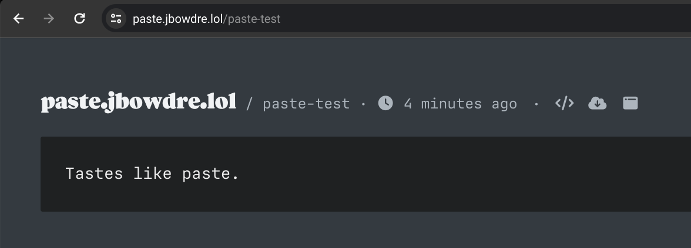
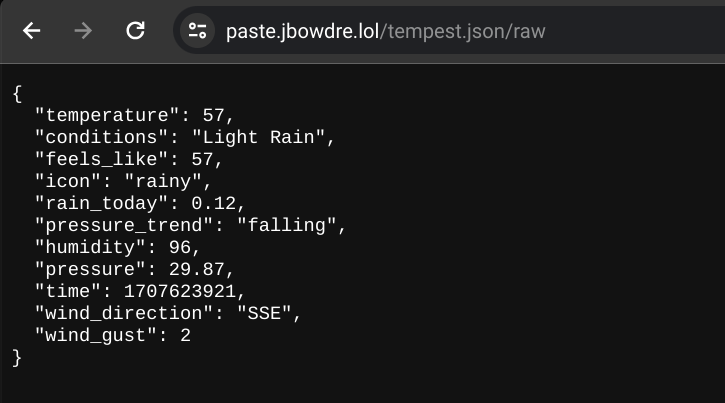

As I covered briefly [in a recent Scribble](https://scribbles.jbowdre.lol/post/near-realtime-weather-on-profile-lol-ku4yq-zr), I spent some time this week with integrating data from my [Weatherflow Tempest weather station](https://shop.weatherflow.com/products/tempest) into my [omg.lol homepage](https://jbowdre.lol). That page is rendered as a static site, so I needed a way to do this *without* including secrets like the station ID or API token in the client-side JavaScript.

I realized I could use a GitHub Actions workflow to retrieve the data from the authenticated Tempest API, post it somewhere publicly accessible, and then have the client-side code fetch the data from there without needing any authentication. This post will cover how I did it.

### Retrieve Weather Data from Tempest API
To start, I want to play with the API a bit to see what the responses look like. Before I can talk to the API, though, I need to generate a new token for my account at `https://tempestwx.com/settings/tokens`. I also make a note of my station ID, and store both of those values in my shell for easier use.

```shell
read wx_token # [tl! .cmd:1]
read wx_station
```

After browsing the Tempest API Explorer a little, it seems to me like the [`/better_forecast` endpoint](https://weatherflow.github.io/Tempest/api/swagger/#!/forecast/getBetterForecast) will probably be the easiest to work with, particularly since it lets the user choose which units will be used in the response. That will keep me from having to do metric-to-imperial conversions for many of the data.

So I start out calling the API like this:

```shell
curl -sL "https://swd.weatherflow.com/swd/rest/better_forecast?station_id=$wx_station&token=$wx_token&units_temp=f&units_wind=mph&units_pressure=inhg&units_precip=in&units_distance=mi" \
| jq # [tl! .cmd:-1]
{ # [tl! .nocopy:start]
  "current_conditions": {
    "air_density": 1.2,
    "air_temperature": 59.0,
    "brightness": 1,
    "conditions": "Rain Possible",
    "delta_t": 2.0,
    "dew_point": 55.0,
    "feels_like": 59.0,
    "icon": "possibly-rainy-night",
    "is_precip_local_day_rain_check": true,
    "is_precip_local_yesterday_rain_check": true,
    "lightning_strike_count_last_1hr": 0,
    "lightning_strike_count_last_3hr": 0,
    "lightning_strike_last_distance": 12,
    "lightning_strike_last_distance_msg": "11 - 13 mi",
    "lightning_strike_last_epoch": 1706394852,
    "precip_accum_local_day": 0,
    "precip_accum_local_yesterday": 0.05,
    "precip_minutes_local_day": 0,
    "precip_minutes_local_yesterday": 28,
    "pressure_trend": "falling",
    "relative_humidity": 88,
    "sea_level_pressure": 29.89,
    "solar_radiation": 0,
    "station_pressure": 29.25,
    "time": 1707618643,
    "uv": 0,
    "wet_bulb_globe_temperature": 57.0,
    "wet_bulb_temperature": 56.0,
    "wind_avg": 2.0,
    "wind_direction": 244,
    "wind_direction_cardinal": "WSW",
    "wind_gust": 2.0
  },
  "forecast": { # [tl! collapse:start]
    "daily": [
      {
        [...],
        "day_num": 10,
        [...],
      },
      {
        [...],
        "day_num": 11,
        [...],
      },
      {
        [...],
        "day_num": 12,
        [...],
      }
    ]
  }
} # [tl! collapse:end .nocopy:end]
```

So that validates that the endpoint will give me what I want, but I don't *really* need the extra 10-day forecast since I'm only interested in showing the current conditions. I can start working some `jq` magic to filter down to just what I'm interested in. And, while I'm at it, I'll stick the API URL in a variable to make that easier to work with.

```shell
endpoint="https://swd.weatherflow.com/swd/rest/better_forecast?station_id=$wx_station&token=$wx_token&units_temp=f&units_wind=mph&units_pressure=inhg&units_precip=in&units_distance=mi" # [tl! .cmd:1]
curl -sL "$endpoint" | jq '.current_conditions'
{ # [tl! .nocopy:start]
  "air_density": 1.2,
  "air_temperature": 59.0,
  "brightness": 1,
  "conditions": "Light Rain",
  "delta_t": 2.0,
  "dew_point": 55.0,
  "feels_like": 59.0,
  "icon": "rainy",
  "is_precip_local_day_rain_check": true,
  "is_precip_local_yesterday_rain_check": true,
  "lightning_strike_count_last_1hr": 0,
  "lightning_strike_count_last_3hr": 0,
  "lightning_strike_last_distance": 12,
  "lightning_strike_last_distance_msg": "11 - 13 mi",
  "lightning_strike_last_epoch": 1706394852,
  "precip_accum_local_day": 0,
  "precip_accum_local_yesterday": 0.05,
  "precip_description": "Light Rain",
  "precip_minutes_local_day": 0,
  "precip_minutes_local_yesterday": 28,
  "pressure_trend": "falling",
  "relative_humidity": 88,
  "sea_level_pressure": 29.899,
  "solar_radiation": 0,
  "station_pressure": 29.258,
  "time": 1707618703,
  "uv": 0,
  "wet_bulb_globe_temperature": 57.0,
  "wet_bulb_temperature": 56.0,
  "wind_avg": 1.0,
  "wind_direction": 230,
  "wind_direction_cardinal": "SW",
  "wind_gust": 2.0
} # [tl! .nocopy:end]
```

Piping the response through `jq '.current_conditions'` works well to select that objects, but I'm still not going to want to display all of that information. After some thought, these are the fields I want to hold on to:

- `air_temperature`
- `conditions`
- `feels_like` (apparent air temperature)
- `icon`
- `precip_accum_local_day` (rainfall total for the day)
- `pressure_trend` (rising, falling, or steady)
- `relative_humidity`
- `sea_level_pressure` (the pressure recorded by the station, adjusted for altitude)
- `time` ([epoch](https://en.wikipedia.org/wiki/Unix_time) timestamp of the report)
- `wind_direction_cardinal` (which way the wind is blowing *from*)
- `wind_gust`

I can use more `jq` wizardry to grab only those fields, and I'll also rename a few of the more cumbersome ones and round some of the values where I don't need full decimal precision:

```shell
curl -sL "$endpoint" | jq '.current_conditions | {temperature: (.air_temperature | round), conditions,
  feels_like: (.feels_like | round), icon, rain_today: .precip_accum_local_day, pressure_trend,
  humidity: .relative_humidity, pressure: ((.sea_level_pressure * 100) | round | . / 100), time,
  wind_direction: .wind_direction_cardinal, wind_gust}'
{ # [tl! .cmd:-4,1 .nocopy:start]
  "temperature": 58,
  "conditions": "Very Light Rain",
  "feels_like": 58,
  "icon": "rainy",
  "rain_today": 0.01,
  "pressure_trend": "steady",
  "humidity": 91,
  "pressure": 29.9,
  "time": 1707620142,
  "wind_direction": "W",
  "wind_gust": 0.0
} # [tl! .nocopy:end]
```

Now I'm just grabbing the specific data points that I plan to use, and I'm renaming messy names like `precip_accum_local_day` to things like `rain_today` to make them a bit less unwieldy. I'm also rounding the temperatures to whole numbers[^fahrenheit], and reducing the pressure from three decimal points to just two.

[^fahrenheit]: These are degrees Fahrenheit, after all. If I needed precision I'd be using better units.

Now that I've got the data I want, I'll just stash it in a local file for safe keeping:

```shell
curl -sL "$endpoint" | jq '.current_conditions | {temperature: (.air_temperature | round), conditions,
  feels_like: (.feels_like | round), icon, rain_today: .precip_accum_local_day, pressure_trend,
  humidity: .relative_humidity, pressure: ((.sea_level_pressure * 100) | round | . / 100), time,
  wind_direction: .wind_direction_cardinal, wind_gust}' \
  > tempest.json # [tl! .cmd:-4,1 **]
```

### Post to paste.lol
I've been using [omg.lol](https://home.omg.lol/) for a couple of months now, and I'm constantly discovering new uses for the bundled services. I thought that the [paste.lol](https://paste.lol/) service would be a great fit for this project. For one it was easy to tie it to a custom domain[^sucker], and it's got an [easy API](https://api.omg.lol/#token-post-pastebin-create-or-update-a-paste-in-a-pastebin) that I can use for automating this.

[^sucker]: I'm such a sucker for basically *anything* that I can tie one of my domains to.

To use the API, I'll of course need a token. I can find that at the bottom of my [omg.lol Account](https://home.omg.lol/account) page, and I'll once again store that as an environment variable. I can then test out the API by creating a new paste:

```shell
curl -L --request POST --header "Authorization: Bearer $omg_token" \ # [tl! .cmd]
  "https://api.omg.lol/address/jbowdre/pastebin/" \
  --data '{"title": "paste-test", "content": "Tastes like paste."}'
{ # [tl! .nocopy:9]
  "request": {
    "status_code": 200,
    "success": true
  },
  "response": {
    "message": "OK, your paste has been saved. <a href=\"https:\/\/paste.lol\/jbowdre\/paste-test\" target=\"_blank\">View it live<\/a>.",
    "title": "paste-test"
  }
}
```

And, sure enough, I can view it at my slick custom domain for my pastes, `https://paste.jbowdre.lol/paste-test`



That page is simple enough, but I'll really want to be sure I can store and retrieve the raw JSON that I captured from the Tempest API. There's a handy button the webpage for that, or I can just append `/raw` to the URL:


Yep, looks like that will do the trick. One small hurdle, though: I have to send the `--data` as a JSON object. I already have the JSON file that I pulled from the Tempest API, but I'll need to wrap that inside another layer of JSON. Fortunately, `jq` can come to the rescue once more.

```shell
request_body='{"title": "tempest.json", "content": '"$(jq -Rsa . tempest.json)"'}' # [tl! .cmd]
```

The `jq` command here reads the `tempest.json` file as plaintext (not as a JSON object), and then formats it as a JSON string so that it can be wrapped in the request body JSON:

```shell
jq -Rsa '.' tempest.json # [tl! .cmd .nocopy:1]
"{\n  \"temperature\": 58,\n  \"conditions\": \"Heavy Rain\",\n  \"feels_like\": 58,\n  \"icon\": \"rainy\",\n  \"rain_today\": 0.05,\n  \"pressure_trend\": \"steady\",\n  \"humidity\": 93,\n  \"pressure\": 29.89,\n  \"time\": 1707620863,\n  \"wind_direction\": \"S\",\n  \"wind_gust\": 1.0\n}\n"
```

So then I can repeat the earlier `curl` but this time pass in `$request_body` to include the file contents:

```shell
curl -L --request POST --header "Authorization: Bearer $omg_token" \ # [tl! .cmd]
  "https://api.omg.lol/address/jbowdre/pastebin/" \
  --data "$request_body"
{ # [tl! .nocopy:9]
    "request": {
        "status_code": 200,
        "success": true
    },
    "response": {
        "message": "OK, your paste has been saved. <a href=\"https:\/\/paste.lol\/jbowdre\/tempest.json\" target=\"_blank\">View it live<\/a>.",
        "title": "tempest.json"
    }
}
```

And there it is, at `https://paste.jbowdre.lol/tempest.json/raw`:



### Automate with GitHub Actions
At this point, I know the commands needed to retrieve weather data from the Tempest API, and I know what will be needed to post it to the omg.lol pastebin. The process works, but now it's time to automate it. And I'll do that with a simple [GitHub Actions workflow](https://docs.github.com/en/actions).

I create a [new GitHub repo](https://github.com/jbowdre/lolz) to store this (and future?) omg.lol sorcery, and navigate to **Settings > Secrets and variables > Actions**. I'll create four new repository secrets to hold my variables:
- `OMG_ADDR`
- `OMG_TOKEN`
- `TEMPEST_STATION`
- `TEMPEST_TOKEN`

And I'll create a new file at `.github/workflows/tempest.yml` to define my new workflow. Here's the start:

```yaml
# torchlight! {"lineNumbers": true}
name: Tempest Update
on:
  schedule:
    - cron: "*/5 * * * *"
  workflow_dispatch:
  push:
    branches:
      - main

defaults:
  run:
    shell: bash
```

The `on` block defines when the workflow will run:
1. On a `cron` schedule which fires (roughly) every five minutes
2. On a `workflow_dispatch` event (so I can start it manually if I want)
3. When changes are pushed to the `main` branch

And the `defaults` block makes sure that the following scripts will be run in `bash`:

```yaml
# torchlight! {"lineNumbers": true}
name: Tempest Update # [tl! collapse:start]
on:
  schedule:
    - cron: "*/5 * * * *"
  workflow_dispatch:
  push:
    branches:
      - main

defaults:
  run:
    shell: bash
# [tl! collapse:end]
jobs:
  fetch-and-post-tempest:
    runs-on: ubuntu-latest
    steps:
      - name: Fetch Tempest API data # [tl! **:2,3]
        run: |
          curl -sL "https://swd.weatherflow.com/swd/rest/better_forecast?station_id=${{ secrets.TEMPEST_STATION }}&token=${{ secrets.TEMPEST_TOKEN }}&units_temp=f&units_wind=mph&units_pressure=inhg&units_precip=in&units_distance=mi" \
            | jq '.current_conditions | {temperature: (.air_temperature | round), conditions, feels_like: (.feels_like | round), icon, rain_today: .precip_accum_local_day, pressure_trend, humidity: .relative_humidity, pressure: ((.sea_level_pressure * 100) | round | . / 100), time, wind_direction: .wind_direction_cardinal, wind_gust}' \
            > tempest.json
      - name: POST to paste.lol # [tl! **:2,4]
        run: |
          request_body='{"title": "tempest.json", "content": '"$(jq -Rsa . tempest.json)"'}'
          curl --location --request POST --header "Authorization: Bearer ${{ secrets.OMG_TOKEN }}" \
            "https://api.omg.lol/address/${{ secrets.OMG_ADDR }}/pastebin/" \
            --data "$request_body"

```

Each step in the `jobs` section should look pretty familiar since those are almost exactly the commands that I used earlier. The only real difference is that they now use the format `${{ secrets.SECRET_NAME }}` to pull in the repository secrets I just created.

Once I save, commit, and push this new file to the repo, it will automatically execute, and I can go to the [Actions](https://github.com/jbowdre/lolz/actions) tab to confirm that the run was succesful. I can also check `https://paste.jbowdre.lol/tempest.json` to confirm that the contents have updated.