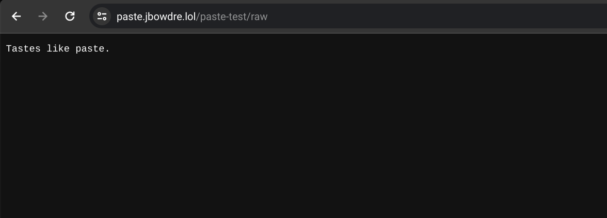

As I covered briefly [in a recent Scribble](https://scribbles.jbowdre.lol/post/near-realtime-weather-on-profile-lol-ku4yq-zr), I was inspired by the way [Kris's omg.lol page](https://kris.omg.lol/) displays realtime data from his [Weatherflow Tempest weather station](https://shop.weatherflow.com/products/tempest). I thought that was really neat and wanted to do the same on [my omg.lol page](https://jbowdre.lol) with data from my own Tempest, but I wanted to do it without including my station ID or API token directly in the client-side JavaScript.

I realized I could use a GitHub Actions workflow to retrieve the data from the authenticated Tempest API, post it somewhere publicly accessible, and then have the client-side code fetch the data from there without needing any authentication. After a few days of tinkering, I came up with a presentation I'm happy with.


This post will cover how I did it.

### Retrieve Weather Data from Tempest API
To start, I want to play with the API a bit to see what the responses look like. Before I can talk to the API, though, I need to generate a new token for my account at `https://tempestwx.com/settings/tokens`. I also make a note of my station ID, and store both of those values in my shell for easier use.

```shell
read wx_token # [tl! .cmd:1]
read wx_station
```

After browsing the Tempest API Explorer a little, it seems to me like the [`/better_forecast` endpoint](https://weatherflow.github.io/Tempest/api/swagger/#!/forecast/getBetterForecast) will probably be the easiest to work with, particularly since it lets the user choose which units will be used in the response. That will keep me from having to do metric-to-imperial conversions for many of the data.

So I start out calling the API like this:

```shell
curl -sL "https://swd.weatherflow.com/swd/rest/better_forecast?station_id=$wx_station&token=$wx_token&units_temp=f&units_wind=mph&units_pressure=inhg&units_precip=in&units_distance=mi" \
| jq # [tl! .cmd:-1]
{ # [tl! .nocopy:start]
  "current_conditions": {
    "air_density": 1.2,
    "air_temperature": 59.0,
    "brightness": 1,
    "conditions": "Rain Possible",
    "delta_t": 2.0,
    "dew_point": 55.0,
    "feels_like": 59.0,
    "icon": "possibly-rainy-night",
    "is_precip_local_day_rain_check": true,
    "is_precip_local_yesterday_rain_check": true,
    "lightning_strike_count_last_1hr": 0,
    "lightning_strike_count_last_3hr": 0,
    "lightning_strike_last_distance": 12,
    "lightning_strike_last_distance_msg": "11 - 13 mi",
    "lightning_strike_last_epoch": 1706394852,
    "precip_accum_local_day": 0,
    "precip_accum_local_yesterday": 0.05,
    "precip_minutes_local_day": 0,
    "precip_minutes_local_yesterday": 28,
    "pressure_trend": "falling",
    "relative_humidity": 88,
    "sea_level_pressure": 29.89,
    "solar_radiation": 0,
    "station_pressure": 29.25,
    "time": 1707618643,
    "uv": 0,
    "wet_bulb_globe_temperature": 57.0,
    "wet_bulb_temperature": 56.0,
    "wind_avg": 2.0,
    "wind_direction": 244,
    "wind_direction_cardinal": "WSW",
    "wind_gust": 2.0
  },
  "forecast": { # [tl! collapse:start]
    "daily": [
      {
        [...],
        "day_num": 10,
        [...],
      },
      {
        [...],
        "day_num": 11,
        [...],
      },
      {
        [...],
        "day_num": 12,
        [...],
      }
    ]
  }
} # [tl! collapse:end .nocopy:end]
```

So that validates that the endpoint will give me what I want, but I don't *really* need the extra 10-day forecast since I'm only interested in showing the current conditions. I can start working some `jq` magic to filter down to just what I'm interested in. And, while I'm at it, I'll stick the API URL in a variable to make that easier to work with.

```shell
endpoint="https://swd.weatherflow.com/swd/rest/better_forecast?station_id=$wx_station&token=$wx_token&units_temp=f&units_wind=mph&units_pressure=inhg&units_precip=in&units_distance=mi" # [tl! .cmd:1]
curl -sL "$endpoint" | jq '.current_conditions'
{ # [tl! .nocopy:start]
  "air_density": 1.2,
  "air_temperature": 59.0,
  "brightness": 1,
  "conditions": "Light Rain",
  "delta_t": 2.0,
  "dew_point": 55.0,
  "feels_like": 59.0,
  "icon": "rainy",
  "is_precip_local_day_rain_check": true,
  "is_precip_local_yesterday_rain_check": true,
  "lightning_strike_count_last_1hr": 0,
  "lightning_strike_count_last_3hr": 0,
  "lightning_strike_last_distance": 12,
  "lightning_strike_last_distance_msg": "11 - 13 mi",
  "lightning_strike_last_epoch": 1706394852,
  "precip_accum_local_day": 0,
  "precip_accum_local_yesterday": 0.05,
  "precip_description": "Light Rain",
  "precip_minutes_local_day": 0,
  "precip_minutes_local_yesterday": 28,
  "pressure_trend": "falling",
  "relative_humidity": 88,
  "sea_level_pressure": 29.899,
  "solar_radiation": 0,
  "station_pressure": 29.258,
  "time": 1707618703,
  "uv": 0,
  "wet_bulb_globe_temperature": 57.0,
  "wet_bulb_temperature": 56.0,
  "wind_avg": 1.0,
  "wind_direction": 230,
  "wind_direction_cardinal": "SW",
  "wind_gust": 2.0
} # [tl! .nocopy:end]
```

Piping the response through `jq '.current_conditions'` works well to select that objects, but I'm still not going to want to display all of that information. After some thought, these are the fields I want to hold on to:

- `air_temperature`
- `conditions`
- `feels_like` (apparent air temperature)
- `icon`
- `precip_accum_local_day` (rainfall total for the day)
- `pressure_trend` (rising, falling, or steady)
- `relative_humidity`
- `sea_level_pressure` (the pressure recorded by the station, adjusted for altitude)
- `time` ([epoch](https://en.wikipedia.org/wiki/Unix_time) timestamp of the report)
- `wind_direction_cardinal` (which way the wind is blowing *from*)
- `wind_gust`

I can use more `jq` wizardry to grab only those fields, and I'll also rename a few of the more cumbersome ones and round some of the values where I don't need full decimal precision:

```shell
curl -sL "$endpoint" | jq '.current_conditions | {temperature: (.air_temperature | round), conditions,
  feels_like: (.feels_like | round), icon, rain_today: .precip_accum_local_day, pressure_trend,
  humidity: .relative_humidity, pressure: ((.sea_level_pressure * 100) | round | . / 100), time,
  wind_direction: .wind_direction_cardinal, wind_gust}'
{ # [tl! .cmd:-4,1 .nocopy:start]
  "temperature": 58,
  "conditions": "Very Light Rain",
  "feels_like": 58,
  "icon": "rainy",
  "rain_today": 0.01,
  "pressure_trend": "steady",
  "humidity": 91,
  "pressure": 29.9,
  "time": 1707620142,
  "wind_direction": "W",
  "wind_gust": 0.0
} # [tl! .nocopy:end]
```

Now I'm just grabbing the specific data points that I plan to use, and I'm renaming messy names like `precip_accum_local_day` to things like `rain_today` to make them a bit less unwieldy. I'm also rounding the temperatures to whole numbers[^fahrenheit], and reducing the pressure from three decimal points to just two.

[^fahrenheit]: These are degrees Fahrenheit, after all. If I needed precision I'd be using better units.

Now that I've got the data I want, I'll just stash it in a local file for safe keeping:

```shell
curl -sL "$endpoint" | jq '.current_conditions | {temperature: (.air_temperature | round), conditions,
  feels_like: (.feels_like | round), icon, rain_today: .precip_accum_local_day, pressure_trend,
  humidity: .relative_humidity, pressure: ((.sea_level_pressure * 100) | round | . / 100), time,
  wind_direction: .wind_direction_cardinal, wind_gust}' \
  > tempest.json # [tl! .cmd:-4,1 **]
```

### Post to paste.lol
I've been using [omg.lol](https://home.omg.lol/) for a couple of months now, and I'm constantly discovering new uses for the bundled services. I thought that the [paste.lol](https://paste.lol/) service would be a great fit for this project. For one it was easy to tie it to a custom domain[^sucker], and it's got an [easy API](https://api.omg.lol/#token-post-pastebin-create-or-update-a-paste-in-a-pastebin) that I can use for automating this.

[^sucker]: I'm such a sucker for basically *anything* that I can tie one of my domains to.

To use the API, I'll of course need a token. I can find that at the bottom of my [omg.lol Account](https://home.omg.lol/account) page, and I'll once again store that as an environment variable. I can then test out the API by creating a new paste:

```shell
curl -L --request POST --header "Authorization: Bearer $omg_token" \ # [tl! .cmd]
  "https://api.omg.lol/address/jbowdre/pastebin/" \
  --data '{"title": "paste-test", "content": "Tastes like paste."}'
{ # [tl! .nocopy:9]
  "request": {
    "status_code": 200,
    "success": true
  },
  "response": {
    "message": "OK, your paste has been saved. <a href=\"https:\/\/paste.lol\/jbowdre\/paste-test\" target=\"_blank\">View it live<\/a>.",
    "title": "paste-test"
  }
}
```

And, sure enough, I can view it at my slick custom domain for my pastes, `https://paste.jbowdre.lol/paste-test`


That page is simple enough, but I'll really want to be sure I can store and retrieve the raw JSON that I captured from the Tempest API. There's a handy button the webpage for that, or I can just append `/raw` to the URL:



Yep, looks like that will do the trick. One small hurdle, though: I have to send the `--data` as a JSON object. I already have the JSON file that I pulled from the Tempest API, but I'll need to wrap that inside another layer of JSON. Fortunately, `jq` can come to the rescue once more.

```shell
request_body='{"title": "tempest.json", "content": '"$(jq -Rsa . tempest.json)"'}' # [tl! .cmd]
```

The `jq` command here reads the `tempest.json` file as plaintext (not as a JSON object), and then formats it as a JSON string so that it can be wrapped in the request body JSON:

```shell
jq -Rsa '.' tempest.json # [tl! .cmd .nocopy:1]
"{\n  \"temperature\": 58,\n  \"conditions\": \"Heavy Rain\",\n  \"feels_like\": 58,\n  \"icon\": \"rainy\",\n  \"rain_today\": 0.05,\n  \"pressure_trend\": \"steady\",\n  \"humidity\": 93,\n  \"pressure\": 29.89,\n  \"time\": 1707620863,\n  \"wind_direction\": \"S\",\n  \"wind_gust\": 1.0\n}\n"
```

So then I can repeat the earlier `curl` but this time pass in `$request_body` to include the file contents:

```shell
curl -L --request POST --header "Authorization: Bearer $omg_token" \ # [tl! .cmd]
  "https://api.omg.lol/address/jbowdre/pastebin/" \
  --data "$request_body"
{ # [tl! .nocopy:9]
    "request": {
        "status_code": 200,
        "success": true
    },
    "response": {
        "message": "OK, your paste has been saved. <a href=\"https:\/\/paste.lol\/jbowdre\/tempest.json\" target=\"_blank\">View it live<\/a>.",
        "title": "tempest.json"
    }
}
```

And there it is, at `https://paste.jbowdre.lol/tempest.json/raw`:


### Automate with GitHub Actions
At this point, I know the commands needed to retrieve weather data from the Tempest API, and I know what will be needed to post it to the omg.lol pastebin. The process works, but now it's time to automate it. And I'll do that with a simple [GitHub Actions workflow](https://docs.github.com/en/actions).

I create a [new GitHub repo](https://github.com/jbowdre/lolz) to store this (and future?) omg.lol sorcery, and navigate to **Settings > Secrets and variables > Actions**. I'll create four new repository secrets to hold my variables:
- `OMG_ADDR`
- `OMG_TOKEN`
- `TEMPEST_STATION`
- `TEMPEST_TOKEN`

And I'll create a new file at `.github/workflows/tempest.yml` to define my new workflow. Here's the start:

```yaml
# torchlight! {"lineNumbers": true}
name: Tempest Update
on:
  schedule:
    - cron: "*/5 * * * *"
  workflow_dispatch:
  push:
    branches:
      - main

defaults:
  run:
    shell: bash
```

The `on` block defines when the workflow will run:
1. On a schedule which fires (roughly[^cron]) every five minutes
2. On a `workflow_dispatch` event (so I can start it manually if I want)
3. When changes are pushed to the `main` branch

[^cron]: Per [the docs](https://docs.github.com/en/actions/using-workflows/events-that-trigger-workflows#schedule), runs can run *at most* once every five minutes, and they may be delayed (or even canceled) if a runner isn't available due to heavy load.

And the `defaults` block makes sure that the following scripts will be run in `bash`:

```yaml
# torchlight! {"lineNumbers": true}
name: Tempest Update # [tl! collapse:start]
on:
  schedule:
    - cron: "*/5 * * * *"
  workflow_dispatch:
  push:
    branches:
      - main

defaults:
  run:
    shell: bash
# [tl! collapse:end]
jobs:
  fetch-and-post-tempest:
    runs-on: ubuntu-latest
    steps:
      - name: Fetch Tempest API data # [tl! **:2,3]
        run: |
          curl -sL "https://swd.weatherflow.com/swd/rest/better_forecast?station_id=${{ secrets.TEMPEST_STATION }}&token=${{ secrets.TEMPEST_TOKEN }}&units_temp=f&units_wind=mph&units_pressure=inhg&units_precip=in&units_distance=mi" \
            | jq '.current_conditions | {temperature: (.air_temperature | round), conditions, feels_like: (.feels_like | round), icon, rain_today: .precip_accum_local_day, pressure_trend, humidity: .relative_humidity, pressure: ((.sea_level_pressure * 100) | round | . / 100), time, wind_direction: .wind_direction_cardinal, wind_gust}' \
            > tempest.json
      - name: POST to paste.lol # [tl! **:2,4]
        run: |
          request_body='{"title": "tempest.json", "content": '"$(jq -Rsa . tempest.json)"'}'
          curl --location --request POST --header "Authorization: Bearer ${{ secrets.OMG_TOKEN }}" \
            "https://api.omg.lol/address/${{ secrets.OMG_ADDR }}/pastebin/" \
            --data "$request_body"

```

Each step in the `jobs` section should look pretty familiar since those are almost exactly the commands that I used earlier. The only real difference is that they now use the format `${{ secrets.SECRET_NAME }}` to pull in the repository secrets I just created.

Once I save, commit, and push this new file to the repo, it will automatically execute, and I can go to the [Actions](https://github.com/jbowdre/lolz/actions) tab to confirm that the run was succesful. I can also check `https://paste.jbowdre.lol/tempest.json` to confirm that the contents have updated.

### Show Weather on Homepage
By this point, I've fetched the weather data from Tempest, filtered it for just the fields I want to see, and posted the condensed JSON to a publicly-accessible pastebin. Now I just need to figure out how to make it show up on my omg.lol homepage. Rather than implementing these changes on the public site right away, I'll start with a barebones `tempest.html` that I can test with locally. Here's the initial structure that I'll be building from:

```html
<!-- torchlight! {"lineNumbers": true} -->
<!DOCTYPE html>
<html>
  <head>
    <meta charset="utf-8">
    <link rel="stylesheet" href="https://cdnjs.cloudflare.com/ajax/libs/font-awesome/6.1.2/css/all.min.css" integrity="sha512-1sCRPdkRXhBV2PBLUdRb4tMg1w2YPf37qatUFeS7zlBy7jJI8Lf4VHwWfZZfpXtYSLy85pkm9GaYVYMfw5BC1A==" crossorigin="anonymous">
    <title>Weather Test</title>
    <script>
      // TODO
    </script>
  </head>
  <body>
    <h1>Local Weather</h1>
    <ul>
      <li>Conditions: <i class='fa-solid fa-cloud-sun-rain'></i><span id="conditions"></span></li>
      <li>Temperature: <i class='fa-solid fa-temperature-half'></i> <span id="temp"></span></li>
      <li>Humidity: <span id="humidity"></span></li>
      <li>Wind: <span id="wind"></span></li>
      <li>Precipitation: <i class='fa-solid fa-droplet-slash'></i><span id="rainToday"></span></li>
      <li>Pressure: <i class='fa-solid fa-arrow-right-long'></i><span id="pressure"></span></li>
      <li><i>Last Update: <span id="time"></span></i></li>
  </body>
</html>
```

In the `<head>`, I'm specifying the character set so that I won't get any weird reactions when using exotic symbols like `°`, and I'm also pulling in the [Font Awesome](https://fontawesome.com) stylesheet so I can easily use those icons in the weather display. The `<body>` just holds empty `<span>`s that will later be populated with data via JavaScript.

I only included a few icons here. I'm going to try to make those icons dynamic so that they'll change depending on how hot/cold it is or what the pressure trend is doing. I don't plan to toy with the humidity, wind, or last update icons (yet) so I'm not going to bother with testing those locally.

With that framework in place, I can use `python3 -m http.server 8080` to serve the page at `http://localhost:8080/tempest.html`.


It's rather sparse, but it works. I won't be tinkering with any of that HTML from this point on, I'll just focus on the (currently-empty) `<script>` block. I don't think I'm super great with JavaScript, so I leaned heavily upon the code on [Kris's page](https://kris.omg.lol) to get started and then put my own spin on it as I went along.

Before I can do much of anything, though, I'll need to start by retrieving the JSON data from my paste.lol endpoint and parsing the data:

```javascript
// torchlight! {"lineNumbers": true}
const wx_endpoint = 'https://paste.jbowdre.lol/tempest.json/raw'; // [tl! reindex(8)]
// fetch data from pastebin
fetch(wx_endpoint)
  .then(res => res.json())
  .then(function(res){
    // parse data
    let updateTime = res.time;
    let conditions = res.conditions;
    let temp = res.temperature;
    let humidity = res.humidity;
    let wind = res.wind_gust;
    let rainToday = res.rain_today;
    let pressure = res.pressure;

    // display data
    document.getElementById('time').innerHTML = updateTime;
    document.getElementById('conditions').innerHTML = conditions;
    document.getElementById('temp').innerHTML = temp;
    document.getElementById('humidity').innerHTML = humidity;
    document.getElementById('wind').innerHTML = wind;
    document.getElementById('rainToday').innerHTML = rainToday;
    document.getElementById('pressure').innerHTML = pressure;
  });
```

So this is fetching the data from the pastebin, mapping variables to the JSON fields, and using `document.getElementById()` to select the placeholder `<span>`s by their id and replace the corresponding `innerHTML` with the appropriate values.

The result isn't very pretty, but it's a start:


That [Unix epoch timestamp](https://en.wikipedia.org/wiki/Unix_time) stands out as being particularly unwieldy. Instead of the exact timestamp, I'd prefer to show that as the relative time since the last update. I'll do that with the [`Intl.RelativeTimeFormat` object](https://developer.mozilla.org/en-US/docs/Web/JavaScript/Reference/Global_Objects/Intl/RelativeTimeFormat).

```javascript
// torchlight! {"lineNumbers": true}
const wx_endpoint = 'https://paste.jbowdre.lol/tempest.json/raw'; // [tl! reindex(8)]
// get ready to calculate relative time [tl! ++:start **:start]
const units = {
  year  : 24 * 60 * 60 * 1000 * 365,
  month : 24 * 60 * 60 * 1000 * 365/12,
  day   : 24 * 60 * 60 * 1000,
  hour  : 60 * 60 * 1000,
  minute: 60 * 1000,
  second: 1000
}
let rtf = new Intl.RelativeTimeFormat('en', { numeric: 'auto' })
let getRelativeTime = (d1, d2 = new Date()) => {
  let elapsed = d1 - d2
  for (var u in units)
    if (Math.abs(elapsed) > units[u] || u === 'second')
      return rtf.format(Math.round(elapsed/units[u]), u)
} // [tl! ++:end **:end]
// fetch data from pastebin
fetch(wx_endpoint)
  .then(res => res.json())
  .then(function(res){
    // calculate age of last update [tl! ++:start **:start]
    let updateTime = res.time;
    updateTime = parseInt(updateTime);
    updateTime = updateTime*1000;
    updateTime = new Date(updateTime);
    let updateAge = getRelativeTime(updateTime);

    // parse data
    let updateTime = res.time; // [tl! -- reindex(-1)]
    let conditions = res.conditions;
    let temp = res.temperature;
    let humidity = res.humidity;
    let wind = res.wind_gust;
    let rainToday = res.rain_today;
    let pressure = res.pressure;

    // display data
    document.getElementById('time').innerHTML = updateAge; // [tl! ++ **]
    document.getElementById('time').innerHTML = updateTime; // [tl! -- reindex(-1)]
    document.getElementById('conditions').innerHTML = conditions;
    document.getElementById('temp').innerHTML = temp;
    document.getElementById('humidity').innerHTML = humidity;
    document.getElementById('wind').innerHTML = wind;
    document.getElementById('rainToday').innerHTML = rainToday;
    document.getElementById('pressure').innerHTML = pressure;
  });
```

That's a bit more friendly:


Alright, let's massage some of the other fields a little. I'll add units and labels, translate temperature and speed values to metric for my international friends, and combine a few additional fields for more context. I'm also going to make sure everything is lowercase to match the, uh, *aesthetic* of my omg page.

```javascript
// torchlight! {"lineNumbers": true}
const wx_endpoint = 'https://paste.jbowdre.lol/tempest.json/raw'; // [tl! reindex(8) collapse:start]
// get ready to calculate relative time
const units = {
  year  : 24 * 60 * 60 * 1000 * 365,
  month : 24 * 60 * 60 * 1000 * 365/12,
  day   : 24 * 60 * 60 * 1000,
  hour  : 60 * 60 * 1000,
  minute: 60 * 1000,
  second: 1000
}
let rtf = new Intl.RelativeTimeFormat('en', { numeric: 'auto' })
let getRelativeTime = (d1, d2 = new Date()) => {
  let elapsed = d1 - d2
  for (var u in units)
    if (Math.abs(elapsed) > units[u] || u === 'second')
      return rtf.format(Math.round(elapsed/units[u]), u)
}
// fetch data from pastebin
fetch(wx_endpoint)
  .then(res => res.json())
  .then(function(res){
    // calculate age of last update
    let updateTime = res.time;
    updateTime = parseInt(updateTime);
    updateTime = updateTime*1000;
    updateTime = new Date(updateTime);
    let updateAge = getRelativeTime(updateTime); // [tl! collapse:end]

    // parse data
    let updateTime = res.time;
    let conditions = (res.conditions).toLowerCase(); // [tl! ++ **]
    let conditions = res.conditions; // [tl! -- reindex(-1)]
    let temp = `${res.temperature}°f (${(((res.temperature - 32) * 5) / 9).toFixed(1)}°c)`; // [tl! ++ **]
    let temp = res.temperature; // [tl! -- reindex(-1)]
    let humidity = `${res.humidity}% humidity`; // [tl! ++ **]
    let humidity = res.humidity; // [tl! -- reindex(-1)]
    let wind = `${res.wind_gust}mph (${(res.wind_gust*1.609344).toFixed(1)}kph) from ${(res.wind_direction).toLowerCase()}`; // [tl! ++ **]
    let wind = res.wind_gust; // [tl! -- reindex(-1)]
    let rainToday = `${res.rain_today}" rain today`; // [tl! ++ **]
    let rainToday = res.rain_today; // [tl! -- reindex(-1)]
    let pressureTrend = res.pressure_trend; // [tl! ++:1 **:1]
    let pressure = `${res.pressure}inhg and ${pressureTrend}`;
    let pressure = res.pressure; // [tl! -- reindex(-1)]

    // display data [tl! collapse:start]
    document.getElementById('time').innerHTML = updateAge;
    document.getElementById('time').innerHTML = updateTime;
    document.getElementById('conditions').innerHTML = conditions;
    document.getElementById('temp').innerHTML = temp;
    document.getElementById('humidity').innerHTML = humidity;
    document.getElementById('wind').innerHTML = wind;
    document.getElementById('rainToday').innerHTML = rainToday;
    document.getElementById('pressure').innerHTML = pressure;
  }); // [tl! collapse:end]
```

That's a bit better:


Now let's add some conditionals into the mix. I'd like to display the `feels_like` temperature but only if it's five or more degrees away from the actual air temperature. And if there hasn't been any rain, the page should show `no rain today` instead of `0.00" rain today`.

```javascript
// torchlight! {"lineNumbers": true}
const wx_endpoint = 'https://paste.jbowdre.lol/tempest.json/raw'; // [tl! reindex(8) collapse:start]
// get ready to calculate relative time
const units = {
  year  : 24 * 60 * 60 * 1000 * 365,
  month : 24 * 60 * 60 * 1000 * 365/12,
  day   : 24 * 60 * 60 * 1000,
  hour  : 60 * 60 * 1000,
  minute: 60 * 1000,
  second: 1000
}
let rtf = new Intl.RelativeTimeFormat('en', { numeric: 'auto' })
let getRelativeTime = (d1, d2 = new Date()) => {
  let elapsed = d1 - d2
  for (var u in units)
    if (Math.abs(elapsed) > units[u] || u === 'second')
      return rtf.format(Math.round(elapsed/units[u]), u)
} //
// fetch data from pastebin
fetch(wx_endpoint)
  .then(res => res.json())
  .then(function(res){
    // calculate age of last update
    let updateTime = res.time;
    updateTime = parseInt(updateTime);
    updateTime = updateTime*1000;
    updateTime = new Date(updateTime);
    let updateAge = getRelativeTime(updateTime); // [tl! collapse:end]

    // parse data
    let updateTime = res.time;
    let conditions = (res.conditions).toLowerCase();
    let tempDiff = Math.abs(res.temperature - res.feels_like); // [tl! ++ **]
    let temp = `${res.temperature}°f (${(((res.temperature - 32) * 5) / 9).toFixed(1)}°c)`;
    if (tempDiff >= 5) { // [tl! ++:2 **:2]
      temp += `, feels ${res.feels_like}°f (${(((res.feels_like - 32) *5) / 9).toFixed(1)}°c)`;
    }
    let humidity = `${res.humidity}% humidity`;
    let wind = `${res.wind_gust}mph (${(res.wind_gust*1.609344).toFixed(1)}kph) from ${(res.wind_direction).toLowerCase()}`;
    let rainToday; // [tl! ++:5 **:5]
    if (res.rain_today === 0) {
      rainToday = 'no rain today';
    } else {
      rainToday = `${res.rain_today}" rain today`;
    }
    let rainToday = `${res.rain_today}" rain today`; // [tl! -- reindex(-1)]
    let pressureTrend = res.pressure_trend;
    let pressure = `${res.pressure}inhg and ${pressureTrend}`;

    // display data [tl! collapse:start]
    document.getElementById('time').innerHTML = updateAge;
    document.getElementById('time').innerHTML = updateTime;
    document.getElementById('conditions').innerHTML = conditions;
    document.getElementById('temp').innerHTML = temp;
    document.getElementById('humidity').innerHTML = humidity;
    document.getElementById('wind').innerHTML = wind;
    document.getElementById('rainToday').innerHTML = rainToday;
    document.getElementById('pressure').innerHTML = pressure;
  }); // [tl! collapse:end]
```

For testing this, I can manually alter[^alter] the contents of the pastebin to ensure the values are what I need:

[^alter]: My dishonest values will just get corrected the next time the workflow is triggered.

```json
// torchlight! {"lineNumbers": true}
{
  "temperature": 57, // [tl! **]
  "conditions": "Rain Likely",
  "feels_like": 67, // [tl! **]
  "icon": "rainy",
  "rain_today": 0, // [tl! **]
  "pressure_trend": "steady",
  "humidity": 92,
  "pressure": 29.91,
  "time": 1707676590,
  "wind_direction": "WSW",
  "wind_gust": 2
}
```


The final touch will be to change the icons depending on the values of certain fields:
- The conditions icon will vary from <i class="fa-solid fa-sun"></i> to <i class="fa-solid fa-cloud-bolt"></i>, roughly corresponding to the `icon` value from the Tempest API.
- The temperature icon will range from <i class="fa-solid fa-thermometer-empty"></i> to <i class="fa-solid fa-thermometer-full"></i> depending on the temperature.
- The precipitation icon will be <i class="fa-solid fa-droplet-slash"></i> for no precipitation, and progress through <i class="fa-solid fa-glass-water-droplet"></i> and <i class="fa-solid fa-glass-water"></i> for a bit more rain, and cap out at <i class="fa-solid fa-bucket"></i> for lots of rain[^rain].
- The pressure icon should change based on the trend: <i class="fa-solid fa-arrow-trend-up"></i>, <i class="fa-solid fa-arrow-right-long"></i>, and <i class="fa-solid fa-arrow-trend-down"></i>.

[^rain]: Okay, admittedly this progression isn't perfect, but it's the best I could come up with within the free FA icon set.

I'll set up a couple of constants to define the ranges, and a few more for mapping the values to icons. Then I'll use the `Array.prototype.find` method to select the appropriate `upper` value from each range. And then I leverage `document.getElementsByClassName` to match the placeholder icon classes and dynamically replace them.

```javascript
// torchlight! {"lineNumbers": true}
const wx_endpoint = 'https://paste.jbowdre.lol/tempest.json/raw'; // [tl! reindex(8) collapse:start]
// get ready to calculate relative time
const units = {
  year  : 24 * 60 * 60 * 1000 * 365,
  month : 24 * 60 * 60 * 1000 * 365/12,
  day   : 24 * 60 * 60 * 1000,
  hour  : 60 * 60 * 1000,
  minute: 60 * 1000,
  second: 1000
}
let rtf = new Intl.RelativeTimeFormat('en', { numeric: 'auto' })
let getRelativeTime = (d1, d2 = new Date()) => {
  let elapsed = d1 - d2
  for (var u in units)
    if (Math.abs(elapsed) > units[u] || u === 'second')
      return rtf.format(Math.round(elapsed/units[u]), u)
} // [tl! collapse:end]

// set up temperature and rain ranges [tl! ++:start **:start]
const tempRanges = [
  { upper: 32, label: 'cold' },
  { upper: 60, label: 'cool' },
  { upper: 80, label: 'warm' },
  { upper: Infinity, label: 'hot' }
];
const rainRanges = [
  { upper: 0.02, label: 'none' },
  { upper: 0.2, label: 'light' },
  { upper: 1.4, label: 'moderate' },
  { upper: Infinity, label: 'heavy' }
]

// maps for selecting icons
const CLASS_MAP_PRESS = {
  'steady': 'fa-solid fa-arrow-right-long',
  'rising': 'fa-solid fa-arrow-trend-up',
  'falling': 'fa-solid fa-arrow-trend-down'
}
const CLASS_MAP_RAIN = {
  'none': 'fa-solid fa-droplet-slash',
  'light': 'fa-solid fa-glass-water-droplet',
  'moderate': 'fa-solid fa-glass-water',
  'heavy': 'fa-solid fa-bucket'
}
const CLASS_MAP_TEMP = {
  'hot': 'fa-solid fa-thermometer-full',
  'warm': 'fa-solid fa-thermometer-half',
  'cool': 'fa-solid fa-thermometer-quarter',
  'cold': 'fa-solid fa-thermometer-empty'
}
const CLASS_MAP_WX = {
  'clear-day': 'fa-solid fa-sun',
  'clear-night': 'fa-solid fa-moon',
  'cloudy': 'fa-solid fa-cloud',
  'foggy': 'fa-solid fa-cloud-showers-smog',
  'partly-cloudy-day': 'fa-solid fa-clouds-sun',
  'partly-cloudy-night': 'fa-solid fa-clouds-moon',
  'possibly-rainy-day': 'fa-solid fa-cloud-sun-rain',
  'possibly-rainy-night': 'fa-solid fa-cloud-moon-rain',
  'possibly-sleet-day': 'fa-solid fa-cloud-meatball',
  'possibly-sleet-night': 'fa-solid fa-cloud-moon-rain',
  'possibly-snow-day': 'fa-solid fa-snowflake',
  'possibly-snow-night': 'fa-solid fa-snowflake',
  'possibly-thunderstorm-day': 'fa-solid fa-cloud-bolt',
  'possibly-thunderstorm-night': 'fa-solid fa-cloud-bolt',
  'rainy': 'fa-solid fa-cloud-showers-heavy',
  'sleet': 'fa-solid fa-cloud-rain',
  'snow': 'fa-solid fa-snowflake',
  'thunderstorm': 'fa-solid fa-cloud-bolt',
  'windy': 'fa-solid fa-wind',
} // [tl! ++:end **:end]

// fetch data from pastebin [tl! collapse:10]
fetch(wx_endpoint)
  .then(res => res.json())
  .then(function(res){
    // calculate age of last update
    let updateTime = res.time;
    updateTime = parseInt(updateTime);
    updateTime = updateTime*1000;
    updateTime = new Date(updateTime);
    let updateAge = getRelativeTime(updateTime);

    // parse data
    let updateTime = res.time;
    let conditions = (res.conditions).toLowerCase();
    let tempDiff = Math.abs(res.temperature - res.feels_like);
    let temp = `${res.temperature}°f (${(((res.temperature - 32) * 5) / 9).toFixed(1)}°c)`;
    if (tempDiff >= 5) {
      temp += `, feels ${res.feels_like}°f (${(((res.feels_like - 32) *5) / 9).toFixed(1)}°c)`;
    }
    let tempLabel = (tempRanges.find(range => res.feels_like < range.upper)).label; // [tl! ++ **]
    let humidity = `${res.humidity}% humidity`;
    let wind = `${res.wind_gust}mph (${(res.wind_gust*1.609344).toFixed(1)}kph) from ${(res.wind_direction).toLowerCase()}`;
    let rainLabel = (rainRanges.find(range => res.rain_today < range.upper)).label; // [tl! ++ **]
    let rainToday;
    if (res.rain_today === 0) {
      rainToday = 'no rain today';
    } else {
      rainToday = `${res.rain_today}" rain today`;
    }
    let rainToday = `${res.rain_today}" rain today`;
    let pressureTrend = res.pressure_trend;
    let pressure = `${res.pressure}inhg and ${pressureTrend}`;
    let icon = res.icon; // [tl! ++ **]

    // display data [tl! collapse:8]
    document.getElementById('time').innerHTML = updateAge;
    document.getElementById('time').innerHTML = updateTime;
    document.getElementById('conditions').innerHTML = conditions;
    document.getElementById('temp').innerHTML = temp;
    document.getElementById('humidity').innerHTML = humidity;
    document.getElementById('wind').innerHTML = wind;
    document.getElementById('rainToday').innerHTML = rainToday;
    document.getElementById('pressure').innerHTML = pressure;
    // update icons [tl! ++:4 **:4]
    document.getElementsByClassName('fa-cloud-sun-rain')[0].classList = CLASS_MAP_WX[icon];
    document.getElementsByClassName('fa-temperature-half')[0].classList = CLASS_MAP_TEMP[tempLabel];
    document.getElementsByClassName('fa-droplet-slash')[0].classList = CLASS_MAP_RAIN[rainLabel];
    document.getElementsByClassName('fa-arrow-right-long')[0].classList = CLASS_MAP_PRESS[pressureTrend];
  });
```

And I can see that the icons do indeed match the conditions:


### OMG, LOL, Let's Do It
Now that all that prep work is out of the way, transposing the code into the live omg.lol homepage doesn't really take much effort.

I'll just use the online editor to drop this at the bottom of my web page:

```markdown
// torchlight! {"lineNumbers":true}
# /proc/wx <!-- [tl! reindex(47)] -->
- <span id="conditions"></span> {cloud-sun-rain}
- <span id="temp"></span> {temperature-half}
- <span id="humidity"></span> {droplet}
- <span id="wind"></span> {wind}
- <span id="rainToday"></span> {droplet-slash}
- <span id="pressure"></span> {arrow-right-long}
- <i>as of <span id="time"></span></i> {clock}
```

A bit further down the editor page, there's a box for inserting additional content into the page's `<head>` block. That's a great place to past in the entirety of my script:

```html
// torchlight! {"lineNumbers":true}
<script> // [tl! reindex(3)]
  const wx_endpoint = 'https://paste.jbowdre.lol/tempest.json/raw';
  // get ready to calculate relative time
  const units = {
    year  : 24 * 60 * 60 * 1000 * 365,
    month : 24 * 60 * 60 * 1000 * 365/12,
    day   : 24 * 60 * 60 * 1000,
    hour  : 60 * 60 * 1000,
    minute: 60 * 1000,
    second: 1000
  }
  let rtf = new Intl.RelativeTimeFormat('en', { numeric: 'auto' })
  let getRelativeTime = (d1, d2 = new Date()) => {
    let elapsed = d1 - d2
    for (var u in units)
      if (Math.abs(elapsed) > units[u] || u === 'second')
        return rtf.format(Math.round(elapsed/units[u]), u)
  }

  // set up temperature and rain ranges
  const tempRanges = [
    { upper: 32, label: 'cold' },
    { upper: 60, label: 'cool' },
    { upper: 80, label: 'warm' },
    { upper: Infinity, label: 'hot' }
  ];
  const rainRanges = [
    { upper: 0.02, label: 'none' },
    { upper: 0.2, label: 'light' },
    { upper: 1.4, label: 'moderate' },
    { upper: Infinity, label: 'heavy' }
  ]

  // maps for selecting icons
  const CLASS_MAP_PRESS = {
    'steady': 'fa-solid fa-arrow-right-long',
    'rising': 'fa-solid fa-arrow-trend-up',
    'falling': 'fa-solid fa-arrow-trend-down'
  }
  const CLASS_MAP_RAIN = {
    'none': 'fa-solid fa-droplet-slash',
    'light': 'fa-solid fa-glass-water-droplet',
    'moderate': 'fa-solid fa-glass-water',
    'heavy': 'fa-solid fa-bucket'
  }
  const CLASS_MAP_TEMP = {
    'hot': 'fa-solid fa-thermometer-full',
    'warm': 'fa-solid fa-thermometer-half',
    'cool': 'fa-solid fa-thermometer-quarter',
    'cold': 'fa-solid fa-thermometer-empty'
  }
  const CLASS_MAP_WX = {
    'clear-day': 'fa-solid fa-sun',
    'clear-night': 'fa-solid fa-moon',
    'cloudy': 'fa-solid fa-cloud',
    'foggy': 'fa-solid fa-cloud-showers-smog',
    'partly-cloudy-day': 'fa-solid fa-clouds-sun',
    'partly-cloudy-night': 'fa-solid fa-clouds-moon',
    'possibly-rainy-day': 'fa-solid fa-cloud-sun-rain',
    'possibly-rainy-night': 'fa-solid fa-cloud-moon-rain',
    'possibly-sleet-day': 'fa-solid fa-cloud-meatball',
    'possibly-sleet-night': 'fa-solid fa-cloud-moon-rain',
    'possibly-snow-day': 'fa-solid fa-snowflake',
    'possibly-snow-night': 'fa-solid fa-snowflake',
    'possibly-thunderstorm-day': 'fa-solid fa-cloud-bolt',
    'possibly-thunderstorm-night': 'fa-solid fa-cloud-bolt',
    'rainy': 'fa-solid fa-cloud-showers-heavy',
    'sleet': 'fa-solid fa-cloud-rain',
    'snow': 'fa-solid fa-snowflake',
    'thunderstorm': 'fa-solid fa-cloud-bolt',
    'windy': 'fa-solid fa-wind',
  }

  // fetch data from pastebin
  fetch(wx_endpoint)
    .then(res => res.json())
    .then(function(res){

      // calculate age of last update
      let updateTime = res.time;
      updateTime = parseInt(updateTime);
      updateTime = updateTime*1000;
      updateTime = new Date(updateTime);
      let updateAge = getRelativeTime(updateTime);

      // parse data
      let conditions = (res.conditions).toLowerCase();
      let tempDiff = Math.abs(res.temperature - res.feels_like);
      let temp = `${res.temperature}°f (${(((res.temperature - 32) * 5) / 9).toFixed(1)}°c)`;
      if (tempDiff >= 5) {
        temp += `, feels ${res.feels_like}°f (${(((res.feels_like - 32) *5) / 9).toFixed(1)}°c)`;
      }
      let tempLabel = (tempRanges.find(range => res.feels_like < range.upper)).label;
      let humidity = `${res.humidity}% humidity`;
      let wind = `${res.wind_gust}mph (${(res.wind_gust*1.609344).toFixed(1)}kph) from ${(res.wind_direction).toLowerCase()}`;
      let rainLabel = (rainRanges.find(range => res.rain_today < range.upper)).label;
      let rainToday;
      if (res.rain_today === 0) {
        rainToday = 'no rain today';
      } else {
        rainToday = `${res.rain_today}" rain today`;
      }
      let pressureTrend = res.pressure_trend;
      let pressure = `${res.pressure}inhg and ${pressureTrend}`;
      let icon = res.icon;

      // display data
      document.getElementById('time').innerHTML = updateAge;
      document.getElementById('conditions').innerHTML = conditions;
      document.getElementById('temp').innerHTML = temp;
      document.getElementById('humidity').innerHTML = humidity;
      document.getElementById('wind').innerHTML = wind;
      document.getElementById('rainToday').innerHTML = rainToday;
      document.getElementById('pressure').innerHTML = pressure;
      // update icons
      document.getElementsByClassName('fa-cloud-sun-rain')[0].classList = CLASS_MAP_WX[icon];
      document.getElementsByClassName('fa-temperature-half')[0].classList = CLASS_MAP_TEMP[tempLabel];
      document.getElementsByClassName('fa-droplet-slash')[0].classList = CLASS_MAP_RAIN[rainLabel];
      document.getElementsByClassName('fa-arrow-right-long')[0].classList = CLASS_MAP_PRESS[pressureTrend];
    });
</script>
```

With that, I hit the happy little **Save & Publish** button in the editor, and then revel in seeing my new weather display at the bottom of my [omg.lol page](https://jbowdre.lol):


I'm quite pleased with how this turned out, and I had fun learning a few JavaScript tricks in the process. I stashed the code for this little project in my [lolz repo](https://github.com/jbowdre/lolz) in case you'd like to take a look. I have some ideas for other APIs I might want to integrate in a similar way in the future so stay tuned.