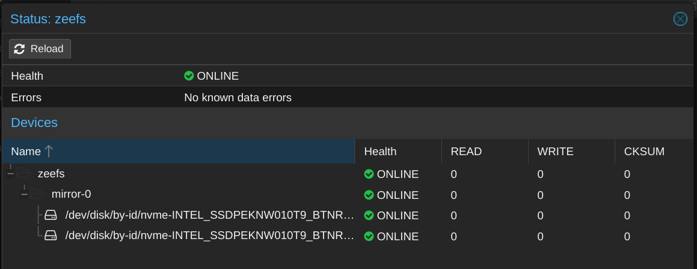
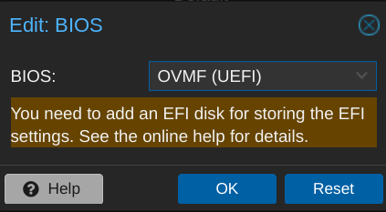
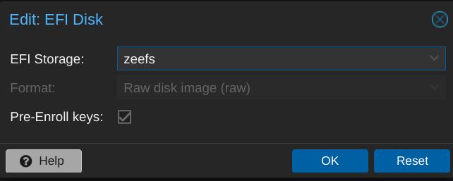

Way back in 2021, I [documented](/vmware-home-lab-on-intel-nuc-9) how I had built a VMWare-focused home lab on an Intel NUC 9 host. The setup was fairly complicated specifically so I could build and test content for what was then known as vRealize Automation. My priorities [have since shifted](/virtuallypotato-runtimeterror)[^future], though, and I no longer have need for vRA at my house. vSphere + vCenter carries a hefty amount of overhead, so I thought it might be time to switch my homelab over to something a bit simpler in the form of [Proxmox VE](https://www.proxmox.com/en/proxmox-virtual-environment/overview).

[^future]: And, if I'm being entirely honest, I'm a little uncertain of what the future may hold for VMware now that the [Broadcom acquisition has closed](https://www.theregister.com/2023/11/23/broadcom_vmware_reorg/).

I only really have the one physical host[^esxi-arm] so I knew that I wouldn't be able to do any sort of live migration. This move would require a full "production" outage as I converted the host, but I needed to ensure I could export some of my critical workloads off of vSphere and the import them into the new Proxmox VE environment. I run [Home Assistant](https://www.home-assistant.io/) in a VM and it would be _Double Plus Bad_ if I broke my smart home's brain in the process.

[^esxi-arm]: Sure, I've still got [ESXi-ARM running on a Quartz64 single-board computer](/esxi-arm-on-quartz64) but that doesn't *really* count.

It took most of a Sunday afternoon, but I eventually fumbled my way through the hypervisor transformation and got things up and running again in time for my evening HA automations to fire at sunset[^deadline]. I'm not going to detail the entire process here, but do want to highlight a few of the lessons I learned along the way. A lot of this information comes from Proxmox's [Migration of servers to Proxmox VE](https://pve.proxmox.com/wiki/Migration_of_servers_to_Proxmox_VE#VMware) doc[^hindsight].

[^deadline]: There's nothing like starting a project with a strict deadline!.
[^hindsight]: I realized in hindsight that I _probably_ could have used the [Server self-migration](https://pve.proxmox.com/wiki/Migration_of_servers_to_Proxmox_VE#Server_self-migration) steps to import VMs straight off of the VMFS datastore but (1) I wasn't sure if/how that would work with a single datastore stretched across multiple disks and (2) I didn't think of it until after I had already imported from OVF.

### The Plan
I've found that my most successful projects begin with a plan[^plan]:

1. Capture details like IPs and network configurations to try and maintain some consistency.
2. Export my needed VMs as OVFs, and save these to external storage.
3. Install Proxmox VE.
4. Transfer the OVFs to the new Proxmox host, and then import them.
5. Perform any required post-import cleanup to make things happy.

[^plan]: The plan usually doesn't survive for very long once the project starts, but establishing a plan is an important part of the project ritual.

#### Exporting VMs to OVF
My initial plan was to just right-click the VMs in the vSphere UI and export them from there, but I'd forgotten how reliable that process seems to be. A few smaller VMs exported fine, but most would fail after a while.

I switched to using [VMware's `ovftool`](https://developer.vmware.com/web/tool/ovf/) to do the exports and that worked better, though I did have to fumble through until I found the right syntax:

```shell
~/ovftool/ovftool --noSSLVerify \ # [tl! .cmd]
  "vi://${vsphere_username}@vsphere.local:${vsphere_password}@${vsphere_host}/${vsphere_datacenter}/vm/${vsphere_folder}/${vsphere_vm_name}" \
  "${vsphere_vm_name}.ova"
```

{}
Along the way I also learned that I could search for a VM name with `?dns=${vsphere_vm_name}` and not have to work out the complete path to it:
```shell
~/ovftool/ovftool --noSSLVerify \ # [tl! .cmd]
  "vi://${vsphere_username}@vsphere.local:${vsphere_password}@${vsphere_host}/?dns=${vsphere_vm_name}" \
  "${vsphere_vm_name}.ova"
```
{}

#### Installing Proxmox VE
I had been running ESXi off of small USB drive inserted in the NUC's internal USB port, and that typically worked fine since ESXi runs entirely in-memory after it's booted. Proxox VE doesn't do the ramdisk thing, and I found after an initial test install that the performance when running from USB wasn't great. I dug around in my desk drawers and miscellaneous parts bins and found the 512GB M.2 2230 NVMe drive that originally came in my Steam Deck (before I upgraded it to a [2TB drive from Framework](https://frame.work/products/western-digital-sn740-nvme-m-2-2230)). I installed that (and a [2230->2242 adapter](https://www.amazon.com/dp/B0BLJNGGVD)) in the NUC's third (and final) M.2 slot and used _that_ as Proxmox VE's system drive.

Performance was a lot better that way!

After Proxmox VE booted, I went ahead and wiped the two 1TB NVMe drives (which had been my VMFS datastore) to get them ready for use. Without the heavyweight vCenter and vRA VMs, I wouldn't be needing as much storage so I elected to add these drives to a RAID1 ZFS pool (named `zeefs`) to get a bit of extra resiliency.



#### Importing VMs
Once Proxmox VE was up and (marginally) configured, I could start the process of restoring my workloads, beginning with the all-important Home Assistant VM.

I used `scp` to transfer it to the Proxmox VE host:
```shell
scp hassos.ova root@${proxmox_host}:/tmp/ #[tl! .cmd]
```

On the host, I needed to first extract the OVA archive so I could get at the OVF and VMDK files inside:
```shell
cd /tmp # [tl! .cmd_root:2]
tar xf hassos.ova
```

I could then use the [`qm` command](https://pve.proxmox.com/pve-docs/qm.1.html) to import the OVF. The syntax is:
```shell
qm importovf ${vm_id} ${ovf_filename} ${vm_storage}
```

I'll assign this VM ID number `100` and will deploy it on the `zeefs` storage:
```shell
qm importovf 100 hassos.ovf zeefs # [tl! .cmd_root]
```

#### Booting imported VMs (or trying to)

Once the import completed, I went to the Proxmox VE UI to see how things looked. The imported VM was missing a network interface, so I added a new `virtio` one. Everything else looked okay so I hit the friendly Start button and popped to the Console view to keep an eye on things.

Unfortunately, the boot hung with a message about not being able to find the OS. In this case, that's because the imported VM defaulted to a traditional BIOS firmware while the installed guest OS is configured for use with UEFI firmware. That's easy enough to change:


Though it does warn that I'll need to manually add an EFI disk for storing the configuration, so I'll do that as well:


That allowed me to boot the VM successfully, and my Home Assistant system came online in its new home without much more fuss. I could then move forward with importing the remaining workloads. Some needed to have their network settings reconfigured, while some preserved them (I guess it depends on how the guest was addressing the NIC).

In hindsight, I should have also recorded information about the firmware configuration of my VMs. Some used BIOS, some used EUFI, and I didn't really know which way a particular VM was going to lean until I tried booting it with the default `SeaBIOS`.

### Tailscale
I'm a big fan of [Tailscale](https://tailscale.com/), and have been using it to make [secure networking simple](/secure-networking-made-simple-with-tailscale) for a little while now. Naturally, I wanted to see how I could leverage it with this new setup.

#### On the host
While ESXi is a locked-down hypervisor which runs off a ramdisk (making installing arbitrary software kind of tricky/messy/dangerous), Proxmox VE is a customized Debian install with a bunch of VM-management tools built in. This means (among other things) that I can [easily install Tailscale](https://tailscale.com/kb/1133/proxmox/) and use that for securely accessing my Proxmox VE server remotely.

Installing Tailscale on a Proxmox VE host is basically the same as on any other Debian-based Linux OS:
```shell
curl -fsSL https://tailscale.com/install.sh | sh # [tl! .cmd_root]
```

I can then use `tailscale up` to start the process of logging in to my Tailscale account, and I throw in the `--ssh` flag to configure [Tailscale SSH](https://tailscale.com/kb/1193/tailscale-ssh/):
```shell
tailscale up --ssh # [tl! .cmd_root]
```

Once I'm logged in, I'll also use [Tailscale Serve](https://tailscale.com/kb/1312/serve/) as a reverse-proxy for Proxmox VE's web management interface:
```shell
tailscale serve --bg https+insecure://localhost:8006 # [tl! .cmd_root]
```

That takes a few minutes for the MagicDNS record and automatically-provisioned TLS certificate to go live, but I can then access my environment by going to `https://prox1.my-tailnet.ts.net/`, and my browser won't throw any warnings about untrusted certs. Very cool.

#### In LXC containers
One of the other slick features of Proxmox VE is the ability to run [lightweight LXC system containers](https://pve.proxmox.com/wiki/Linux_Container) right on the hypervisor. These are unprivileged containers by default, though, so attempting to bring Tailscale online fails:
```shell
tailscale up # [tl! .cmd_root focus:3]
failed to connect to local tailscaled; it doesn’t appear to be running (sudo systemctl start tailscaled ?) # [tl! .nocopy]
systemctl start tailscaled # [tl! .cmd_root:1]
systemctl status tailscaled
x tailscaled.service - Tailscale node agent # [tl! .nocopy:2]
     Loaded: loaded (/lib/systemd/system/tailscaled.service; enabled; vendor preset: enabled)
     Active: failed (Result: exit-code) since Fri 2023-11-24 20:36:25 UTC; 463ms ago # [tl! focus highlight]
```

Fortunately, [Tailscale has a doc](https://tailscale.com/kb/1130/lxc-unprivileged/) for working with unprivileged LXC containers. I just need to edit the CT's config file on the proxmox host:
```shell
vim /etc/pve/lxc/${ID}.conf # [tl! .cmd_root]
```

And add these two lines at the bottom:
```ini
# torchlight! {"lineNumbers": true}
arch: amd64
cores: 2
features: nesting=1
hostname: gitlab
memory: 2048
nameserver: 192.168.1.1
net0: name=eth0,bridge=vmbr0,firewall=1,hwaddr=B6:DE:F0:8A:5C:5C,ip=dhcp,type=veth
ostype: debian
rootfs: zeefs:subvol-104-disk-0,size=60G
swap: 512
unprivileged: 1
lxc.cgroup2.devices.allow: c 10:200 rwm # [tl! focus:1 ++:1]
lxc.mount.entry: /dev/net/tun dev/net/tun none bind,create=file
```

After stopping and restarting the container, Tailscale works just brilliantly!

### Closing thoughts
There were a few hiccups along the way, but I'm overall very happy with both the decision to ditch ESXi as well as how the migration to Proxmox VE went. I've been focused on VMware for so long, and hadn't really kept up with the other options. It's past time for me to broaden my virtualization horizons a bit.

Proxmox VE makes a lot more sense for a homelab setup, and I'm looking forward to learning more about it as I build more stuff on it.