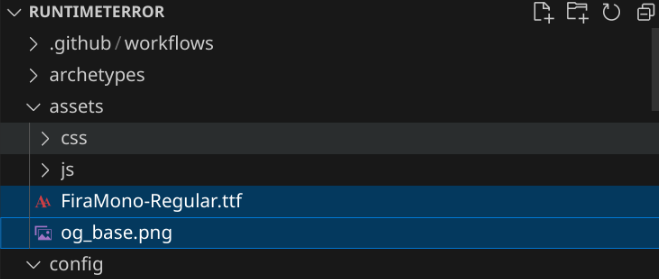

I've lately seen some folks on [social.lol](https://social.lol) posting about their various strategies for automatically generating [Open Graph images](https://ogp.me/) for their [Eleventy](https://11ty.dev) sites. So this weekend I started exploring ways to do that for my [Hugo](https://gohugo.io) site.

During my search, I came across a few different approaches using external services or additional scripts to run at build time, but I was hoping for a way to do this with Hugo's built-in tooling. I eventually came across a tremendously helpful post from Aaro titled [Generating OpenGraph images with Hugo](https://aarol.dev/posts/hugo-og-image/). This solution was exactly what I was after, as it uses Hugo's [image functions](https://gohugo.io/functions/images/filter/) to dynamically create a share image for each page.

I ended up borrowing heavily from Aaro's approach while adding a few small variations for my OpenGraph images.
- When sharing the home page, the image includes the site description.
- When sharing a post, the image includes the post title.
- ... but if the post has a thumbnail[^thumbnail] listed in the front matter, that gets overlaid in the corner.

[^thumbnail]: My current theme doesn't make use of the thumbnails, but a previous theme did so I've got a bunch of posts with thumbnails still assigned. And now I've got a use for them again!

Here's how I did it.

### New resources
Based on Aaro's suggestions, I used [GIMP](https://www.gimp.org/) to create a 1200x600 image for the base. I'm not a graphic designer[^web] so I kept it simple while trying to match the theme, font, and colors used on the site.

I had to install the Fira Mono font [Fira Mono `.ttf`](https://github.com/mozilla/Fira/blob/master/ttf/FiraMono-Regular.ttf) to my `~/.fonts/` folder so I could use it in GIMP.

![Red background with a command prompt displaying "[runtimeterror.dev] $" in white and red font.](og_base.png)

[^web]: Or a web designer, if I'm being honest.

That fits with the vibe of the site, and leaves plenty of room for text to be added to the image.

I also wanted to use that font later for the text overlay, so I stashed both of those resources in my `assets/` folder:



### OpenGraph partial
Hugo uses an [internal template](https://github.com/gohugoio/hugo/blob/master/tpl/tplimpl/embedded/templates/opengraph.html) for rendering OpenGraph properties by default. I needed to import that as a partial so that I could override its behavior. So I dropped the following in `layouts/partials/opengraph.html` as a starting point:

```jinja-html
// torchlight! {"lineNumbers": true}
<meta property="og:title" content="{{ .Title }}" />
<meta property="og:description" content="{{ with .Description }}{{ . }}{{ else }}{{if .IsPage}}{{ .Summary }}{{ else }}{{ with .Site.Params.description }}{{ . }}{{ end }}{{ end }}{{ end }}" />
<meta property="og:type" content="{{ if .IsPage }}article{{ else }}website{{ end }}" />
<meta property="og:url" content="{{ .Permalink }}" />
<meta property="og:locale" content="{{ .Lang }}" />

{{- if .IsPage }}
  {{- $iso8601 := "2006-01-02T15:04:05-07:00" -}}
  <meta property="article:section" content="{{ .Section }}" />
  {{ with .PublishDate }}<meta property="article:published_time" {{ .Format $iso8601 | printf "content=%q" | safeHTMLAttr }} />{{ end }}
  {{ with .Lastmod }}<meta property="article:modified_time" {{ .Format $iso8601 | printf "content=%q" | safeHTMLAttr }} />{{ end }}
{{- end -}}

{{- with .Params.audio }}<meta property="og:audio" content="{{ . }}" />{{ end }}
{{- with .Params.locale }}<meta property="og:locale" content="{{ . }}" />{{ end }}
{{- with .Site.Params.title }}<meta property="og:site_name" content="{{ . }}" />{{ end }}
{{- with .Params.videos }}{{- range . }}
<meta property="og:video" content="{{ . | absURL }}" />
{{ end }}{{ end }}
```

To use this new partial, I added it to my `layouts/partials/head.html`:

```jinja-html
{{ partial "opengraph" . }}
```

which is in turn loaded by `layouts/_defaults/baseof.html`:

```jinja-html
  <head>
    {{- partial "head.html" . -}}
  </head>
```

### Aaro's OG image generation
[Aaro's code](https://aarol.dev/posts/hugo-og-image/) provided the base functionality for what I need:

```jinja-html
{{/* Generate opengraph image */}}
{{- if .IsPage -}}
  {{ $base := resources.Get "og_base.png" }}
  {{ $boldFont := resources.Get "/Inter-SemiBold.ttf"}}
  {{ $mediumFont := resources.Get "/Inter-Medium.ttf"}}
  {{ $img := $base.Filter (images.Text .Site.Title (dict
    "color" "#ffffff"
    "size" 52
    "linespacing" 2
    "x" 141
    "y" 117
    "font" $boldFont
  ))}}
  {{ $img = $img.Filter (images.Text .Page.Title (dict
    "color" "#ffffff"
    "size" 64
    "linespacing" 2
    "x" 141
    "y" 291
    "font" $mediumFont
  ))}}
  {{ $img = resources.Copy (path.Join .Page.RelPermalink "og.png") $img }}
  <meta property="og:image" content="{{$img.Permalink}}">
  <meta property="og:image:width" content="{{$img.Width}}" />
  <meta property="og:image:height" content="{{$img.Height}}" />

  <!-- Twitter metadata (used by other websites as well) -->
  <meta name="twitter:card" content="summary_large_image" />
  <meta name="twitter:title" content="{{ .Title }}" />
  <meta name="twitter:description" content="{{ with .Description }}{{ . }}{{ else }}{{if .IsPage}}{{ .Summary }}{{ else }}{{ with .Site.Params.description }}{{ . }}{{ end }}{{ end }}{{ end -}}"/>
  <meta name="twitter:image" content="{{$img.Permalink}}" />
{{ end }}
```

The [`resources.Get`](https://gohugo.io/functions/resources/get/) bits import the image and font resources to make them available to the [`images.Text`](https://gohugo.io/functions/images/text/) functions, which add the site and page title texts to the image using the designated color, size, placement, and font.

The `resources.Copy` line moves the generated OG image into the post bundle directory and gives it a clean `og.png` name rather than the very-long randomly-generated name it would have by default.

And then the `<meta ... />` lines insert the generated image into the page's `<head>` block so it can be rendered when the link is shared on sites which support OpenGraph.

This is a great starting point for what I wanted to accomplish, but made some changes in my `opengraph.html` partial to tailor it to my needs.

### My tweaks
As I mentioned earlier, I wanted to have three slightly-different recipes for baking my OG images: one for the homepage, one for standard posts, and one for posts with an associated thumbnail. They all use the same basic code, though, so I wanted to be sure that my setup didn't repeat itself too much.

My code starts with fetching my resources up front, and initializing an empty `$text` variable to hold the description or title:

```jinja-html
{{ $img := resources.Get "og_base.png" }}
{{ $font := resources.Get "/FiraMono-Regular.ttf" }}
{{ $text := "" }}
```

For the site homepage, I set `$text` to hold the site description:

```jinja-html
{{- if .IsHome }}
  {{ $text = .Site.Params.Description }}
{{- end }}
```

On standard post pages, I used the page title instead:

```jinja-html
{{- if .IsPage }}
  {{ $text = .Page.Title }}
{{ end }}
```

If the page has a `thumbnail` parameter defined in the front matter,  Hugo will use `.Resources.Get` to grab the image.

```jinja-html
{{- with .Params.thumbnail }}
  {{ $thumbnail := $.Resources.Get . }}
```

{}
The [`resources.Get` function](https://gohugo.io/functions/resources/get/) (little r) I used earlier works on *global* resources, like the image and font stored in the site's `assets/` directory. On the other hand, the [`Resources.Get` method](https://gohugo.io/methods/page/resources/) (big R) is used for loading *page* resources, like the file indicated by the page's `thumbnail` parameter.
{}

And since I'm calling this method from inside a `with` branch I have to put a `$` in front of the method. Otherwise, the leading `.` would refer directly to the `thumbnail` parameter (which isn't a page and so doesn't have the method available[^scope]).

[^scope]: Hugo scoping is kind of wild.

Anyhoo, after the thumbnail is loaded, I use the [`Fit` image processing](https://gohugo.io/content-management/image-processing/#fit) to scale down the thumbnail and then call the [`images.Overlay` function](https://gohugo.io/functions/images/overlay/) to *overlay* it near the top right corner of the `og_base.png` image.

```jinja-html
  {{ with $thumbnail }}
    {{ $img = $img.Filter (images.Overlay (.Process "fit 300x250") 875 38 )}}
  {{ end }}
{{ end }}
```

Then I insert the desired text:

```jinja-html
{{ $img = $img.Filter (images.Text $text (dict
  "color" "#d8d8d8"
  "size" 64
  "linespacing" 2
  "x" 40
  "y" 300
  "font" $font
))}}
{{ $img = resources.Copy (path.Join $.Page.RelPermalink "og.png") $img }}
```

### All together now

After merging my code in with the existing `layouts/partials/opengraph.html`, here's what the whole file looks like:

```jinja-html
// torchlight! {"lineNumbers": true}
{{ $img := resources.Get "og_base.png" }} <!-- [tl! **:2] -->
{{ $font := resources.Get "/FiraMono-Regular.ttf" }}
{{ $text := "" }}
<meta property="og:title" content="{{ .Title }}" />
<meta property="og:description" content="{{ with .Description }}{{ . }}{{ else }}{{if .IsPage}}{{ .Summary }}{{ else }}{{ with .Site.Params.description }}{{ . }}{{ end }}{{ end }}{{ end }}" />
<meta property="og:type" content="{{ if .IsPage }}article{{ else }}website{{ end }}" />
<meta property="og:url" content="{{ .Permalink }}" />
<meta property="og:locale" content="{{ .Lang }}" />
{{- if .IsHome }} <!-- [tl! **:2] -->
  {{ $text = .Site.Params.Description }}
{{- end }}

{{- if .IsPage }}
  {{- $iso8601 := "2006-01-02T15:04:05-07:00" -}}
  <meta property="article:section" content="{{ .Section }}" />
  {{ with .PublishDate }}<meta property="article:published_time" {{ .Format $iso8601 | printf "content=%q" | safeHTMLAttr }} />{{ end }}
  {{ with .Lastmod }}<meta property="article:modified_time" {{ .Format $iso8601 | printf "content=%q" | safeHTMLAttr }} />{{ end }}
  {{ $text = .Page.Title }} <!-- [tl! ** ] -->
{{ end }}

{{- with .Params.thumbnail }} <!-- [tl! **:start] -->
  {{ $thumbnail := $.Resources.Get . }}
  {{ with $thumbnail }}
    {{ $img = $img.Filter (images.Overlay (.Process "fit 300x250") 875 38 )}}
  {{ end }}
{{ end }}

{{ $img = $img.Filter (images.Text $text (dict
  "color" "#d8d8d8"
  "size" 64
  "linespacing" 2
  "x" 40
  "y" 300
  "font" $font
))}}
{{ $img = resources.Copy (path.Join $.Page.RelPermalink "og.png") $img }} <!-- [tl! **:end] -->

<meta property="og:image" content="{{$img.Permalink}}">
<meta property="og:image:width" content="{{$img.Width}}" />
<meta property="og:image:height" content="{{$img.Height}}" />
<meta name="twitter:card" content="summary_large_image" />
<meta name="twitter:title" content="{{ .Title }}" />
<meta name="twitter:description" content="{{ with .Description }}{{ . }}{{ else }}{{if .IsPage}}{{ .Summary }}{{ else }}{{ with .Site.Params.description }}{{ . }}{{ end }}{{ end }}{{ end -}}"/>
<meta name="twitter:image" content="{{$img.Permalink}}" />

{{- with .Params.audio }}<meta property="og:audio" content="{{ . }}" />{{ end }}
{{- with .Site.Params.title }}<meta property="og:site_name" content="{{ . }}" />{{ end }}
{{- with .Params.videos }}{{- range . }}
<meta property="og:video" content="{{ . | absURL }}" />
{{ end }}{{ end }}
```

And it works!
![Black background with text "Dynamic Opengraph Images With Hugo", a command prompt "[runtimeterror.dev] $", and colorful hexagon shapes with "HUGO" letters.](og-demo.png)

 I'm sure this could be further optimized by someone who knows what they're doing[^future]. I'd really like to find a better way of positioning the thumbnail overlay to better account for different heights and widths. But for now, I'm pretty happy  with how it works, and I enjoyed learning more about Hugo along the way.

[^future]: Like Future John, perhaps? Past John loves leaving stuff for that guy to figure out.