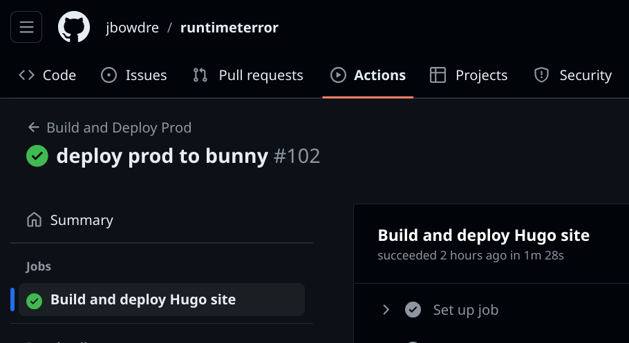
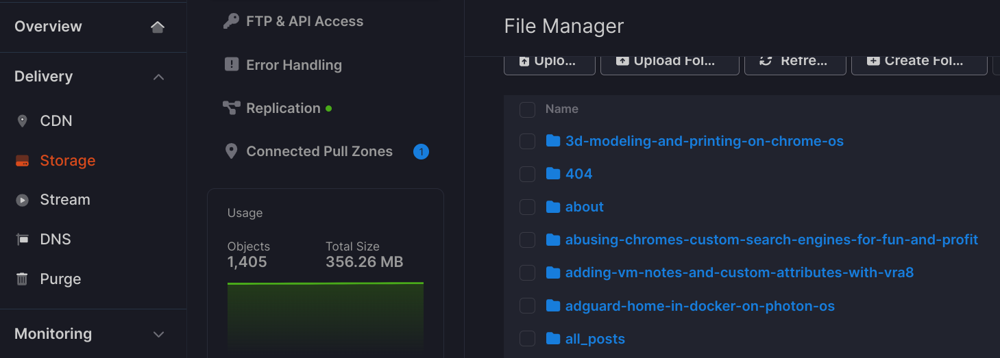

It wasn't too long ago (January, in fact) that I started [hosting this site with Neocities](/deploy-hugo-neocities-github-actions/). I was pretty pleased with that setup, but a few weeks ago my [monitoring setup](https://scribbles.jbowdre.lol/post/upptime-serverless-server-monitoring-c88fbaz7) started reporting that the site was down. And sure enough, trying to access the site would return a generic error message stating that the site was unknown. I eventually discovered that this was due to Neocities "forgetting" that the site was linked to the `runtimeterror.dev` domain. It was easy enough to just re-enter that domain in the configuration, and that immediately fixed things... until a few days later when the same thing happened again.

The same problem has now occurred five or six times, and my messages to the Neocities support contact have gone unanswered. I didn't see anyone else online reporting this exact issue, but I found several posts on Reddit about sites getting randomly broken (or even deleted!) and support taking a week (or more) to reply. I don't have that kind of patience, so I started to consider moving my content away from Neocities and cancelling my $5/month Supporter subscription.

I [recently](https://scribbles.jbowdre.lol/post/i-just-hopped-to-bunny-net) started using [bunny.net](https://bunny.net) for the site's DNS, and had also [leveraged Bunny's CDN for hosting font files](/using-custom-font-hugo/). This setup has been working great for me, and I realized that I could also use Bunny's CDN for hosting the entirety of my static site as well. After all, serving static files on the web is exactly what a CDN is great at. After an hour or two of tinkering, I successfully switched hosting setups with just a few seconds of downtime.

Here's how I did it.

### Storage Zone
I started by logging into Bunny's dashboard and creating a new storage zone to hold the files. I gave it a name (like `my-storage-zone`), selected the main storage region nearest to me (New York), and also enabled replication to a site in Europe and another in Asia for good measure. (That's going to cost me a whopping $0.025/GB.)

After the storage zone was created, I clicked over to the **FTP & API Access** page to learn how upload files. I did some initial tests with an FTP client to confirm that it worked, but mostly I just made a note of the credentials since they'll be useful later.

### Pull Zone
To get files out of the storage zone and onto the web site, I had to also configure a pull zone. While looking at my new storage, I clicked **Connected Pull Zones** and then the **+Connect Pull Zone** button at the top right of the screen. From there, I selected the option to **Add Pull Zone** and that whisked me away to the zone creation wizard.

Once again, I gave the zone a name (`my-pull-zone`). I left the origin settings configured to pull from my new storage zone, and also left it on the standard tier. I left all the pricing zones enabled so that the content can be served from whatever region is closest. (Even with all pricing zones activate, my delivery costs will still be just $0.01 to $0.06/GB.)

After admiring the magnificence of my new pull zone, I clicked the menu button at the top right and select **Copy Pull Zone ID** and made a note of that as well.

### GitHub Action
I found the [bunnycdn-storage-deploy](https://github.com/ayeressian/bunnycdn-storage-deploy) Action which makes it easy to upload content to a Bunny storage zone and also purge the cache of the pull zone at the same time. For that to work, I had to add a few new[action secrets](https://docs.github.com/en/actions/security-guides/using-secrets-in-github-actions) to my GitHub repo:

| Name                     | Sample Value                  | Description                                                                                                  |
|--------------------------|-------------------------------|--------------------------------------------------------------------------------------------------------------|
| `BUNNY_API_KEY`          | `34b05c3b-[...]-1b0f8cd6f0af` | Used for purging the cache. Find it under [Bunny's Account Settings](https://dash.bunny.net/account/api-key) |
| `BUNNY_STORAGE_ENDPOINT` | `ny.storage.bunnycdn.com`     | Hostname from the storage zone's FTP & API Access page                                                       |
| `BUNNY_STORAGE_NAME`     | `my-storage-zone`             | Name of the storage zone, which is also the username                                                         |
| `BUNNY_STORAGE_PASSWORD` | `7cb197e5-[...]-ad35820c0de8` | Get it from the storage zone's FTP & API Access page                                                         |
| `BUNNY_ZONE_ID`          | `12345`                       | The pull zone ID you copied earlier                                                                          |

Then I just updated [my deployment workflow](https://github.com/jbowdre/runtimeterror/blob/main/.github/workflows/deploy-prod.yml) to swap the Bunny action in place of the Neocities one:

```yaml
# torchlight! {"lineNumbers":true}
name: Deploy to Production # [tl! collapse:start]

# only run on changes to main
on:
  schedule:
    - cron: 0 13 * * *
  workflow_dispatch:
  push:
    branches:
      - main

concurrency: # prevent concurrent deploys doing strange things
  group: deploy-prod
  cancel-in-progress: true

# Default to bash
defaults:
  run:
    shell: bash
# [tl! collapse:end]
jobs:
  deploy:
    name: Build and deploy Hugo site
    runs-on: ubuntu-latest
    steps:
      - name: Hugo setup # [tl! collapse:19]
        uses: peaceiris/actions-hugo@v2.6.0
        with:
          hugo-version: '0.121.1'
          extended: true
      - name: Checkout
        uses: actions/checkout@v4
        with:
          submodules: recursive
      - name: Connect to Tailscale
        uses: tailscale/github-action@v2
        with:
          oauth-client-id: ${{ secrets.TS_API_CLIENT_ID }}
          oauth-secret: ${{ secrets.TS_API_CLIENT_SECRET }}
          tags: ${{ secrets.TS_TAG }}
      - name: Configure SSH known hosts
        run: |
          mkdir -p ~/.ssh
          echo "${{ secrets.SSH_KNOWN_HOSTS }}" > ~/.ssh/known_hosts
          chmod 644 ~/.ssh/known_hosts #
      - name: Build with Hugo
        run: HUGO_REMOTE_FONT_PATH=${{ secrets.REMOTE_FONT_PATH }} hugo --minify
      - name: Highlight with Torchlight
        run: |
          npm i @torchlight-api/torchlight-cli
          TORCHLIGHT_TOKEN=${{ secrets.TORCHLIGHT_TOKEN }} npx torchlight
      - name: Deploy HTML to Neocities # [tl! **:5 --:5]
        uses: bcomnes/deploy-to-neocities@v1
        with:
          api_token: ${{ secrets.NEOCITIES_API_TOKEN }}
          cleanup: true
          dist_dir: public
      - name: Deploy to Bunny # [tl! **:19 ++:19 reindex(-6)]
        uses: ayeressian/bunnycdn-storage-deploy@v2.2.2
        with:
          # copy from the 'public' folder
          source: public
          # to the root of the storage zone
          destination: /
          # details for accessing the storage zone
          storageZoneName: "${{ secrets.BUNNY_STORAGE_NAME }}"
          storagePassword: "${{ secrets.BUNNY_STORAGE_PASSWORD }}"
          storageEndpoint: "${{ secrets.BUNNY_STORAGE_ENDPOINT }}"
          # details for accessing the pull zone
          accessKey: "${{ secrets.BUNNY_API_KEY }}"
          pullZoneId: "${{ secrets.BUNNY_ZONE_ID }}"
          # upload files/folders
          upload: "true"
          # remove all remote files first (clean)
          remove: "true"
          # purge the pull zone cache
          purgePullZone: "true"
      - name: Deploy GMI to Agate
        run: |
          rsync -avz --delete --exclude='*.html' --exclude='*.css' --exclude='*.js' -e ssh public/ deploy@${{ secrets.GMI_HOST }}:${{ secrets.GMI_CONTENT_PATH }}
```

After committing and pushing this change, I checked my repo on GitHub to confirm that the workflow completed successfully:



And I also checked the Bunny storage zone to confirm that the site's contents had been copied there:



### DNS
With the site content in place, all remained was to switch over the DNS record. I needed to use a `CNAME` to point `runtimeterror.dev` to the new pull zone, and that meant I first had to delete the existing `A` record pointing to Neocities' IP address. I waited about thirty seconds to make sure that change really took hold before creating the new `CNAME` to link `runtimeterror.dev` to the new pull zone, `my-pull-zone.b-cdn.net`.

### SSL
The final piece was to go back to the pull zone's **Hostnames** configuration, add `runtimeterror.dev` as a custom hostname, and allow Bunny to automatically generate and install a cert for this hostname.

### All done!
That's it - everything I did to get my site shifted over to being hosted directly by Bunny. It seems quite a bit snappier to me during my initial testing, and I'm hoping that things will be a bit more stable going forward. (Even if I *do* run into any issues with this sestup, I'm pretty confident that Bunny's [ulta-responsive support team](https://social.lol/@jbowdre/112531789177956368) would be able to help me fix it.)

*I'm really impressed with Bunny, and honestly can't recommend their platform highly enough. If you'd like to check it out, maybe use [this referral link](https://bunny.net/?ref=0eh23p45xs)?*