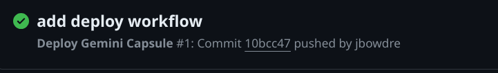

I've recently been exploring some indieweb/smolweb technologies, and one of the most interesting things I've come across is [Project Gemini](https://geminiprotocol.net/):

> Gemini is a new internet technology supporting an electronic library of interconnected text documents. That's not a new idea, but it's not old fashioned either. It's timeless, and deserves tools which treat it as a first class concept, not a vestigial corner case. Gemini isn't about innovation or disruption, it's about providing some respite for those who feel the internet has been disrupted enough already. We're not out to change the world or destroy other technologies. We are out to build a lightweight online space where documents are just documents, in the interests of every reader's privacy, attention and bandwidth.

I thought it was an interesting idea, so after a bit of experimentation with various hosted options I created a self-hosted [Gemini capsule (Gemini for "web site") to host a lightweight text-focused Gemlog ("weblog")](https://capsule.jbowdre.lol/gemlog/2024-03-05-hello-gemini.gmi). After further tinkering, I arranged to serve the capsule both on the Gemini network as well as the traditional HTTP-based web, and I set up a GitHub Actions workflow to handle posting updates. This post will describe how I did that.

### Gemini Server: Agate
There are a number of different [Gemini server applications](https://github.com/kr1sp1n/awesome-gemini?tab=readme-ov-file#servers) to choose from. I decided to use [Agate](https://github.com/mbrubeck/agate), not just because it was at the top of the Awesome Gemini list but also because seems to be widely recommended, regularly updated, and easy to use. Plus it will automatically generates certs for me, which is nice since Gemini *requires* valid certificates for all connections.

I wasn't able to find a pre-built Docker image for Agate (at least not one which seemed to be actively maintained), but I found that I could easily make my own by just installing Agate on top of the standard Rust image. So I came up with this `Dockerfile`:

```Dockerfile
# torchlight! {"lineNumbers": true}
FROM rust:latest

RUN cargo install agate

WORKDIR /var/agate

ENTRYPOINT ["agate"]
```

This very simply uses the [Rust package manager](https://doc.rust-lang.org/cargo/) to install `agate`, change to an appropriate working directory, and start the `agate` executable.

And then I can create a basic `docker-compose.yaml` for it:

```yaml
# torchlight! {"lineNumbers": true}
services:
  agate:
    restart: always
    build: .
    container_name: agate
    volumes:
      - ./content:/var/agate/content
      - ./certs:/var/agate/certs
    ports:
      - "1965:1965"
    command: >
      --content content --certs certs --addr 0.0.0.0:1965
      --hostname capsule.jbowdre.lol --lang en-US
```

This mounts local directories `./content` and `./certs` into the `/var/agate/` working directory, passes arguments specifying those directories as well as the hostname to the `agate` executable, and exposes the service on port `1965` (commemorating the [first manned Gemini missions](https://en.wikipedia.org/wiki/Project_Gemini#Missions) - I love the space nerd influences here!).

Now I'll throw some quick [Gemtext](https://geminiprotocol.net/docs/gemtext.gmi) into a file in the `./content` directory:

```shell
mkdir -p content # [tl! .cmd]
cat <<< EOF > content/hello-gemini.gmi # [tl! .cmd]
# This is a test of the Gemini broadcast system.

* This is only a test.

=> gemini://geminiprotocol.net/history/ Gemini History
EOF
```

After configuring the `capsule.jbowdre.lol` DNS record and opening port `1965` on my server's firewall, I can use `docker compose up -d` to spawn the server and begin serving my mostly-empty capsule at `gemini://capsule.jbowdre.lol/hello-gemini.gmi`. I can then check it out in a popular Gemini client called [Lagrange](https://github.com/skyjake/lagrange):


Hooray, I have an outpost in Geminispace! Let's dress it up a little bit now.

### Gemini Content: gempost
A "hello world" post will only hold someone's interest for so long. I wanted to start using my capsule for lightweight blogging tasks, but I didn't want to have to manually keep track of individual posts or manage consistent formatting. After a bit of questing, I found [gempost](https://github.com/justlark/gempost), a static site generator for gemlogs (Gemini blogs). It makes it easy to template out index pages and insert headers/footers, and supports tracking post metadata in a yaml sidecar for each post (handy since gemtext doesn't support front matter or other inline meta properties).

gempost is installed as a Rust package, so I _could_ have installed Rust and then used `cargo install gempost` to install gempost. But I've been really getting into using project-specific development shells powered by [Nix flakes](https://nixos.wiki/wiki/Flakes) and [direnv](https://github.com/direnv/direnv/wiki/Nix) to automatically load/unload packages as I traverse the directory tree. So I put together [this flake](https://github.com/jbowdre/capsule/blob/main/flake.nix) to activate Agate, Rust, and gempost when I change into the directory where I want to build my capsule content:

```nix
# torchlight! {"lineNumbers": true}
{
  description = "gemsite build environment";

  inputs = {
    nixpkgs.url = "github:nixos/nixpkgs/nixos-unstable";
  };

  outputs = { self, nixpkgs }:
  let
    pkgs = import nixpkgs { system = "x86_64-linux"; };
    gempost = pkgs.rustPlatform.buildRustPackage rec {
      pname = "gempost";
      version = "v0.3.0";

      src = pkgs.fetchFromGitHub {
        owner = "justlark";
        repo = pname;
        rev = version;
        hash = "sha256-T6CP1blKXik4AzkgNJakrJyZDYoCIU5yaxjDvK3p01U=";
      };
      cargoHash = "sha256-jG/G/gmaCGpqXeRQX4IqV/Gv6i/yYUpoTC0f7fMs4pQ=";
    };
  in
   {
    devShells.x86_64-linux.default = pkgs.mkShell {
      packages = with pkgs; [
        agate
        gempost
      ];
    };
  };
}
```

Then I just need to tell direnv to load the flake, by dropping this into `.envrc`:

```shell
# torchlight! {"lineNumbers":true}
#!/usr/bin/env direnv
use flake .
```

Now when I `cd` into the directory where I'm managing the content for my capsule, the appropriate environment gets loaded automagically:

```shell
which gempost # [tl! .cmd]
cd capsule/ # [tl! .cmd]
direnv: loading ~/projects/capsule/.envrc # [tl! .nocopy:3]
direnv: using flake .
direnv: nix-direnv: using cached dev shell # [tl! collapse:1]
direnv: export +AR +AS +CC +CONFIG_SHELL +CXX +HOST_PATH +IN_NIX_SHELL +LD +NIX_BINTOOLS +NIX_BINTOOLS_WRAPPER_TARGET_HOST_x86_64_unknown_linux_gnu +NIX_BUILD_CORES +NIX_CC +NIX_CC_WRAPPER_TARGET_HOST_x86_64_unknown_linux_gnu +NIX_CFLAGS_COMPILE +NIX_ENFORCE_NO_NATIVE +NIX_HARDENING_ENABLE +NIX_LDFLAGS +NIX_STORE +NM +OBJCOPY +OBJDUMP +RANLIB +READELF +SIZE +SOURCE_DATE_EPOCH +STRINGS +STRIP +__structuredAttrs +buildInputs +buildPhase +builder +cmakeFlags +configureFlags +depsBuildBuild +depsBuildBuildPropagated +depsBuildTarget +depsBuildTargetPropagated +depsHostHost +depsHostHostPropagated +depsTargetTarget +depsTargetTargetPropagated +doCheck +doInstallCheck +dontAddDisableDepTrack +mesonFlags +name +nativeBuildInputs +out +outputs +patches +phases +preferLocalBuild +propagatedBuildInputs +propagatedNativeBuildInputs +shell +shellHook +stdenv +strictDeps +system ~PATH ~XDG_DATA_DIRS
which gempost # [tl! .cmd]
/nix/store/1jbfsb0gm1pr1ijc8304jqak7iamjybi-gempost-v0.3.0/bin/gempost # [tl! .nodopy]
```

Neat!

I'm not going to go into too much detail on how I configured/use gempost; the [readme](https://github.com/justlark/gempost/blob/main/README.md) does a great job of explaining what's needed to get started, and the [examples directory](https://github.com/justlark/gempost/tree/main/examples) shows some of the flexibility and configurable options. Perhaps the biggest change I made is using `gemlog/` as the gemlog directory (instead of `posts/`). You can check out my [gempost config file](https://github.com/jbowdre/capsule/blob/main/gempost.yaml) and/or [gempost templates](https://github.com/jbowdre/capsule/tree/main/templates) for the full details.

In any case, after gempost is configured and I've written some posts, I can build the capsule with `gempost build`. It spits out the "rendered" gemtext (basically generating index pages and the Atom feed from the posts and templates) in the `public/` directory.

If I copy the contents of that `public/` directory into my Agate `content/` directory, I'll be serving this new-and-improved Gemini capsule. But who wants to be manually running `gempost build` and copying files around to publish them? Not this guy. I'll set up a GitHub Actions workflow to take care of that for me.

But first, let's do a little bit more work to make this capsule available on the traditional HTTP-powered world wide web.

### Web Proxy: kineto
I looked at a few different options for making Gemini content available on the web. I thought about finding/writing a script to convert geminitext to HTML and just serving that directly. I saw a few alternative Gemini servers which seemed able to cross-host content. But the simplest solution I saw (and one that I've seen used on quite a few other sites) is a Gemini-to-HTTP proxy called [kineto](https://sr.ht/~sircmpwn/kineto/).

kineto is distributed as a golang package so that's pretty easy to build and install in a Docker image:

```Dockerfile
# torchlight! {"lineNumbers":true}
FROM golang:1.22 as build
WORKDIR /build
RUN git clone https://git.sr.ht/~sircmpwn/kineto
WORKDIR /build/kineto
RUN go mod download \
  && CGO_ENABLED=0 GOOS=linux go build -o kineto

FROM alpine:3.19
WORKDIR /app
COPY --from=build /build/kineto/kineto /app/kineto
ENTRYPOINT ["/app/kineto"]
```

I created a slightly-tweaked `style.css` based on kineto's [default styling](https://git.sr.ht/~sircmpwn/kineto/tree/857f8c97ebc5724f4c34931ba497425e7653894e/item/main.go#L257) to tailor the appearance a bit more to my liking. (I've got some more work to do to make it look "good", but I barely know how to spell CSS so I'll get to that later.)

```css
/* torchlight! {"lineNumbers":true} */
html { /* [tl! collapse:start] */
  font-family: sans-serif;
  color: #080808;
}

body {
  max-width: 920px;
  margin: 0 auto;
  padding: 1rem 2rem;
}

blockquote {
  background-color: #eee;
  border-left: 3px solid #444;
  margin: 1rem -1rem 1rem calc(-1rem - 3px);
  padding: 1rem;
}

ul {
  margin-left: 0;
  padding: 0;
}

li {
  padding: 0;
}

li:not(:last-child) {
  margin-bottom: 0.5rem;
} /* [tl! collapse:end] */

a {
  position: relative;
  text-decoration: dotted underline; /* [tl! ++:start] */
}

a:hover {
 text-decoration: solid underline; /* [tl! ++:end] */
}
/* [tl! collapse:start] */
a:before {
  content: '⇒';
  color: #999;
  text-decoration: none;
  font-weight: bold;
  position: absolute;
  left: -1.25rem;
}

pre {
  background-color: #eee;
  margin: 0 -1rem;
  padding: 1rem;
  overflow-x: auto;
}

details:not([open]) summary,
details:not([open]) summary a {
  color: gray;
}

details summary a:before {
  display: none;
}

dl dt {
  font-weight: bold;
}

dl dt:not(:first-child) {
  margin-top: 0.5rem;
} /* [tl! collapse:end] */

@media(prefers-color-scheme:dark) { /* [tl! collapse:start] */
  html {
    background-color: #111;
    color: #eee;
  }

  blockquote {
    background-color: #000;
  }

  pre {
    background-color: #222;
  }

  a {
    color: #0087BD;
  } /* [tl! collapse:end] */

  a:visited {
    color: #333399; /* [tl! --] */
    color: #006ebd; /* [tl! ++ reindex(-1)] */
  }
}
/* [tl! collapse:start] */
label {
  display: block;
  font-weight: bold;
  margin-bottom: 0.5rem;
}

input {
  display: block;
  border: 1px solid #888;
  padding: .375rem;
  line-height: 1.25rem;
  transition: border-color .15s ease-in-out,box-shadow .15s ease-in-out;
  width: 100%;
}

input:focus {
  outline: 0;
  border-color: #80bdff;
  box-shadow: 0 0 0 0.2rem rgba(0,123,255,.25);
} /* [tl! collapse:end] */
```

And then I crafted a `docker-compose.yaml` for my kineto instance:

```yaml
# torchlight! {"lineNumbers":true}
services:
  kineto:
    restart: always
    build: .
    container_name: kineto
    ports:
      - "8081:8080"
    volumes:
      - ./style.css:/app/style.css
    command: -s style.css gemini://capsule.jbowdre.lol
```

Port `8080` was already in use for another service on this system, so I had to expose this on `8081` instead. And I used the `-s` argument to `kineto` to load my customized CSS, and then pointed the proxy at the capsule's Gemini address.

I started this container with `docker compose up -d`... but the job wasn't *quite* done. This server is already using [Caddy webserver](https://caddyserver.com/) for serving some stuff, so I'll use that for fronting kineto as well. That way, the content can be served over the typical HTTPS port and Caddy can manage the certificate for me too.

So I added this to my `/etc/caddy/Caddyfile`:

```text
capsule.jbowdre.lol {
  reverse_proxy localhost:8081
}
```

And bounced the Caddy service.

Now my capsule is available at both `gemini://capsule.jbowdre.lol` and `https://capsule.jbowdre.lol`. Agate handles generating the Gemini content, and kineto is able to convert that to web-friendly HTML on the fly. It even handles embedded `gemini://` links pointing to other capsules, allowing legacy web users to explore bits of Geminispace from the comfort of their old-school browsers.

One thing that kineto _doesn't_ translate, though, are the contents of the atom feed at `public/gemlog/atom.xml`. Whether it's served via Gemini or HTTPS, the contents are static. For instance:

```xml
<entry>
  <id>urn:uuid:a751b018-cda5-4c03-bd9d-16bdc1506050</id>
  <title>Hello Gemini</title>
  <summary>I decided to check out Geminispace. You're looking at my first exploration.</summary>
  <published>2024-03-05T17:00:00-06:00</published>
  <updated>2024-03-06T07:45:00-06:00</updated>
  <link rel="alternate" href="gemini://capsule.jbowdre.lol/gemlog/2024-03-05-hello-gemini.gmi"/> <!-- [tl! **] -->
</entry>
```

No worries, I can throw together a quick script that will generate a web-friendly feed:

```shell
# torchlight! {"lineNumbers":true}
#!/usr/bin/env bash
# generate-web-feed.sh
set -eu

INFEED="public/gemlog/atom.xml"
OUTFEED="public/gemlog/atom-web.xml"

# read INFEED, replace gemini:// with https:// and write to OUTFEED
sed 's/gemini:\/\//https:\/\//g' $INFEED > $OUTFEED
# fix self url
sed -i 's/atom\.xml/atom-web\.xml/g' $OUTFEED
```

After running that, I have a `public/gemlog/atom-web.xml` file that I can serve for web visitors, and it correctly points to the `https://` endpoint so that feed readers won't get confused:

```xml
<entry>
  <id>urn:uuid:a751b018-cda5-4c03-bd9d-16bdc1506050</id>
  <title>Hello Gemini</title>
  <summary>I decided to check out Geminispace. You're looking at my first exploration.</summary>
  <published>2024-03-05T17:00:00-06:00</published>
  <updated>2024-03-06T07:45:00-06:00</updated>
  <link rel="alternate" href="https://capsule.jbowdre.lol/gemlog/2024-03-05-hello-gemini.gmi" /> <!-- [tl! ** ] -->
</entry>
```

Let's sort out an automated build process now...

### Publish: GitHub Actions
To avoid having to manually publish my capsule by running `gempost build` and copying the result into the server's `content/` directory, I'm going to automate that process with a GitHub Actions workflow. It will execute the build process in a GitHub runner and then shift the result to my server. I'll make use of [Tailscale](https://tailscale.com/) to easily establish an rsync-ssh connection between the runner and the server without having to open up any ports publicly.

I'll start by creating a new GitHub repo for managing my capsule content; let's call it [github.com/jbowdre/capsule](https://github.com/jbowdre/capsule). I'll clone it locally so I can work in it on my laptop and then push changes upstream when I'm ready. So I'll copy/move over all the gempost files I've worked on so far, along with a copy of the Docker configurations for Agate and kineto just so I've got those visible in one place:

```
.
├── .certificates
├── .direnv
├── agate
├── gemlog
├── kineto
├── public
├── static
├── templates
├── .envrc
├── .gitignore
├── flake.lock
├── flake.nix
├── gempost.yaml
└── generate-web-feed.sh
```

I don't need to sync `.direnv/` (which holds the local direnv state), `public/` (which holds the gempost output - I'll be building that in GitHub shortly), or `.certificates/` (which was automatically created when testing agate locally with `agate --content public --hostname localhost`), so I'll add those to `.gitignore`:

```
/.certificates/
/.direnv/
/public/
```

Then I can create `.github/workflows/deploy-gemini.yml` to manage the deployment, and I start that by defining when it should be triggered:
- only on pushes to the `main` branch,
- and only when one of the gempost-related files/directories are included in that push.

It will also set some other sane defaults for the workflow:

```yaml
# torchlight! {"lineNumbers":true}
name: Deploy Gemini Capsule

# only run on changes to main
on:
  workflow_dispatch:
  push:
    branches:
      - main
    paths:
      - 'gemlog/**'
      - 'static/**'
      - 'templates/**'
      - 'gempost.yaml'

concurrency: # prevent concurrent deploys doing strange things
  group: deploy-gemini-capsule
  cancel-in-progress: true

# Default to bash
defaults:
  run:
    shell: bash

```

I'll then define my first couple of jobs to:
- use the [cargo-install Action](https://github.com/baptiste0928/cargo-install/tree/v3.0.0/) to install gempost,
- checkout the current copy of my capsule repo,
- run the `gempost build` process,
- and then call my `generate-web-feed.sh` script.

```yaml
# torchlight! {"lineNumbers":true}
jobs: # [tl! reindex(24)]
  deploy:
    name: Deploy Gemini Capsule
    runs-on: ubuntu-latest
    steps:
      - name: Install gempost
        uses: baptiste0928/cargo-install@v3.0.0
        with:
          crate: gempost
      - name: Checkout
        uses: actions/checkout@v4
      - name: Gempost build
        run: gempost build
      - name: Generate web feed
        run: ./generate-web-feed.sh
```

Next, I'll use the [Tailscale Action](https://github.com/tailscale/github-action/tree/v2/) to let the runner connect to my Tailnet. It will use an [OAuth client](https://tailscale.com/kb/1215/oauth-clients) to authenticate the new node, and will apply an [ACL tag](https://tailscale.com/kb/1068/acl-tags) which grants access _only_ to my web server.

```yaml
# torchlight! {"lineNumbers":true}
      - name: Connect to Tailscale # [tl! reindex(39)]
        uses: tailscale/github-action@v2
        with:
          oauth-client-id: ${{ secrets.TS_API_CLIENT_ID }}
          oauth-secret: ${{ secrets.TS_API_CLIENT_SECRET }}
          tags: ${{ secrets.TS_TAG }}
```

I'll let [Tailscale SSH](https://tailscale.com/kb/1193/tailscale-ssh) facilitate the authentication for the rsync-ssh login, but I need to pre-stage `~/.ssh/known_hosts` on the runner so that the client will know it can trust the server:

```yaml
# torchlight! {"lineNumbers":true}
      - name: Configure SSH known hosts # [tl! reindex(45)]
        run: |
          mkdir -p ~/.ssh
          echo "${{ secrets.SSH_KNOWN_HOSTS }}" > ~/.ssh/known_hosts
          chmod 644 ~/.ssh/known_hosts
```

And finally, I'll use `rsync` to transfer the contents of the gempost-produced `public/` folder to the Agate `content/` folder on the remote server:

```yaml
# torchlight! {"lineNumbers":true}
      - name: Deploy GMI to Agate # [tl! reindex(50)]
        run: |
          rsync -avz --delete -e ssh public/ deploy@${{ secrets.GMI_HOST }}:${{ secrets.GMI_CONTENT_PATH }}
```

You can view the workflow in its entirety on [GitHub](https://github.com/jbowdre/capsule/blob/main/.github/workflows/deploy-gemini.yml). But before I can actually use it, I'll need to configure Tailscale, set up the server, and safely stash those `secrets.*` values in the repo.

#### Tailscale configuration
I want to use a pair of ACL tags to identify the GitHub runner and the server, and ensure that the runner can connect to the server over port 22. To create a new tag in a Tailscale ACL, I need to assign the permission, so I'll add this to my ACL file:

```json
  "tagOwners": {
    "tag:gh-bld":      ["group:admins"], // github builder
    "tag:gh-srv":      ["group:admins"], // server it can deploy to
  },
```

Then I'll add this to the `acls` block:

```json
  "acls": [
    {
      // github runner can talk to the deployment target
      "action": "accept",
      "users":  ["tag:gh-bld"],
      "ports": [
        "tag:gh-srv:22"
      ],
    }
  ],
```

And I'll use this to configure [Tailscale SSH](https://tailscale.com/kb/1193/tailscale-ssh) to define that the runner can log in to the web server as the `deploy` user using a keypair automagically managed by Tailscale:

```json
  "ssh": [
    {
      "action": "accept",
      "src": ["tag:gh-bld"],
      "dst": ["tag:gh-srv"],
      "users": ["deploy"],
    }
  ],
```

To generate the OAuth client, I'll head to [Tailscale Admin Console > Settings > OAuth Clients](https://login.tailscale.com/admin/settings/oauth) and click the **Generate OAuth Client** button. The new client only needs to have the ability to read and write new devices, and I set it to assign the `tag:gh-bld` tag:


I take the Client ID and Client Secret store those in the GitHub Repo as Actions Repository Secrets named `TS_API_CLIENT_ID` and `TS_API_CLIENT_SECRET`. I also save the tag as `TS_TAG`.

#### Server configuration
From my previous manual experimentation, I have the Docker configuration for the Agate server hanging out at `/opt/gemini/`, and kineto is on the same server at `/opt/kineto/` (though it doesn't really matter where kineto actually lives - it can proxy any `gemini://` address from anywhere).

I'm actually using [Agate's support for Virtual Hosts](https://github.com/mbrubeck/agate?tab=readme-ov-file#virtual-hosts) to serve both the capsule I've been discussing in this post as well as a version of _this very site_ available in Geminispace at `gemini://gmi.runtimeterror.dev`. By passing multiple hostnames to the `agate` command line, it looks for hostname-specific subdirs inside of the `content` and `certs` folders. So my production setup looks like this:

```text
.
├── certs
│  ├── capsule.jbowdre.lol
│  └── gmi.runtimeterror.dev
├── content
│  ├── capsule.jbowdre.lol
│  └── gmi.runtimeterror.dev
├── docker-compose.yaml
└── Dockerfile
```

And the `command:` line of `docker-compose.yaml` looks like this:

```yaml
  command: >
    --content content --certs certs --addr 0.0.0.0:1965
    --hostname gmi.runtimeterror.dev
    --hostname capsule.jbowdre.lol
    --lang en-US
```

I told the Tailscale ACL that the runner should be able to log in to the server as the `deploy` user, so I guess I'd better create that account on the server:

```shell
sudo useradd -U -m -s /usr/bin/bash deploy # [tl! .cmd]
```

And I want to make that user the owner of the content directories so that it can use `rsync` to overwrite them when changes are made:

```shell
sudo chown -R deploy:deploy /opt/gemini/content/capsule.jbowdre.lol # [tl! .cmd:1]
sudo chown -R deploy:deploy /opt/gemini/content/gmi.runtimeterror.dev
```

I should also make sure that the server bears the appropriate Tailscale tag and that it has Tailscale SSH enabled:

```shell
sudo tailscale up --advertise-tags="tag:gh-srv" --ssh
```

I can use the `ssh-keyscan` utility _from another system_ to retrieve the server's SSH public keys so they can be added to the runner's `known_hosts` file:

```shell
ssh-keyscan -H $servername # [tl! .cmd]
```

I'll copy the entirety of that output and save it as a repository secret named `SSH_KNOWN_HOSTS`. I'll also save the Tailnet node name as `GMI_HOST` and the full path to the capsule's content directory (`/opt/gemini/content/capsule.jbowdre.lol/`) as `GMI_CONTENT_PATH`.

### Deploy!
All the pieces are in place, and all that's left is to `git commit` and `git push` the repo I've been working on. With a bit of luck (and a lot of ~~failures~~ _lessons learned_), GitHub shows a functioning deployment!



And the capsule is live at both `https://capsule.jbowdre.lol` and `gemini://capsule.jbowdre.lol`:


Come check it out!
- [My Capsule on Gemini](gemini://capsule.jbowdre.lol)
- [My Capsule on the web](https://capsule.jbowdre.lol)