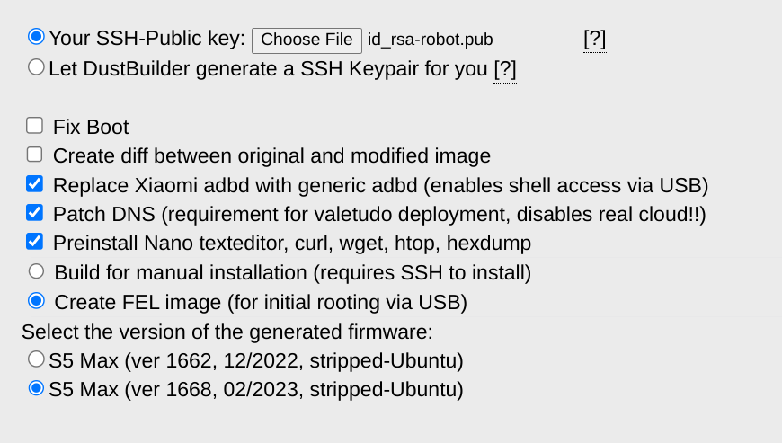

Continuing my mission to *[Tailscale](/tags/tailscale/) all the things!*, I recently added my robot vacuum (a [Roborock S5 Max](https://us.roborock.com/pages/roborock-s5-max)) to my tailnet.

Okay, installing Tailscale wasn't the *only* thing I did. I also loaded it with software to control it locally so that it no longer has to talk to The Cloud. (And then I installed Tailscale because I can.)

I was inspired to give this a go after reading the [Tailscale sucks](https://tailscale.dev/blog/tailscale-sucks) post on the Tailscale developer blog. That post educated me about a couple of very helpful projects:

- [Valetudo](https://valetudo.cloud/), a web-based front-end for robot vacuums by Sören Beye
- [DustBuilder](https://builder.dontvacuum.me/), a custom firmware builder for a variety of robot vacuums by Dennis Giese

Both sites also include a wealth of documentation to guide you along your robot-hacking journey, including a [list of supported robots](https://valetudo.cloud/pages/general/supported-robots.html) and a [detailed technical/feature comparison of a variety of robots[(https://robotinfo.dev/).

This post will detail all the steps I took to hack my robot, install Tailscale, configure Valetudo, and get it connected to Home Assistant. (I also semi-live-blogged the process on [social.lol](https://social.lol/@jbowdre/112911333551545789)).

### Getting started
I started by looking at the Valetudo [supported robots list](https://valetudo.cloud/pages/general/supported-robots.html) to see that `Rooting [my S5 Max] requires full disassembly.` Clicking through to the [FEL rooting instructions](https://valetudo.cloud/pages/installation/roborock.html#fel) further warned that `This rooting method is not suited for beginners.`.

> Don't threaten me with a good time.

Before getting into the robots guts, though, I went ahead and requested the appropriate firmware so that I wouldn't have to wait on it later.

### Firmware generation
I went to the [Dustbuilder](https://builder.dontvacuum.me/) page,  scrolled until I found the entry for the S5 Max (which also goes by `s5e` in some circles), and clicked to access [that builder](https://builder.dontvacuum.me/_s5e.html).



I generated a new RSA keypair to use for the initial SSH connection:

```shell
ssh-keygen -t rsa -f ~/.ssh/id_rsa-robot # [tl! .cmd]
```

And I uploaded the resulting `id_rsa-robot.pub` to the Dustbuilder interface.

I also made sure to select the `Create FEL image (for initial rooting via USB)` option. Otherwise I left the other options alone, entered a Cloaked email address, and clicked the **Create job** button to kick things off.

### Robot surgery
While my firmware was in the oven I went ahead and began the disassembly process. I started by watching [a disassembly video](https://www.youtube.com/watch?v=68flJFSOK8A) but quickly realized that my S5 Max apparently differs from the one being taken apart: after carefully prying off the top cover I found that my robot doesn't have a set of screws surrounding the spinning laser assembly. The inner top cover is a single, solid piece of plastic. So I ditched the video and forged my own path.

MORE DISASSEMBLY DETAILS HERE

### Launching the hack
I checked my email and found that I had indeed received notification of a successful Dustbuilder build so I downloaded those files:

```shell
ls -l robo* # [tl! .cmd .nocopy:1,2]
.rw-r--r-- 5.3M john  9 Aug 19:02 roborock.vacuum.s5e_1668_fel.zip
.rw-r--r--  28M john  9 Aug 19:00 roborock.vacuum.s5e_1668_fw.tar.gz
```

I also grabbed the [latest `valetudo-armv7-lowmem.upx` binary](https://github.com/Hypfer/Valetudo/releases/latest/download/valetudo-armv7-lowmem.upx) from the [Valetudo GitHub](https://github.com/Hypfer/Valetudo/).

And I installed the `sunxi-tools` package needed for communicating with the robot over USB:

```shell
sudo apt update # [tl! .cmd:1]
sudo apt install sunxi-tools
```

I used a micro-USB cable to connect the mainboard's debugging port to my Chromebook (running then [Linux development environment](https://www.chromium.org/chromium-os/developer-library/guides/containers/containers-and-vms/)). (I wasn't entirely sure that the Chromebook would work for this as it can be somewhat picky about [supporting USB devices](https://www.chromium.org/chromium-os/developer-library/guides/containers/containers-and-vms/#can-i-access-hardware-eg-usbbluetoothserial) so also had another Linux laptop standing by just in case.) And I then connected the robot's battery to the mainboard (but without powering on the robot).

Next came the only truly tricky part of this whole process: shorting the `TPA17` test point on the bottom side of the mainboard to ground, while *also* pressing and holding the power button on the *top* side of the board.

I used my fingernail to gently scrape the coating off the pad to make good contact, and settled on using a bent paperclip for the shunt. I was able to hook one end of the clip through one of the (grounded) screw holes and then only have to worry about precisely placing the other end on `TPA17`, which freed up my other hand for mashing the button.

The prescription is to short `TPA17`, press-and-hold the power button for three seconds, and keep `TPA17` shorted to ground for five more seconds after that.

I did that, the status LEDs on the robot came alive, and I went to my terminal to check the status with `lsusb` to see if the `Allwinner Technology sunxi SoC OTG connector in FEL/flashing mode` showed up.

> For a moment, nothing happened.
> Then, after a second or so, nothing continued to happen.
>
> - Douglas Adams

"Okay," I thought to myself, "It must be ChromeOS getting in the way." So I tried my backup laptop (which, admittedly, started as a Chromebook but now runs NixOS). Interestingly, the same thing there - no Allwinner Chicken Dinner.

After half an hour of repeating the same steps and hoping for different results, I had the bright idea to try a different micro-USB cable.

Unfortunately, that didn't change things. So I kept repeating the same steps some more and hoping for different results. Eventually, I tried *another* micro-USB cable, and that seemed to do the trick!

```shell
lsusb # [tl! .cmd]
Bus 001 Device 014: ID 1f3a:efe8 Allwinner Technology sunxi SoC OTG connector in FEL/flashing mode # [tl! .nocopy ~~]
```

{}
I don't have many micro-USB cables left in my house at this point, and most of the ones I do still have arrived as charging cables for various cheap devices. As it turns out, those two other cables I tried first were charging-only cables without any wires to carry the USB data signals.

I had to go digging through my cable drawer to find a quality braided cable (that I knew supported data transfer). If I had just started with a decent cable from the start I could have saved a lot of time and trouble.
{}


