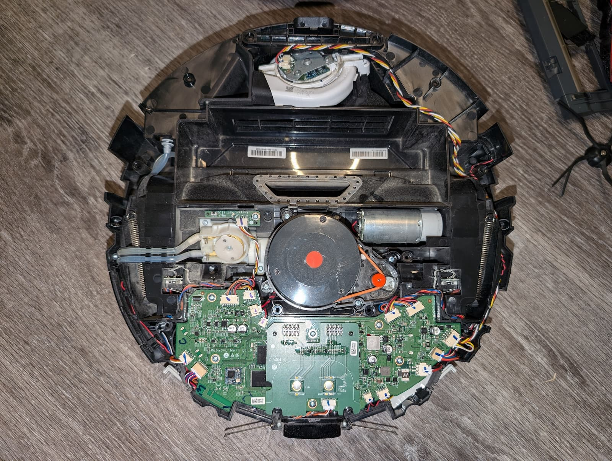

Continuing my mission to *[Tailscale](/tags/tailscale/) all the things!*, I recently added my robot vacuum (a [Roborock S5 Max](https://us.roborock.com/pages/roborock-s5-max)) to my tailnet.

Okay, installing Tailscale wasn't the *only* thing I did. I also loaded it with software to control it locally so that it no longer has to talk to The Cloud. (And then I installed Tailscale because I can.)

I was inspired to give this a go after reading the [Tailscale sucks](https://tailscale.dev/blog/tailscale-sucks) post on the Tailscale developer blog. That post educated me about a couple of very helpful projects:

- [Valetudo](https://valetudo.cloud/), a web-based front-end for robot vacuums by Sören Beye
- [DustBuilder](https://builder.dontvacuum.me/), a custom firmware builder for a variety of robot vacuums by Dennis Giese

Both sites also include a wealth of documentation to guide you along your robot-hacking journey, including a [list of supported robots](https://valetudo.cloud/pages/general/supported-robots.html) and a [detailed technical/feature comparison of a variety of robots[(https://robotinfo.dev/).

This post will detail all the steps I took to hack my robot, install Tailscale, configure Valetudo, and get it connected to Home Assistant. (I also semi-live-blogged the process on [social.lol](https://social.lol/@jbowdre/112911333551545789)).

### Getting started
I started by looking at the Valetudo [supported robots list](https://valetudo.cloud/pages/general/supported-robots.html) to see that `Rooting [my S5 Max] requires full disassembly.` Clicking through to the [FEL rooting instructions](https://valetudo.cloud/pages/installation/roborock.html#fel) further warned that `This rooting method is not suited for beginners.`.

> Don't threaten me with a good time.

Before getting into the robots guts, though, I went ahead and requested the appropriate firmware so that I wouldn't have to wait on it later.

### Firmware generation
I went to the [Dustbuilder](https://builder.dontvacuum.me/) page,  scrolled until I found the entry for the S5 Max (which also goes by `s5e` in some circles), and clicked to access [that builder](https://builder.dontvacuum.me/_s5e.html).


I generated a new RSA keypair to use for the initial SSH connection:

```shell
ssh-keygen -t rsa -f ~/.ssh/id_rsa-robot # [tl! .cmd]
```

And I uploaded the resulting `id_rsa-robot.pub` to the Dustbuilder interface.

I also made sure to select the `Create FEL image (for initial rooting via USB)` option. Otherwise I left the other options alone, entered a Cloaked email address, and clicked the **Create job** button to kick things off.

### Robot surgery
While my firmware was in the oven I went ahead and began the disassembly process. I started by watching [a disassembly video](https://www.youtube.com/watch?v=68flJFSOK8A) but quickly realized that my S5 Max apparently differs from the one being taken apart: after carefully prying off the top cover I found that my robot doesn't have a set of screws surrounding the spinning laser assembly. The inner top cover is a single, solid piece of plastic rather than having a separate cover for the laser.


So I ditched the video and forged my own path:

1. Remove the dustbin and water basin.
2. Turn robot upside-down.
3. Remove main roller assembly.
4. Unscrew side brush.
    
5. Unscrew 6 large screws and remove the bottom cover, exposing the battery.
    
6. Unscrew 8 small screws securing the two-piece bumper to the edge of the robot and remove the bumper.
    
7. Disconnect and remove battery.
8. Unscrew 3 small screws holding the side brush motor and remove the motor (my pictures got out of order so I don't actually show the motor removal until much later... please just pretend that I removed it like I said I did).
    
9. There are several groups of screws to extract so you can separate the top and bottom halves of the robot:
    1. 2 screws in the battery compartment.
        
    2. 4 short screws near the rear of the robot, where the water basin attaches.
        
    3. 1 screw next to one of the main wheel motors.
    4. 1 recessed screw next to the other motor.
        
    5. And 8 recessed screws along the robot edges, including one which was covered by the side brush motor.
        
        
10. Now lift the entire bottom shell to separate it from the top, and flip it over to expose the electronic goodies.
    
11. Carefully remove the 8 connectors along the front edges of the mainboard; the ones along the rear can stay connected.
    
12. Remove 6 screws from the mainboard.
    
13. Carefully lift the mainboard into a vertical position.
    

That's it! Just 40 screws to be able to access the bottom side of the mainboard, and I was finally ready to launch the attack.

### Launching the hack
I checked my email and found that I had indeed received notification of a successful Dustbuilder build so I downloaded those files:

```shell
ls -l robo* # [tl! .cmd .nocopy:1,2]
.rw-r--r-- 5.3M john  9 Aug 19:02 roborock.vacuum.s5e_1668_fel.zip
.rw-r--r--  28M john  9 Aug 19:00 roborock.vacuum.s5e_1668_fw.tar.gz
```

I also grabbed the [latest `valetudo-armv7-lowmem.upx` binary](https://github.com/Hypfer/Valetudo/releases/latest/download/valetudo-armv7-lowmem.upx) from the [Valetudo GitHub](https://github.com/Hypfer/Valetudo/).

And I installed the `sunxi-tools` package needed for communicating with the robot over USB:

```shell
sudo apt update # [tl! .cmd:1]
sudo apt install sunxi-tools
```

I used a micro-USB cable to connect the mainboard's debugging port to my laptop.


And I then connected the robot's battery to the mainboard (but without powering on the robot).

Next came the only truly tricky part of this whole process: shorting the `TPA17` test point on the bottom side of the mainboard to ground, while *also* pressing and holding the power button on the *top* side of the board (it's the button labeled `KEYI3`).


I used my fingernail to gently scrape the coating off the pad to make good contact, and settled on using a bent paperclip for the shunt. I was able to hook one end of the clip through one of the (grounded) screw holes and then only have to worry about precisely placing the other end on `TPA17`, which freed up my other hand for mashing the button.

The technique is to short `TPA17`, press-and-hold the power button for three seconds, and keep `TPA17` shorted to ground for five more seconds after that.

I did that, the status LEDs on the robot came alive, and I went to my terminal to check the status with `lsusb` to see if the `Allwinner Technology sunxi SoC OTG connector in FEL/flashing mode` showed up.

> For a moment, nothing happened.
> Then, after a second or so, nothing continued to happen.
>
> - Douglas Adams

"Okay," I thought to myself, "It must be ChromeOS getting in the way." So I tried my backup laptop (which, admittedly, started as a Chromebook but now runs NixOS). Interestingly, the same thing there - no Allwinner Chicken Dinner.

After half an hour of repeating the same steps and hoping for different results, I had the bright idea to try a different micro-USB cable.

Unfortunately, that didn't change things. So I kept repeating the same steps some more and hoping for different results. Eventually, I tried *another* micro-USB cable, and that seemed to do the trick! ChromeOS prompted me to connect the device to the Linux environment, and `lsusb` then returned the desired result:

```shell
lsusb # [tl! .cmd]
Bus 001 Device 014: ID 1f3a:efe8 Allwinner Technology sunxi SoC OTG connector in FEL/flashing mode # [tl! .nocopy ~~]
```

{}
I don't have many micro-USB cables left in my house at this point, and most of the ones I do still have arrived as charging cables for various cheap devices. As it turns out, those two other cables I tried first were charging-only cables without any wires to carry the USB data signals.

I had to go digging through my cable drawer to find a quality braided cable (that I knew supported data transfer). If I had just started with a decent cable from the start I could have saved a lot of time and trouble.
{}

Once I knew that my Chromebook would actually be able to communicate with the robot, I extracted the contents of the `roborock.vacuum.s5e_1668_fel.zip` archive:

```shell
unzip -d fel roborock.vacuum.s5e_1668_fel.zip # [tl! .cmd:2]
cd fel
ls -l
.rw-r--r--  184 john  9 Aug 19:02 activation.lic # [tl! .nocopy:10]
.rwxr-xr-x  66k john  1 Jul  2023 dtb.bin
.rw-r--r--  33k john  1 Jul  2023 dtb_stripped.bin
.rw-r--r--  31k john  1 Jul  2023 felnand.config
.rwxr-xr-x  14k john  1 Jul  2023 fsbl.bin
.rwxr-xr-x  240 john  1 Jul  2023 run.bat
.rwxr-xr-x  281 john  1 Jul  2023 run.sh
.rwxr-xr-x 2.0M john  1 Jul  2023 sunxi-fel.exe
.rw-r--r-- 852k john  1 Jul  2023 ub.bin
.rwxr-xr-x 852k john  1 Jul  2023 ub_full.bin
.rw-r--r-- 3.9M john  9 Aug 19:02 uImage
```

And then executed `run.sh` as root:

```shell
sudo su # [tl! .cmd]
./run.sh # [tl! .cmd_root]
waiting for 3 seconds # [tl! .nocopy:4]
100% [================================================]   852 kB,  152.2 kB/s
100% [================================================]    66 kB,  162.1 kB/s
100% [================================================]     0 kB,   93.2 kB/s
100% [================================================]  3647 kB,  153.6 kB/s
```

After a minute or two the robot rebooted and began broadcasting its own Wi-Fi AP. I connected to that, and then used my RSA key to log in via SSH:

```shell
ssh -i ~/.ssh/id_rsa-robot root@192.168.8.1 # [tl! .cmd]
[root@rockrobo ~]# # [tl! .nocopy]
```

At this point, the robot was temporarily running on a rooted live image with [busybox](https://busybox.net/about.html) to provide a lot of shell functionality; I still needed to install the patched firmware to maintain control though.

I backed up the `nandb` and `nandk` flash partitions, which apparently contain unique calibration and identity data that can't be recovered if I break something:

```shell
dd if=/dev/nandb | gzip > /tmp/nandb.img.gz # [tl! .cmd_root:1]
dd if=/dev/nandk | gzip > /tmp/nandk.img.gz
```

I spawned another shell from my laptop to retrieve those important files:

```shell
scp -O -i ~/.ssh/id_rsa-robot root@192.168.8.1:/tmp/nand* . # [tl! .cmd]
```

Back on the robot's shell, I deleted some logs to make sure I'd have enough space to load the new firmware image:

```shell
rm -rf /mnt/data/rockrobo/rrlog/* # [tl! .cmd_root]
```

And used the laptop's shell to transfer over the firmware image:

```shell
scp -O -i ~/.ssh/id_rsa-robot roborock.vacuum.s5e_1668_fw.tar.gz root@192.168.8.1:/mnt/data/ # [tl! .cmd]
```

I switched back to the robot session, extracted the firmware package, ran the installer, and rebooted the robot once it was complete:

```shell
cd /mnt/data/ # [tl! .cmd_root:2]
tar xvzf roborock.vacuum.s5e_1668_fw.tar.gz
./install.sh

reboot # [tl! .cmd_root]
```

After the reboot, I reconnected to the robot's AP, logged back in to SSH, and ran the install again, followed by another reboot:

```shell
cd /mnt/data/ # [tl! .cmd_root:1]
./install.sh

reboot # [tl! .cmd_root]
```

I reconnected to the robot's AP once again, and transferred the Valetudo binary to the robot:

```shell
scp -O -i ~/.ssh/id_rsa-robot valetudo-armv7-lowmem.upx root@192.168.8.1:/mnt/data/valetudo # [tl! .cmd]
```

And then I logged back into the robot via SSH, cleaned up some of the installation files, configured Valetudo to automatically start at boot, and rebooted once again:

```shell
ssh -i ~/.ssh/id_rsa-robot root@192.168.8.1 # [tl! .cmd]
cd /mnt/data # [tl! .cmd_root:3]
rm roborock.vacuum.*.gz boot.img firmware.md5sum rootfs.img install.sh
cp /root/_root.sh.tpl /mnt/reserve/_root.sh
chmod +x /mnt/reserve/_root.sh /mnt/data/valetudo

reboot # [tl! .cmd_root]
```

I connected to the robot's AP for the last time, and pointed my web browser to `http://192.168.8.1/` to start the Valetudo setup process.


After the robot successfully connected to my Wi-Fi network, I was able to use the [Valetudo Companion Android app](https://f-droid.org/packages/cloud.valetudo.companion/) to easily find the robot on my network. I could then connect to its web interface at `http://192.168.1.172/` and see the fruits of my labor:


The hack was a success!

### Tailscale time
Needing to find the robot's IP before I can interact with it is kind of lame. I'd rather leverage Tailscale's [MagicDNS](https://tailscale.com/kb/1081/magicdns) so that I can connect to the robot without knowing its IP (or even being on the same network).

That Tailscale blog post I mentioned earlier offered some [notes on installing Tailscale on a robot vacuum](https://tailscale.dev/blog/tailscale-sucks#:~:text=Getting%20Tailscale%20on%20the%20robot), which I used as a guide for my efforts.

There's plenty (~260MB) of free space on the robot's `/mnt/data/` persistent partition so I logged back in via SSH and did all the work there, starting with downloading the appropriate ARM package from [Tailscale's package server](https://pkgs.tailscale.com/stable/#static)

```shell
ssh -i ~/.ssh/id_rsa-robot root@192.168.1.169 # [tl! .cmd]
cd /mnt/data # [tl! .cmd_root:1]
wget --no-check-certificate https://pkgs.tailscale.com/stable/tailscale_1.72.1_arm.tgz
```

Then I extracted the binaries, moved them to an appropriate location, and cleaned up the downloaded package:

```shell
tar xvf tailscale_1.72.1_arm.tgz # [tl! .cmd_root:1]
mv tailscale_1.72.1_arm/tailscale \
  tailscale_1.72.1_arm/tailscaled \
  /mnt/data/
rm -rf tailscale_1.72.1_arm* # [tl! .cmd_root]
```

Remember that `/mnt/reserve/_root.sh` script that I copied earlier so that Valetudo would run at boot? I can hijack that to launch Tailscale as well.

Here's the original script:

```shell
# torchlight! {"lineNumbers":true}
#!/bin/bash
if [[ -f /mnt/data/valetudo ]]; then
  mkdir -p /mnt/data/miio/

  if grep -q -e "cfg_by=tuya" -e "cfg_by=rriot" /mnt/data/miio/wifi.conf; then
    sed -i "s/cfg_by=tuya/cfg_by=miot/g" /mnt/data/miio/wifi.conf
    sed -i "s/cfg_by=rriot/cfg_by=miot/g" /mnt/data/miio/wifi.conf
    echo region=de >> /mnt/data/miio/wifi.conf
    echo 0 > /mnt/data/miio/device.uid
    echo "de" > /mnt/data/miio/device.country
  fi

  # Delete useless cleanup logs on each boot to enable Valetudo to update itself
  rm -r /mnt/data/rockrobo/rrlog/*REL

  VALETUDO_CONFIG_PATH=/mnt/data/valetudo_config.json /mnt/data/valetudo >> /dev/null 2>&1 &

fi

### It is strongly recommended that you put your changes inside the IF-statement above. In case your changes cause a problem, a factory reset will clean the data partition and disable your chances.
### Keep in mind that your robot model does not have a recovery partition. A bad script can brick your device!
```

See that note at the bottom? Sounds like a good idea, so I'll put my Tailscale code inside the existing `if` statement:

```shell
# torchlight! {"lineNumbers":true}
#!/bin/bash
if [[ -f /mnt/data/valetudo ]]; then
  mkdir -p /mnt/data/miio/

  if grep -q -e "cfg_by=tuya" -e "cfg_by=rriot" /mnt/data/miio/wifi.conf; then
    sed -i "s/cfg_by=tuya/cfg_by=miot/g" /mnt/data/miio/wifi.conf
    sed -i "s/cfg_by=rriot/cfg_by=miot/g" /mnt/data/miio/wifi.conf
    echo region=de >> /mnt/data/miio/wifi.conf
    echo 0 > /mnt/data/miio/device.uid
    echo "de" > /mnt/data/miio/device.country
  fi

  # Delete useless cleanup logs on each boot to enable Valetudo to update itself
  rm -r /mnt/data/rockrobo/rrlog/*REL

  VALETUDO_CONFIG_PATH=/mnt/data/valetudo_config.json /mnt/data/valetudo >> /dev/null 2>&1 &

  # tailscale # [tl! **:7 ++:7]
  if [[ -f /mnt/data/tailscaled ]]; then
    mkdir -p /mnt/data/tailscale-state /tmp/tailscale
    STATE_DIRECTORY=/tmp/tailscale /mnt/data/tailscaled \
      --tun=userspace-networking \
      --socket=/tmp/tailscale/tailscaled.sock \
      --statedir=/mnt/data/tailscale-state > /dev/null 2>&1 &
  fi

fi
```

I rebooted the robot, then reconnected and logged in to Tailscale, also setting a custom hostname and enabling [Tailscale SSH](/tailscale-ssh-serve-funnel/#tailscale-ssh) along the way:

```shell
/mnt/data/tailscale --socket=/tmp/tailscale/tailscaled.sock \
  up --ssh --hostname=derpmop # [tl! .cmd_root:-1,1]
```

Now I won't have to keep up with the robot's IP address anymore; I can just point a browser to `http://derpmop.tailnet-name.ts.net/`. I can also SSH in without having to specify a key since Tailscale is handling the authentication for me:

```shell
ssh root@derpmop # [tl! .cmd]
```

### Home Assistant integration

- Set up [Mosquito MQTT Broker](https://www.home-assistant.io/integrations/mqtt/#setting-up-a-broker) for Home Assistant.
- Connect Valetudo following [these instructions](https://valetudo.cloud/pages/integrations/home-assistant-integration.html).
- Render map status in HA with [MQTT Vacuum's Camera Add-On](https://github.com/sca075/mqtt_vacuum_camera).
- Make a pretty dashboard card with [Lovelace Vacuum Map Card](https://github.com/PiotrMachowski/lovelace-xiaomi-vacuum-map-card).