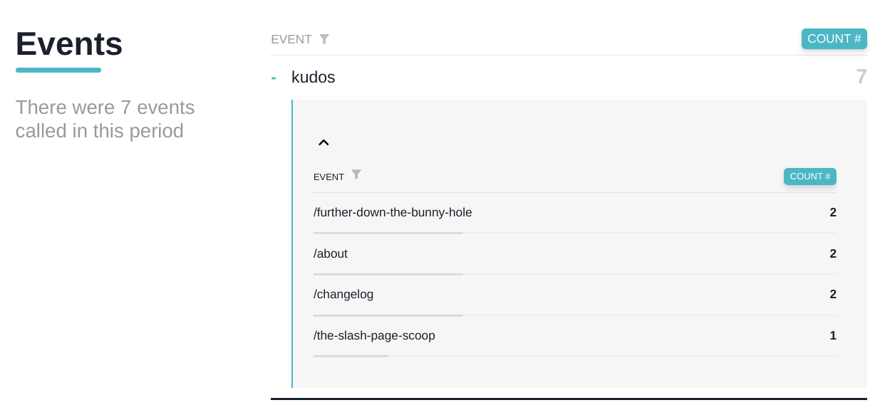

I'm not one to really worry about page view metrics, but I do like to see which of my posts attract the most attention - and where that attention might be coming from. That insight has allowed me to find new blogs and sites that have linked to mine, and has tipped me off that maybe I should update that four-year-old post that's suddenly getting renewed traffic from Reddit.

In my quest for such knowledge, last week I switched my various web properties back to using [Cabin](https://withcabin.com/) for "privacy-first, carbon conscious web analytics". I really like how lightweight and deliberately minimal Cabin is, and the portal does a great job of presenting the information that I care about. With this change, though, I gave up the cute little upvote widgets provided by the previous analytics platform.

I recently shared [on my Bear weblog](https://srsbsns.lol/tracking-bear-upvotes-from-my-cabin/) about how I was hijacking Bear's built-in upvote button to send a "kudos" [event](https://docs.withcabin.com/events.html) to Cabin and tally those actions there.

Well today I implemented a similar thing on *this* blog. Without an existing widget to hijack, I needed to create this one from scratch using a combination of HTML in my page template, CSS to style it, and JavaScript to fire the event.

### Layout

My [Hugo](https://gohugo.io/) setup uses `layouts/_default/single.html` to control how each post is rendered, and I've already got a section at the bottom which displays the "Reply by email" link if replies are permitted on that page:


```html
# torchlight! {"lineNumbers":true}
    <div class="content__body"> <!-- [tl! reindex(33))] -->
        {{ .Content }}
    </div>
    {{- $reply := true }}
    {{- if eq .Site.Params.reply false }}
      {{- $reply = false }}
    {{- else if eq .Params.reply false }}
      {{- $reply = false }}
    {{- end }}
    {{- if eq $reply true }}
    <hr>
    <span class="post_email_reply"><a href="mailto:replies@example.com?Subject=Re: {{ .Title }}">📧 Reply by email</a></span>
    {{- end }}
```

I'll only want the upvote widget to appear on pages where replies are permitted so this makes a logical place to insert the new code:

```html
# torchlight! {"lineNumbers":true}
    <div class="content__body"> <!-- [tl! reindex(33)] -->
        {{ .Content }}
    </div>
    {{- $reply := true }}
    {{- if eq .Site.Params.reply false }}
      {{- $reply = false }}
    {{- else if eq .Params.reply false }}
      {{- $reply = false }}
    {{- end }}
    {{- if eq $reply true }}
    <hr>
    <div class="kudos-container"> <!-- [tl! ++:5 **:5] -->
      <button class="kudos-button">
        <span class="emoji">👍</span>
      </button>
      <span class="kudos-text">Enjoyed this?</span>
    </div>
    <span class="post_email_reply"><a href="mailto:replies@example.com?Subject=Re: {{ .Title }}">📧 Reply by email</a></span>
    {{- end }}
```

The button won't actually do anything yet, but it'll at least appear on the page. I can use some CSS to make it look a bit nicer though.

### CSS

My theme uses `static/css/custom.css` to override the defaults, so I'll drop some styling bits at the bottom of that file:

```css
# torchlight! {"lineNumbers":true}
/* Cabin kudos styling [tl! reindex(406)] */
.kudos-container {
  display: flex;
  align-items: center;
}

.kudos-button {
  background: none;
  border: none;
  cursor: pointer;
  font-size: 1.2rem;
  padding: 0;
  margin-right: 0.25rem;
}

.kudos-button:disabled {
  cursor: default;
}

.kudos-button .emoji {
  display: inline-block;
  transition: transform 0.3s ease;
}

.kudos-button.clicked .emoji {
  transform: rotate(360deg);
}

.kudos-text {
  transition: font-style 0.3s ease;
}

.kudos-text.thanks {
  font-style: italic;
}
```

I got carried away a little bit and decided to add a fun animation when the button gets clicked. Which brings me to what happens when this thing gets clicked.

### JavaScript

I want the button to do a little bit more than *just* send the event to Cabin so I decided to break that out into a separate script, `assets/js/kudos.js`. This script will latch on to the kudos-related elements, and when the button gets clicked it will (1) fire off the `cabin.event('kudos')` function to record the event, (2) disable the button to discourage repeated clicks, (3) change the displayed text to `Thanks!`, and (4) celebrate the event by spinning the emoji and replacing it with a party popper.

```javascript
// torchlight! {"lineNumbers":true}
// manipulates the post upvote "kudos" button behavior

window.onload = function() {
  // get the button and text elements
  const kudosButton = document.querySelector('.kudos-button');
  const kudosText = document.querySelector('.kudos-text');
  const emojiSpan = kudosButton.querySelector('.emoji');

  kudosButton.addEventListener('click', function(event) {
    // send the event to Cabin
    cabin.event('kudos')
    // disable the button
    kudosButton.disabled = true;
    kudosButton.classList.add('clicked');
    // change the displayed text
    kudosText.textContent = 'Thanks!';
    kudosText.classList.add('thanks');
    // spin the emoji
    emojiSpan.style.transform = 'rotate(360deg)';
    // change the emoji to celebrate
    setTimeout(function() {
      emojiSpan.textContent = '🎉';
    }, 150);  // half of the css transition time for a smooth mid-rotation change
  });
}
```

The last step is to go back to my `single.html` layout and pull in this new JavaScript file. I placed it in the site's `assets/` folder so that Hugo can apply its minifying magic so I'll need to load it in as a page resource:

```html
# torchlight! {"lineNumbers":true}
    <div class="content__body"> <!-- [tl! reindex(33)] -->
        {{ .Content }}
    </div>
    {{- $reply := true }} <!-- [tl! collapse:6] -->
    {{- if eq .Site.Params.reply false }}
      {{- $reply = false }}
    {{- else if eq .Params.reply false }}
      {{- $reply = false }}
    {{- end }}
    {{- if eq $reply true }}
    <hr>
    <div class="kudos-container">
      <button class="kudos-button">
        <span class="emoji">👍</span>
      </button>
      <span class="kudos-text">Enjoyed this?</span>
    </div>
    {{ $kudos := resources.Get "js/kudos.js" | minify }} <!-- [tl! ++:1 **:1] -->
    <script src="{{ $kudos.RelPermalink }}"></script>
    <span class="post_email_reply"><a href="mailto:replies@example.com?Subject=Re: {{ .Title }}">📧 Reply by email</a></span>
    {{- end }}
```

You might have noticed that I'm not doing anything to display the upvote count on the page itself. I don't feel like the reader really needs to know how (un)popular a post may be before deciding to vote it up; the total count isn't really relevant. (Also, the Cabin stats don't update in realtime and I just didn't want to deal with that... but mostly that first bit.)

In any case, after clicking the 👍 button on a few pages I can see the `kudos` events recorded in my [Cabin portal](https://l.runtimeterror.dev/rterror-stats):


Go on, try it out: