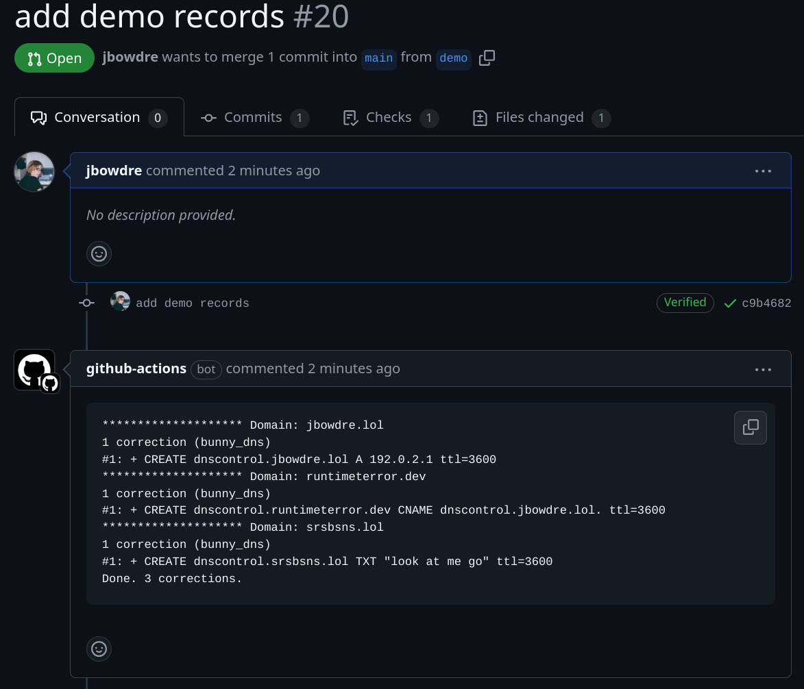
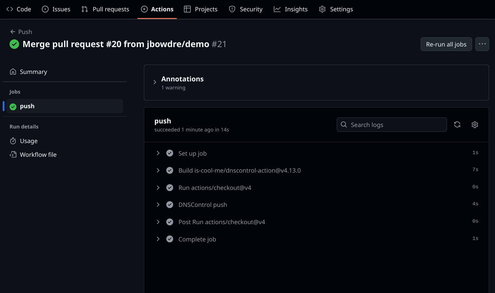
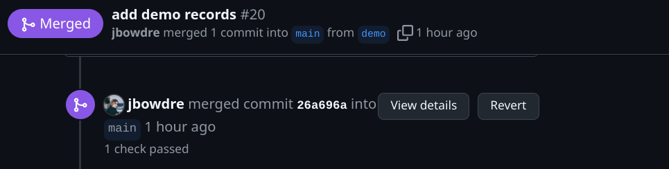
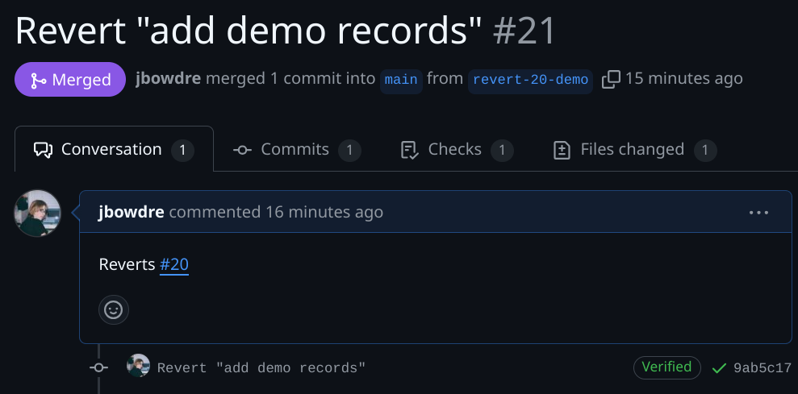

I have too many domains, and trying to keep track of all of the individual records across multiple registrars DNS providers can be a real chore. Fortunately, I saw Robb's [posts](https://rknight.me/blog/setting-up-dnscontrol/) [about](https://rknight.me/blog/moving-my-dns-records-with-dnscontrol/) using [DNSControl](https://dnscontrol.org/) to take some of the pain out of managing his DNS records. It looked like a very useful tool so I [gave it a spin](https://srsbsns.lol/this-week-2024-10-27/#:~:text=Speaking%20of%20migrating%20things) and came away quite impressed.

Running a script to manage my DNS records is pretty cool - but it would be even cooler to *not* have to run the script myself. Applying a GitOps approach to my DNS management would enable just such an automation, while also adding in some safety/sanity checks, recording a history of changes, and providing the ability to undo a change by just reverting the relevant commit.

This post will start with a quick overview of how I set up DNSControl for local execution, and then we'll get into the GitHub Actions workflows I use for doing the heavy lifting.

### Initial setup
The DNSControl docs do a good job of [guiding through the setup](https://docs.dnscontrol.org/getting-started/getting-started#id-1.-install-the-software) so I'm not going to rehash the install process in full.

#### Credentials file
A `creds.json` file is used to tell DNSControl how to interact with the various [providers](https://docs.dnscontrol.org/getting-started/providers) that control the DNS records. There are a ton of providers with varying levels of features and support. In my case, I selected the [Porkbun provider](https://docs.dnscontrol.org/provider/porkbun) as my registrar and the [Bunny DNS](https://docs.dnscontrol.org/provider/bunny_dns) provider for the records themselves.

So my `creds.json` file looks like this:
```json
{
  "bunny_dns": {
    "TYPE": "BUNNY_DNS",
    "api_key": "$BUNNY_API_KEY"
  },
  "porkbun": {
    "TYPE": "PORKBUN",
    "api_key": "$PORKBUN_API_KEY",
    "secret_key": "$PORKBUN_SECRET_KEY"
  },
  "none": { "TYPE": "NONE" }
}
```

I'm storing the sensitive credentials themselves in a separate `.env` file:

```shell
export PORKBUN_API_KEY=my-api-key
export PORKBUN_SECRET_KEY=my-secret-key
```

and so on. Setting up this way will allow Future John to commit/push the required `creds.json` file without actually exposing my credentials.

#### Capturing existing records
Now that I've got creds in place, I can use the handy-dandy [`get-zones` utility](https://docs.dnscontrol.org/commands/get-zones) to fetch all the records in a given zone. This will make it a *lot* easier to start using DNSControl for managing my DNS without having to recreate all the records from scratch.

The syntax for the command is
```shell
dnscontrol get-zones [options] <credkey> <zone>
```

where
- `<credkey>` is the key of the provider configuration in `creds.json` (like `bunny_dns`),
- `<provider>` is the provider name *or* a literal `-` to pull that from the creds file, and
- `<zone>` is the zone (domain name) to retrieve.

There are a few options that can be used but the most important (for this use case, at least) is probably the `--format` format to choose how the output should be structured; `--format=djs` will match the syntax of DNSControl's configuration file so that's a good choice for bulk-importing records.

So retrieving the records for the domain you're (probably) looking at right now might look a bit like this:

```shell
dnscontrol get-zones --format=djs bunny_dns - runtimeterror.dev # [tl! .cmd]
var DSP_BUNNY_DNS = NewDnsProvider("bunny_dns"); # [tl! .nocopy:start]
var REG_CHANGEME = NewRegistrar("none");

D("runtimeterror.dev", REG_CHANGEME
    , DnsProvider(DSP_BUNNY_DNS)
    , DefaultTTL(3600)
    //, NAMESERVER("kiki.bunny.net.")
    //, NAMESERVER("coco.bunny.net.")
    , A("bearlytics", "155.138.198.183")
    , A("gist", "155.138.198.183")
    , A("notes", "155.138.198.183")
    , A("status", "155.138.198.183")
    // NOTE: CNAME at apex may require manual editing.
    , CNAME("@", "rt-site.b-cdn.net.")
    , CNAME("cdn", "runtimeterror-pull.b-cdn.net.")
    , CNAME("www", "runtimeterror.dev.")
) # [tl! .nocopy:end]
```

This will still need some minor adjustments before it's ready for use, but it makes a great starting point. So I just copied that output into a new file called `dnsconfig.js` and made a few tweaks:

1. Adjust the `var` declarations at the top to match the providers in `creds.json`.
2. Use `REG_NONE` as the registrar provider on all records; no reason to ping the registrar on each run unless/until I need to change the nameservers.
3. For that reason I'll also leave the `NAMESERVER()` lines commented out.
4. Use a duration string (`1h`) in place of the 3600-second TTL.
5. Use an [`ALIAS` record](https://docs.dnscontrol.org/language-reference/domain-modifiers/alias) in place of the `CNAME` at the zone apex (`@`) (after consulting the [providers chart](https://docs.dnscontrol.org/getting-started/providers)to confirm that `ALIAS` is supported with Bunny DNS).

So my `dnsconfig.js` looks like this:

```js
// torchlight! {"lineNumbers":true}
// dnsconfig.js: dnscontrol configuration

// Providers:
var DSP_BUNNY_DNS = NewDnsProvider("bunny_dns"); // [tl! ~~:2]
var REG_PORKBUN = NewRegistrar("porkbun");
var REG_NONE = NewRegistrar("none");

// Domains:
D("runtimeterror.dev", REG_NONE // [tl! ~~]
  , DnsProvider(DSP_BUNNY_DNS)
  , DefaultTTL("1h") // [tl! ~~]
  // , NAMESERVER("kiki.bunny.net.")
  // , NAMESERVER("coco.bunny.net.")
  , A("bearlytics", "155.138.198.183")
  , A("gist", "155.138.198.183")
  , A("notes", "155.138.198.183")
  , A("status", "155.138.198.183")
  , ALIAS("@", "rt-site.b-cdn.net.") // [tl! ~~]
  , CNAME("cdn", "runtimeterror-pull.b-cdn.net.")
  , CNAME("res", "srsbsns-web.b-cdn.net.")
  , CNAME("www", "runtimeterror.dev.")
)
```

At this point, I can circle back and run `dnscontrol get-zones` again for another domain, add (and tweak) that output to my `dnsconfig.js` file, and repeat until all my domains are accounted for:

```js
// torchlight! {"lineNumbers":true}
// dnsconfig.js: dnscontrol configuration file [tl! collapse:6]

// Providers:
var DSP_BUNNY_DNS = NewDnsProvider("bunny_dns");
var DSP_PORKBUN = NewDnsProvider("porkbun");
var REG_PORKBUN = NewRegistrar("porkbun");
var REG_NONE = NewRegistrar("none");

// Domains:
D("jbowdre.lol", REG_NONE
  , DnsProvider(DSP_BUNNY_DNS)
  , DefaultTTL("1h")
  // , NAMESERVER("kiki.bunny.net.")
  // , NAMESERVER("coco.bunny.net.")
  , A("bearlytics", "155.138.198.183")
  , ALIAS("@", "hosted.omg.lol.")
  , CNAME("cdn", "cdn-jbowdrelol.b-cdn.net.")
  , CNAME("chillfeed", "jbowdre.github.io.")
  , CNAME("now", "hosted.omg.lol.")
  , CNAME("paste", "hosted.omg.lol.")
  , CNAME("res", "srsbsns-web.b-cdn.net.")
  , CNAME("status", "hosted.omg.lol.")
  , CNAME("url", "hosted.omg.lol.")
)

D("runtimeterror.dev", REG_NONE
  , DnsProvider(DSP_BUNNY_DNS)
  , DefaultTTL("1h")
  // , NAMESERVER("kiki.bunny.net.")
  // , NAMESERVER("coco.bunny.net.")
  , A("bearlytics", "155.138.198.183")
  , A("gist", "155.138.198.183")
  , A("notes", "155.138.198.183")
  , A("status", "155.138.198.183")
  , ALIAS("@", "rt-site.b-cdn.net.")
  , CNAME("cdn", "runtimeterror-pull.b-cdn.net.")
  , CNAME("res", "srsbsns-web.b-cdn.net.")
  , CNAME("www", "runtimeterror.dev.")
)

D("srsbsns.lol", REG_NONE
  , DnsProvider(DSP_BUNNY_DNS)
  , DefaultTTL("1h")
  // , NAMESERVER("kiki.bunny.net.")
  // , NAMESERVER("coco.bunny.net.")
  , A("bearlytics", "155.138.198.183")
  , A("goto", "155.138.198.183")
  , A("status", "155.138.198.183")
  , ALIAS("@", "domain-proxy.bearblog.dev.")
  , CNAME("cabin", "custom.withcabin.com.")
  , CNAME("cdn", "cdn-srsbsns.b-cdn.net.")
  , CNAME("fe-bounces", "forwardemail.net.")
  , CNAME("res", "srsbsns-web.b-cdn.net.")
  , CNAME("www", "domain-proxy.bearblog.dev.")
)
```

#### Previewing changes
Now that my config is in order I can use the `dnscontrol preview` command to *preview* any changes. This is useful both to confirm that my local config matches what's in production as well as to validate any changes.

```shell
dnscontrol preview # [tl! .cmd]
******************** Domain: jbowdre.lol # [tl! .nocopy:3]
******************** Domain: runtimeterror.dev
******************** Domain: srsbsns.lol
Done. 0 corrections.
```

So in this case everything seems to match up. Let's make a few changes and see what `preview` reports:

```js
// torchlight! {"lineNumbers":true}
// dnsconfig.js: dnscontrol configuration file [tl! collapse:6]

// Providers:
var DSP_BUNNY_DNS = NewDnsProvider("bunny_dns");
var DSP_PORKBUN = NewDnsProvider("porkbun");
var REG_PORKBUN = NewRegistrar("porkbun");
var REG_NONE = NewRegistrar("none");

// Domains:
D("jbowdre.lol", REG_NONE
  , DnsProvider(DSP_BUNNY_DNS)
  , DefaultTTL("1h")
  // , NAMESERVER("kiki.bunny.net.")
  // , NAMESERVER("coco.bunny.net.")
  , A("bearlytics", "155.138.198.183")
  , A("dnscontrol", "192.0.2.1") // [tl! ++]
  , ALIAS("@", "hosted.omg.lol.")
  , CNAME("cdn", "cdn-jbowdrelol.b-cdn.net.")
  , CNAME("chillfeed", "jbowdre.github.io.")
  , CNAME("now", "hosted.omg.lol.")
  , CNAME("paste", "hosted.omg.lol.")
  , CNAME("res", "srsbsns-web.b-cdn.net.")
  , CNAME("status", "hosted.omg.lol.")
  , CNAME("url", "hosted.omg.lol.")
)

D("runtimeterror.dev", REG_NONE
  , DnsProvider(DSP_BUNNY_DNS)
  , DefaultTTL("1h")
  // , NAMESERVER("kiki.bunny.net.")
  // , NAMESERVER("coco.bunny.net.")
  , A("bearlytics", "155.138.198.183")
  , A("gist", "155.138.198.183")
  , A("notes", "155.138.198.183")
  , A("status", "155.138.198.183")
  , ALIAS("@", "rt-site.b-cdn.net.")
  , CNAME("cdn", "runtimeterror-pull.b-cdn.net.")
  , CNAME("dnscontrol", "dnscontrol.jbowdre.lol.") // [tl! ++]
  , CNAME("res", "srsbsns-web.b-cdn.net.")
  , CNAME("www", "runtimeterror.dev.")
)

D("srsbsns.lol", REG_NONE
  , DnsProvider(DSP_BUNNY_DNS)
  , DefaultTTL("1h")
  // , NAMESERVER("kiki.bunny.net.")
  // , NAMESERVER("coco.bunny.net.")
  , A("bearlytics", "155.138.198.183")
  , A("goto", "155.138.198.183")
  , A("status", "155.138.198.183")
  , ALIAS("@", "domain-proxy.bearblog.dev.")
  , CNAME("cabin", "custom.withcabin.com.")
  , CNAME("cdn", "cdn-srsbsns.b-cdn.net.")
  , CNAME("fe-bounces", "forwardemail.net.")
  , CNAME("res", "srsbsns-web.b-cdn.net.")
  , CNAME("www", "domain-proxy.bearblog.dev.")
  , TXT("dnscontrol", "look at me go") // [tl! ++]
)
```

```shell
dnscontrol preview # [tl! .cmd]
******************** Domain: jbowdre.lol # [tl! .nocopy:10]
1 correction (bunny_dns)
#1: + CREATE dnscontrol.jbowdre.lol A 192.0.2.1 ttl=3600
******************** Domain: runtimeterror.dev
1 correction (bunny_dns)
#1: + CREATE dnscontrol.runtimeterror.dev CNAME dnscontrol.jbowdre.lol. ttl=3600
******************** Domain: srsbsns.lol
1 correction (bunny_dns)
#1: + CREATE dnscontrol.srsbsns.lol TXT "look at me go" ttl=3600
Done. 3 corrections.
```

As expected, it picked up the three records I added.

#### Executing changes
All I need to do to actually *push* these changes is alter the command from `dnscontrol preview` to `dnscontrol push`:

```shell
dnscontrol push # [tl! .cmd]
******************** Domain: jbowdre.lol # [tl! .nocopy:13]
1 correction (bunny_dns)
#1: + CREATE dnscontrol.jbowdre.lol A 192.0.2.1 ttl=3600
SUCCESS!
******************** Domain: runtimeterror.dev
1 correction (bunny_dns)
#1: + CREATE dnscontrol.runtimeterror.dev CNAME dnscontrol.jbowdre.lol. ttl=3600
SUCCESS!
******************** Domain: srsbsns.lol
1 correction (bunny_dns)
#1: + CREATE dnscontrol.srsbsns.lol TXT "look at me go" ttl=3600
SUCCESS!
Done. 3 corrections.
```

Bunny [really hops](https://srsbsns.lol/i-just-hopped-to-bunnynet/) so those changes are live pretty much instantaneously:

```shell
dig +short dnscontrol.jbowdre.lol A # [tl! .cmd]
192.0.2.1 # [tl! .nocopy]
dig +short dnscontrol.runtimeterror.dev CNAME # [tl! .cmd]
dnscontrol.jbowdre.lol. # [tl! .nocopy]
dig +short dnscontrol.srsbsns.lol TXT
"look at me go" # [tl! .nocopy]
```

If I decide that I don't actually want those records, I can just remove them from `dnscontrol.js` and re-rerun the `push` command:

```shell
dnscontrol push # [!tl .cmd]
******************** Domain: jbowdre.lol # [tl! .nocopy:13]
1 correction (bunny_dns)
#1: - DELETE dnscontrol.jbowdre.lol A 192.0.2.1 ttl=3600
SUCCESS!
******************** Domain: runtimeterror.dev
1 correction (bunny_dns)
#1: - DELETE dnscontrol.runtimeterror.dev CNAME dnscontrol.jbowdre.lol. ttl=3600
SUCCESS!
******************** Domain: srsbsns.lol
1 correction (bunny_dns)
#1: - DELETE dnscontrol.srsbsns.lol TXT "look at me go" ttl=3600
SUCCESS!
Done. 3 corrections.
```

### GitHub Actions workflows
Alright, now for the fun part: setting up a GitHub Actions workflow to do the work for me. I'm going to use a **private** GitHub repository for this since I don't necessarily want everyone to know about all of the domains I own.

#### Repository structure
In that repo, I'll add the `dnsconfig.js` and `creds.json` files I've been working with so far (remember: `creds.json` references environment variables which store the credentials rather than storing the credentials directly). I also include a `.gitignore` which tells *git* to *ignore* the `.env` file which actually stores the creds so they won't be accidentally committed to GitHub. Those credentials will instead be stored as [repository secrets](https://docs.github.com/en/actions/security-for-github-actions/security-guides/using-secrets-in-github-actions) to make them available to the workflows.

The layout looks something like this:

```
.
├── .env
├── .github
│   └── workflows
│       ├── preview.yaml
│       └── push.yaml
├── .gitignore
├── creds.json
└── dnsconfig.js

```

As you can see, the repo will also hold a pair of workflows: `preview.yaml` and `push.yaml`.


#### Preview workflow
The preview workflow gets triggered by a pull request. It uses [dnscontrol-action](https://github.com/is-cool-me/dnscontrol-action) to validate the syntax of the configuration and perform a preview run, and leverages [comment-on-pr](https://github.com/unsplash/comment-on-pr) to add a *comment on the PR* to indicate which record(s) will be impacted.

```yaml
# torchlight! {"lineNumbers": "true"}
name: Check and Preview

on: # execute on pull request event
  pull_request:

# permissions needed to write a comment to the PR
permissions:
  contents: read
  issues: write
  pull-requests: write

jobs:
  preview:
    runs-on: ubuntu-latest
    steps:
      # check out the repo
      - uses: actions/checkout@v4

      # validate dnscontrol.js syntax
      - name: DNSControl check
        uses: is-cool-me/dnscontrol-action@v4.13.0
        with:
          args: check

      # execute preview run
      - name: DNSControl preview
        uses: is-cool-me/dnscontrol-action@v4.13.0
        id: dnscontrol_preview
        env:
          BUNNY_API_KEY: ${{ secrets.BUNNY_API_KEY }}
          PORKBUN_API_KEY: ${{ secrets.PORKBUN_API_KEY }}
          PORKBUN_SECRET_KEY: ${{ secrets.PORKBUN_SECRET_KEY }}
          # disable terminal color codes in the output to keep comments clean
          NO_COLOR: true
        with:
          args: preview

      # insert preview output as PR comment
      - name: Preview pull request comment
        uses: unsplash/comment-on-pr@v1.3.0
        env:
          GITHUB_TOKEN: ${{ secrets.GITHUB_TOKEN }}
        with:
          # fences should be ``` (no spaces) but escaping that is hard
          # use your imagination please
          msg: |
            ` ` `
            ${{ steps.dnscontrol_preview.outputs.preview_comment }}
            ` ` `
          check_for_duplicate_msg: true
```

#### Push workflow
The push workflow *pushes* the changes to the DNS provider(s), and will be executed after I've reviewed the preview results and decided to complete the merge.


```yaml
name: Push

on:
  push:
    branches:
      - main

jobs:
  push:
    runs-on: ubuntu-latest
    steps:
      - uses: actions/checkout@v4

      - name: DNSControl push
        uses: is-cool-me/dnscontrol-action@v4.13.0
        env:
          BUNNY_API_KEY: ${{ secrets.BUNNY_API_KEY }}
          PORKBUN_API_KEY: ${{ secrets.PORKBUN_API_KEY }}
          PORKBUN_SECRET_KEY: ${{ secrets.PORKBUN_SECRET_KEY }}
        with:
          args: push
```

#### Usage
Now that the workflows are in place, let's see how I use them to manage my DNS records.

I start by making sure my local repo is up to date, and then creating a new branch to work on:

```shell
git switch main # [tl! .cmd:2]
git pull
git switch -c demo
```

And I'll update `dnscontrol.js` to create the same records I was playing with earlier:

```js
// torchlight! {"lineNumbers":true}
// dnsconfig.js: dnscontrol configuration file [tl! collapse:6]

// Providers:
var DSP_BUNNY_DNS = NewDnsProvider("bunny_dns");
var DSP_PORKBUN = NewDnsProvider("porkbun");
var REG_PORKBUN = NewRegistrar("porkbun");
var REG_NONE = NewRegistrar("none");

// Domains:
D("jbowdre.lol", REG_NONE
  , DnsProvider(DSP_BUNNY_DNS)
  , DefaultTTL("1h")
  // , NAMESERVER("kiki.bunny.net.")
  // , NAMESERVER("coco.bunny.net.")
  , A("bearlytics", "155.138.198.183")
  , A("dnscontrol", "192.0.2.1") // [tl! ++]
  , ALIAS("@", "hosted.omg.lol.")
  , CNAME("cdn", "cdn-jbowdrelol.b-cdn.net.") // [tl! collapse:6]
  , CNAME("chillfeed", "jbowdre.github.io.")
  , CNAME("now", "hosted.omg.lol.")
  , CNAME("paste", "hosted.omg.lol.")
  , CNAME("res", "srsbsns-web.b-cdn.net.")
  , CNAME("status", "hosted.omg.lol.")
  , CNAME("url", "hosted.omg.lol.")
)

D("runtimeterror.dev", REG_NONE
  , DnsProvider(DSP_BUNNY_DNS)
  , DefaultTTL("1h")
  // , NAMESERVER("kiki.bunny.net.")
  // , NAMESERVER("coco.bunny.net.")
  , A("bearlytics", "155.138.198.183") // [tl! collapse:4]
  , A("gist", "155.138.198.183")
  , A("notes", "155.138.198.183")
  , A("status", "155.138.198.183")
  , ALIAS("@", "rt-site.b-cdn.net.")
  , CNAME("cdn", "runtimeterror-pull.b-cdn.net.")
  , CNAME("dnscontrol", "dnscontrol.jbowdre.lol.") // [tl! ++]
  , CNAME("res", "srsbsns-web.b-cdn.net.")
  , CNAME("www", "runtimeterror.dev.")
)

D("srsbsns.lol", REG_NONE
  , DnsProvider(DSP_BUNNY_DNS)
  , DefaultTTL("1h")
  // , NAMESERVER("kiki.bunny.net.")
  // , NAMESERVER("coco.bunny.net.")
  , A("bearlytics", "155.138.198.183") // [tl! collapse:8]
  , A("goto", "155.138.198.183")
  , A("status", "155.138.198.183")
  , ALIAS("@", "domain-proxy.bearblog.dev.")
  , CNAME("cabin", "custom.withcabin.com.")
  , CNAME("cdn", "cdn-srsbsns.b-cdn.net.")
  , CNAME("fe-bounces", "forwardemail.net.")
  , CNAME("res", "srsbsns-web.b-cdn.net.")
  , CNAME("www", "domain-proxy.bearblog.dev.")
  , TXT("dnscontrol", "look at me go") // [tl! ++]
)
```

I save the file, stage it, and then commit it:

```shell
git add dnscontrol.js # [tl! .cmd:1]
git commit -S -m "add demo records"
```

And then I push my new local branch to a new branch on the remote:

```shell
git push origin demo # [tl! .cmd]
```

Now it's time to jump out of the terminal and go check out my (private) repo on GitHub, where I get a big friendly banner about how the `demo` branch just had a recent push and would I like to **Compare & pull request**.


I click the big green button to start the pull request, and review the changes on the next screen to make sure there aren't any surprises. Satisfied, I click the next big green **Create pull request** button.

That triggers the preview workflow, and after a few moments a comment gets added to the PR thread describing the expected changes:



Those are exactly the changes I intended to make so I can click the green **Merge pull request** button at the bottom of the page to accept the change - and trigger the `push` workflow to execute. I click over to the **Actions** tab to make sure the run is successful:



And I can also check from my trusty terminal:

```shell
dig +short dnscontrol.srsbsns.lol TXT # [tl! .cmd]
"look at me go" # [tl! .nocopy]
dig +short dnscontrol.runtimeterror.dev CNAME # [tl! .cmd]
dnscontrol.jbowdre.lol. # [tl! .nocopy]
dig +short dnscontrol.jbowdre.lol A # [tl! .cmd]
192.0.2.1 # [tl! .nocopy]
```

### So what?
I'll be honest: I probably could have logged into Bunny's web interface and created those records the old-fashioned click-ops way quicker than doing the whole *edit file -> stage file -> commit file -> git push -> create pull request -> merge pull request* dance. So why bother?

DNS is a pretty critical piece of any environment, and it can be kind of easy to screw up with a careless typo or a click in the wrong place. I've definitely lost my place a time or two when working on an information-dense UI and edited (or worse, deleted) the row above or below the one I was trying to change. This is an even bigger risk when working with multiple providers with their own similar-but-different interfaces and layouts.

A methodical text-based approach like DNSControl makes careless mistakes less likely, and it provides a standard approach which works the same regardless of what providers are being used. One of my first big wins with DNSControl was using it to migrate three complete zones (domains) from one provider to another. Rather than needing to manually pre-stage all of the existing records (10-15 records including `A`, `CNAME`, `TXT`, and `MX` for *each domain*) in the new provider and then update the name server configuration with the registrar, all I had to do was adjust the `DnsProvider()` line for each zone. DNSControl took care of creating all the records and swapping the name server configuration. The entire migration was done in under a minute. (And, thanks to Past John using DNSControl to update the TTLs on all the records the day before the migration, the changes were actually live in under five minutes. That Past John guy can be pretty smart, sometimes.)

Adding the GitOps approach to the mix provides additional sanity checks through PR reviews. Even with an organization of one, being ~~forced~~ asked to *look at what you've done* before the changes get applied can provide a valuable opportunity to catch mistakes. This approach also creates a historical record of changes, making it easy to see what changed (and when). It also allows for painless roll-backs in case of trouble... or if you just created a couple of demo records for a blog post and don't need them anymore.





