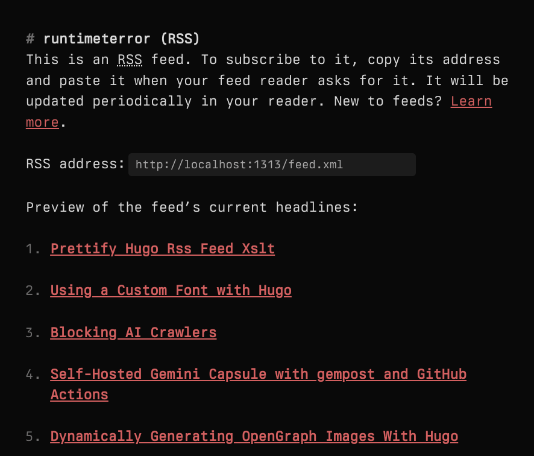

I put in some work several months back making my sure my site's RSS would work well in a feed reader. This meant making a *lot* of modifications to the [default Hugo RSS template](https://github.com/gohugoio/hugo/blob/master/tpl/tplimpl/embedded/templates/_default/rss.xml). I made it load the full article text rather than just the summary, present correctly-formatted code blocks with no loss of important whitespace, include inline images, and even pass online validation checks:

[](http://validator.w3.org/feed/check.cgi?url=https%3A//runtimeterror.dev/feed.xml)

But while the feed looks great when rendered by a reader, the browser presentation left some to be desired...


It feels like there should be a friendlier way to present a feed "landing page" to help users new to RSS figure out what they need to do in order to follow a blog - and there absolutely is. In much the same way that you can prettify plain HTML with the inclusion of a CSS stylesheet, you can also style boring XML using [eXtensible Stylesheet Language Transformations (XSLT)](https://www.w3schools.com/xml/xsl_intro.asp).

This post will quickly cover how I used XSLT to style my blog's RSS feed and made it look like this:


### Starting Point
The [RSS Templates](https://gohugo.io/templates/rss/) page from the Hugo documentation site provides some basic information about how to generate (and customize) an RSS feed for a Hugo-powered site. The basic steps are to [enable the RSS output in `hugo.toml`](https://github.com/jbowdre/runtimeterror/blob/871be9794234177c1bfa0b1c470873bde8f046be/config/_default/hugo.toml#L19-L30), include a link to the generated feed inside the `<head>` element of the site template (I added it to [`layouts/partials/head.html`](https://github.com/jbowdre/runtimeterror/blob/871be9794234177c1bfa0b1c470873bde8f046be/layouts/partials/head.html#L8-L11)), and (optionally) include a customized RSS template to influence how the output gets rendered.

Here's the content of my `layouts/_default/rss.xml`, before adding the XSLT styling:

```xml
# torchlight! {"lineNumbers": true}
{{- $pctx := . -}}
{{- if .IsHome -}}{{ $pctx = .Site }}{{- end -}}
{{- $pages := slice -}}
{{- if or $.IsHome $.IsSection -}}
{{- $pages = (where $pctx.RegularPages "Type" "in" site.Params.mainSections) -}}
{{- else -}}
{{- $pages = (where $pctx.Pages "Type" "in" site.Params.mainSections) -}}
{{- end -}}
{{- $limit := .Site.Config.Services.RSS.Limit -}}
{{- if ge $limit 1 -}}
{{- $pages = $pages | first $limit -}}
{{- end -}}
{{- printf "<?xml version=\"1.0\" encoding=\"utf-8\" standalone=\"yes\"?>" | safeHTML }}
<rss version="2.0"
  xmlns:atom="http://www.w3.org/2005/Atom"
  xmlns:content="http://purl.org/rss/1.0/modules/content/"
  xmlns:dc="http://purl.org/dc/elements/1.1/">
  <channel>
    <title>{{ if eq  .Title  .Site.Title }}{{ .Site.Title }}{{ else }}{{ with .Title }}{{.}} on {{ end }}{{ .Site.Title }}{{ end }}</title>
    <link>{{ .Permalink }}</link>
    <description>Recent content {{ if ne  .Title  .Site.Title }}{{ with .Title }}in {{.}} {{ end }}{{ end }}on {{ .Site.Title }}</description>
    <generator>Hugo -- gohugo.io</generator>{{ with .Site.LanguageCode }}
    <language>{{.}}</language>{{end}}{{ with .Site.Copyright }}
    <copyright>{{.}}</copyright>{{end}}{{ if not .Date.IsZero }}
    <lastBuildDate>{{ .Date.Format "Mon, 02 Jan 2006 15:04:05 -0700" | safeHTML }}</lastBuildDate>{{ end }}
    {{- with .OutputFormats.Get "RSS" -}}
    {{ printf "<atom:link href=%q rel=\"self\" type=%q />" .Permalink .MediaType | safeHTML }}
    {{- end -}}
    <image>
      <url>{{ .Site.Params.fallBackOgImage | absURL }}</url>
      <title>{{ if eq  .Title  .Site.Title }}{{ .Site.Title }}{{ else }}{{ with .Title }}{{.}} on {{ end }}{{ .Site.Title }}{{ end }}</title>
      <link>{{ .Permalink }}</link>
    </image>
    {{ range $pages }}
    <item>
      <title>{{ .Title | plainify }}</title>
      <link>{{ .Permalink }}</link>
      <pubDate>{{ .Date.Format "Mon, 02 Jan 2006 15:04:05 -0700" | safeHTML }}</pubDate>
      {{ with .Site.Params.Author.name }}<dc:creator>{{.}}</dc:creator>{{ end }}
      {{ with .Params.series }}<category>{{ . | lower }}</category>{{ end }}
      {{ range (.GetTerms "tags") }}
      <category>{{ .LinkTitle }}</category>{{ end }}
      <guid>{{ .Permalink }}</guid>
      {{- $content := replaceRE "a href=\"(#.*?)\"" (printf "%s%s%s" "a href=\"" .Permalink "$1\"") .Content -}}
      {{- $content = replaceRE "img src=\"(.*?)\"" (printf "%s%s%s" "img src=\"" .Permalink "$1\"") $content -}}
      {{- $content = replaceRE "<svg.*</svg>" "" $content -}}
      {{- $content = replaceRE `-moz-tab-size:\d;-o-tab-size:\d;tab-size:\d;?` "" $content -}}
      <description>{{ $content | html }}</description>
    </item>
    {{ end }}
  </channel>
</rss>
```

There's a lot going on here, but much of it is conditional logic so that Hugo can use the same template to render feeds for individual tags, categories, or the entire site. It then loops through the `range` of pages of that type to generate the data for each post. It also uses the [Hugo `strings.ReplaceRE` function](https://gohugo.io/functions/strings/replacere/) to replace relative image and anchor links with the full paths so those references will work correctly in readers, and to clean up some potentially-problematic HTML markup that was causing validation failures.

All I really need to do to get this XML ready to be styled is just link in a style sheet, and I'll do that by inserting a `<?xml-stylesheet />` element directly below the top-level `<?xml />` one:

```xml
# torchlight! {"lineNumbers": true, "lineNumbersStart": 10}
{{- if ge $limit 1 -}}
{{- $pages = $pages | first $limit -}}
{{- end -}}
{{- printf "<?xml version=\"1.0\" encoding=\"utf-8\" standalone=\"yes\"?>" | safeHTML }}
{{ printf "<?xml-stylesheet type=\"text/xsl\" href=\"xml/feed.xsl\" media=\"all\"?>" | safeHTML }} <!-- [tl! ++ ] -->
<rss version="2.0"
  xmlns:atom="http://www.w3.org/2005/Atom"
  xmlns:content="http://purl.org/rss/1.0/modules/content/"
  xmlns:dc="http://purl.org/dc/elements/1.1/">
```

I'll put the stylesheet in `static/xml/feed.xsl` so Hugo will make it available at the appropriate path.

### Creating the Style
While trying to figure out how I could dress up my RSS XML, I came across the [default XSL file](https://github.com/getnikola/nikola/blob/master/nikola/data/themes/base/assets/xml/rss.xsl) provided with the [Nikola SSG](https://getnikola.com/), and I thought it looked like a pretty good starting point.

Here's Nikola's default XSL:

```xml
# torchlight! {"lineNumbers": true}
<?xml version="1.0" encoding="UTF-8"?>
<xsl:stylesheet xmlns:xsl="http://www.w3.org/1999/XSL/Transform" xmlns:atom="http://www.w3.org/2005/Atom" xmlns:dc="http://purl.org/dc/elements/1.1/" version="1.0">
<xsl:output method="xml"/>
<xsl:template match="/">
<html xmlns="http://www.w3.org/1999/xhtml" lang="en">
<head>
<meta charset="UTF-8"/>
<meta name="viewport" content="width=device-width"/>
<title><xsl:value-of select="rss/channel/title"/> (RSS)</title>
<style><![CDATA[html{margin:0;padding:0;}body{color:hsl(180,1%,31%);font-family:Helvetica,Arial,sans-serif;font-size:17px;line-height:1.4;margin:5%;max-width:35rem;padding:0;}input{min-width:20rem;margin-left:.2rem;padding-left:.2rem;padding-right:.2rem;}ol{list-style-type:disc;padding-left:1rem;}h2{font-size:22px;font-weight:inherit;}]]></style>
</head>
<body>
<h1><xsl:value-of select="rss/channel/title"/> (RSS)</h1>
<p>This is an <abbr title="Really Simple Syndication">RSS</abbr> feed. To subscribe to it, copy its address and paste it when your feed reader asks for it. It will be updated periodically in your reader. New to feeds? <a href="https://duckduckgo.com/?q=how+to+get+started+with+rss+feeds" title="Search on the web to learn more">Learn more</a>.</p>
<p>
<label for="address">RSS address:</label>
<input><xsl:attribute name="type">url</xsl:attribute><xsl:attribute name="id">address</xsl:attribute><xsl:attribute name="spellcheck">false</xsl:attribute><xsl:attribute name="value"><xsl:value-of select="rss/channel/atom:link[@rel='self']/@href"/></xsl:attribute></input>
</p>
<p>Preview of the feed’s current headlines:</p>
<ol>
<xsl:for-each select="rss/channel/item">
<li><h2><a><xsl:attribute name="href"><xsl:value-of select="link"/></xsl:attribute><xsl:value-of select="title"/></a></h2></li>
</xsl:for-each>
</ol>
</body>
</html>
</xsl:template>
</xsl:stylesheet>
```

If I just plug that in at `static/xml/feed.xml`, I do successfully get a styled (though *very* white) RSS page:


I'd like this to inherit the same styling as the rest of the site so that it looks like it belongs. I can go a long way toward that by bringing in the CSS stylesheets that are used on every page, and I'll also tweak the existing `<style />` element to remove some conflicts with my preferred styling:

```xml
# torchlight! {"lineNumbers": true, "lineNumbersStart": 10}
<title><xsl:value-of select="rss/channel/title"/> (RSS)</title>
<style><![CDATA[html{margin:0;padding:0;}body{color:hsl(180,1%,31%);font-family:Helvetica,Arial,sans-serif;font-size:17px;line-height:1.4;margin:5%;max-width:35rem;padding:0;}input{min-width:20rem;margin-left:.2rem;padding-left:.2rem;padding-right:.2rem;}ol{list-style-type:disc;padding-left:1rem;}h2{font-size:22px;font-weight:inherit;}]]></style><title><xsl:value-of select="rss/channel/title"/> (RSS)</title> <!-- [tl! remove ] -->
<style><![CDATA[html{margin:0;padding:0;}body{color:font-size:1.1rem;line-height:1.4;margin:5%;max-width:35rem;padding:0;}input{min-width:20rem;margin-left:.2rem;padding-left:.2rem;padding-right:.2rem;}h2{font-size:22px;font-weight:inherit;}h2:before{content:"" !important;}]]></style> <!-- [tl! ++:3 reindex(-1) ] -->
<link rel="stylesheet" href="/css/palettes/runtimeterror.css" />
<link rel="stylesheet" href="/css/risotto.css" />
<link rel="stylesheet" href="/css/custom.css" />
</head>
```

While I'm at it, I'll also go on and add in some favicons:

```xml
# torchlight! {"lineNumbers": true, "lineNumbersStart": 10}
<title><xsl:value-of select="rss/channel/title"/> (RSS)</title>
<style><![CDATA[html{margin:0;padding:0;}body{color:font-size:1.1rem;line-height:1.4;margin:5%;max-width:35rem;padding:0;}input{min-width:20rem;margin-left:.2rem;padding-left:.2rem;padding-right:.2rem;}h2{font-size:22px;font-weight:inherit;}h2:before{content:"" !important;}]]></style>
<link rel="apple-touch-icon" sizes="180x180" href="/icons/apple-touch-icon.png" /> <!-- [tl! ++:5] -->
<link rel="icon" type="image/png" sizes="32x32" href="/icons/favicon-32x32.png" />
<link rel="icon" type="image/png" sizes="16x16" href="/icons/favicon-16x16.png" />
<link rel="manifest" href="/icons/site.webmanifest" />
<link rel="mask-icon" href="/icons/safari-pinned-tab.svg" color="#5bbad5" />
<link rel="shortcut icon" href="/icons/favicon.ico" />
<link rel="stylesheet" href="/css/palettes/runtimeterror.css" />
<link rel="stylesheet" href="/css/risotto.css" />
<link rel="stylesheet" href="/css/custom.css" />
```

That's getting there:



Including those CSS styles means that the rendered page now uses my color palette and the [font I worked so hard to integrate](/using-custom-font-hugo/). I'm just going to make a few more tweaks to change some of the formatting, put the `New to feeds?` bit on its own line, and point to my [self-hosted instance of the SearXNG metasearch engine](https://scribbles.jbowdre.lol/post/self-hosting-a-search-engine-iyjdlk6y) instead of DDG.

Here's my final (for now) `static/xml/feed.xsl` file:

```xml
# torchlight! {"lineNumbers": true}
<?xml version="1.0" encoding="UTF-8"?>
<!-- adapted from https://github.com/getnikola/nikola/blob/master/nikola/data/themes/base/assets/xml/rss.xsl -->
<xsl:stylesheet xmlns:xsl="http://www.w3.org/1999/XSL/Transform" xmlns:atom="http://www.w3.org/2005/Atom" xmlns:dc="http://purl.org/dc/elements/1.1/" version="1.0">
<xsl:output method="xml"/>
<xsl:template match="/">
<html xmlns="http://www.w3.org/1999/xhtml" lang="en">
<head>
<meta charset="UTF-8"/>
<meta name="viewport" content="width=device-width"/>
<title><xsl:value-of select="rss/channel/title"/> (RSS)</title>
<style><![CDATA[html{margin:0;padding:0;}body{color:font-size:1.1rem;line-height:1.4;margin:5%;max-width:35rem;padding:0;}input{min-width:20rem;margin-left:.2rem;padding-left:.2rem;padding-right:.2rem;}h2{font-size:22px;font-weight:inherit;}h3:before{content:"" !important;}]]></style>
<link rel="apple-touch-icon" sizes="180x180" href="/icons/apple-touch-icon.png" />
<link rel="icon" type="image/png" sizes="32x32" href="/icons/favicon-32x32.png" />
<link rel="icon" type="image/png" sizes="16x16" href="/icons/favicon-16x16.png" />
<link rel="manifest" href="/icons/site.webmanifest" />
<link rel="mask-icon" href="/icons/safari-pinned-tab.svg" color="#5bbad5" />
<link rel="shortcut icon" href="/icons/favicon.ico" />
<link rel="stylesheet" href="/css/palettes/runtimeterror.css" />
<link rel="stylesheet" href="/css/risotto.css" />
<link rel="stylesheet" href="/css/custom.css" />
</head>
<body>
<h1><xsl:value-of select="rss/channel/title"/> (RSS)</h1>
<p>This is an <abbr title="Really Simple Syndication">RSS</abbr> feed. To subscribe to it, copy its address and paste it when your feed reader asks for it. It will be updated periodically in your reader.</p>
<p>New to feeds? <a href="https://grep.vpota.to/search?q=how+to+get+started+with+rss+feeds" title="Search on the web to learn more">Learn more</a>.</p>
<p>
<label for="address">RSS address:</label>
<input><xsl:attribute name="type">url</xsl:attribute><xsl:attribute name="id">address</xsl:attribute><xsl:attribute name="spellcheck">false</xsl:attribute><xsl:attribute name="value"><xsl:value-of select="rss/channel/atom:link[@rel='self']/@href"/></xsl:attribute></input>
</p>
<p><h2>Recent posts:</h2></p>
<ul>
<xsl:for-each select="rss/channel/item">
<li><h3><a><xsl:attribute name="href"><xsl:value-of select="link"/></xsl:attribute><xsl:value-of select="title"/></a></h3></li>
</xsl:for-each>
</ul>
</body>
</html>
</xsl:template>
</xsl:stylesheet>
```

I'm pretty pleased with [that result](/feed.xml)!