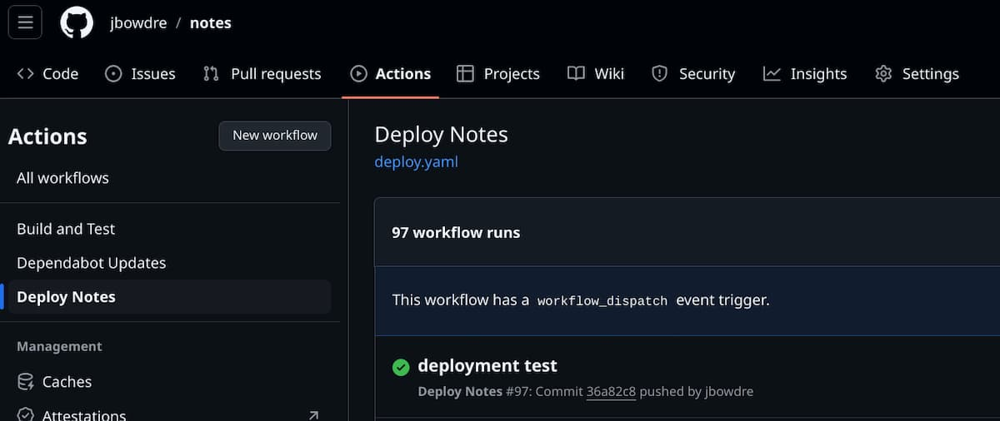
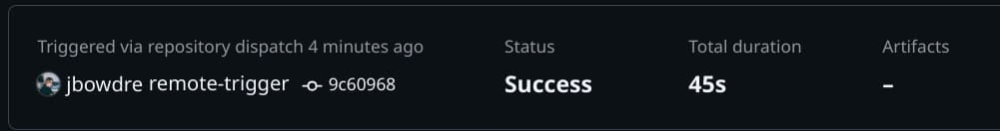

It's been about two months since I [switched](https://srsbsns.lol/is-silverbullet-the-note-keeping-silver-bullet/) my note-keeping efforts from [Obsidian](https://obsidian.md) to [SilverBullet](https://silverbullet.md/), and I've been really enjoying it. SilverBullet is [easy to deploy with Docker](/silverbullet-self-hosted-knowledge-management/), and it's packed with [useful features](https://silverbullet.md/#Features) without becoming slow or otherwise cumbersome. Being able to access and write my notes from any device with a web browser has been super convenient.

But one use case I hadn't yet migrated from Obsidian to SilverBullet was managing the notes I share publicly at [notes.runtimeterror.dev](https://notes.runtimeterror.dev) using [Quartz](https://quartz.jzhao.xyz/), a fancy static site generator optimized for building "digital gardens" from Obsidian vaults. I had been using Quartz with a [public repo](https://github.com/jbowdre/notes/tree/867dde54f8a72d2d04bac140a4c54e64dd0f569b) containing the Quartz code with a dedicated (public) Obsidian vault folder [embedded within](https://github.com/jbowdre/notes/tree/867dde54f8a72d2d04bac140a4c54e64dd0f569b/content).

I played a bit with SilverBullet's [publishing plugin](https://silverbullet.md/Plugs/Pub), which would let me selectively publish notes in certain folders or bearing certain tags, but the HTML it produces is a bit sparse. I didn't want to give up the Quartz niceties like the auto-generated navigation menu and built-in search.

After a little experimentation I settled on an approach that I think works really well for my needs:
- SilverBullet syncs to a private repo via the [Git plug](https://silverbullet.md/Plugs/Git).
- Pushes to that private repo trigger a workflow run in my (public) Quartz repo.
- A workflow in the Quartz repo clones the private SilverBullet repo to `content/`.
- Quartz processes the Markdown files in the `content/` directory and renders HTML for the files with `publish: true` in the front matter as HTML files in `public/`.
- The contents of `public/` are transferred to my server via Tailscale, and then served by Caddy.

This post will describe the entire setup in detail (though not necessarily in that order).

### Plugging in the Git plug
SilverBullet can be extended through the use of [plugs](https://silverbullet.md/Plugs), and installing the [Git plug](https://silverbullet.md/Plugs/Git) should make it easy to sync my SilverBullet content to a private GitHub repo.

But I should probably initialize my space (the SilverBullet equivalent of a vault/notebook/graph) as a git repo first.

Recall from my [setup notes](/silverbullet-self-hosted-knowledge-management/#silverbullet-setup) that I'm mounting a folder named `./space` into my SilverBullet container at `/space`. I'll need to turn that into a git repo so I SSH to my Docker host, move into the folder containing my SilverBullet space, and initialize the repo:

```shell
cd /opt/silverbullet/space # [tl! .cmd:1]
git init .
```

I'll connect this local git repo to a private GitHub repo, but I'll need to use a [Personal Access Token (PAT)](https://docs.github.com/en/authentication/keeping-your-account-and-data-secure/managing-your-personal-access-tokens) for the git interactions since the Git plug running inside the SilverBullet container won't have access to my SSH private key. So I [create a new PAT](https://github.com/settings/personal-access-tokens/new), scope it only to my new private repo (`jbowdre/spaaace`), and grant it the `contents: write` permission there. I can then use the PAT when I set up the remote and push my first commit:

```shell
git remote add origin https://github_pat_[...]@github.com/jbowdre/spaaace.git # [tl! .cmd:3]
git add .
git commit -m "initial commit"
git push --set-upstream origin main
```

This stores the authentication token directly inside the local git configuration (in `/opt/silverbullet/space/.git/config`) so that git operations performed within the container will be automatically authenticated.

Now that my repo is ready, I can go ahead and install and configure the Git plug. I do that by logging into my SilverBullet instance on the web (`https://silverbullet.tailnet-name.ts.net`), pressing `[Ctrl]` + `/` to bring up the command palette, typing/selecting `Plugs: Add`, and pasting in the URI for the Git plug: `github:silverbulletmd/silverbullet-git/git.plug.js`.

The docs say that I can add the following to my `SETTINGS` file to enable automatic syncing:

```yaml
git:
  autoCommitMinutes: 5
  autoSync: true
```

But that doesn't actually seem to work for some reason (at least for me). That's okay, though, because I can easily add a keyboard shortcut (`[Ctrl]` + `[Alt]` + `.`) to quickly sync on-demand:

```yaml
shortcuts:
  - command: "{[Git: Sync]}"
    key: "Ctrl-Alt-."
```

{}
Note that the command target for the shortcut is wrapped with a square bracket wrapped with a curly brace (`{[ ]}`). It won't work if you do a Go-template-style double-curly-braces (`{{ }}`).

*Ask me how I know (and how long it took me to find my mistake!).*
{}

I'll use `[Ctrl]` + `/` to get the command pallette again and run `System: Reload` to activate my change, and then simply pressing `[Ctrl]` + `[Alt]` + `.` will trigger a `git pull` + `git commit` + `git push` (as needed) sequence.

That takes care of getting my SilverBullet content into GitHub. Now let's see how it gets published.

### Setting up Quartz
"Installing" Quartz is pretty straight forward thanks to the instructions on the [Quartz website](https://quartz.jzhao.xyz/). I just ran these commands on my laptop:

```shell
git clone https://github.com/jackyzha0/quartz.git # [tl! .cmd:3]
cd quartz
npm i
npx quartz create
```

By default, Quartz expects my Obsidian content to be in the `content/` directory (and there's a placeholder file there for now). I'll replace that with my `spaaace` repo for testing but also add that path to the `.gitignore` file to ensure I don't accidentally commit my private notes:

```shell
rm -rf content/ # [tl! .cmd:2]
git clone git@github.com:jbowdre/spaaace.git content
echo "content" >> .gitignore
```

From there I can move on to configuring Quartz. The [documentation](https://quartz.jzhao.xyz/configuration) has helpful information on some of the configuration options so I'm just going to highlight the changes that are particularly important to this specific setup.

In the `plugins:` section of `quartz.config.ts`, I enable the  [`ExplicitPublish` filter plugin](https://quartz.jzhao.xyz/plugins/ExplicitPublish) to tell Quartz to only render pages with `publish: true` in the frontmatter:

```ts
  plugins: {
    filters: [
      Plugin.RemoveDrafts(),
      Plugin.ExplicitPublish(), // [tl! ++]
    ],
    [...]
  }
```

That will allow me very granular control over which posts are published (and which remain private), but the [Private Pages](https://quartz.jzhao.xyz/features/private-pages) Quartz documentation page warns that the `ExplicitPublish` plugin only filters out Markdown files. All other files (images, PDFs, plain TXTs) will still be processed and served publicly. I don't intend to include screenshots or other media with these short code-heavy notes so I scroll back up in the `quartz.config.ts` file and add a little regex to the `ignorePatterns` section:

```ts
  configuration: {
    ignorePatterns: [
      "private",
      "templates",
      "**/!(*.md)" // [tl! ++]
    ],
    [...]
  }
```

That will avoid processing any non-Markdown files.

The rest of the Quartz setup follows the documentation, including the steps to [connect my (public) GitHub repository](https://quartz.jzhao.xyz/setting-up-your-GitHub-repository).

Before publishing, I can check my work by generating and serving the Quartz content locally:

```shell
npx quartz build --serve # [tl! .cmd ** .nocopy:1,13]

 Quartz v4.4.0

Cleaned output directory `public` in 29ms
Found 198 input files from `content` in 24ms
Parsed 198 Markdown files in 4s
Filtered out 198 files in 398μs
⠋ Emitting output files
Warning: you seem to be missing an `index.md` home page file at the root of your `content` folder. This may cause errors when deploying. # [tl! ** ~~]
Emitted 8 files to `public` in 44ms
Done processing 0 files in 103ms
Started a Quartz server listening at http://localhost:8080
hint: exit with ctrl+c

```

Oops! Remember how the `ExplicitPublish` plugin will only process notes with `publish: true` set in the frontmatter? Since I just imported the notes from my (public) Obsidian vault into SilverBullet none of them have that attribute set yet. (But hey, this is a great way to test that my filters work!)

Let me run through the notes I want to be public and update them accordingly...


```markdown
---
title: Trigger remote workflow with GitHub Actions
tags: [github]
publish: true # [tl! ++]
---
...
```

And then I'll try again:

```shell
npx quartz build --serve # [tl! .cmd ** .nocopy:1,11]

 Quartz v4.4.0

Cleaned output directory `public` in 6ms
Found 198 input files from `content` in 32ms
Parsed 198 Markdown files in 4s # [tl! **:2]
Filtered out 123 files in 404μs
Emitted 130 files to `public` in 497ms
Done processing 198 files in 4s
Started a Quartz server listening at http://localhost:8080 # [tl! **]
hint: exit with ctrl+c
```

That's more like it!


But serving my notes from my laptop is only *so* useful. Let's keep going and see what it takes to publish them on the World Wide Web!

### Publish publicly
I've previously written about my [GitHub Actions workflow for publishing my Gemini capsule](/gemini-capsule-gempost-github-actions/#publish-github-actions), and I'm going to reuse a lot of the same ideas here. I'll create a workflow that performs the steps needed to render the HTML to the `public/` directory, establishes a [Tailscale](https://tailscale.com/) tunnel to my server, and transfers the rendered content there. Those static files will then be served with [Caddy](https://caddyserver.com/), taking advantage of its automatic HTTPS abilities.

#### Server prep
The setup on the server is pretty simple. I just create a directory to hold the files, and make sure it's owned by the `deploy` user:

```shell
sudo mkdir /opt/notes # [tl! .cmd:1]
sudo chown -R deploy:deploy /opt/notes
```

I'll also go ahead and update my Caddyfile based on the [Quartz documentation](https://quartz.jzhao.xyz/hosting#using-caddy), but I won't reload Caddy just yet (I'll wait until I have some content to serve):

```Caddyfile
notes.runtimeterror.dev {
    bind 192.0.2.1    # replace with server's public interface address
    root * /opt/notes/public
    try_files {path} {path}.html {path}/ =404
    file_server
    encode gzip

    handle_errors {
        rewrite * /{err.status_code}.html
        file_server
    }
}
```

#### Tailscale prep
The full details of how I configured Tailscale to support this deploy-from-github-actions use case are [available in another post](/gemini-capsule-gempost-github-actions/#tailscale-configuration) so I won't repeat the explanation here. But these are the items I added to my Tailscale ACL to create a set of tags (one for the GitHub runner, one for the server it will deploy to), allow SSH traffic from the runner to the server, and configure [Tailscale SSH](/tailscale-ssh-serve-funnel/#tailscale-ssh) to let the runner log in to the server as the `deploy` user:

```json
{
  "tagOwners": {
    "tag:gh-bld":      ["group:admins"], // github builder
    "tag:gh-srv":      ["group:admins"], // server it can deploy to
  },
  "acls": [
    {
      // github runner can talk to the deployment target
      "action": "accept",
      "users":  ["tag:gh-bld"],
      "ports": [
        "tag:gh-srv:22"
      ],
    }
  ],
  "ssh": [
    {
      // runner can SSH to the server as the 'deploy' user
      "action": "accept",
      "src": ["tag:gh-bld"],
      "dst": ["tag:gh-srv"],
      "users": ["deploy"],
    }
  ],
}
```

#### Workin' on a workflow
With the prep out of the way, I'm ready to start on my deployment workflow.

My `.github/workflows/deploy.yaml` starts simply with just setting some defaults, and it configures the workflow to run on pushes to the default branch (`v4`), [`repository_dispatch` events](https://docs.github.com/en/actions/writing-workflows/choosing-when-your-workflow-runs/events-that-trigger-workflows#repository_dispatch), and `workflow_dispatch` events (manual executions).

```yaml
# torchlight! {"lineNumbers":true}
name: Deploy Notes

# run on changes to default (v4) branch, repository_dispatch events, and manual executions
on:
  push:
    branches:
      - v4
  repository_dispatch:
  workflow_dispatch:

concurrency: # prevent concurrent deploys doing strange things
  group: deploy
  cancel-in-progress: false

# Default to bash
defaults:
  run:
    shell: bash
```

The `deploy` job then starts with [checking out](https://github.com/actions/checkout/tree/v4/) the repo where the job is running [*and* the private repo](https://github.com/actions/checkout/tree/v4/?tab=readme-ov-file#checkout-multiple-repos-private) holding my SilverBullet space, which gets cloned to the `content/` directory.

To be able to fetch the private `jbowdre/spaaace` repo, I'll needed to generate another PAT scoped to that repo. This one only needs read access (no write) to the contents of the repo. The PAT and the repo path get stored as repository secrets.

```yaml
# torchlight! {"lineNumbers": true, "lineNumbersStart": 20}
jobs:
  deploy:
    name: Build and deploy Quartz site
    runs-on: ubuntu-latest
    steps:
      - name: Checkout Quartz
        uses: actions/checkout@v4
      - name: Checkout notes
        uses: actions/checkout@v4
        with:
          repository: ${{ secrets.SPAAACE_REPO }}
          token: ${{ secrets.SPAAACE_REPO_PAT }}
          path: content
```

I can then move on to installing Node and building the Quartz site:

```yaml
# torchlight! {"lineNumbers":true, "lineNumbersStart": 33}
      - name: Setup Node
        uses: actions/setup-node@v4
        with:
          node-version: 20
      - name: Build Quartz
        run: |
          npm ci
          npx quartz build
```

I use the [Tailscale GitHub Action](https://tailscale.com/kb/1276/tailscale-github-action) to connect the ephemeral GitHub runner to my tailnet, and apply that ACL tag that grants it SSH access to my web server (and nothing else).

I've also stored that web server's SSH public key as a repository secret, and I make sure that gets added to the runner's `~/.ssh/known_hosts` file so that it can connect without being prompted to verify the host keys.

Finally, I use `rsync` to copy the `public/` directory (with all the rendered HTML content) to `/opt/notes/` on the server.

```yaml
# torchlight! {"lineNumbers":true, "lineNumbersStart":41}
      - name: Connect to Tailscale
        uses: tailscale/github-action@v2
        with:
          oauth-client-id: ${{ secrets.TS_API_CLIENT_ID }}
          oauth-secret: ${{ secrets.TS_API_CLIENT_SECRET }}
          tags: ${{ secrets.TS_TAG }}
      - name: Configure SSH known hosts
        run: |
          mkdir -p ~/.ssh
          echo "${{ secrets.SSH_KNOWN_HOSTS }}" > ~/.ssh/known_hosts
          chmod 644 ~/.ssh/known_hosts
      - name: Deploy Quartz
        run: |
          rsync -avz --delete -e ssh public/ deploy@${{ secrets.QUARTZ_HOST }}:${{ secrets.QUARTZ_CONTENT_PATH }}
```

After making sure that I've added all the required repository secrets, I can commit and push my code and it *should* trigger the deployment...

```shell
git add . # [tl! .cmd:2]
git commit -m "deployment test"
git push
```



And I can log back onto my server and confirm that the content is there:

```shell
ls -l /opt/notes/public/ # [tl! .cmd .nocopy:1,17]
drwxr-xr-x    - deploy 29 Sep 19:04 ChromeOS
drwxr-xr-x    - deploy 29 Sep 19:04 CICD
drwxr-xr-x    - deploy 29 Sep 19:04 Containers
drwxr-xr-x    - deploy 29 Sep 19:04 Development
drwxr-xr-x    - deploy 29 Sep 19:04 Linux
drwxr-xr-x    - deploy 29 Sep 19:04 Saltstack
drwxr-xr-x    - deploy 29 Sep 19:04 static
drwxr-xr-x    - deploy 29 Sep 19:04 tags
drwxr-xr-x    - deploy 29 Sep 19:04 VMware
drwxr-xr-x    - deploy 29 Sep 19:04 Windows
.rw-r--r-- 3.9k deploy 29 Sep 19:04 404.html
.rw-r--r--  30k deploy 29 Sep 19:04 index.css
.rw-r--r--  25k deploy 29 Sep 19:04 index.html
.rw-r--r-- 4.8k deploy 29 Sep 19:04 index.xml
.rw-r--r--  62k deploy 29 Sep 19:04 postscript.js
.rw-r--r--  903 deploy 29 Sep 19:04 prescript.js
.rw-r--r--  11k deploy 29 Sep 19:04 sitemap.xml
```

Now that I've got some content I can reload Caddy:

```shell
sudo caddy reload -c /etc/caddy/Caddyfile # [tl! .cmd .nocopy:1,2]
2024/09/29 19:11:17.705 INFO    using config from file  {"file": "/etc/caddy/Caddyfile"}
2024/09/29 19:11:17.715 INFO    adapted config to JSON  {"adapter": "caddyfile"}
```

And check to see if the site is up:


Nice, my notes are online!

### Trigger workflow
The last piece of this puzzle is to trigger the deployment workflow whenever my SilverBullet notes get synced to that private repo. Fortunately I [have a note](https://notes.runtimeterror.dev/CICD/Trigger-remote-workflow-with-GitHub-Actions) that describes how to do that.

I'll set up yet *another* GitHub PAT, this one scoped to the `jbowdre/notes` public repo with permissions to write to the repository contents. Then I just need a workflow in the private `jbowdre/spaaace` repo to make a `POST` to `https://api.github.com/repos/jbowdre/notes/dispatches` whenever a Markdown file is created/updated.

Here's `.github/workflows/trigger.yaml`:

```yaml
# torchlight! {"lineNumbers":true}
name: Trigger Quartz Build

on:
  push:
    paths:
      - "**.md"

defaults:
    run:
      shell: bash

jobs:
  publish:
    name: Trigger
    runs-on: ubuntu-latest
    steps:
      - name: Remote trigger
        run: |
          curl -X POST \
            -H "Authorization: token ${{ secrets.NOTES_REPO_PAT }}" \
            -H "Accept: application/vnd.github.v3+json" \
            https://api.github.com/repos/${{ secrets.NOTES_REPO }}/dispatches \
            -d '{"event_type": "remote-trigger"}'
```

Once I commit and push this, any future changes to a markdown file will tell the GitHub API to kick off the remote workflow in the public repo.



### Conclusion
And that's it! I can now write and publish short notes from *anywhere* thanks to the SilverBullet web app, Quartz, and some GitHub Actions shenanigans. This was a little more work to set up on the front end but my new publishing workflow couldn't be simpler: just write a note and hit `[Ctrl]` + `[Alt]` + `.` to sync the change to the private GitHub repo and kick off the deployment.

*Now I don't have an excuse to keep sitting on this backlog of quick notes I've been meaning to share...*