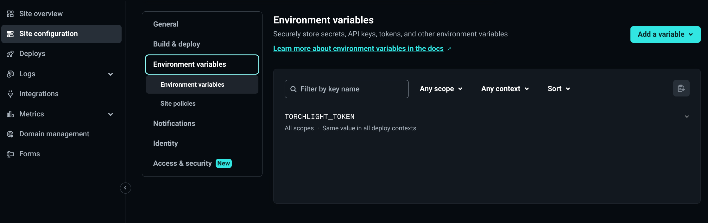

I've been futzing around a bit with how code blocks render on this blog. Hugo has a built-in, _really fast_, [syntax highlighter](https://gohugo.io/content-management/syntax-highlighting/) courtesy of [Chroma](https://github.com/alecthomas/chroma). Chroma is basically automatic and it renders very quickly[^fast] during the `hugo` build process, but it often seems to struggle with tokenizing and highlighting certain languages. And while Hugo allows for annotations like `{hl_lines="11-13"}`, that can get kind of clumsy if you're not sure which lines need to be highlighted[^eleven]. And sometimes I'd like to share a long code block for context while also collapsing it down to just the bits I'm going to write about. That's not something that can be done with the built-in highlighter (at least not without tacking on a bunch of extra JavaScript and CSS nonsense).

[^fast]: Did I mention that it's fast?
[^eleven]: (or how to count to eleven)

But then I found a post from Sebastian de Deyne about [Better code highlighting in Hugo with Torchlight](https://sebastiandedeyne.com/better-code-highlighting-in-hugo-with-torchlight), and thought that [Torchlight](https://torchlight.dev) sounded pretty promising.

In Sebastian's words,

> Torchlight is a code-highlighter-as-a-service built on Visual Studio Code's editor highlighter editor. You throw blocks of code to Torchlight and they return them in a highlighted form. This results in a more complete highlight than alternatives like highlight.js, and a lot of available themes.

Code blocks in, formatted HTML out, and no JavaScript or extra code to render this slick display in the browser:
```toml
# torchlight! {"lineNumbers": true}
# netlify.toml
[build]
  publish = "public"

[build.environment]
  HUGO_VERSION = "0.111.3" # [tl! --]
  HUGO_VERSION = "0.116.1" # [tl! ++ reindex(-1)]

[context.production] # [tl! focus:5 highlight:3,1]
  command = """
  hugo --minify
  npm i @torchlight-api/torchlight-cli
  npx torchlight
  """

[context.preview] # [tl! collapse:start]
  command = """
  hugo --minify --environment preview
  npm i @torchlight-api/torchlight-cli
  npx torchlight
  """
  [[headers]]
    for = "/*"
      [headers.values]
      X-Robots-Tag = "noindex"

[[redirects]]
  from = "/*"
  to = "/404/"
  status = 404 # [tl! collapse:end]
```

Pretty nice, right? That block's got:
- Colorful, accurate syntax highlighting
- Traditional line highlighting
- A shnazzy blur/focus to really make the important lines pop
- In-line diffs to show what's changed
- An expandable section to reveal additional context on-demand

And marking-up that code block was pretty easy and intuitive. Torchlight is controlled by [annotations](https://torchlight.dev/docs/annotations) inserted as comments appropriate for whatever language you're using (like `# [tl! highlight]` to highlight a single line). In most cases you can just put the annotation right at the end of the line you're trying to flag. You can also [specify ranges](https://torchlight.dev/docs/annotations/ranges) relative to the current line (`[tl! focus:5]` to apply the focus effect to the current line and the next five) or use `:start` and `:end` so you don't have to count at all.
```toml
# torchlight! {"torchlightAnnotations": false}
# netlify.toml
[build]
  publish = "public"

[build.environment]
  # diff: remove this line
  HUGO_VERSION = "0.111.3" # [tl! --]
  # diff: add this line, adjust line numbering to compensate
  HUGO_VERSION = "0.116.1" # [tl! ++ reindex(-1)]

# focus this line and the following 5, highlight the third line down
[context.production] # [tl! focus:5 highlight:3,1]
  command = """
  hugo --minify
  npm i @torchlight-api/torchlight-cli
  npx torchlight
  """

# collapse everything from `:start` to `:end`
[context.preview] # [tl! collapse:start]
  command = """
  hugo --minify --environment preview
  npm i @torchlight-api/torchlight-cli
  npx torchlight
  """
  [[headers]]
    for = "/*"
      [headers.values]
      X-Robots-Tag = "noindex"

[[redirects]]
  from = "/*"
  to = "/404/"
  status = 404 # [tl! collapse:end]
```

See what I mean? Being able to put the annotations directly on the line(s) they modify is a lot easier to manage than trying to keep track of multiple line numbers in the header. And I think the effect is pretty cool.

### Basic setup
So what did it take to get this working on my blog?

I started with registering for a free[^free] account at [torchlight.dev](https://app.torchlight.dev/register?plan=free_month) and generating an API token. I'll need to include that later with calls to the Torchlight API. The token will be stashed as an environment variable in my Netlify configuration, but I'll also stick it in a local `.env` file for use with local builds:
```shell
echo "TORCHLIGHT_TOKEN=torch_[...]" > ./.env # [tl! .cmd]
```

[^free]: Torchlight is free for sites which don't generate revenue, though it does require a link back to `torchlight.dev`. I stuck the attribution link in the footer. More pricing info [here].

#### Installation
I then used `npm` to install Torchlight in the root of my Hugo repo:
```shell
npm i @torchlight-api/torchlight-cli # [tl! .cmd]
# [tl! .nocopy:1]
added 94 packages in 5s
```

That created a few new files and directories that I don't want to sync with the repo, so I added those to my `.gitignore` configuration. I'll also be sure to add that `.env` file so that I don't commit any secrets!
```
# torchlight! {"lineNumbers": true}
# .gitignore
.hugo_build.lock
/node_modules/ [tl! ++:2]
/package-lock.json
/package.json
/public/
/resources/
/.env [tl! ++]
```

The [installation instructions](https://torchlight.dev/docs/clients/cli#init-command) say to then initialize Torchlight like so:
```shell
npx torchlight init # [tl! .cmd focus]
# [tl! .nocopy:start]
node:internal/fs/utils:350
    throw err;
    ^

Error: ENOENT: no such file or directory, open '/home/john/projects/runtimeterror/node_modules/@torchlight-api/torchlight-cli/dist/stubs/config.js' # [tl! focus highlight collapse:start]
    at Object.openSync (node:fs:603:3) #
    at Object.readFileSync (node:fs:471:35)
    at write (/home/john/projects/runtimeterror/node_modules/@torchlight-api/torchlight-cli/dist/bin/torchlight.cjs.js:524:39)
    at init (/home/john/projects/runtimeterror/node_modules/@torchlight-api/torchlight-cli/dist/bin/torchlight.cjs.js:538:12)
    at Command.<anonymous> (/home/john/projects/runtimeterror/node_modules/@torchlight-api/torchlight-cli/dist/bin/torchlight.cjs.js:722:12)
    at Command.listener [as _actionHandler] (/home/john/projects/runtimeterror/node_modules/commander/lib/command.js:488:17)
    at /home/john/projects/runtimeterror/node_modules/commander/lib/command.js:1227:65
    at Command._chainOrCall (/home/john/projects/runtimeterror/node_modules/commander/lib/command.js:1144:12)
    at Command._parseCommand (/home/john/projects/runtimeterror/node_modules/commander/lib/command.js:1227:27)
    at Command._dispatchSubcommand (/home/john/projects/runtimeterror/node_modules/commander/lib/command.js:1050:25) { # [tl! collapse:end]
  errno: -2,
  syscall: 'open',
  code: 'ENOENT',
  path: '/home/john/projects/runtimeterror/node_modules/@torchlight-api/torchlight-cli/dist/stubs/config.js'
}

Node.js v18.17.1
# [tl! .nocopy:end]
```

Oh. Hmm.

There's an [open issue](https://github.com/torchlight-api/torchlight-cli/issues/4) which reveals that the stub config file is actually located under the `src/` directory instead of `dist/`.

#### Configuration
I'll just copy that to my repo root and then set to work modifying it to suit my needs:

```shell
cp node_modules/@torchlight-api/torchlight-cli/src/stubs/config.js ./torchlight.config.js # [tl! .cmd]
```

```js
// torchlight! {"lineNumbers": true}
// torchlight.config.js
module.exports = {
  // Your token from https://torchlight.dev
  token: process.env.TORCHLIGHT_TOKEN, // this will come from a netlify build var [tl! highlight focus]

  // The Torchlight client caches highlighted code blocks. Here you
  // can define which directory you'd like to use. You'll likely
  // want to add this directory to your .gitignore. Set to
  // `false` to use an in-memory cache. You may also
  // provide a full cache implementation.
  cache: 'cache', // [tl! -- focus:1]
  cache: false, // disable cache for netlify builds [tl! ++ reindex(-1)]

  // Which theme you want to use. You can find all of the themes at
  // https://torchlight.dev/docs/themes.
  theme: 'material-theme-palenight', // [tl! -- focus:1]
  theme: 'one-dark-pro', // switch up the theme [tl! ++ reindex(-1)]

  // The Host of the API.
  host: 'https://api.torchlight.dev',

  // Global options to control block-level settings.
  // https://torchlight.dev/docs/options
  options: {
    // Turn line numbers on or off globally.
    lineNumbers: false,

    // Control the `style` attribute applied to line numbers.
    // lineNumbersStyle: '',

    // Turn on +/- diff indicators.
    diffIndicators: true,

    // If there are any diff indicators for a line, put them
    // in place of the line number to save horizontal space.
    diffIndicatorsInPlaceOfLineNumbers: true

    // When lines are collapsed, this is the text that will
    // be shown to indicate that they can be expanded.
    // summaryCollapsedIndicator: '...',
  },

  // Options for the highlight command.
  highlight: {
    // Directory where your un-highlighted source files live. If
    // left blank, Torchlight will use the current directory.
    input: '', // [tl! -- focus:1]
    input: 'public', // tells Torchlight where to find Hugo's processed HTML output [tl! ++ reindex(-1)]

    // Directory where your highlighted files should be placed. If
    // left blank, files will be modified in place.
    output: '',

    // Globs to include when looking for files to highlight.
    includeGlobs: [
      '**/*.htm',
      '**/*.html'
    ],

    // String patterns to ignore (not globs). The entire file
    // path will be searched and if any of these strings
    // appear, the file will be ignored.
    excludePatterns: [
      '/node_modules/',
      '/vendor/'
    ]
  }
}
```

You can find more details about the configuration options [here](https://torchlight.dev/docs/clients/cli#configuration-file).

#### Stylization
It's not strictly necessary for the basic functionality, but applying a little bit of extra CSS to match up with the classes leveraged by Torchlight can help to make things look a bit more polished. Fortunately for this _fake-it-til-you-make-it_ dev, Torchlight provides sample CSS that work great for this:

- [Basic CSS](https://torchlight.dev/docs/css) for generally making things look tidy
- [Focus CSS](https://torchlight.dev/docs/annotations/focusing#css) for that slick blur/focus effect
- [Collapse CSS](https://torchlight.dev/docs/annotations/collapsing#required-css) for some accordion action

Put those blocks together (along with a few minor tweaks), and here's what I started with in `assets/css/torchlight.css`:
```css
// torchlight! {"lineNumbers": true}

/*********************************************
* Basic styling for Torchlight code blocks.  *
**********************************************/

/*
 Margin and rounding are personal preferences,
 overflow-x-auto is recommended.
*/
pre {
    border-radius: 0.25rem;
    margin-top: 1rem;
    margin-bottom: 1rem;
    overflow-x: auto;
}

/*
 Add some vertical padding and expand the width
 to fill its container. The horizontal padding
 comes at the line level so that background
 colors extend edge to edge.
*/
pre.torchlight {
    display: block;
    min-width: -webkit-max-content;
    min-width: -moz-max-content;
    min-width: max-content;
    padding-top: 1rem;
    padding-bottom: 1rem;
}

/*
 Horizontal line padding to match the vertical
 padding from the code block above.
*/
pre.torchlight .line {
    padding-left: 1rem;
    padding-right: 1rem;
}

/*
 Push the code away from the line numbers and
 summary caret indicators.
*/
pre.torchlight .line-number,
pre.torchlight .summary-caret {
    margin-right: 1rem;
}

/*********************************************
* Focus styling                              *
**********************************************/

/*
  Blur and dim the lines that don't have the `.line-focus` class,
  but are within a code block that contains any focus lines.
*/
.torchlight.has-focus-lines .line:not(.line-focus) {
    transition: filter 0.35s, opacity 0.35s;
    filter: blur(.095rem);
    opacity: .65;
}

/*
  When the code block is hovered, bring all the lines into focus.
*/
.torchlight.has-focus-lines:hover .line:not(.line-focus) {
    filter: blur(0px);
    opacity: 1;
}

/*********************************************
* Collapse styling                           *
**********************************************/

.torchlight summary:focus {
    outline: none;
}

/* Hide the default markers, as we provide our own */
.torchlight details > summary::marker,
.torchlight details > summary::-webkit-details-marker {
    display: none;
}

.torchlight details .summary-caret::after {
    pointer-events: none;
}

/* Add spaces to keep everything aligned */
.torchlight .summary-caret-empty::after,
.torchlight details .summary-caret-middle::after,
.torchlight details .summary-caret-end::after {
    content: " ";
}

/* Show a minus sign when the block is open. */
.torchlight details[open] .summary-caret-start::after {
    content: "-";
}

/* And a plus sign when the block is closed. */
.torchlight details:not([open]) .summary-caret-start::after {
    content: "+";
}

/* Hide the [...] indicator when open. */
.torchlight details[open] .summary-hide-when-open {
    display: none;
}

/* Show the [...] indicator when closed. */
.torchlight details:not([open]) .summary-hide-when-open {
    display: initial;
}

/*********************************************
* Additional styling                         *
**********************************************/

/* Fix for disjointed horizontal scrollbars */
.highlight div {
  overflow-x: visible;
}
```

I'll make sure that this CSS gets dynamically attached to any pages with a code block by adding this to the bottom of my `layouts/partials/head.html`:
```html
<!-- syntax highlighting -->
{{ if (findRE "<pre" .Content 1) }}
  {{ $syntax := resources.Get "css/torchlight.css" | minify }}
  <link href="{{ $syntax.RelPermalink }}" rel="stylesheet">
```

As a bit of housekeeping, I'm also going to remove the built-in highlighter configuration from my `config/_default/markup.toml` file to make sure it doesn't conflict with Torchlight:
```toml
# torchlight! {"lineNumbers": true}
# config/_default/markup.toml
[goldmark]
  [goldmark.renderer]
    hardWraps = false
    unsafe = true
    xhtml = false
  [goldmark.extensions]
    typographer = false

[highlight] # [tl! --:start]
  anchorLineNos = true
  codeFences = true
  guessSyntax = true
  hl_Lines = ''
  lineNos = false
  lineNoStart = 1
  lineNumbersInTable = false
  noClasses = false
  tabwidth = 2
  style = 'monokai'
# [tl! --:end]
# Table of contents # [tl! reindex(10)]
# Add toc = true to content front matter to enable
[tableOfContents]
  endLevel   = 5
  ordered    = false
  startLevel = 3
```

### Building
Now that the pieces are in place, it's time to start building!

#### Local
I like to preview my blog as I work on it so that I know what it will look like before I hit `git push` and let Netlify do its magic. And Hugo has been fantastic for that! But since I'm offloading the syntax highlighting to the Torchlight API, I'll need to manually build the site instead of relying on Hugo's instant preview builds.

There are a couple of steps I'll use for this:
1. First, I'll `source .env` to load the `TORCHLIGHT_TOKEN` for the API.
2. Then, I'll use `hugo --minify --environment local -D` to render my site into the `public/` directory.
3. Next, I'll call `npx torchlight` to parse the HTML files in `public/`, extract the content of any `<pre>`/`<code>` blocks, send it to the Torchlight API to work the magic, and write the formatted code blocks back to the existing HTML files.
4. Finally, I use `python3 -m http.server --directory public 1313` to serve the `public/` directory so I can view the content at `http://localhost:1313`.

I'm lazy, though, so I'll even put that into a quick `build.sh` script to help me run local builds:
```shell
# torchlight! {"lineNumbers": true}
#!/usr/bin/env bash
# Quick script to run local builds
source .env
hugo --minify --environment local -D
npx torchlight
python3 -m http.server --directory public 1313
```

Now I can just make the script executable and fire it off:
```shell
chmod +x build.sh # [tl! focus:3 .cmd:1]
./build.sh
Start building sites … # [tl! .nocopy:start]
hugo v0.111.3+extended linux/amd64 BuildDate=unknown VendorInfo=nixpkgs

                   | EN
-------------------+------
  Pages            | 202
  Paginator pages  |   0
  Non-page files   | 553
  Static files     |  49
  Processed images |   0
  Aliases          |   5
  Sitemaps         |   1
  Cleaned          |   0

Total in 248 ms
Highlighting index.html
Highlighting 3d-modeling-and-printing-on-chrome-os/index.html
Highlighting 404/index.html
Highlighting about/index.html # [tl! collapse:start]

 +    +     +      O
     o                  '
 ________________        _
 \__(=======/_=_/____.--'-`--.___
           \ \   `,--,-.___.----'
         .--`\\--'../   |
        '---._____.|]  -0-  |o
               *        |  -0-  -O-
      '    o     0          |  '
             .     -0-        .    '

Did you really want to see the full file list?

Highlighting tags/vsphere/index.html # [tl! collapse:end]
Highlighting tags/windows/index.html
Highlighting tags/wireguard/index.html
Highlighting tags/wsl/index.html # [tl! focus:1]
Writing to /home/john/projects/runtimeterror/public/abusing-chromes-custom-search-engines-for-fun-and-profit/index.html
Writing to /home/john/projects/runtimeterror/public/auto-connect-to-protonvpn-on-untrusted-wifi-with-tasker/index.html
Writing to /home/john/projects/runtimeterror/public/cat-file-without-comments/index.html # [tl! collapse:start]

          '         *                  +          -O- |
                              o     o                   .
     ___________             0        o        .
   +/-/_"/-/_/-/|      -0-      o        -O-       *     *
   /"-/-_"/-_//||             .    -O-
  /__________/|/|            +  |              *
  |"|_'='-]:+|/||    .     o   -0-      .    *
  |-+-|.|_'-"||//       +   |   | '      '       0
  |[".[:!+-'=|// |         -0-       0             -O-
  |='!+|-:]|-|/ -0-      o  |-0-       0             -O-
   ----------  * |                -O|   +               o
                       o   -O-     -0-    -0-  -O-
     |     +             |   -O-    |
    -0-                 -0-     .        O
 -O- |                   -O-       *

Writing to /home/john/projects/runtimeterror/public/k8s-on-vsphere-node-template-with-packer/index.html # [tl! collapse:end]
Writing to /home/john/projects/runtimeterror/public/tanzu-community-edition-k8s-homelab/index.html
Serving HTTP on 0.0.0.0 port 1313 (http://0.0.0.0:1313/) ... # [tl! focus:1]
127.0.0.1 - - [07/Nov/2023 20:34:29] "GET /spotlight-on-torchlight/ HTTP/1.1" 200 -
```

#### Netlify
Setting up Netlify to leverage the Torchlight API is kind of similar. I'll start with logging in to the [Netlify dashboard](https://app.netlify.com) and navigating to **Site Configuration > Environment Variables**. There, I'll click on **Add a variable > Add a ingle variable**. I'll give the new variable a key of `TORCHLIGHT_TOKEN` and set its value to the token I obtained earlier.



Once that's done, I edit the `netlify.toml` file at the root of my site repo to alter the build commands:
```toml
# torchlight! {"lineNumbers": true}
[build]
  publish = "public"

[build.environment]
  HUGO_VERSION = "0.111.3"

[context.production] # [tl! focus:6]
  command = "hugo" # [tl! -- ++:1,5 reindex(-1):1,1]
  command = """
  hugo --minify
  npm i @torchlight-api/torchlight-cli
  npx torchlight
  """

```

Now when I `git push` new content, Netlify will use Hugo to build the site, then install and call Torchlight to `++fancy;` the code blocks before the site gets served. Very nice!

### #Goals
Of course, I. Just. Can't. leave well enough alone, so my work here isn't finished - not by a long shot.

You see, I'm a sucker for handy "copy" buttons attached to code blocks, and that's not something that Torchlight does (it just returns rendered HTML, remember? No fancy JavaScript here). I also wanted to add informative prompt indicators (like `$` and `#`) to code blocks representing command-line inputs (rather than script files). And I'd like to flag text returned by a command so that *only* the commands get copied, effectively ignoring the returned text, diff-removed lines, diff markers, line numbers, and prompt indicators.

I had previously implemented a solution based *heavily* on Aaron Luna's blog post, [Hugo: Add Copy-to-Clipboard Button to Code Blocks with Vanilla JS](https://aaronluna.dev/blog/add-copy-button-to-code-blocks-hugo-chroma/). Getting that Chroma-focused solution to work well with Torchlight-formatted code blocks took some work, particularly since I'm inept at web development and can barely spell "CSS" and "JavaScrapped".

But I[^copilot] eventually fumbled through the changes required to meet my #goals, and I'm pretty happy with the result.

[^copilot]: With a little help from my Copilot buddy...

#### Custom classes
Remember Torchlight's in-line annotations that I mentioned earlier? They're pretty capable out of the box, but can also be expanded through the use of [custom classes](https://torchlight.dev/docs/annotations/classes). This makes it pretty easy to selectively apply special handling to lines of code, something that's otherwise pretty dang tricky to do with Chroma.

So, for instance, I could add a class `.cmd` for standard user-level command-line inputs:
```shell
# torchlight! {"torchlightAnnotations":false}
sudo make me a sandwich # [tl! .cmd]
```
```shell
sudo make me a sandwich # [tl! .cmd]
```

Or `.cmd_root` for a root prompt:
```shell
# torchlight! {"torchlightAnnotations": false}
wall "Make your own damn sandwich." # [tl! .cmd_root]
```
```shell
wall "Make your own damn sandwich." # [tl! .cmd_root]
```

And for deviants:
```powershell
# torchlight! {"torchlightAnnotations": false}
Write-Host -ForegroundColor Green "A taco is a sandwich" # [tl! .cmd_pwsh]
```
```powershell
Write-Host -ForegroundColor Green "A taco is a sandwich" # [tl! .cmd_pwsh]
```

I also came up with a cleverly-named `.nocopy` class for the returned lines that shouldn't be copyable:
```shell
# torchlight! {"torchlightAnnotations": false}
copy this # [tl! .cmd]
but not this # [tl! .nocopy]
```
```shell
copy this # [tl! .cmd]
but not this # [tl! .nocopy]
```

So that's how I'll tie my custom classes to individual lines of code[^ranges], but I still need to actually define those classes.

I'll drop those at the bottom of the `assets/css/torchlight.css` file I created earlier:

```css
// torchlight! {"lineNumbers": true}
/* [tl! collapse:start]
/*********************************************
* Basic styling for Torchlight code blocks.  *
**********************************************/

/*
 Margin and rounding are personal preferences,
 overflow-x-auto is recommended.
*/
pre {
    border-radius: 0.25rem;
    margin-top: 1rem;
    margin-bottom: 1rem;
    overflow-x: auto;
}

/*
 Add some vertical padding and expand the width
 to fill its container. The horizontal padding
 comes at the line level so that background
 colors extend edge to edge.
*/
pre.torchlight {
    display: block;
    min-width: -webkit-max-content;
    min-width: -moz-max-content;
    min-width: max-content;
    padding-top: 1rem;
    padding-bottom: 1rem;
}

/*
 Horizontal line padding to match the vertical
 padding from the code block above.
*/
pre.torchlight .line {
    padding-left: 1rem;
    padding-right: 1rem;
}

/*
 Push the code away from the line numbers and
 summary caret indicators.
*/
pre.torchlight .line-number,
pre.torchlight .summary-caret {
    margin-right: 1rem;
}

/*********************************************
* Focus styling                              *
**********************************************/

/*
  Blur and dim the lines that don't have the `.line-focus` class,
  but are within a code block that contains any focus lines.
*/
.torchlight.has-focus-lines .line:not(.line-focus) {
    transition: filter 0.35s, opacity 0.35s;
    filter: blur(.095rem);
    opacity: .65;
}

/*
  When the code block is hovered, bring all the lines into focus.
*/
.torchlight.has-focus-lines:hover .line:not(.line-focus) {
    filter: blur(0px);
    opacity: 1;
}

/*********************************************
* Collapse styling                           *
**********************************************/

.torchlight summary:focus {
    outline: none;
}

/* Hide the default markers, as we provide our own */
.torchlight details > summary::marker,
.torchlight details > summary::-webkit-details-marker {
    display: none;
}

.torchlight details .summary-caret::after {
    pointer-events: none;
}

/* Add spaces to keep everything aligned */
.torchlight .summary-caret-empty::after,
.torchlight details .summary-caret-middle::after,
.torchlight details .summary-caret-end::after {
    content: " ";
}

/* Show a minus sign when the block is open. */
.torchlight details[open] .summary-caret-start::after {
    content: "-";
}

/* And a plus sign when the block is closed. */
.torchlight details:not([open]) .summary-caret-start::after {
    content: "+";
}

/* Hide the [...] indicator when open. */
.torchlight details[open] .summary-hide-when-open {
    display: none;
}

/* Show the [...] indicator when closed. */
.torchlight details:not([open]) .summary-hide-when-open {
    display: initial;
} /* [tl! collapse:end]

/*********************************************
* Additional styling                         *
**********************************************/

/* Fix for disjointed horizontal scrollbars */
.highlight div {
  overflow-x: visible;
}

/* [tl! focus:start]
Insert prompt indicators on interactive shells.
*/
.cmd::before {
  color: var(--base07);
  content: "$ ";
}

.cmd_root::before {
  color: var(--base08);
  content: "# ";
}

.cmd_pwsh::before {
  color: var(--base07);
  content: "PS> ";
}

/*
Don't copy shell outputs
*/
.nocopy {
  webkit-user-select: none;
  user-select: none;
} /* [tl! focus:end]
```

[^ranges]: Or ranges of lines, using the same syntax as before: `[tl! .nocopy:5]` will make this line and the following five uncopyable.

The `.cmd` classes will just insert the respective prompt _before_ each flagged line, and the `.nocopy` class will make it it so that the lines aren't selectable. Now for the tricky part...

#### Copy that blocky
There are two major pieces for the code-copy wizardry: the CSS to style/arrange the copy button and language label, and the JavaScript to make it work.

I put the CSS in `assets/css/code-copy-button.css`. It's basically straight from Aaron's post but with a few stanzas removed, a few elements renamed, and a few values tweaked to fit this site:

```css
// torchlight! {"lineNumbers": true}
/* adapted from https://aaronluna.dev/blog/add-copy-button-to-code-blocks-hugo-chroma/ */

.highlight-wrapper /* already set by torchlight.css [tl! remove:3] */
  display: block;
}
/* [tl! reindex(-4)] */
.highlight {
  position: relative;
  z-index: 0;
  padding: 0;
  margin: 0; /* [tl! remove] */
  margin: 40px 0 10px 0; /* a little more breathing room [tl! reindex(-1)] */
  border-radius: 4px;
}

.highlight > .chroma { /* chroma-specific [tl! remove:start] */
  color: #d0d0d0;
  background-color: #212121;
  position: static;
  z-index: 1;
  border-radius: 4px;
  padding: 10px;
}

.chroma .lntd:first-child {
  padding: 7px 7px 7px 10px;
  margin: 0;
}

.chroma .lntd:last-child {
  padding: 7px 10px 7px 7px;
  margin: 0;
}
/* [tl! remove:end] */
.copy-code-button { /* [tl! reindex(-19)] */
  position: absolute;
  z-index: 2;
  right: 0;
  top: 0; /* [tl! remove] */
  top: -29px; /* put the button above the code block instead of in it [tl! reindex(-1)] */
  font-size: 13px;
  font-weight: 700;
  line-height: 14px;
  letter-spacing: 0.5px;
  width: 65px;
  color: #232326;
  background-color: #7f7f7f;
  border: 1.25px solid #232326;
  border-top-left-radius: 0;
  border-top-right-radius: 4px;
  border-bottom-right-radius: 0;
  border-bottom-left-radius: 4px;
  white-space: nowrap;
  padding: 4px 4px 5px 4px;
  margin: 0 0 0 1px;
  cursor: pointer;
  opacity: 0.6;
}

.copy-code-button:hover,
.copy-code-button:focus,
.copy-code-button:active,
.copy-code-button:active:hover {
  color: #222225;
  background-color: #b3b3b3;
  opacity: 0.8;
}

.copyable-text-area {
  position: absolute;
  height: 0;
  z-index: -1;
  opacity: .01;
}

```