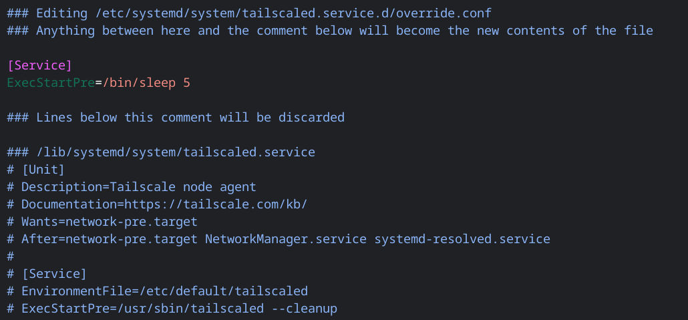

Following a recent update, I found that the [Linux development environment](https://chromium.googlesource.com/chromiumos/docs/+/HEAD/containers_and_vms.md) on my Framework Chromebook would fail to load if the [Tailscale](/secure-networking-made-simple-with-tailscale) daemon was already running. It seems that the Tailscale virtual interface may have interfered with how the CrOS Terminal app was expecting to connect to the Linux container. I initially worked around the problem by just disabling the `tailscaled` service, but having to remember to start it up manually was a pretty heavy cognitive load.

Fortunately, it turns out that overriding the service to insert a short startup delay is really easy. I'll just use the `systemctl edit` command to create a quick override configuration:
```shell
sudo systemctl edit tailscaled # [tl! .cmd]
```

This shows me the existing contents of the `tailscaled.service` definition so I can easily insert some overrides above. In this case, I just want to use `sleep 5` as the `ExecStartPre` command so that the service start will be delayed by 5 seconds:


Upon saving the file, it gets installed to `/etc/systemd/system/tailscaled.service.d/override.conf`. Now the Tailscale interface won't automatically come up until a few seconds later, and that's enough to let my Terminal app start up reliably once more.

Easy peasy.
