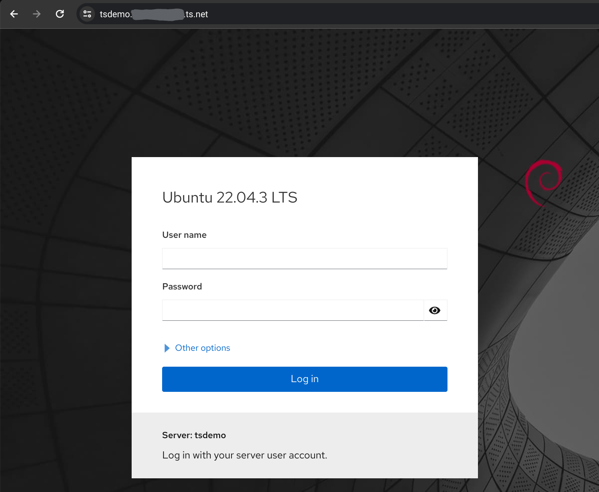
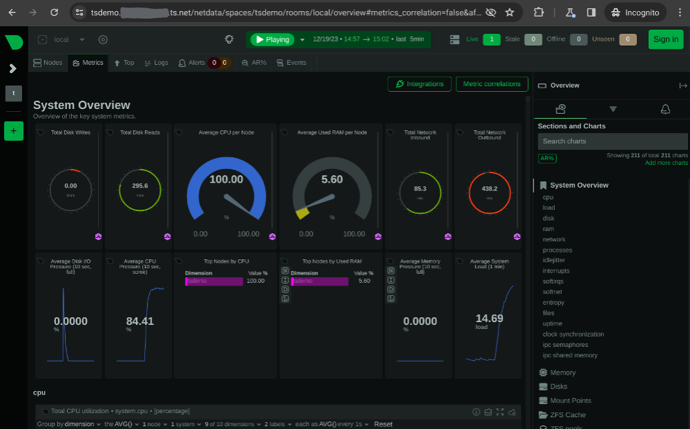

I've spent the past two years in love with [Tailscale](https://tailscale.com/), which builds on the [secure and high-performance Wireguard VPN protocol](/cloud-based-wireguard-vpn-remote-homelab-access/) and makes it [really easy to configure and manage](/secure-networking-made-simple-with-tailscale/). Being able to easily (and securely) access remote devices as if they were on the same LAN is pretty awesome to begin with, but Tailscale is packed with an ever-expanding set of features that can really help to streamline your operations too. Here are three of my favorites.

### Tailscale SSH
Tailscale already takes care of issuing, rotating, and otherwise managing the Wireguard keys used for securing communications between the systems in your tailnet. [Tailscale SSH](https://tailscale.com/kb/1193/tailscale-ssh) lets it do the same for your SSH keys as well. No more manually dropping public keys on systems you're setting up for remote access. No more scrambling to figure out how to get your private key onto your mobile device so you can SSH to a server. No more worrying about who has access to what. Tailscale can solve all those concerns for you - and it does it without impacting traditional SSH operations:

> *With Tailscale, you can already connect machines in your network, and encrypt communications end-to-end from one point to another—and this includes, for example, SSHing from your work laptop to your work desktop. Tailscale also knows your identity, since that’s how you connected to your tailnet. When you enable Tailscale SSH, Tailscale claims port 22 for the Tailscale IP address (that is, only for traffic coming from your tailnet) on the devices for which you have enabled Tailscale SSH. This routes SSH traffic for the device from the Tailscale network to an SSH server run by Tailscale, instead of your standard SSH server. With Tailscale SSH, based on the ACLs in your tailnet, you can allow devices to connect over SSH and rely on Tailscale for authentication instead of public key authentication.*

All you need to advertise Tailscale SSH on a system is to pass the appropriate flag in the `tailscale up` command:
```shell
sudo tailscale up --ssh # [tl! .cmd]
```

To actually use the feature, though, you'll need to make sure that your Tailscale ACL permits access. The default "allow all" ACL does this:
```json
{
  "acls": [
    // Allow all connections.
    { "action": "accept", "src": ["*"], "dst": ["*:*"] },
  ],
  "ssh": [ // [tl! highlight:start]
    // Allow all users to SSH into their own devices in check mode.
    {
      "action": "check",
      "src": ["autogroup:member"],
      "dst": ["autogroup:self"],
      "users": ["autogroup:nonroot", "root"]
    }
  ] // [tl! highlight:end]
}
```

The `acls` block allows all nodes to talk to each other over all ports, and the `ssh` block will allow all users in the tailnet to SSH into systems they own (both as nonroot users as well as the `root` account) but only if they have reauthenticated to Tailscale within the last 12 hours (due to that `check` action).

Most of my tailnet nodes are tagged with a location (`internal`/`external`) instead of belonging to a single user, and the `check` action doesn't work when the source is a tagged system. So my SSH ACL looks a bit more like this:
```json
{
  "acls": [
    {
      // internal systems can SSH to internal and external systems
      "action": "accept",
      "users":  ["tag:internal"],
      "ports": [
        "tag:internal:22",
        "tag:external:22"
      ],
    },
  ],
  "tagOwners": { // [tl! collapse:3]
    "tag:external":    ["group:admins"],
    "tag:internal":    ["group:admins"],
  },
  "ssh": [
    {
      // users can SSH to their own systems and those tagged as internal and external
      "action": "check",
      "src":    ["autogroup:members"],
      "dst":    ["autogroup:self", "tag:internal", "tag:external"],
      "users":  ["autogroup:nonroot", "root"],
    },
    {
      // internal systems can SSH to internal and external systems,
      // but external systems can't SSH at all
      "action": "accept",
      "src":    ["tag:internal"],
      "dst":    ["tag:internal", "tag:external"],
      "users":  ["autogroup:nonroot"],
    },
  ],
}
```

This way, SSH connections originating from `internal` systems will be accepted, while those originating from untagged systems[^web1] will have the extra check for tailnet authentication. You might also note that this policy prevents connections from tagged systems as the `root` user, requiring instead that the user log in with their own account and then escalate as needed.

[^web1]: Or the Tailscale admin web console - as we'll soon see.

These ACLs can get [pretty granular](https://tailscale.com/kb/1018/acls), and I think it's pretty cool to be able to codify your SSH access rules in a centrally-managed[^vcs] policy instead of having to manually keep track of which keys are on which systems.

[^vcs]: And potentially [version-controlled](https://tailscale.com/kb/1204/gitops-acls).

Once SSH is enabled on a tailnet node and the ACL rules are in place, you can SSH from a Tailscale-protected system to another as easily as `ssh [hostname]` and you'll be connected right away - no worrying about keys or fumbling to enter credentials. I think this is doubly cool when implemented on systems running in The Cloud; Tailscale provides the connectivity so I don't need to open up port 22 to the world.

```shell
ssh tsdemo # [tl! .cmd]
Welcome to Ubuntu 22.04.3 LTS (GNU/Linux 6.5.11-6-pve x86_64) # [tl! .nocopy:start]

 * Documentation:  https://help.ubuntu.com
 * Management:     https://landscape.canonical.com
 * Support:        https://ubuntu.com/advantage
Last login: Tue Dec 19 04:17:15 UTC 2023 from 100.73.92.61 on pts/3
john@tsdemo:~$ # [tl! .nocopy:end]
```

As a bonus, I can also open an SSH session from the Tailscale [admin console](https://login.tailscale.com/admin/machines)[^web2]:


[^web2]: SSH connections originating from the admin portal are associated with that logon, so they will follow the `check` portion of the policy. The first attempt to connect will require reauthentication with Tailscale, and subsequent connections will auto-connect for the next 12 hours.

That even works from mobile devices, too!

### Tailscale Serve
I've [mentioned in the past](/federated-matrix-server-synapse-on-oracle-clouds-free-tier/#reverse-proxy-setup) how impressed I was (and still am!) by the [Caddy webserver](https://caddyserver.com/) and how effortless it makes configuring a reverse proxy with automatic TLS. I've used it for a *lot* of my externally-facing projects.

Caddy is great, but it's not quite as easy to use for internal stuff - I'd need a public DNS record and inbound HTTP access in order for the ACME challenge to complete and a cert to be issued and installed, or I would have to manually create a certificate and load it in the Caddy config. That's probably not a great fit for wanting to proxy my [Proxmox host](/ditching-vsphere-for-proxmox/#on-the-host). And that is where the capabilities of [Tailscale Serve](https://tailscale.com/kb/1312/serve) really come in handy.

> *Tailscale Serve is a feature that allows you to route traffic from other devices on your Tailscale network (known as a tailnet) to a local service running on your device. You can think of this as sharing the service, such as a website, with the rest of your tailnet.*

{}
Tailscale Serve requires that the MagicDNS and HTTPS features be enabled on your Tailnet. You can learn how to turn those on [here](https://tailscale.com/kb/1153/enabling-https).
{}

The general syntax is:
```shell
tailscale serve <target>
```
> *`<target>` can be a file, directory, text, or most commonly the location to a service running on the local machine. The location to the location service can be expressed as a port number (e.g., `3000`), a partial URL (e.g., `localhost:3000), or a full URL including a path (e.g., `http://localhost:3000/foo`).*

The command also supports some useful flags:
```shell
  --bg, --bg=false
        Run the command as a background process (default false)
  --http uint
        Expose an HTTP server at the specified port
  --https uint
        Expose an HTTPS server at the specified port (default mode)
  --set-path string
        Appends the specified path to the base URL for accessing the underlying service
  --tcp uint
        Expose a TCP forwarder to forward raw TCP packets at the specified port
  --tls-terminated-tcp uint
        Expose a TCP forwarder to forward TLS-terminated TCP packets at the specified port
  --yes, --yes=false
        Update without interactive prompts (default false)
```

Tailscale Serve can be used for spawning a simple file server (like this one which shares the contents of the `/demo` directory):
```shell
sudo tailscale serve /demo # [tl! .cmd]
Available within your tailnet: # [tl! .nocopy:5]

https://tsdemo.tailnet-name.ts.net/
|-- path  /demo

Press Ctrl+C to exit.
```


Note that this server is running in the foreground, and that it's serving the site with an automatically-generated automatically-trusted [Let's Encrypt](https://letsencrypt.org/) certificate.

I can also use Tailscale Serve for proxying another web server, like [Cockpit](https://cockpit-project.org/), which runs on `http://localhost:9090`:
```shell
sudo tailscale serve --bg 9090 # [tl! .cmd]
Available within your tailnet: # [tl! .nocopy:6]

https://tsdemo.tailnet-name.ts.net/
|-- proxy http://127.0.0.1:9090

Serve started and running in the background.
To disable the proxy, run: tailscale serve --https=443 off
```



This time, I included the `--bg` flag so that the server would run in the background, and I told it to proxy port `9090` instead of a file path.

But what if I want to proxy *another* service (like [netdata](https://github.com/netdata/netdata), which runs on `http://localhost:19999`) at the same time? I can either proxy it on another port, like `8443`:
```shell
sudo tailscale serve --bg --https 8443 19999 # [tl! .cmd]
Available within your tailnet: # [tl! .nocopy:9]

https://tsdemo.tailnet-name.ts.net/
|-- proxy http://127.0.0.1:9090

https://tsdemo.tailnet-name.ts.net:8443/
|-- proxy http://127.0.0.1:19999

Serve started and running in the background.
To disable the proxy, run: tailscale serve --https=8443 off
```

Or serve it at a different path:
```shell
sudo tailscale serve --bg --set-path /netdata 19999 # [tl! .cmd]
Available within your tailnet: # [tl! .nocopy:9]

https://tsdemo.tailnet-name.ts.net/
|-- proxy http://127.0.0.1:9090

https://tsdemo.tailnet-name.ts.net/netdata
|-- proxy http://127.0.0.1:19999

Serve started and running in the background.
To disable the proxy, run: tailscale serve --https=443 off
```



{}
Not all web apps adapt well to being served at a different path than they expect. It works fine for netadata, but did not work with Cockpit (at least not without digging deeper into the configuration to change the base URL). But hey, that's why we've got options!
{}

### Tailscale Funnel
So Tailscale Serve works well for making web resources available inside of my tailnet... but what if I want to share them externally? [Tailscale Funnel](https://tailscale.com/kb/1223/funnel) has that use case covered, and it makes it easy to share things without having to manage DNS records, punch holes in firewalls, or configure certificates.

> *Tailscale Funnel is a feature that allows you to route traffic from the wider internet to a local service running on a machine in your Tailscale network (known as a tailnet). You can think of this as publicly sharing a local service, like a web app, for anyone to access—even if they don’t have Tailscale themselves.*

In addition to requiring that HTTPS is enabled, Funnel also requires that nodes have the `funnel` attribute applied through the ACL policy.

There's a default policy snippet to apply this:
```json
"nodeAttrs": [
  {
    "target": ["autogroup:member"],
    "attr":   ["funnel"],
  },
],
```

But I use a tag to manage funnel privileges instead so my configuration will look something like this:
```json
{
  "acls": [ // [tl! collapse:start]
    {
      // internal systems can SSH to internal and external systems
      "action": "accept",
      "users":  ["tag:internal"],
      "ports": [
        "tag:internal:22",
        "tag:external:22"
      ],
    },
  ], // [tl! collapse:end]
  "tagOwners": {
    "tag:external":    ["group:admins"],
    "tag:funnel":      ["group:admins"], // [tl! focus]
    "tag:internal":    ["group:admins"],
  },
  "ssh": [ // [tl! collapse:start]
    {
      // users can SSH to their own systems and those tagged as internal and external
      "action": "check",
      "src":    ["autogroup:members"],
      "dst":    ["autogroup:self", "tag:internal", "tag:external"],
      "users":  ["autogroup:nonroot", "root"],
    },
    {
      // internal systems can SSH to internal and external systems,
      // but external systems can't SSH at all
      "action": "accept",
      "src":    ["tag:internal"],
      "dst":    ["tag:internal", "tag:external"],
      "users":  ["autogroup:nonroot"],
    },
  ], // [tl! collapse:end]
  "nodeAttrs": [ // [tl! focus:start]
    {
      // devices with the funnel tag can enable Tailscale Funnel
      "target": ["tag:funnel"],
      "attr": ["funnel"],
    },
  ] // [tl! focus:end]
}
```

Now only nodes with the `funnel` tag will be able to enable Funnel.

From there, the process to activate Tailscale Funnel is basically identical to that of Tailscale Serve - you just use `tailscale funnel` instead of `tailscale serve`.

{}
A Funnel configuration is applied to the **port** that Tailscale Serve uses to make a resource available, not the resource itself. In the example above, I have both Cockpit and netdata being served over port `443`. If I try to use `sudo tailscale funnel --set-path /netdata 19999` to Funnel just the netdata instance, that will actually Funnel *both* resources instead of just the one.
{}

If I want to make the netdata instance available publicly while keeping Cockpit internal-only, I'll need to serve netdata on a different port. Funnel [only supports](https://tailscale.com/kb/1223/funnel#limitations) ports `443`, `8443`, and `10000`, so I'll use `8443`:
```shell
sudo tailscale funnel --bg --https 8443 --set-path /netdata 19999 # [tl! .cmd]
Available on the internet: # [tl! .nocopy:6]

https://tsdemo.tailnet-name.ts.net:8443/netdata
|-- proxy http://127.0.0.1:19999

Funnel started and running in the background.
To disable the proxy, run: tailscale funnel --https=8443 off
```

It will take 10 or so minutes for the public DNS record to get created, but after that anyone on the internet (not just within my tailnet!) would be able to access the resource I've shared.

I can use `tailscale serve status` to confirm that both Cockpit and netdata are served internally on port `443`, but only netdata is published externally on port `8443`:
```shell
sudo tailscale serve status # [tl! .cmd]
# [tl! .nocopy:9]
# Funnel on:
#     - https://tsdemo.tailnet-name.ts.net:8443

https://tsdemo.tailnet-name.ts.net (tailnet only)
|-- /        proxy http://127.0.0.1:9090
|-- /netdata proxy http://127.0.0.1:19999

https://tsdemo.tailnet-name.ts.net:8443 (Funnel on)
|-- /netdata proxy http://127.0.0.1:19999
```

Pretty cool, right?

### Other Features
This post has covered some of my favorite (and most-used) Tailscale features, but there are *plenty* of other cool tricks up Tailscale's sleeves. These are some others that are definitely worth checking out:
- [Mullvad Exit Nodes](https://tailscale.com/kb/1258/mullvad-exit-nodes)
- [Taildrop](https://tailscale.com/kb/1106/taildrop)
- [golink](https://tailscale.com/blog/golink) (also covered [here](/tailscale-golink-private-shortlinks-tailnet/))

And if you're particularly nerdy like me, these will probably also grab your interest:
- [GitOps for Tailscale ACLs](https://tailscale.com/kb/1204/gitops-acls)
- [Manage Tailscale resources using Terraform](https://tailscale.com/kb/1210/terraform-provider)

Need more inspiration? Tailscale has a pretty thorough [collection of example uses cases](https://tailscale.com/kb/solutions) to help get the sparks flying.

I'm sure I'll have [more Tailscale-centric posts](/tags/tailscale/) to share in the future, too. Stay tuned!