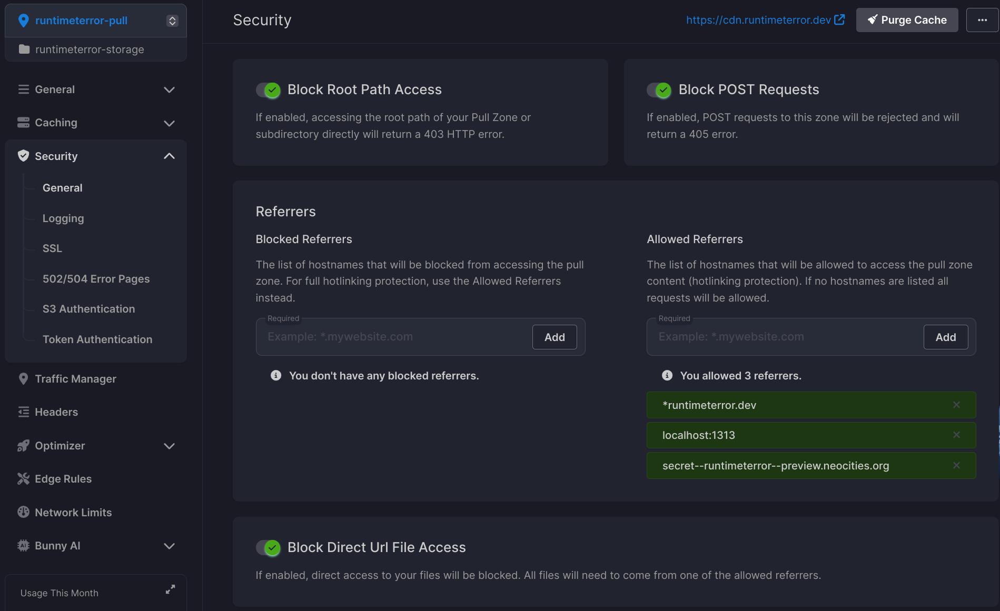
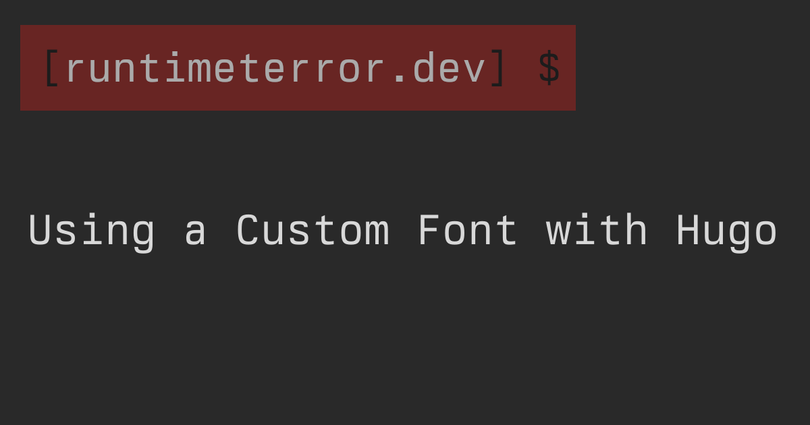

Last week, I came across and immediately fell in love with a delightfully-retro monospace font called [Berkeley Mono](https://berkeleygraphics.com/typefaces/berkeley-mono/). I promptly purchased a "personal developer" license and set to work [applying the font in my IDE and terminal](https://scribbles.jbowdre.lol/post/trying-tabby-terminal). I didn't want to stop there, though; the license also permits me to use the font on my personal site, and Berkeley Mono will fit in beautifully with the whole runtimeterror aesthetic.

Well, you're looking at the slick new font here, and I'm about to tell you how I added the font both to the site itself and to the [dynamically-generated OpenGraph share images](/dynamic-opengraph-images-with-hugo/) setup. It wasn't terribly hard to implement, but the Hugo documentation is a bit light on how to do it (and I'm kind of inept at this whole web development thing).

### Web Font
This site's styling is based on the [risotto theme for Hugo](https://github.com/joeroe/risotto/tree/main). Risotto uses the CSS variable `--font-monospace` in `themes/risotto/static/css/typography.css` to define the font face, and then that variable is inserted wherever the font may need to be set:

```css
/* torchlight! {"lineNumbers":true} */
/* Fonts */
:root {
    --font-monospace: "Fira Mono", monospace; /* [tl! **] */
}

body {
    font-family: var(--font-monospace); /* [tl! **] */
    font-size: 16px;
    line-height: 1.5rem;
}
```

This makes it easy to override the theme's font by inserting my preferred font in `static/custom.css`:

```css
/* font overrides */
:root {
  --font-monospace: 'Berkeley Mono', 'Fira Mono', monospace; /* [tl! **] */
}
```

And that would be the end of things if I could expect that everyone who visited my site already had the Berkeley Mono font installed; if they don't, though, the site will fallback to either the Fira Mono font or whatever generic monospace font is on the system. So maybe I'll add a few other monospace fonts just for good measure:

```css
/* font overrides */
:root {
  --font-monospace: 'Berkeley Mono', 'IBM Plex Mono', 'Cascadia Mono', 'Roboto Mono', 'Source Code Pro', 'Fira Mono', 'Courier New', monospace; /* [tl! **] */
}
```

That provides a few more options to fall back to if the preferred font isn't available. But let's see about making that font available.

#### Hosted Locally
I can use a `@font-face` rule to tell the browser how to find the `.woff2`/`.woff` files for my preferred web font, and I could just set the `src: url` parameter to point to a local path in my Hugo environment:

```css
/* load preferred font */
@font-face {
  font-family: 'Berkeley Mono';
  font-style: normal;
  font-weight: 400;
  /* use the installed font with this name if it's there... */
  src: local('Berkeley Mono'),
  /* otherwise look at these paths */
    url('/fonts/BerkeleyMono.woff2') format('woff2'),
    url('/fonts/BerkeleyMono.woff') format('woff')
}
```

And that would work just fine... but it *would* require storing those web font files in the (public) [GitHub repo](https://github.com/jbowdre/runtimeterror) which powers my site, and I'd rather not store any paid font files there.

So instead, I opted to try using a [Content Delivery Network (CDN)](https://en.wikipedia.org/wiki/Content_delivery_network) to host the font files. This would allow for some degree of access control, help me learn more about a web technology I hadn't played with much, and make use of a cool `cdn.*` subdomain in the process.

{}
Of course, while writing this post I gave in to my impulsive nature and [migrated the site from Cloudflare to Bunny.net](https://scribbles.jbowdre.lol/post/i-just-hopped-to-bunny-net). Rather than scrap the content I'd already written, I'll go ahead and describe how I set this up first on [Cloudflare R2](https://www.cloudflare.com/developer-platform/r2/) and later on [Bunny Storage](https://bunny.net/storage/).
{}

#### Cloudflare R2
Getting started with R2 was really easy; I just [created a new R2 bucket](https://developers.cloudflare.com/r2/buckets/create-buckets/) called `runtimeterror` and [connected it to the custom domain](https://developers.cloudflare.com/r2/buckets/public-buckets/#connect-a-bucket-to-a-custom-domain) `cdn.runtimeterror.dev`. I put the two web font files in a folder titled `fonts` and uploaded them to the bucket so that they can be accessed under `https://cdn.runtimeterror.dev/fonts/`.

I could then employ a [Cross-Origin Resource Sharing (CORS)](https://developers.cloudflare.com/r2/buckets/cors/) policy to ensure the fonts hosted on my fledgling CDN can only be loaded on my site. I configured the policy to also allow access from my `localhost` Hugo build environment as well as a preview Neocities environment I use for testing such major changes:

```json
[
  {
    "AllowedOrigins": [
      "http://localhost:1313",
      "https://secret--runtimeterror--preview.neocities.org",
      "https://runtimeterror.dev"
    ],
    "AllowedMethods": [
      "GET"
    ]
  }
]
```

Then I just needed to update the `@font-face` rule accordingly:

```css
/* load preferred font */
@font-face {
  font-family: 'Berkeley Mono';
  font-style: normal;
  font-weight: 400;
  font-display: fallback; /* [tl! ++] */
  src: local('Berkeley Mono'),
    url('/fonts/BerkeleyMono.woff2') format('woff2'), /* [tl! --] */
    url('https://cdn.runtimeterror.dev/fonts/BerkeleyMono.woff2') format('woff2'), /* [tl! ++] */
    url('/fonts/BerkeleyMono.woff') format('woff') /* [tl! --] */
    url('https://cdn.runtimeterror.dev/fonts/BerkeleyMono.woff') format('woff') /* [tl! ++] */
}
```

I added in the `font-display: fallback;` descriptor to address the fact that the site will now be loading a remote font. Rather than blocking and not rendering text until the preferred font is loaded, it will show text in one of the available fallback fonts. If the preferred font loads quickly enough, it will be swapped in; otherwise, it will just show up on the next page load. I figured this was a good middle-ground between wanting the site to load quickly while also looking the way I want it to.

To test my work, I ran `hugo server` to build and serve the site locally on `http://localhost:1313`... and promptly encountered a cascade of CORS-related errors. I kept tweaking the policy and trying to learn more about what I'm doing (reminder: I'm bad at this), but just couldn't figure out what was preventing the font from being loaded.

I *eventually* discovered that sometimes you need to clear Cloudflare's cache so that new policy changes will take immediate effect. Once I [purged everything](https://developers.cloudflare.com/cache/how-to/purge-cache/purge-everything/), the errors went away and the font loaded successfully.

### Bunny Storage
After migrating my domain to Bunny.net, the CDN font setup was pretty similar - but also different enough that it's worth mentioning. I started by creating a new Storage Zone named `runtimeterror-storage`, and selecting an appropriate-seeming set of replication regions. I then uploaded the same `fonts/` folder as before.

To be able to access the files in Bunny Storage, I connected a new Pull Zone (called `runtimeterror-pull`) and linked that Pull Zone with the `cdn.runtimeterror.dev` hostname. I also made sure to enable the option to automatically generate a certificate for this host.

Rather than needing me to understand CORS and craft a viable policy file, Bunny provides a clean UI with easy-to-understand options for configuring the pull zone security. I enabled the options to block root path access, block `POST` requests, block direct file access, and also added the same trusted referrers as before:



I made sure to use the same paths as I had on Cloudflare so I didn't need to update the Hugo config at all even after changing CDNs. That same CSS from before still works:

```css
/* load preferred font */
@font-face {
  font-family: 'Berkeley Mono';
  font-style: normal;
  font-weight: 400;
  font-display: fallback;
  src: local('Berkeley Mono'),
    url('https://cdn.runtimeterror.dev/fonts/BerkeleyMono.woff2') format('woff2'),
    url('https://cdn.runtimeterror.dev/fonts/BerkeleyMono.woff') format('woff')
}
```

I again tested locally with `hugo server` and confirmed that the font loaded from Bunny CDN without any CORS or other errors.

So that's the web font for the web site sorted (twice); now let's tackle the font in the OpenGraph share images.

### Image Filter Text
My [setup for generating the share images](/dynamic-opengraph-images-with-hugo/) leverages the Hugo [images.Text](https://gohugo.io/functions/images/text/) function to overlay text onto a background image, and it needs a TrueType font in order to work. I was previously just storing the required font directly in my GitHub repo so that it would be available during the site build, but I definitely don't want to do that with a paid TrueType font file. So I needed to come up with some way to provide the TTF file to the GitHub runner without making it publicly available.

I recently figured out how I could [use a GitHub Action to easily connect the runner to my Tailscale environment](/gemini-capsule-gempost-github-actions/#publish-github-actions:~:text=name%3A%20Connect%20to%20Tailscale), and I figured I could re-use that idea here - only instead of pushing something to my tailnet, I'll be pulling something out.

#### Tailscale Setup
So I SSH'd to the cloud server I'm already using for hosting my Gemini capsule, created a folder to hold the font file (`/opt/fonts/`), and copied the TTF file into there. And then I used [Tailscale Serve](/tailscale-ssh-serve-funnel/#tailscale-serve) to publish that folder internally to my tailnet:

```shell
sudo tailscale serve --bg --set-path /fonts /opt/fonts/ # [tl! .cmd]
# [tl! .nocopy:4]
Available within your tailnet:

https://node.tailnet-name.ts.net/fonts/
|-- path  /opt/fonts
```

The `--bg` flag will run the share in the background and automatically start it with the system (like a daemon-mode setup).

When I set up Tailscale for the Gemini capsule workflow, I configured the Tailscale ACL so that the GitHub runner (`tag:gh-bld`) could talk to my server (`tag:gh-srv`) over SSH:

```json
  "acls": [
    {
      // github runner can talk to the deployment target
      "action": "accept",
      "users":  ["tag:gh-bld"],
      "ports": [
        "tag:gh-srv:22"
      ],
    }
  ],
```

I needed to update that ACL to allow communication over HTTPS as well:

```json
  "acls": [
    {
      // github runner can talk to the deployment target
      "action": "accept",
      "users":  ["tag:gh-bld"],
      "ports": [
        "tag:gh-srv:22",
        "tag:gh-srv:443" // [tl! ++]
      ],
    }
  ],
```

I then logged into the Tailscale admin panel to follow the same steps as last time to generate a unique [OAuth client](https://tailscale.com/kb/1215/oauth-clients) tied to the `tag:gh-bld` tag. I stored the ID, secret, and tags as repository secrets named `TS_API_CLIENT_ID`, `TS_API_CLIENT_SECRET`, and `TS_TAG`.

I also created a `REMOTE_FONT_PATH` secret which will be used to tell Hugo where to find the required TTF file (`https://node.tailnet-name.ts.net/fonts/BerkeleyMono.ttf`).

#### Hugo Setup
Here's the image-related code that I was previously using in `layouts/partials/opengraph` to create the OpenGraph images:

```jinja-html
{{ $img := resources.Get "og_base.png" }}
{{ $font := resources.Get "/FiraMono-Regular.ttf" }}
{{ $text := "" }}

{{- if .IsHome }}
  {{ $text = .Site.Params.Description }}
{{- end }}

{{- if .IsPage }}
  {{ $text = .Page.Title }}
{{ end }}

{{- with .Params.thumbnail }}
  {{ $thumbnail := $.Resources.Get . }}
  {{ with $thumbnail }}
    {{ $img = $img.Filter (images.Overlay (.Process "fit 300x250") 875 38 )}}
  {{ end }}
{{ end }}

{{ $img = $img.Filter (images.Text $text (dict
  "color" "#d8d8d8"
  "size" 64
  "linespacing" 2
  "x" 40
  "y" 300
  "font" $font
))}}
{{ $img = resources.Copy (path.Join $.Page.RelPermalink "og.png") $img }}
```

All I need to do is get it to pull the font resource from a web address rather than the local file system, and I'll do that by loading an environment variable instead of hardcoding the path here.

{}
By default, Hugo's `os.Getenv` function only has access to environment variables which start with `HUGO_`. You can [adjust the security configuration](https://gohugo.io/functions/os/getenv/#security) to alter this restriction if needed, but I figured I could work just fine within the provided constraints.
{}

```jinja-html
{{ $img := resources.Get "og_base.png" }}
{{ $font := resources.Get "/FiraMono-Regular.ttf" }} <!-- [tl! -- ] -->
{{ $text := "" }}
{{ $font := "" }} <!-- [tl! ++:10 **:10 ]>
{{ $path := os.Getenv "HUGO_REMOTE_FONT_PATH" }}
{{ with resources.GetRemote $path }}
  {{ with .Err }}
    {{ errorf "%s" . }}
  {{ else }}
    {{ $font = . }}
  {{ end }}
{{ else }}
  {{ errorf "Unable to get resource %q" $path }}
{{ end }}

{{- if .IsHome }}
  {{ $text = .Site.Params.Description }}
{{- end }}

<!-- [tl! collapse:start ] -->
{{- if .IsPage }}
  {{ $text = .Page.Title }}
{{ end }}

{{- with .Params.thumbnail }}
  {{ $thumbnail := $.Resources.Get . }}
  {{ with $thumbnail }}
    {{ $img = $img.Filter (images.Overlay (.Process "fit 300x250") 875 38 )}}
  {{ end }}
{{ end }}

{{ $img = $img.Filter (images.Text $text (dict
  "color" "#d8d8d8"
  "size" 64
  "linespacing" 2
  "x" 40
  "y" 300
  "font" $font
))}}
{{ $img = resources.Copy (path.Join $.Page.RelPermalink "og.png") $img }} <!-- [tl! collapse:end ] -->
```

I can test that this works by running a build locally from a system with access to my tailnet. I'm not going to start a web server with this build; I'll just review the contents of the `public/` folder once it's complete to see if the OpenGraph images got rendered correctly.

```shell
HUGO_REMOTE_FONT_PATH=https://node.tailnet-name.ts.net/fonts/BerkeleyMono.ttf hugo
```

Neat, it worked!



#### GitHub Action
All that's left is to update the GitHub Actions workflow I use for [building and deploying my site to Neocities](/deploy-hugo-neocities-github-actions/) to automate things:

```yaml
# torchlight! {"lineNumbers": true}
# .github/workflows/deploy-to-neocities.yml
name: Deploy to Neocities
# [tl! collapse:start]
on:
  schedule:
    - cron: 0 13 * * *
  push:
    branches:
      - main

concurrency:
  group: deploy-to-neocities
  cancel-in-progress: true

defaults:
  run:
    shell: bash
# [tl! collapse:end]
jobs:
  deploy:
    name: Build and deploy Hugo site
    runs-on: ubuntu-latest
    steps:
      - name: Hugo setup
        uses: peaceiris/actions-hugo@v2.6.0
        with:
          hugo-version: '0.121.1'
          extended: true
      - name: Checkout
        uses: actions/checkout@v4
        with:
          submodules: recursive
      - name: Connect to Tailscale # [tl! ++:10 **:10]
        uses: tailscale/github-action@v2
        with:
          oauth-client-id: ${{ secrets.TS_API_CLIENT_ID }}
          oauth-secret: ${{ secrets.TS_API_CLIENT_SECRET }}
          tags: ${{ secrets.TS_TAG }}
      - name: Build with Hugo
        run: hugo --minify # [tl! -- **]
        run: HUGO_REMOTE_FONT_PATH=${{ secrets.REMOTE_FONT_PATH }} hugo --minify # [tl! ++ ** reindex(-1) ]
      - name: Insert 404 page
        run: |
          cp public/404/index.html public/not_found.html
      - name: Highlight with Torchlight
        run: |
          npm i @torchlight-api/torchlight-cli
          npx torchlight
      - name: Deploy to Neocities
        uses: bcomnes/deploy-to-neocities@v1
        with:
          api_token: ${{ secrets.NEOCITIES_API_TOKEN }}
          cleanup: true
          dist_dir: public
```

This uses the [Tailscale GitHub Action](https://github.com/tailscale/github-action) to connect the runner to my tailnet using the credentials I created earlier, and passes the `REMOTE_FONT_PATH` secret as an environment variable to the Hugo command line. Hugo will then be able to retrieve and use the TTF font during the build process.

### Conclusion
Configuring and using a custom font in my Hugo-generated site wasn't hard to do, but I had to figure some things out on my own to get started in the right direction. I learned a lot about how fonts are managed in CSS along the way, and I love the way the new font looks on this site!

This little project also gave me an excuse to play with first Cloudflare R2 and then Bunny Storage, and I came away seriously impressed by Bunny (and have since moved more of my domains to bunny.net). Expect me to write more about cool Bunny stuff in the future.